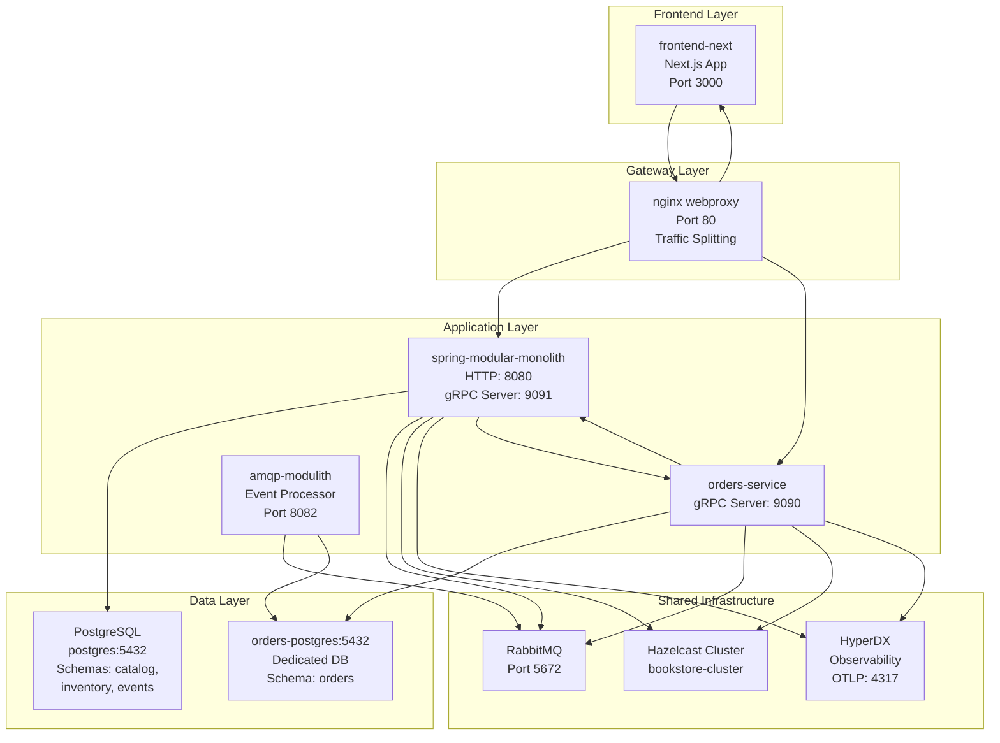
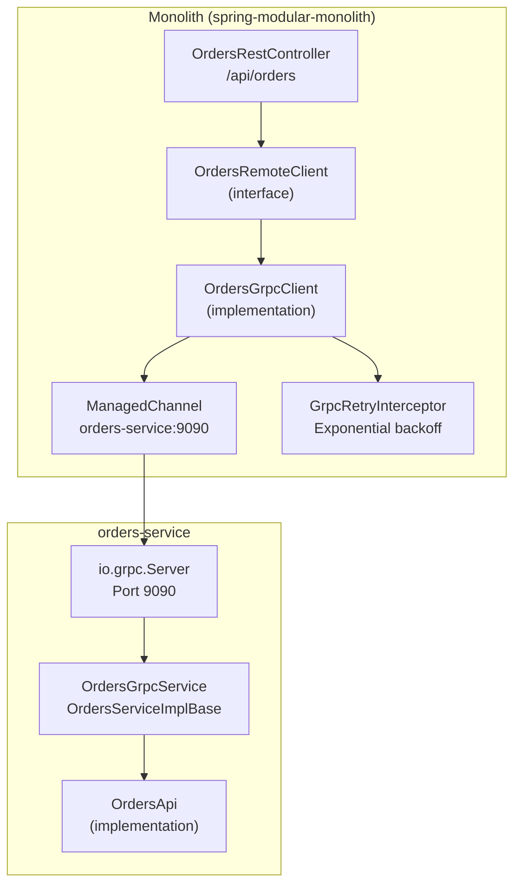
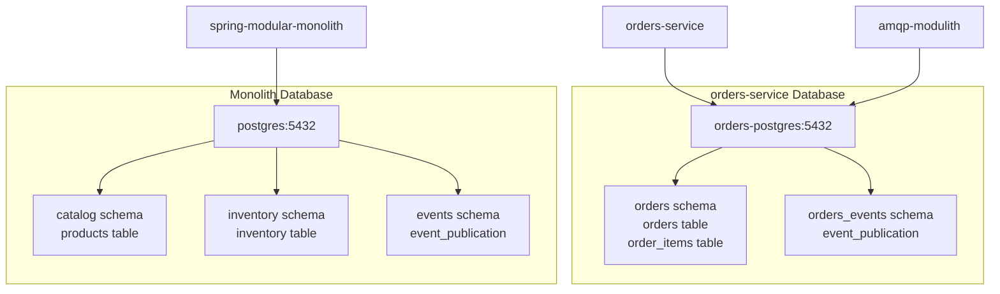
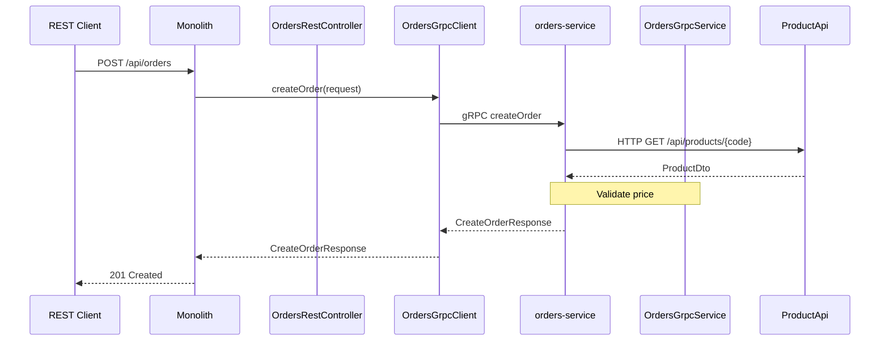
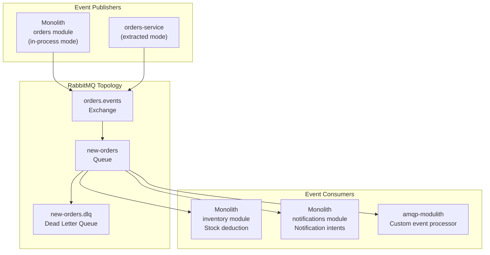
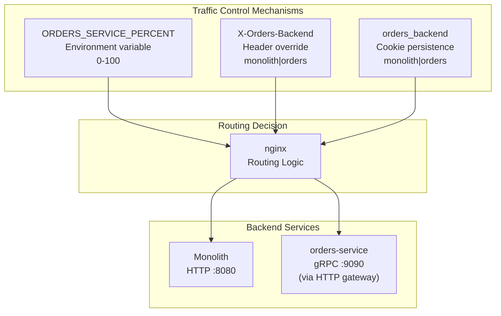
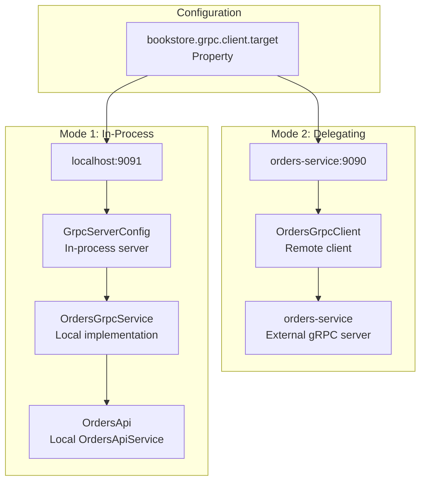

# Orders Microservice Extraction

> **Relevant source files**
> * [README-API.md](https://github.com/philipz/spring-modular-monolith/blob/30c9bf30/README-API.md)
> * [README.md](https://github.com/philipz/spring-modular-monolith/blob/30c9bf30/README.md)
> * [compose.yml](https://github.com/philipz/spring-modular-monolith/blob/30c9bf30/compose.yml)
> * [docs/API_ANALYSIS_SUMMARY.txt](https://github.com/philipz/spring-modular-monolith/blob/30c9bf30/docs/API_ANALYSIS_SUMMARY.txt)
> * [docs/REST_API_ANALYSIS.md](https://github.com/philipz/spring-modular-monolith/blob/30c9bf30/docs/REST_API_ANALYSIS.md)
> * [docs/bookstore-microservices.png](https://github.com/philipz/spring-modular-monolith/blob/30c9bf30/docs/bookstore-microservices.png)
> * [docs/improvement.md](https://github.com/philipz/spring-modular-monolith/blob/30c9bf30/docs/improvement.md)
> * [docs/orders-data-ownership-analysis.md](https://github.com/philipz/spring-modular-monolith/blob/30c9bf30/docs/orders-data-ownership-analysis.md)
> * [docs/orders-module-boundary-analysis.md](https://github.com/philipz/spring-modular-monolith/blob/30c9bf30/docs/orders-module-boundary-analysis.md)
> * [docs/orders-traffic-migration.md](https://github.com/philipz/spring-modular-monolith/blob/30c9bf30/docs/orders-traffic-migration.md)
> * [k6.js](https://github.com/philipz/spring-modular-monolith/blob/30c9bf30/k6.js)
> * [pom.xml](https://github.com/philipz/spring-modular-monolith/blob/30c9bf30/pom.xml)
> * [src/main/java/com/sivalabs/bookstore/config/GrpcHealthIndicator.java](https://github.com/philipz/spring-modular-monolith/blob/30c9bf30/src/main/java/com/sivalabs/bookstore/config/GrpcHealthIndicator.java)
> * [src/main/java/com/sivalabs/bookstore/config/GrpcProperties.java](https://github.com/philipz/spring-modular-monolith/blob/30c9bf30/src/main/java/com/sivalabs/bookstore/config/GrpcProperties.java)
> * [src/main/java/com/sivalabs/bookstore/orders/api/OrdersRemoteClient.java](https://github.com/philipz/spring-modular-monolith/blob/30c9bf30/src/main/java/com/sivalabs/bookstore/orders/api/OrdersRemoteClient.java)
> * [src/main/java/com/sivalabs/bookstore/orders/grpc/OrdersGrpcClient.java](https://github.com/philipz/spring-modular-monolith/blob/30c9bf30/src/main/java/com/sivalabs/bookstore/orders/grpc/OrdersGrpcClient.java)
> * [src/main/java/com/sivalabs/bookstore/orders/grpc/OrdersGrpcService.java](https://github.com/philipz/spring-modular-monolith/blob/30c9bf30/src/main/java/com/sivalabs/bookstore/orders/grpc/OrdersGrpcService.java)
> * [src/main/resources/application.properties](https://github.com/philipz/spring-modular-monolith/blob/30c9bf30/src/main/resources/application.properties)
> * [src/test/java/com/sivalabs/bookstore/BookStoreApplicationTests.java](https://github.com/philipz/spring-modular-monolith/blob/30c9bf30/src/test/java/com/sivalabs/bookstore/BookStoreApplicationTests.java)
> * [src/test/java/com/sivalabs/bookstore/TestcontainersConfiguration.java](https://github.com/philipz/spring-modular-monolith/blob/30c9bf30/src/test/java/com/sivalabs/bookstore/TestcontainersConfiguration.java)
> * [src/test/java/com/sivalabs/bookstore/orders/grpc/OrdersGrpcClientIntegrationTest.java](https://github.com/philipz/spring-modular-monolith/blob/30c9bf30/src/test/java/com/sivalabs/bookstore/orders/grpc/OrdersGrpcClientIntegrationTest.java)
> * [src/test/java/com/sivalabs/bookstore/orders/grpc/OrdersGrpcServiceIntegrationTest.java](https://github.com/philipz/spring-modular-monolith/blob/30c9bf30/src/test/java/com/sivalabs/bookstore/orders/grpc/OrdersGrpcServiceIntegrationTest.java)

## Purpose and Scope

This document describes the extraction of the Orders functionality from the Spring Modulith monolith into a standalone `orders-service` microservice. It covers the architecture, communication patterns, data isolation strategy, and the dual-mode operation that allows progressive migration from monolithic to microservices deployment.

For details on the Orders module's internal structure within the monolith, see [Orders Module](/philipz/spring-modular-monolith/8.2-orders-module). For the traffic migration strategy used to gradually shift load between backends, see [Traffic Migration Strategy](/philipz/spring-modular-monolith/10.4-traffic-migration-strategy). For gRPC protocol details, see [gRPC Infrastructure](/philipz/spring-modular-monolith/12-grpc-infrastructure).

---

## Extraction Overview

The orders-service represents a strategic extraction of order lifecycle management from the monolith. It operates as an independent microservice with:

* **Dedicated PostgreSQL database** (`orders-postgres` service in compose.yml)
* **gRPC server** exposing order operations on port 9090
* **Event publishing** to RabbitMQ for cross-service coordination
* **Shared infrastructure** (Hazelcast, RabbitMQ, HyperDX) with the monolith
* **Dual-mode capability** allowing the monolith to operate with or without the external service

The monolith retains an orders module that can function in two modes:

1. **In-process mode**: Orders module operates internally with the monolith's database
2. **Delegating mode**: REST endpoints delegate to the external orders-service via gRPC

**Sources:** [compose.yml L88-L117](https://github.com/philipz/spring-modular-monolith/blob/30c9bf30/compose.yml#L88-L117)

 [README.md L1-L149](https://github.com/philipz/spring-modular-monolith/blob/30c9bf30/README.md#L1-L149)

---

## Deployment Architecture



**Key Characteristics:**

| Aspect | Monolith | orders-service |
| --- | --- | --- |
| Database | `postgres:5432` (multi-schema) | `orders-postgres:5432` (dedicated) |
| Protocol | HTTP REST (8080) + gRPC Server (9091) | gRPC Server (9090) |
| Event Bus | RabbitMQ (publishes `OrderCreatedEvent`) | RabbitMQ (publishes `OrderCreatedEvent`) |
| Caching | Hazelcast (`bookstore-cluster`) | Hazelcast (`bookstore-cluster`) |
| Observability | HyperDX (OTLP gRPC) | HyperDX (OTLP gRPC) |

**Sources:** [compose.yml L1-L189](https://github.com/philipz/spring-modular-monolith/blob/30c9bf30/compose.yml#L1-L189)

 [README.md L7-L42](https://github.com/philipz/spring-modular-monolith/blob/30c9bf30/README.md#L7-L42)

---

## Communication Patterns

### gRPC Client-Server Architecture



**gRPC Operations:**

| RPC Method | Request | Response | Monolith Initiator |
| --- | --- | --- | --- |
| `createOrder` | `CreateOrderRequest` | `CreateOrderResponse` | `OrdersRestController.createOrder()` |
| `getOrder` | `GetOrderRequest` | `GetOrderResponse` | `OrdersRestController.getOrder()` |
| `listOrders` | `ListOrdersRequest` | `ListOrdersResponse` | `OrdersRestController.getOrders()` |

**Sources:** [src/main/java/com/sivalabs/bookstore/orders/grpc/OrdersGrpcClient.java L1-L112](https://github.com/philipz/spring-modular-monolith/blob/30c9bf30/src/main/java/com/sivalabs/bookstore/orders/grpc/OrdersGrpcClient.java#L1-L112)

 [src/main/java/com/sivalabs/bookstore/orders/grpc/OrdersGrpcService.java L1-L108](https://github.com/philipz/spring-modular-monolith/blob/30c9bf30/src/main/java/com/sivalabs/bookstore/orders/grpc/OrdersGrpcService.java#L1-L108)

 [src/main/java/com/sivalabs/bookstore/orders/api/OrdersRemoteClient.java L1-L16](https://github.com/philipz/spring-modular-monolith/blob/30c9bf30/src/main/java/com/sivalabs/bookstore/orders/api/OrdersRemoteClient.java#L1-L16)

---

## Data Ownership and Database Isolation

### Database Per Service Pattern



**Schema Ownership:**

| Schema | Owner | Purpose | Liquibase Path |
| --- | --- | --- | --- |
| `catalog` | Monolith | Product catalog data | `src/main/resources/db/migration/V1__*` |
| `orders` | orders-service | Order and order items | orders-service migrations |
| `inventory` | Monolith | Stock levels | `src/main/resources/db/migration/V2__*` |
| `events` | Monolith | Modulith event log | `src/main/resources/db/migration/V6__*` |
| `orders_events` | orders-service | Orders event log | orders-service migrations |

**Data Isolation Guarantees:**

1. **No cross-database joins**: Orders-service cannot directly query catalog or inventory tables
2. **API-based data access**: Product information retrieved via HTTP calls to monolith's `/api/products/{code}`
3. **Event-driven sync**: Inventory updates triggered by `OrderCreatedEvent` published to RabbitMQ
4. **Independent schema evolution**: Each service manages its own Liquibase migrations

**Sources:** [compose.yml L2-L32](https://github.com/philipz/spring-modular-monolith/blob/30c9bf30/compose.yml#L2-L32)

 [src/main/resources/application.properties L7-L25](https://github.com/philipz/spring-modular-monolith/blob/30c9bf30/src/main/resources/application.properties#L7-L25)

 [docs/orders-data-ownership-analysis.md L1-L35](https://github.com/philipz/spring-modular-monolith/blob/30c9bf30/docs/orders-data-ownership-analysis.md#L1-L35)

---

## Integration Points

### Product Data Integration

The orders-service depends on the monolith for product catalog data:



**Configuration:**

* **orders-service → monolith**: `PRODUCT_API_BASE_URL=http://monolith:8080` [compose.yml L113](https://github.com/philipz/spring-modular-monolith/blob/30c9bf30/compose.yml#L113-L113)
* **Fallback behavior**: Order creation fails if product cannot be fetched (no stale price acceptance)

**Sources:** [compose.yml L113](https://github.com/philipz/spring-modular-monolith/blob/30c9bf30/compose.yml#L113-L113)

 [README.md L37-L42](https://github.com/philipz/spring-modular-monolith/blob/30c9bf30/README.md#L37-L42)

---

### Event Publishing

Both monolith and orders-service publish domain events to RabbitMQ:



**Event Payload:**

The `OrderCreatedEvent` contains:

* `orderNumber`: Unique identifier
* `orderItem`: Product code, name, price, quantity
* `customer`: Name, email, phone
* `deliveryAddress`: Shipping address

**Guarantees:**

* **At-least-once delivery**: Spring Modulith JDBC event log ensures events are persisted before publish
* **Idempotency required**: Consumers must handle duplicate events (e.g., inventory deduction checks existing state)

**Sources:** [compose.yml L34-L48](https://github.com/philipz/spring-modular-monolith/blob/30c9bf30/compose.yml#L34-L48)

 [src/main/resources/application.properties L27-L40](https://github.com/philipz/spring-modular-monolith/blob/30c9bf30/src/main/resources/application.properties#L27-L40)

 [docs/orders-module-boundary-analysis.md L16-L26](https://github.com/philipz/spring-modular-monolith/blob/30c9bf30/docs/orders-module-boundary-analysis.md#L16-L26)

---

## Traffic Migration Strategy

### Progressive Routing with nginx

The `webproxy` nginx service supports gradual traffic shifting from monolith to orders-service:



**Migration Phases:**

| Phase | ORDERS_SERVICE_PERCENT | Behavior | Purpose |
| --- | --- | --- | --- |
| 0 - Development | `0` (default) | All traffic → monolith | Baseline stability |
| 1 - Canary | `5-10` | Small percentage → orders-service | Smoke testing |
| 2 - Gradual Rollout | `25 → 50 → 75` | Progressive increase | Confidence building |
| 3 - Full Migration | `100` | All traffic → orders-service | Complete extraction |
| 4 - Rollback | Reset to `0` | Revert to monolith | Emergency fallback |

**Testing Overrides:**

```markdown
# Force routing to orders-service for QA
curl -H "X-Orders-Backend: orders" http://localhost/api/orders

# Force routing to monolith
curl -H "X-Orders-Backend: monolith" http://localhost/api/orders

# Cookie-based persistence (set by nginx, maintained across requests)
# orders_backend=orders
```

**Observability:**

* nginx access logs annotate each request with `backend=monolith` or `backend=orders-service`
* Response header `X-Orders-Backend` echoes the chosen backend
* HyperDX traces show latency comparison between backends

**Sources:** [docs/orders-traffic-migration.md L1-L69](https://github.com/philipz/spring-modular-monolith/blob/30c9bf30/docs/orders-traffic-migration.md#L1-L69)

 [README.md L143-L148](https://github.com/philipz/spring-modular-monolith/blob/30c9bf30/README.md#L143-L148)

---

## Dual-Mode Operation

### Monolith Configuration Modes

The monolith's orders module can operate in two distinct modes based on configuration:



**Configuration Comparison:**

| Aspect | In-Process Mode | Delegating Mode |
| --- | --- | --- |
| `bookstore.grpc.client.target` | `localhost:9091` | `orders-service:9090` |
| Orders database | Monolith's `postgres:5432` | orders-service's `orders-postgres:5432` |
| gRPC server | Embedded in monolith (port 9091) | External orders-service (port 9090) |
| REST to gRPC flow | REST → local gRPC stub → local service | REST → remote gRPC stub → network → external service |
| Deployment | Single container | Two containers + orchestration |

**When to Use Each Mode:**

* **In-Process**: Local development, testing without Docker, rollback scenarios
* **Delegating**: Production deployment, microservices evolution, independent scaling

**Sources:** [src/main/resources/application.properties L113-L127](https://github.com/philipz/spring-modular-monolith/blob/30c9bf30/src/main/resources/application.properties#L113-L127)

 [compose.yml L76](https://github.com/philipz/spring-modular-monolith/blob/30c9bf30/compose.yml#L76-L76)

 [README.md L37-L42](https://github.com/philipz/spring-modular-monolith/blob/30c9bf30/README.md#L37-L42)

---

## Configuration Reference

### Monolith Configuration

**gRPC Client Settings** [application.properties L113-L127](https://github.com/philipz/spring-modular-monolith/blob/30c9bf30/application.properties#L113-L127)

:

```markdown
# Target endpoint (environment-specific)
bookstore.grpc.client.target=localhost:9091

# Deadline for RPC calls
bookstore.grpc.client.deadline-ms=5000

# Retry behavior
bookstore.grpc.client.retry-enabled=true
bookstore.grpc.client.max-retry-attempts=3
```

**gRPC Server Settings** [application.properties L113-L127](https://github.com/philipz/spring-modular-monolith/blob/30c9bf30/application.properties#L113-L127)

:

```markdown
# Embedded server port (in-process mode)
bookstore.grpc.server.port=9091

# Health checks and reflection
bookstore.grpc.server.health-check-enabled=true
bookstore.grpc.server.reflection-enabled=true

# Message size limit (4 MB)
bookstore.grpc.server.max-inbound-message-size=4194304

# Graceful shutdown period
bookstore.grpc.server.shutdown-grace-period-seconds=30
```

**Sources:** [src/main/resources/application.properties L113-L127](https://github.com/philipz/spring-modular-monolith/blob/30c9bf30/src/main/resources/application.properties#L113-L127)

 [src/main/java/com/sivalabs/bookstore/config/GrpcProperties.java L1-L145](https://github.com/philipz/spring-modular-monolith/blob/30c9bf30/src/main/java/com/sivalabs/bookstore/config/GrpcProperties.java#L1-L145)

---

### orders-service Configuration

**Docker Compose Environment** [compose.yml L88-L117](https://github.com/philipz/spring-modular-monolith/blob/30c9bf30/compose.yml#L88-L117)

:

```python
environment:
  # gRPC server port (main protocol)
  # HTTP REST removed during migration (2025-10-04)
  
  # Database (dedicated instance)
  SPRING_DATASOURCE_URL: jdbc:postgresql://orders-postgres:5432/postgres
  SPRING_DATASOURCE_USERNAME: postgres
  SPRING_DATASOURCE_PASSWORD: postgres
  SPRING_DATASOURCE_POOL_SIZE: 200
  
  # RabbitMQ (shared with monolith)
  SPRING_RABBITMQ_HOST: rabbitmq
  SPRING_RABBITMQ_PORT: 5672
  SPRING_RABBITMQ_USERNAME: guest
  SPRING_RABBITMQ_PASSWORD: guest
  SPRING_RABBITMQ_CACHE_CHANNEL_SIZE: 300
  
  # OpenTelemetry
  OTLP_ENDPOINT: http://hyperdx:4317
  OTLP_GRPC_HEADERS_AUTHORIZATION: ${HYPERDX_API_KEY}
  
  # Event schema (isolated from monolith)
  SPRING_MODULITH_EVENTS_SCHEMA: orders_events
  
  # Product API integration
  PRODUCT_API_BASE_URL: http://monolith:8080
```

**Port Exposure:**

```yaml
ports:
  - "9090:9090"  # gRPC server port
```

**Sources:** [compose.yml L88-L117](https://github.com/philipz/spring-modular-monolith/blob/30c9bf30/compose.yml#L88-L117)

---

## Testing Strategy

### Integration Tests

The codebase includes comprehensive tests for both client and server:

**OrdersGrpcServiceIntegrationTest** [src/test/java/com/sivalabs/bookstore/orders/grpc/OrdersGrpcServiceIntegrationTest.java L1-L311](https://github.com/philipz/spring-modular-monolith/blob/30c9bf30/src/test/java/com/sivalabs/bookstore/orders/grpc/OrdersGrpcServiceIntegrationTest.java#L1-L311)

:

* Uses in-process gRPC server for fast execution
* Tests all RPC methods (`createOrder`, `getOrder`, `listOrders`)
* Validates error mapping (e.g., `INVALID_ARGUMENT`, `NOT_FOUND`)
* Mocks `ProductApi` to isolate orders logic

**OrdersGrpcClientIntegrationTest** [src/test/java/com/sivalabs/bookstore/orders/grpc/OrdersGrpcClientIntegrationTest.java L1-L220](https://github.com/philipz/spring-modular-monolith/blob/30c9bf30/src/test/java/com/sivalabs/bookstore/orders/grpc/OrdersGrpcClientIntegrationTest.java#L1-L220)

:

* Tests client-side error mapping to domain exceptions
* Validates retry logic and deadline enforcement
* Uses in-process channel for deterministic testing
* Exercises full request/response cycle

**Test Configuration:**

```
@SpringBootTest(
    webEnvironment = NONE,
    properties = {
        "bookstore.cache.enabled=false",
        "bookstore.session.hazelcast.enabled=false",
        "bookstore.grpc.server.enabled=false"
    }
)
```

**Sources:** [src/test/java/com/sivalabs/bookstore/orders/grpc/OrdersGrpcServiceIntegrationTest.java L43-L54](https://github.com/philipz/spring-modular-monolith/blob/30c9bf30/src/test/java/com/sivalabs/bookstore/orders/grpc/OrdersGrpcServiceIntegrationTest.java#L43-L54)

 [src/test/java/com/sivalabs/bookstore/orders/grpc/OrdersGrpcClientIntegrationTest.java L51-L64](https://github.com/philipz/spring-modular-monolith/blob/30c9bf30/src/test/java/com/sivalabs/bookstore/orders/grpc/OrdersGrpcClientIntegrationTest.java#L51-L64)

---

## Operational Considerations

### Health Checks

**gRPC Health Indicator** [src/main/java/com/sivalabs/bookstore/config/GrpcHealthIndicator.java L1-L40](https://github.com/philipz/spring-modular-monolith/blob/30c9bf30/src/main/java/com/sivalabs/bookstore/config/GrpcHealthIndicator.java#L1-L40)

:

```python
@Component
public class GrpcHealthIndicator implements HealthIndicator {
    @Override
    public Health health() {
        boolean running = !server.isShutdown() && !server.isTerminated();
        if (running) {
            return Health.up()
                .withDetail("port", server.getPort())
                .withDetail("services", server.getServices().size())
                .build();
        }
        return Health.down()
            .withDetail("reason", "gRPC server not running")
            .build();
    }
}
```

Available at: `http://localhost:8080/actuator/health`

---

### Troubleshooting

**Common Issues:**

| Problem | Symptom | Solution |
| --- | --- | --- |
| orders-service offline | `UNAVAILABLE` status in gRPC client | Set `bookstore.grpc.client.target=localhost:9091` to use in-process mode |
| Session issues across backends | Cart lost after routing change | Ensure both backends share Hazelcast cluster or use sticky sessions |
| Product API timeout | Order creation fails with timeout | Check `PRODUCT_API_BASE_URL` and monolith health |
| Event duplication | Inventory double-counted | Verify consumer idempotency and check RabbitMQ DLQ |

**Logs to Monitor:**

* Monolith: `logging.level.com.sivalabs.bookstore.orders.grpc=DEBUG`
* orders-service: gRPC server startup logs
* nginx: `backend=monolith` or `backend=orders-service` annotations

**Sources:** [README.md L141-L148](https://github.com/philipz/spring-modular-monolith/blob/30c9bf30/README.md#L141-L148)

 [src/main/resources/application.properties L125-L126](https://github.com/philipz/spring-modular-monolith/blob/30c9bf30/src/main/resources/application.properties#L125-L126)

---

## Summary

The orders-service extraction demonstrates:

1. **Database per service**: Independent `orders-postgres` instance with isolated schema
2. **gRPC-first communication**: Binary protocol for efficient inter-service calls
3. **Dual-mode flexibility**: Monolith can operate standalone or delegate to external service
4. **Progressive migration**: nginx-based traffic splitting enables gradual rollout
5. **Shared infrastructure**: Leverages common Hazelcast, RabbitMQ, and observability stack
6. **Event-driven coordination**: RabbitMQ events for inventory and notification triggers

This architecture enables independent scaling, deployment, and evolution of the orders domain while maintaining operational simplicity through shared infrastructure and observability.

**Sources:** [compose.yml L1-L189](https://github.com/philipz/spring-modular-monolith/blob/30c9bf30/compose.yml#L1-L189)

 [README.md L1-L149](https://github.com/philipz/spring-modular-monolith/blob/30c9bf30/README.md#L1-L149)

 [docs/orders-traffic-migration.md L1-L69](https://github.com/philipz/spring-modular-monolith/blob/30c9bf30/docs/orders-traffic-migration.md#L1-L69)