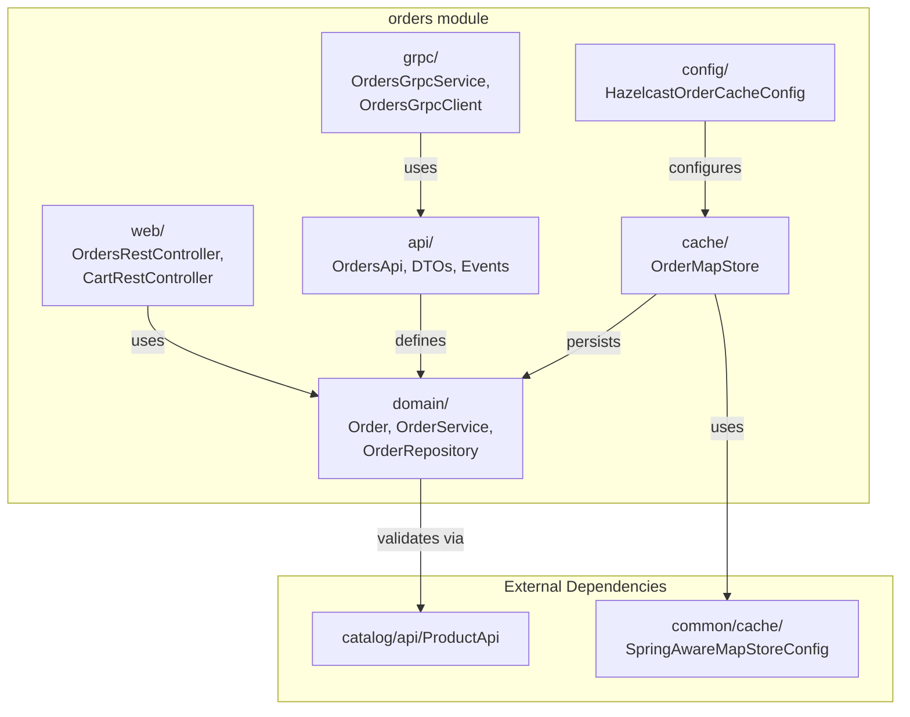
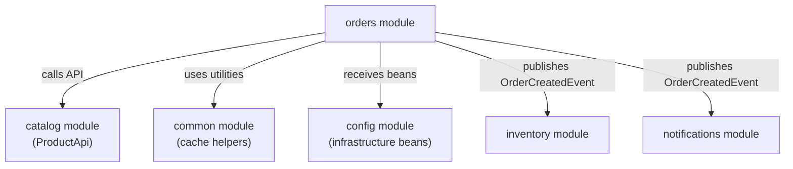
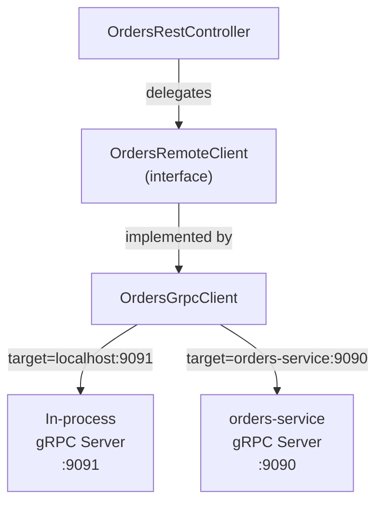
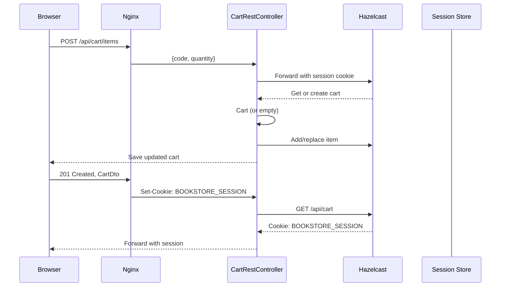
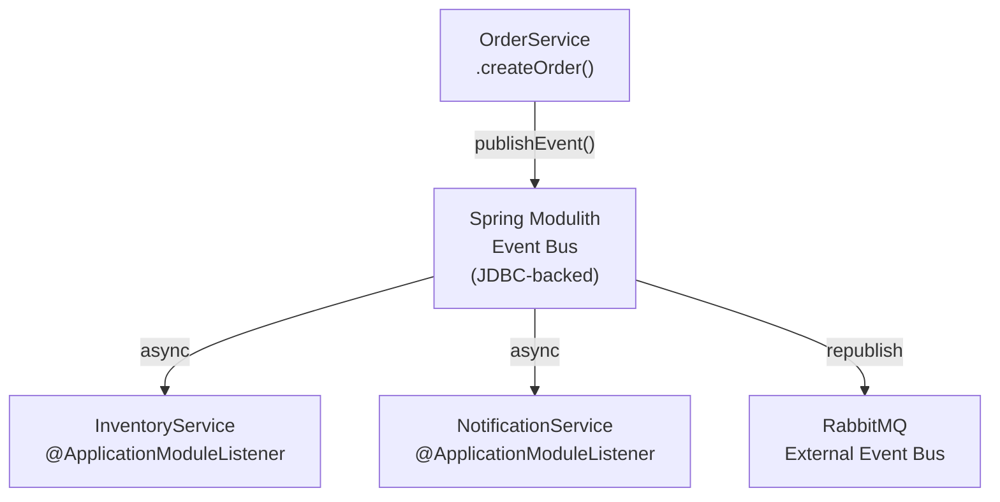
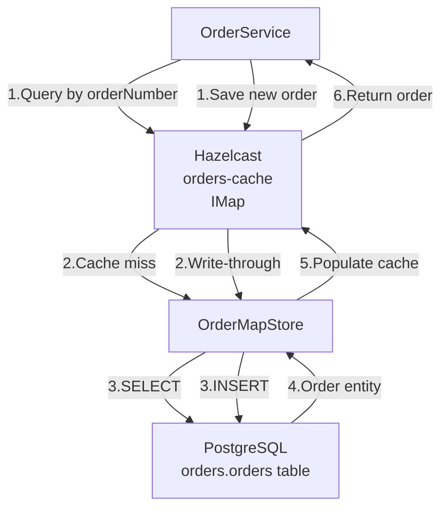

# Orders Module

> **Relevant source files**
> * [README-API.md](https://github.com/philipz/spring-modular-monolith/blob/30c9bf30/README-API.md)
> * [README.md](https://github.com/philipz/spring-modular-monolith/blob/30c9bf30/README.md)
> * [docs/API_ANALYSIS_SUMMARY.txt](https://github.com/philipz/spring-modular-monolith/blob/30c9bf30/docs/API_ANALYSIS_SUMMARY.txt)
> * [docs/REST_API_ANALYSIS.md](https://github.com/philipz/spring-modular-monolith/blob/30c9bf30/docs/REST_API_ANALYSIS.md)
> * [docs/bookstore-microservices.png](https://github.com/philipz/spring-modular-monolith/blob/30c9bf30/docs/bookstore-microservices.png)
> * [docs/improvement.md](https://github.com/philipz/spring-modular-monolith/blob/30c9bf30/docs/improvement.md)
> * [docs/orders-data-ownership-analysis.md](https://github.com/philipz/spring-modular-monolith/blob/30c9bf30/docs/orders-data-ownership-analysis.md)
> * [docs/orders-module-boundary-analysis.md](https://github.com/philipz/spring-modular-monolith/blob/30c9bf30/docs/orders-module-boundary-analysis.md)
> * [docs/orders-traffic-migration.md](https://github.com/philipz/spring-modular-monolith/blob/30c9bf30/docs/orders-traffic-migration.md)
> * [http_requests.http](http_requests.http)
> * [k6.js](https://github.com/philipz/spring-modular-monolith/blob/30c9bf30/k6.js)
> * [src/main/java/com/sivalabs/bookstore/config/GrpcHealthIndicator.java](https://github.com/philipz/spring-modular-monolith/blob/30c9bf30/src/main/java/com/sivalabs/bookstore/config/GrpcHealthIndicator.java)
> * [src/main/java/com/sivalabs/bookstore/config/GrpcProperties.java](https://github.com/philipz/spring-modular-monolith/blob/30c9bf30/src/main/java/com/sivalabs/bookstore/config/GrpcProperties.java)
> * [src/main/java/com/sivalabs/bookstore/orders/api/OrdersRemoteClient.java](https://github.com/philipz/spring-modular-monolith/blob/30c9bf30/src/main/java/com/sivalabs/bookstore/orders/api/OrdersRemoteClient.java)
> * [src/main/java/com/sivalabs/bookstore/orders/domain/ProductServiceClient.java](https://github.com/philipz/spring-modular-monolith/blob/30c9bf30/src/main/java/com/sivalabs/bookstore/orders/domain/ProductServiceClient.java)
> * [src/main/java/com/sivalabs/bookstore/orders/grpc/OrdersGrpcClient.java](https://github.com/philipz/spring-modular-monolith/blob/30c9bf30/src/main/java/com/sivalabs/bookstore/orders/grpc/OrdersGrpcClient.java)
> * [src/main/java/com/sivalabs/bookstore/orders/grpc/OrdersGrpcService.java](https://github.com/philipz/spring-modular-monolith/blob/30c9bf30/src/main/java/com/sivalabs/bookstore/orders/grpc/OrdersGrpcService.java)
> * [src/test/java/com/sivalabs/bookstore/orders/grpc/OrdersGrpcClientIntegrationTest.java](https://github.com/philipz/spring-modular-monolith/blob/30c9bf30/src/test/java/com/sivalabs/bookstore/orders/grpc/OrdersGrpcClientIntegrationTest.java)
> * [src/test/java/com/sivalabs/bookstore/orders/grpc/OrdersGrpcServiceIntegrationTest.java](https://github.com/philipz/spring-modular-monolith/blob/30c9bf30/src/test/java/com/sivalabs/bookstore/orders/grpc/OrdersGrpcServiceIntegrationTest.java)

## Purpose and Scope

The Orders Module is a Spring Modulith business module responsible for managing the complete order lifecycle, shopping cart operations, and customer order data. It provides REST and gRPC APIs for order creation and retrieval, implements session-based shopping cart functionality, and publishes domain events to notify other modules of order state changes.

This page documents the internal structure, API surface, caching strategy, and integration patterns of the orders module. For product catalog operations, see [Catalog Module](/philipz/spring-modular-monolith/8.1-catalog-module). For inventory updates triggered by orders, see [Inventory Module](/philipz/spring-modular-monolith/8.3-inventory-module). For distributed caching infrastructure, see [Caching with Hazelcast](/philipz/spring-modular-monolith/5-caching-with-hazelcast).

**Sources:** [README.md L1-L150](https://github.com/philipz/spring-modular-monolith/blob/30c9bf30/README.md#L1-L150)

 [docs/orders-module-boundary-analysis.md L1-L37](https://github.com/philipz/spring-modular-monolith/blob/30c9bf30/docs/orders-module-boundary-analysis.md#L1-L37)

---

## Module Responsibilities

The orders module encapsulates the following responsibilities:

| Responsibility | Implementation |
| --- | --- |
| **Order Creation** | Validates product prices via `ProductApi`, persists order entities to the `orders` schema, publishes `OrderCreatedEvent` |
| **Cart Management** | Session-based cart storage in Hazelcast, single-item constraint (currently), REST endpoints for add/update/delete |
| **Order Retrieval** | Query orders by order number or paginated list, cache reads via `OrderMapStore` |
| **gRPC Exposure** | `OrdersGrpcService` implements proto-defined RPCs, dual-mode operation (in-process or external service) |
| **Event Publication** | Emits `OrderCreatedEvent` to Spring Modulith event bus and RabbitMQ for inventory/notification processing |
| **API Facade** | `OrdersApi` interface provides module-level abstraction for internal order operations |

**Sources:** [README.md L11-L12](https://github.com/philipz/spring-modular-monolith/blob/30c9bf30/README.md#L11-L12)

 [docs/orders-module-boundary-analysis.md L8-L13](https://github.com/philipz/spring-modular-monolith/blob/30c9bf30/docs/orders-module-boundary-analysis.md#L8-L13)

---

## Architecture and Module Boundaries

### Internal Package Structure



**Description:** The orders module follows a layered architecture where `api/` defines the public contract (`OrdersApi` interface, DTOs, events), `domain/` contains business logic (`OrderService`, `Order` entity, `OrderRepository`), `web/` and `grpc/` provide transport-specific endpoints, and `cache/`+`config/` handle caching concerns.

**Sources:** [docs/orders-module-boundary-analysis.md L8-L30](https://github.com/philipz/spring-modular-monolith/blob/30c9bf30/docs/orders-module-boundary-analysis.md#L8-L30)

 [README.md L122-L128](https://github.com/philipz/spring-modular-monolith/blob/30c9bf30/README.md#L122-L128)

### Module Dependencies



**Description:** The orders module depends on the catalog module's `ProductApi` for product validation during order creation ([src/main/java/com/sivalabs/bookstore/orders/domain/ProductServiceClient.java L1-L24](https://github.com/philipz/spring-modular-monolith/blob/30c9bf30/src/main/java/com/sivalabs/bookstore/orders/domain/ProductServiceClient.java#L1-L24)

), uses common module utilities for cache configuration, and receives infrastructure beans (Hazelcast instance, gRPC channel) from the config module. It publishes events consumed by inventory and notifications but does not directly depend on their implementations.

**Sources:** [docs/orders-module-boundary-analysis.md L9-L16](https://github.com/philipz/spring-modular-monolith/blob/30c9bf30/docs/orders-module-boundary-analysis.md#L9-L16)

 [src/main/java/com/sivalabs/bookstore/orders/domain/ProductServiceClient.java L1-L24](https://github.com/philipz/spring-modular-monolith/blob/30c9bf30/src/main/java/com/sivalabs/bookstore/orders/domain/ProductServiceClient.java#L1-L24)

---

## Data Model and Persistence

### Order Entity

The `Order` entity (located in `orders/domain/`) is persisted to the `orders.orders` table with the following structure:

| Column | Type | Purpose |
| --- | --- | --- |
| `order_id` | BIGSERIAL | Primary key, auto-generated |
| `order_number` | VARCHAR(255) | Business identifier (e.g., "ORD-2025-000123"), unique |
| `customer_name` | VARCHAR(255) | Customer name |
| `customer_email` | VARCHAR(255) | Customer email |
| `customer_phone` | VARCHAR(255) | Customer phone |
| `delivery_address` | TEXT | Delivery address |
| `item_code` | VARCHAR(255) | Product code (currently single item) |
| `item_name` | VARCHAR(255) | Product name snapshot |
| `item_price` | NUMERIC | Product price snapshot |
| `item_quantity` | INTEGER | Order quantity |
| `status` | VARCHAR(50) | Order status (NEW, PROCESSING, etc.) |
| `created_at` | TIMESTAMP | Creation timestamp |

The schema is managed via Liquibase changesets in `src/main/resources/db/migration/V4__orders_create_orders_table.sql` and `V5__orders_add_orders_data.sql`.

**Sources:** [docs/orders-data-ownership-analysis.md L1-L35](https://github.com/philipz/spring-modular-monolith/blob/30c9bf30/docs/orders-data-ownership-analysis.md#L1-L35)

 [README.md L137-L139](https://github.com/philipz/spring-modular-monolith/blob/30c9bf30/README.md#L137-L139)

### Repository and Service Layer

* **`OrderRepository`** ([orders/domain/OrderRepository](https://github.com/philipz/spring-modular-monolith/blob/30c9bf30/orders/domain/OrderRepository) ): Spring Data JPA repository extending `JpaRepository`, provides `findByOrderNumber()` and `findByOrderNumberIn()` for batch retrieval
* **`OrderService`** ([orders/domain/OrderService](https://github.com/philipz/spring-modular-monolith/blob/30c9bf30/orders/domain/OrderService) ): Orchestrates order creation, validates products via `ProductServiceClient`, persists orders, publishes `OrderCreatedEvent`, and delegates cache updates to `OrderMapStore`

**Sources:** [docs/orders-data-ownership-analysis.md L8-L13](https://github.com/philipz/spring-modular-monolith/blob/30c9bf30/docs/orders-data-ownership-analysis.md#L8-L13)

---

## REST API Endpoints

### Orders API

The `OrdersRestController` exposes order operations under `/api/orders`:

| Method | Path | Request | Response | Description |
| --- | --- | --- | --- | --- |
| `POST` | `/api/orders` | `CreateOrderRequest` | `201 Created`, `CreateOrderResponse` | Creates a new order from session cart, returns order number |
| `GET` | `/api/orders` | `?page=1&pageSize=10` | `PagedResult<OrderView>` | Lists orders with pagination |
| `GET` | `/api/orders/{orderNumber}` | - | `OrderDto` | Retrieves full order details by order number |

**CreateOrderRequest Structure:**

```json
{
  "customer": {
    "name": "Jane Doe",
    "email": "jane@example.com",
    "phone": "+1-555-0100"
  },
  "deliveryAddress": "123 Main Street, Springfield",
  "item": {
    "code": "P100",
    "name": "The Hunger Games",
    "price": 34.0,
    "quantity": 1
  }
}
```

**Sources:** [README-API.md L91-L149](https://github.com/philipz/spring-modular-monolith/blob/30c9bf30/README-API.md#L91-L149)

 [docs/REST_API_ANALYSIS.md L37-L45](https://github.com/philipz/spring-modular-monolith/blob/30c9bf30/docs/REST_API_ANALYSIS.md#L37-L45)

 [http_requests.http L7-L24](https://github.com/philipz/spring-modular-monolith/blob/30c9bf30/http_requests.http#L7-L24)

### Cart API

The `CartRestController` manages session-based cart operations under `/api/cart`:

| Method | Path | Request | Response | Description |
| --- | --- | --- | --- | --- |
| `GET` | `/api/cart` | - | `CartDto` | Retrieves current cart from session |
| `POST` | `/api/cart/items` | `AddToCartRequest` | `201 Created`, `CartDto` | Adds/replaces item in cart |
| `PUT` | `/api/cart/items/{code}` | `UpdateQuantityRequest` | `CartDto` | Updates quantity for item |
| `DELETE` | `/api/cart` | - | `204 No Content` | Clears cart |

**Cart Session Behavior:**

* Cart state is stored in Hazelcast under the `BOOKSTORE_SESSION` cookie (HttpOnly, SameSite=Strict, 30-minute TTL)
* Session cookie must be included in requests (`credentials: 'include'` for browser clients)
* Empty cart is automatically created on first access

**Sources:** [README-API.md L53-L89](https://github.com/philipz/spring-modular-monolith/blob/30c9bf30/README-API.md#L53-L89)

 [docs/REST_API_ANALYSIS.md L28-L36](https://github.com/philipz/spring-modular-monolith/blob/30c9bf30/docs/REST_API_ANALYSIS.md#L28-L36)

---

## gRPC Interface

### Protocol Buffer Definition

The orders module exposes a gRPC service defined in `src/main/proto/orders.proto`:

```
service OrdersService {
  rpc CreateOrder(CreateOrderRequest) returns (CreateOrderResponse);
  rpc GetOrder(GetOrderRequest) returns (GetOrderResponse);
  rpc ListOrders(ListOrdersRequest) returns (ListOrdersResponse);
}
```

### gRPC Server

**`OrdersGrpcService`** ([src/main/java/com/sivalabs/bookstore/orders/grpc/OrdersGrpcService.java L1-L108](https://github.com/philipz/spring-modular-monolith/blob/30c9bf30/src/main/java/com/sivalabs/bookstore/orders/grpc/OrdersGrpcService.java#L1-L108)

):

* Implements `OrdersServiceGrpc.OrdersServiceImplBase`
* Delegates to `OrdersApi` for business logic
* Uses `GrpcMessageMapper` to translate between protobuf messages and domain DTOs
* Validates requests using Jakarta Bean Validation (`Validator`)
* Maps exceptions via `GrpcExceptionHandler`: * `InvalidOrderException` → `Status.INVALID_ARGUMENT` * `OrderNotFoundException` → `Status.NOT_FOUND` * Other exceptions → `Status.INTERNAL`

The server is registered in `GrpcServerConfig` and runs on port `9091` (configurable via `bookstore.grpc.server.port`).

**Sources:** [src/main/java/com/sivalabs/bookstore/orders/grpc/OrdersGrpcService.java L1-L108](https://github.com/philipz/spring-modular-monolith/blob/30c9bf30/src/main/java/com/sivalabs/bookstore/orders/grpc/OrdersGrpcService.java#L1-L108)

 [README.md L37-L41](https://github.com/philipz/spring-modular-monolith/blob/30c9bf30/README.md#L37-L41)

### gRPC Client

**`OrdersGrpcClient`** ([src/main/java/com/sivalabs/bookstore/orders/grpc/OrdersGrpcClient.java L1-L112](https://github.com/philipz/spring-modular-monolith/blob/30c9bf30/src/main/java/com/sivalabs/bookstore/orders/grpc/OrdersGrpcClient.java#L1-L112)

):

* Implements `OrdersRemoteClient` interface
* Wraps `OrdersServiceGrpc.OrdersServiceBlockingStub` with deadline enforcement
* Connects to target specified by `bookstore.grpc.client.target`: * **In-process mode:** `localhost:9091` (default) for monolithic operation * **External mode:** `orders-service:9090` for extracted microservice
* Translates gRPC `StatusRuntimeException` to domain exceptions (`OrderNotFoundException`, `InvalidOrderException`)

**Dual-Mode Operation:**



**Description:** The REST controller delegates all order operations to `OrdersRemoteClient`, which is implemented by `OrdersGrpcClient`. This allows seamless switching between in-process gRPC calls (monolithic mode) and remote calls to the extracted `orders-service` microservice by changing the `bookstore.grpc.client.target` configuration.

**Sources:** [src/main/java/com/sivalabs/bookstore/orders/grpc/OrdersGrpcClient.java L1-L112](https://github.com/philipz/spring-modular-monolith/blob/30c9bf30/src/main/java/com/sivalabs/bookstore/orders/grpc/OrdersGrpcClient.java#L1-L112)

 [README.md L37-L41](https://github.com/philipz/spring-modular-monolith/blob/30c9bf30/README.md#L37-L41)

 [docs/orders-traffic-migration.md L1-L69](https://github.com/philipz/spring-modular-monolith/blob/30c9bf30/docs/orders-traffic-migration.md#L1-L69)

---

## Cart Functionality

### Cart Data Model

The cart is stored in the HTTP session (Hazelcast-backed) and currently supports **a single item**:

```python
// Simplified representation
class Cart {
    CartItem item;  // Only one item allowed
}

record CartItem(String code, String name, BigDecimal price, int quantity) {}
```

**Session Storage:**

* Cookie name: `BOOKSTORE_SESSION`
* Storage: Hazelcast `spring:session:sessions` map
* TTL: 30 minutes (configurable via `server.servlet.session.timeout`)
* Cart is not persisted to database; exists only in session

**Sources:** [docs/REST_API_ANALYSIS.md L49-L56](https://github.com/philipz/spring-modular-monolith/blob/30c9bf30/docs/REST_API_ANALYSIS.md#L49-L56)

 [README.md L22-L23](https://github.com/philipz/spring-modular-monolith/blob/30c9bf30/README.md#L22-L23)

### Cart Operations Flow



**Description:** Cart operations are stateless from the client perspective but stateful via Hazelcast-backed sessions. The `BOOKSTORE_SESSION` cookie maintains session affinity. The `CartRestController` uses `CartUtil` helper methods to manipulate cart state stored in the session.

**Sources:** [docs/REST_API_ANALYSIS.md L63-L69](https://github.com/philipz/spring-modular-monolith/blob/30c9bf30/docs/REST_API_ANALYSIS.md#L63-L69)

 [README-API.md L53-L89](https://github.com/philipz/spring-modular-monolith/blob/30c9bf30/README-API.md#L53-L89)

---

## Event Publishing

### OrderCreatedEvent

When an order is successfully created, `OrderService` publishes `OrderCreatedEvent` to the Spring Modulith internal event bus:

**Event Structure** ([orders/api/events/OrderCreatedEvent](https://github.com/philipz/spring-modular-monolith/blob/30c9bf30/orders/api/events/OrderCreatedEvent)

):

```
public record OrderCreatedEvent(
    String orderNumber,
    String itemCode,
    int quantity
) {}
```

**Event Flow:**



**Description:** The event is first published to the internal event bus with guaranteed delivery (stored in `events` schema). Inventory and notification modules consume it asynchronously. The event is also republished to RabbitMQ for external consumers or the extracted `orders-service` to process.

**Sources:** [README.md L30-L34](https://github.com/philipz/spring-modular-monolith/blob/30c9bf30/README.md#L30-L34)

 [docs/orders-module-boundary-analysis.md L20-L24](https://github.com/philipz/spring-modular-monolith/blob/30c9bf30/docs/orders-module-boundary-analysis.md#L20-L24)

---

## Caching Strategy

### OrderMapStore Write-Through Pattern

The orders module implements a Hazelcast `MapStore` for write-through and read-through caching:

**`OrderMapStore`** ([orders/cache/OrderMapStore](https://github.com/philipz/spring-modular-monolith/blob/30c9bf30/orders/cache/OrderMapStore)

):

| Method | Behavior |
| --- | --- |
| `load(String orderNumber)` | Loads order from database on cache miss |
| `loadAll(Collection<String>)` | Batch loads orders using `findByOrderNumberIn()` |
| `store(String key, Object value)` | Synchronously writes order to database (writeDelaySeconds=0) |
| `delete(String key)` | Deletes order from database |

**Cache Configuration** ([orders/config/HazelcastOrderCacheConfig](https://github.com/philipz/spring-modular-monolith/blob/30c9bf30/orders/config/HazelcastOrderCacheConfig)

):

```
@Bean
MapConfig ordersMapConfig() {
    return new MapConfig("orders-cache")
        .setTimeToLiveSeconds(3600)  // 1 hour TTL
        .setMaxSizePolicy(MaxSizePolicy.PER_NODE)
        .setEvictionPolicy(EvictionPolicy.LRU)
        .setBackupCount(1)
        .setMapStoreConfig(new MapStoreConfig()
            .setEnabled(true)
            .setImplementation(orderMapStore)
            .setWriteDelaySeconds(0));  // Immediate write-through
}
```

**Startup Grace Period:**

* `OrderMapStore` distinguishes between startup phase and normal operation using `STARTUP_GRACE_PERIOD_MS` (30 seconds)
* During startup, load failures log as `DEBUG`; after startup, they log as `WARN`
* This prevents log spam from warming up the cache

**Sources:** [docs/orders-data-ownership-analysis.md L17-L20](https://github.com/philipz/spring-modular-monolith/blob/30c9bf30/docs/orders-data-ownership-analysis.md#L17-L20)

 [docs/improvement.md L3-L6](https://github.com/philipz/spring-modular-monolith/blob/30c9bf30/docs/improvement.md#L3-L6)

### Cache Architecture Diagram



**Description:** On read, Hazelcast checks the cache; if the order is not present, `OrderMapStore.load()` fetches it from the database and populates the cache. On write, orders are synchronously persisted to PostgreSQL before returning to the caller (writeDelaySeconds=0), ensuring cache-database consistency.

**Sources:** [docs/orders-data-ownership-analysis.md L17-L20](https://github.com/philipz/spring-modular-monolith/blob/30c9bf30/docs/orders-data-ownership-analysis.md#L17-L20)

---

## Integration Patterns

### API Facade Pattern

**`OrdersApi`** ([orders/api/OrdersApi](https://github.com/philipz/spring-modular-monolith/blob/30c9bf30/orders/api/OrdersApi)

) provides a module-level interface for internal integrations:

```
public interface OrdersApi {
    CreateOrderResponse createOrder(CreateOrderRequest request);
    Optional<OrderDto> findOrder(String orderNumber);
    PagedResult<OrderView> findOrders(int page, int size);
}
```

Implemented by **`OrdersApiService`** ([orders/api/OrdersApiService](https://github.com/philipz/spring-modular-monolith/blob/30c9bf30/orders/api/OrdersApiService)

), which wraps `OrderService` and enforces module boundaries. External modules interact with orders exclusively through this API, never directly accessing repositories or entities.

**Sources:** [docs/orders-module-boundary-analysis.md L18-L20](https://github.com/philipz/spring-modular-monolith/blob/30c9bf30/docs/orders-module-boundary-analysis.md#L18-L20)

### Validation via ProductApi

Before creating an order, `ProductServiceClient` validates the product:

```javascript
// Simplified from src/main/java/com/sivalabs/bookstore/orders/domain/ProductServiceClient.java
public void validate(String productCode, BigDecimal price) {
    var product = productApi.getByCode(productCode)
        .orElseThrow(() -> new InvalidOrderException("Product not found"));
    if (product.price().compareTo(price) != 0) {
        throw new InvalidOrderException("Product price mismatch");
    }
}
```

This cross-module dependency uses the exported `ProductApi` from the catalog module, maintaining loose coupling.

**Sources:** [src/main/java/com/sivalabs/bookstore/orders/domain/ProductServiceClient.java L1-L24](https://github.com/philipz/spring-modular-monolith/blob/30c9bf30/src/main/java/com/sivalabs/bookstore/orders/domain/ProductServiceClient.java#L1-L24)

 [docs/orders-module-boundary-analysis.md L9-L13](https://github.com/philipz/spring-modular-monolith/blob/30c9bf30/docs/orders-module-boundary-analysis.md#L9-L13)

---

## Configuration Reference

### Application Properties

Orders module configuration is controlled via `application.properties`:

| Property | Default | Description |
| --- | --- | --- |
| `bookstore.grpc.server.enabled` | `true` | Enable/disable gRPC server |
| `bookstore.grpc.server.port` | `9091` | gRPC server listening port |
| `bookstore.grpc.server.health-check-enabled` | `true` | Enable gRPC health checks |
| `bookstore.grpc.server.reflection-enabled` | `true` | Enable gRPC server reflection |
| `bookstore.grpc.client.target` | `localhost:9091` | gRPC client target (`orders-service:9090` in Docker) |
| `bookstore.grpc.client.deadline-ms` | `5000` | gRPC call deadline (milliseconds) |
| `bookstore.grpc.client.retry-enabled` | `true` | Enable client-side retries |
| `bookstore.grpc.client.max-retry-attempts` | `3` | Maximum retry attempts |
| `bookstore.cache.ttl-seconds` | `3600` | Cache TTL for orders |
| `server.servlet.session.timeout` | `30m` | Session timeout for cart |
| `server.servlet.session.cookie.name` | `BOOKSTORE_SESSION` | Session cookie name |

**Sources:** [src/main/java/com/sivalabs/bookstore/config/GrpcProperties.java L1-L145](https://github.com/philipz/spring-modular-monolith/blob/30c9bf30/src/main/java/com/sivalabs/bookstore/config/GrpcProperties.java#L1-L145)

 [README.md L37-L41](https://github.com/philipz/spring-modular-monolith/blob/30c9bf30/README.md#L37-L41)

### Health Checks

The `GrpcHealthIndicator` ([src/main/java/com/sivalabs/bookstore/config/GrpcHealthIndicator.java L1-L40](https://github.com/philipz/spring-modular-monolith/blob/30c9bf30/src/main/java/com/sivalabs/bookstore/config/GrpcHealthIndicator.java#L1-L40)

) exposes gRPC server status via Spring Actuator:

```css
# Query gRPC server health
curl http://localhost:8080/actuator/health

# Response (when healthy)
{
  "status": "UP",
  "components": {
    "grpcHealthIndicator": {
      "status": "UP",
      "details": {
        "port": 9091,
        "services": 1
      }
    }
  }
}
```

**Sources:** [src/main/java/com/sivalabs/bookstore/config/GrpcHealthIndicator.java L1-L40](https://github.com/philipz/spring-modular-monolith/blob/30c9bf30/src/main/java/com/sivalabs/bookstore/config/GrpcHealthIndicator.java#L1-L40)

---

## Testing

### Integration Tests

The orders module includes comprehensive integration tests:

| Test Class | Purpose |
| --- | --- |
| `OrdersGrpcServiceIntegrationTest` | Tests gRPC server endpoints using in-process server, validates order creation, retrieval, listing, and error handling |
| `OrdersGrpcClientIntegrationTest` | Tests gRPC client against in-process server, validates remote client abstraction and exception mapping |
| `OrderMapStoreTest` | (Location varies) Tests cache write-through and read-through behavior, startup grace period handling |

**Test Infrastructure:**

* Testcontainers for PostgreSQL (`postgres:17-alpine`)
* In-process gRPC server/channel to avoid port conflicts
* `@MockBean` for `RabbitTemplate` and `ProductApi` to isolate orders module
* `TestSessionConfiguration` for session management without full Hazelcast cluster

**Sources:** [src/test/java/com/sivalabs/bookstore/orders/grpc/OrdersGrpcServiceIntegrationTest.java L1-L365](https://github.com/philipz/spring-modular-monolith/blob/30c9bf30/src/test/java/com/sivalabs/bookstore/orders/grpc/OrdersGrpcServiceIntegrationTest.java#L1-L365)

 [src/test/java/com/sivalabs/bookstore/orders/grpc/OrdersGrpcClientIntegrationTest.java L1-L220](https://github.com/philipz/spring-modular-monolith/blob/30c9bf30/src/test/java/com/sivalabs/bookstore/orders/grpc/OrdersGrpcClientIntegrationTest.java#L1-L220)

---

## Known Limitations and Future Enhancements

### Current Limitations

1. **Single-Item Cart:** The cart currently supports only one item. Multi-item support requires schema and DTO changes ([docs/improvement.md L6-L7](https://github.com/philipz/spring-modular-monolith/blob/30c9bf30/docs/improvement.md#L6-L7) ).
2. **No Authentication:** All endpoints are open; JWT/OAuth integration is planned ([docs/improvement.md L8-L10](https://github.com/philipz/spring-modular-monolith/blob/30c9bf30/docs/improvement.md#L8-L10) ).
3. **No Order History Filtering:** The `listOrders()` endpoint returns all orders without per-customer filtering ([docs/API_ANALYSIS_SUMMARY.txt L222-L225](https://github.com/philipz/spring-modular-monolith/blob/30c9bf30/docs/API_ANALYSIS_SUMMARY.txt#L222-L225) ).

### Planned Improvements

* Extend cart to support multiple items with `items[]` collection ([docs/improvement.md L6-L7](https://github.com/philipz/spring-modular-monolith/blob/30c9bf30/docs/improvement.md#L6-L7) )
* Add authentication layer and enable `server.servlet.session.cookie.secure=true` for HTTPS ([docs/improvement.md L8-L10](https://github.com/philipz/spring-modular-monolith/blob/30c9bf30/docs/improvement.md#L8-L10) )
* Enrich `CreateOrderResponse` with status and timestamps to reduce extra fetches ([docs/improvement.md L13-L15](https://github.com/philipz/spring-modular-monolith/blob/30c9bf30/docs/improvement.md#L13-L15) )
* Add pagination to `/api/orders` list endpoint ([docs/improvement.md L14](https://github.com/philipz/spring-modular-monolith/blob/30c9bf30/docs/improvement.md#L14-L14) )
* Provide resilience strategy if Hazelcast is unavailable (e.g., in-memory session fallback) ([docs/improvement.md L10-L11](https://github.com/philipz/spring-modular-monolith/blob/30c9bf30/docs/improvement.md#L10-L11) )

**Sources:** [docs/improvement.md L1-L25](https://github.com/philipz/spring-modular-monolith/blob/30c9bf30/docs/improvement.md#L1-L25)

 [docs/API_ANALYSIS_SUMMARY.txt L213-L237](https://github.com/philipz/spring-modular-monolith/blob/30c9bf30/docs/API_ANALYSIS_SUMMARY.txt#L213-L237)