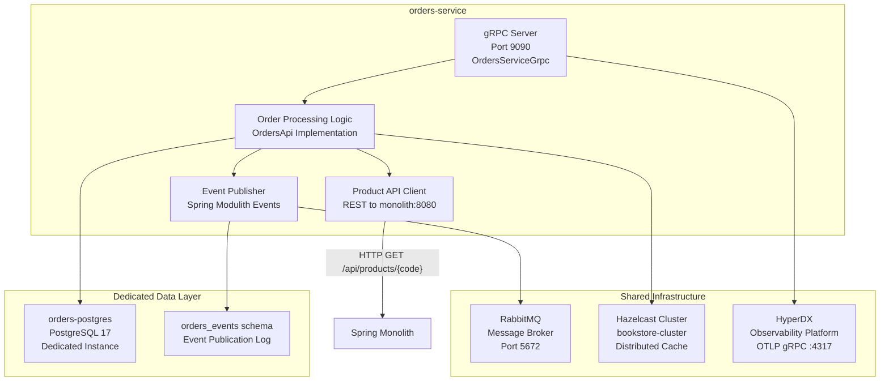
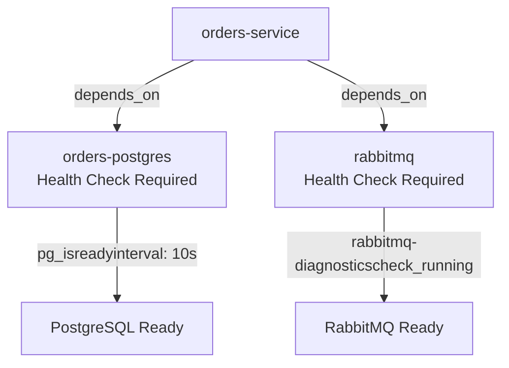
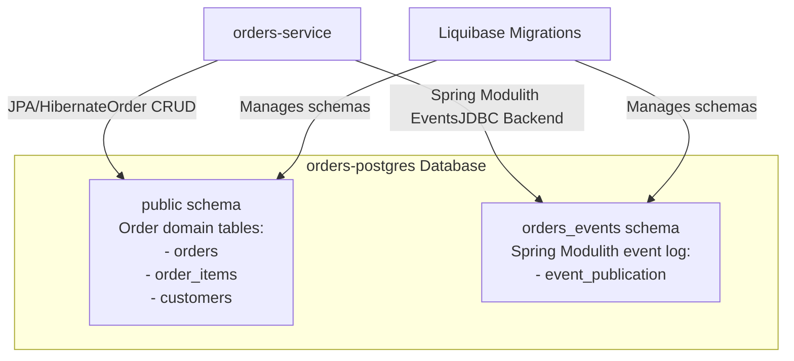
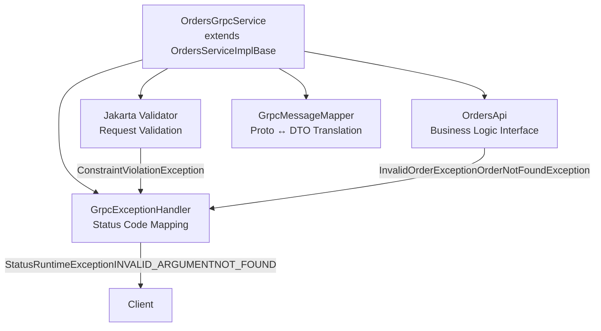
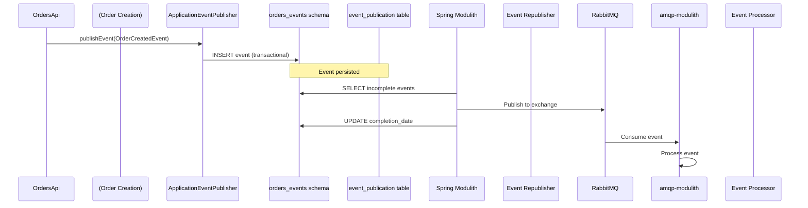
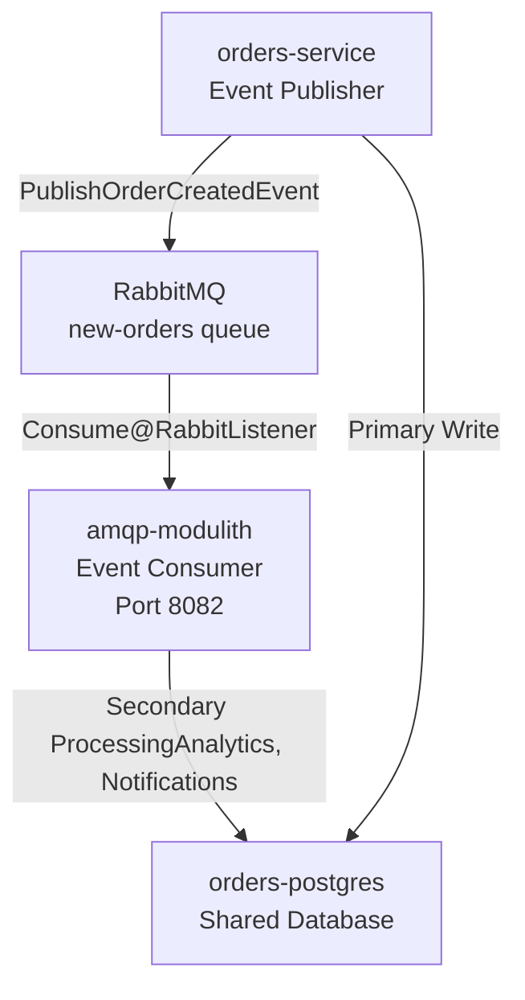
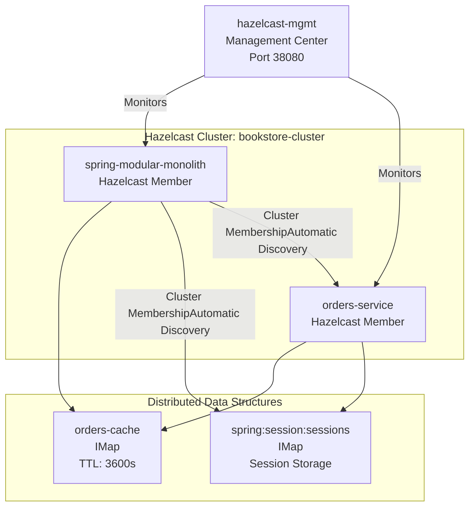
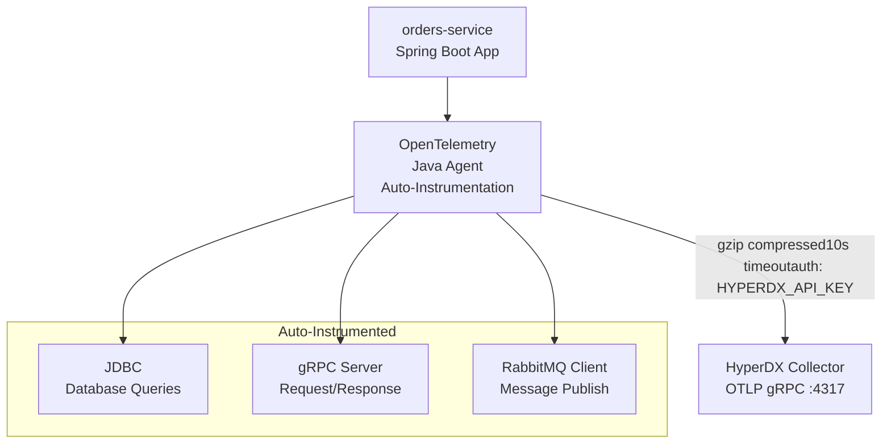
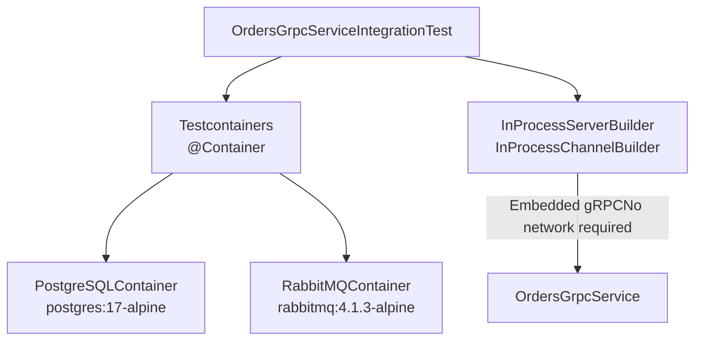

# Orders Service Architecture

> **Relevant source files**
> * [compose.yml](https://github.com/philipz/spring-modular-monolith/blob/30c9bf30/compose.yml)
> * [pom.xml](https://github.com/philipz/spring-modular-monolith/blob/30c9bf30/pom.xml)
> * [src/main/java/com/sivalabs/bookstore/config/GrpcHealthIndicator.java](https://github.com/philipz/spring-modular-monolith/blob/30c9bf30/src/main/java/com/sivalabs/bookstore/config/GrpcHealthIndicator.java)
> * [src/main/java/com/sivalabs/bookstore/config/GrpcProperties.java](https://github.com/philipz/spring-modular-monolith/blob/30c9bf30/src/main/java/com/sivalabs/bookstore/config/GrpcProperties.java)
> * [src/main/java/com/sivalabs/bookstore/orders/api/OrdersRemoteClient.java](https://github.com/philipz/spring-modular-monolith/blob/30c9bf30/src/main/java/com/sivalabs/bookstore/orders/api/OrdersRemoteClient.java)
> * [src/main/java/com/sivalabs/bookstore/orders/grpc/OrdersGrpcClient.java](https://github.com/philipz/spring-modular-monolith/blob/30c9bf30/src/main/java/com/sivalabs/bookstore/orders/grpc/OrdersGrpcClient.java)
> * [src/main/java/com/sivalabs/bookstore/orders/grpc/OrdersGrpcService.java](https://github.com/philipz/spring-modular-monolith/blob/30c9bf30/src/main/java/com/sivalabs/bookstore/orders/grpc/OrdersGrpcService.java)
> * [src/main/resources/application.properties](https://github.com/philipz/spring-modular-monolith/blob/30c9bf30/src/main/resources/application.properties)
> * [src/test/java/com/sivalabs/bookstore/BookStoreApplicationTests.java](https://github.com/philipz/spring-modular-monolith/blob/30c9bf30/src/test/java/com/sivalabs/bookstore/BookStoreApplicationTests.java)
> * [src/test/java/com/sivalabs/bookstore/TestcontainersConfiguration.java](https://github.com/philipz/spring-modular-monolith/blob/30c9bf30/src/test/java/com/sivalabs/bookstore/TestcontainersConfiguration.java)
> * [src/test/java/com/sivalabs/bookstore/orders/grpc/OrdersGrpcClientIntegrationTest.java](https://github.com/philipz/spring-modular-monolith/blob/30c9bf30/src/test/java/com/sivalabs/bookstore/orders/grpc/OrdersGrpcClientIntegrationTest.java)
> * [src/test/java/com/sivalabs/bookstore/orders/grpc/OrdersGrpcServiceIntegrationTest.java](https://github.com/philipz/spring-modular-monolith/blob/30c9bf30/src/test/java/com/sivalabs/bookstore/orders/grpc/OrdersGrpcServiceIntegrationTest.java)

## Purpose and Scope

This document details the internal architecture of the **orders-service** microservice, which has been extracted from the Spring Modular Monolith as an independent service. This page covers the service's deployment configuration, database architecture, gRPC server implementation, event publishing mechanism, and integration with shared infrastructure components.

For information about how the monolith communicates with this service and the migration strategy, see [Integration with Monolith](/philipz/spring-modular-monolith/13.2-integration-with-monolith). For the monolith's internal Orders module structure, see [Orders Module](/philipz/spring-modular-monolith/8.2-orders-module).

---

## Service Overview

The orders-service is a standalone microservice that handles all order lifecycle operations including order creation, retrieval, and listing. It was extracted from the monolith to demonstrate a strangler pattern migration while maintaining backward compatibility through gRPC communication.

### Key Characteristics



**Sources:** [compose.yml L88-L117](https://github.com/philipz/spring-modular-monolith/blob/30c9bf30/compose.yml#L88-L117)

 High-Level Diagram 1

| Characteristic | Value |
| --- | --- |
| Service Type | Extracted Microservice |
| Communication Protocol | gRPC (port 9090) |
| Database | Dedicated PostgreSQL instance |
| Event Bus | RabbitMQ + Spring Modulith JDBC events |
| Observability | OpenTelemetry → HyperDX |
| Cache | Shared Hazelcast cluster |
| Image | `philipz/orders-service:0.0.1-SNAPSHOT` |

**Sources:** [compose.yml L88-L117](https://github.com/philipz/spring-modular-monolith/blob/30c9bf30/compose.yml#L88-L117)

---

## Deployment Configuration

The orders-service is deployed as a containerized service with the following configuration:

### Docker Compose Definition

```yaml
orders-service:
  image: philipz/orders-service:0.0.1-SNAPSHOT
  ports:
    - "9090:9090"  # gRPC server port
  depends_on:
    orders-postgres:
      condition: service_healthy
    rabbitmq:
      condition: service_healthy
```

**Sources:** [compose.yml L88-L117](https://github.com/philipz/spring-modular-monolith/blob/30c9bf30/compose.yml#L88-L117)

### Environment Variables

| Variable | Value | Purpose |
| --- | --- | --- |
| `SPRING_PROFILES_ACTIVE` | `docker` | Activates Docker-specific configuration |
| `SPRING_DATASOURCE_URL` | `jdbc:postgresql://orders-postgres:5432/postgres` | Dedicated database connection |
| `SPRING_DATASOURCE_USERNAME` | `postgres` | Database authentication |
| `SPRING_DATASOURCE_PASSWORD` | `postgres` | Database credentials |
| `SPRING_DATASOURCE_POOL_SIZE` | `200` | HikariCP connection pool size |
| `SPRING_RABBITMQ_HOST` | `rabbitmq` | Message broker hostname |
| `SPRING_RABBITMQ_PORT` | `5672` | AMQP port |
| `SPRING_RABBITMQ_CACHE_CHANNEL_SIZE` | `300` | Channel cache for performance |
| `SPRING_MODULITH_EVENTS_SCHEMA` | `orders_events` | Event publication log schema |
| `PRODUCT_API_BASE_URL` | `http://monolith:8080` | Catalog service endpoint |
| `OTLP_ENDPOINT` | `http://hyperdx:4317` | OpenTelemetry collector |
| `OTLP_GRPC_HEADERS_AUTHORIZATION` | `${HYPERDX_API_KEY}` | Observability authentication |

**Sources:** [compose.yml L95-L113](https://github.com/philipz/spring-modular-monolith/blob/30c9bf30/compose.yml#L95-L113)

### Service Dependencies



**Sources:** [compose.yml L90-L94](https://github.com/philipz/spring-modular-monolith/blob/30c9bf30/compose.yml#L90-L94)

---

## Database Architecture

The orders-service maintains complete data isolation through a dedicated PostgreSQL instance, separate from the monolith's database.

### Database Instance Configuration

```yaml
orders-postgres:
  image: 'postgres:17-alpine'
  environment:
    - 'POSTGRES_DB=postgres'
    - 'POSTGRES_PASSWORD=postgres'
    - 'POSTGRES_USER=postgres'
  command: ['postgres', '-c', 'max_connections=300']
  healthcheck:
    test: ["CMD-SHELL", "pg_isready -U postgres -d postgres"]
    interval: 10s
    timeout: 5s
    retries: 5
```

**Sources:** [compose.yml L19-L32](https://github.com/philipz/spring-modular-monolith/blob/30c9bf30/compose.yml#L19-L32)

### Schema Organization



The `orders_events` schema is configured explicitly to isolate the event publication log from business tables:

```
SPRING_MODULITH_EVENTS_SCHEMA=orders_events
```

**Sources:** [compose.yml L112](https://github.com/philipz/spring-modular-monolith/blob/30c9bf30/compose.yml#L112-L112)

 High-Level Diagram 3

| Schema | Purpose | Managed By |
| --- | --- | --- |
| `public` | Order domain entities (orders, order_items, customers) | Liquibase migrations |
| `orders_events` | Spring Modulith event publication log | Spring Modulith auto-initialization |

**Sources:** [compose.yml L112](https://github.com/philipz/spring-modular-monolith/blob/30c9bf30/compose.yml#L112-L112)

### Database Isolation Benefits

1. **Independent Scaling**: Connection pool sized to 200 for orders workload
2. **Schema Evolution**: Liquibase migrations run independently
3. **Failure Isolation**: Database failures don't affect monolith
4. **Performance Isolation**: No query contention with other modules
5. **Migration Simplicity**: Clean separation for future cloud migration

**Sources:** [compose.yml L19-L32](https://github.com/philipz/spring-modular-monolith/blob/30c9bf30/compose.yml#L19-L32)

 [compose.yml L100](https://github.com/philipz/spring-modular-monolith/blob/30c9bf30/compose.yml#L100-L100)

---

## gRPC Server Implementation

The orders-service exposes its API through a gRPC server listening on port 9090, using the protocol buffer definitions shared with the monolith.

### Service Definition

The service implements the `OrdersService` defined in [src/main/proto/orders.proto](https://github.com/philipz/spring-modular-monolith/blob/30c9bf30/src/main/proto/orders.proto)

:

```
service OrdersService {
  rpc CreateOrder(CreateOrderRequest) returns (CreateOrderResponse);
  rpc GetOrder(GetOrderRequest) returns (GetOrderResponse);
  rpc ListOrders(ListOrdersRequest) returns (ListOrdersResponse);
}
```

**Sources:** Referenced in [src/main/java/com/sivalabs/bookstore/orders/grpc/OrdersGrpcService.java L1-L107](https://github.com/philipz/spring-modular-monolith/blob/30c9bf30/src/main/java/com/sivalabs/bookstore/orders/grpc/OrdersGrpcService.java#L1-L107)

### gRPC Server Configuration

Based on the monolith's `GrpcProperties` configuration pattern, the orders-service likely uses similar settings:

| Property | Default Value | Purpose |
| --- | --- | --- |
| `bookstore.grpc.server.port` | `9090` | gRPC server port (not 9091 like monolith) |
| `bookstore.grpc.server.health-check-enabled` | `true` | gRPC health service |
| `bookstore.grpc.server.reflection-enabled` | `true` | Server reflection for tools like grpcurl |
| `bookstore.grpc.server.max-inbound-message-size` | `4194304` | 4MB message size limit |
| `bookstore.grpc.server.shutdown-grace-period-seconds` | `30` | Graceful shutdown timeout |

**Sources:** [src/main/resources/application.properties L114-L118](https://github.com/philipz/spring-modular-monolith/blob/30c9bf30/src/main/resources/application.properties#L114-L118)

 [src/main/java/com/sivalabs/bookstore/config/GrpcProperties.java L1-L144](https://github.com/philipz/spring-modular-monolith/blob/30c9bf30/src/main/java/com/sivalabs/bookstore/config/GrpcProperties.java#L1-L144)

### RPC Method Implementation

The service implementation follows the same pattern as the monolith's `OrdersGrpcService`:



**Sources:** [src/main/java/com/sivalabs/bookstore/orders/grpc/OrdersGrpcService.java L1-L107](https://github.com/philipz/spring-modular-monolith/blob/30c9bf30/src/main/java/com/sivalabs/bookstore/orders/grpc/OrdersGrpcService.java#L1-L107)

### Error Handling

The service maps domain exceptions to gRPC status codes:

| Domain Exception | gRPC Status Code | Example |
| --- | --- | --- |
| `InvalidOrderException` | `INVALID_ARGUMENT` | Validation failures (empty customer name, negative quantity) |
| `OrderNotFoundException` | `NOT_FOUND` | Order does not exist |
| `ConstraintViolationException` | `INVALID_ARGUMENT` | Bean validation errors |
| Other exceptions | `INTERNAL` | Unexpected errors |

**Sources:** [src/test/java/com/sivalabs/bookstore/orders/grpc/OrdersGrpcServiceIntegrationTest.java L269-L340](https://github.com/philipz/spring-modular-monolith/blob/30c9bf30/src/test/java/com/sivalabs/bookstore/orders/grpc/OrdersGrpcServiceIntegrationTest.java#L269-L340)

---

## Event Publishing Architecture

The orders-service uses Spring Modulith's JDBC-backed event publication combined with RabbitMQ for external event distribution.

### Event Publication Flow



**Sources:** High-Level Diagram 2, [compose.yml L112](https://github.com/philipz/spring-modular-monolith/blob/30c9bf30/compose.yml#L112-L112)

### Event Schema Configuration

The `orders_events` schema stores the event publication log, ensuring at-least-once delivery:

```
SPRING_MODULITH_EVENTS_SCHEMA=orders_events
```

This table structure (created by Spring Modulith) includes:

* `id`: Event unique identifier
* `event_type`: Fully qualified event class name
* `serialized_event`: JSON payload
* `publication_date`: When event was published
* `completion_date`: When delivery was confirmed (NULL = pending)
* `listener_id`: Target listener identifier

**Sources:** [compose.yml L112](https://github.com/philipz/spring-modular-monolith/blob/30c9bf30/compose.yml#L112-L112)

 [src/main/resources/application.properties L37-L40](https://github.com/philipz/spring-modular-monolith/blob/30c9bf30/src/main/resources/application.properties#L37-L40)

### RabbitMQ Configuration

The service publishes events to RabbitMQ with high-throughput settings:

| Configuration | Value | Purpose |
| --- | --- | --- |
| `SPRING_RABBITMQ_HOST` | `rabbitmq` | Message broker hostname |
| `SPRING_RABBITMQ_PORT` | `5672` | AMQP protocol port |
| `SPRING_RABBITMQ_CACHE_CHANNEL_SIZE` | `300` | Channel caching for performance |
| `SPRING_RABBITMQ_USERNAME` | `guest` | Authentication |
| `SPRING_RABBITMQ_PASSWORD` | `guest` | Credentials |

**Sources:** [compose.yml L101-L105](https://github.com/philipz/spring-modular-monolith/blob/30c9bf30/compose.yml#L101-L105)

### Event Types Published

Based on the monolith's Orders module, the service publishes:

| Event Type | Trigger | Consumers |
| --- | --- | --- |
| `OrderCreatedEvent` | New order persisted | Inventory module, Notifications module, amqp-modulith |

**Sources:** High-Level Diagram 2

---

## AMQP Modulith Event Processor

The `amqp-modulith` service is a companion processor that consumes events from RabbitMQ and performs additional processing against the orders database.

### AMQP Modulith Configuration

```yaml
amqp-modulith:
  image: philipz/amqp-modulith:0.0.1-SNAPSHOT
  depends_on:
    orders-postgres:
      condition: service_healthy
    rabbitmq:
      condition: service_healthy
  environment:
    SPRING_DATASOURCE_URL: jdbc:postgresql://orders-postgres:5432/postgres
    SPRING_RABBITMQ_HOST: rabbitmq
    SPRING_RABBITMQ_CACHE_CHANNEL_SIZE: 300
  ports:
    - "8082:8082"
```

**Sources:** [compose.yml L119-L138](https://github.com/philipz/spring-modular-monolith/blob/30c9bf30/compose.yml#L119-L138)

### Event Processing Architecture



**Sources:** [compose.yml L119-L138](https://github.com/philipz/spring-modular-monolith/blob/30c9bf30/compose.yml#L119-L138)

 High-Level Diagram 1

The amqp-modulith service shares the same database as orders-service, allowing it to:

1. Read order data for enrichment
2. Write analytics or audit records
3. Trigger downstream notifications
4. Perform asynchronous post-processing

**Sources:** [compose.yml L127-L129](https://github.com/philipz/spring-modular-monolith/blob/30c9bf30/compose.yml#L127-L129)

---

## Caching and Session Management

The orders-service participates in the shared Hazelcast cluster for distributed caching and session management.

### Hazelcast Cluster Membership



**Sources:** High-Level Diagram 3, [compose.yml L175-L185](https://github.com/philipz/spring-modular-monolith/blob/30c9bf30/compose.yml#L175-L185)

### Cache Configuration

The orders-service likely uses the same cache properties pattern as the monolith:

| Property | Value | Purpose |
| --- | --- | --- |
| `bookstore.cache.enabled` | `true` | Enable Hazelcast caching |
| `bookstore.cache.max-size` | `1000` | Eviction threshold |
| `bookstore.cache.time-to-live-seconds` | `3600` | 1 hour TTL for orders |
| `bookstore.cache.backup-count` | `1` | Replicate to one other member |
| `bookstore.cache.write-through` | `true` | Synchronous database write |

**Sources:** [src/main/resources/application.properties L44-L56](https://github.com/philipz/spring-modular-monolith/blob/30c9bf30/src/main/resources/application.properties#L44-L56)

### Cache MapStore Pattern

The service implements `OrderMapStore` for write-through caching:

* **Cache Hit**: Return from Hazelcast IMap
* **Cache Miss**: Load from PostgreSQL, populate cache
* **Write**: Synchronous write to database (writeDelaySeconds=0)

**Sources:** High-Level Diagram 3

---

## Observability and Monitoring

The orders-service exports telemetry to HyperDX using OpenTelemetry's OTLP gRPC protocol.

### OpenTelemetry Configuration



**Sources:** [compose.yml L106-L108](https://github.com/philipz/spring-modular-monolith/blob/30c9bf30/compose.yml#L106-L108)

 High-Level Diagram 5

### Telemetry Endpoints

| Component | Endpoint | Purpose |
| --- | --- | --- |
| OpenTelemetry Exporter | `http://hyperdx:4317` | gRPC telemetry ingestion |
| Authentication | `OTLP_GRPC_HEADERS_AUTHORIZATION` | API key for HyperDX |
| Compression | `gzip` | Reduce network bandwidth |
| Timeout | `10s` | Exporter deadline |

**Sources:** [compose.yml L107-L108](https://github.com/philipz/spring-modular-monolith/blob/30c9bf30/compose.yml#L107-L108)

 [src/main/resources/application.properties L76-L82](https://github.com/philipz/spring-modular-monolith/blob/30c9bf30/src/main/resources/application.properties#L76-L82)

### Distributed Tracing

The service participates in end-to-end distributed tracing:

1. **Nginx** → Trace ID created, forwarded to monolith
2. **Monolith** → gRPC call to orders-service with trace context
3. **orders-service** → Spans recorded for database queries, event publishing
4. **HyperDX** → Unified trace view across all services

**Sources:** High-Level Diagram 5

### Health Checks

The service exposes Spring Actuator health endpoints:

```
GET /actuator/health
GET /actuator/health/liveness
GET /actuator/health/readiness
```

The gRPC server provides its own health check via `grpc.health.v1.Health` service:

**Sources:** [src/main/java/com/sivalabs/bookstore/config/GrpcHealthIndicator.java L1-L39](https://github.com/philipz/spring-modular-monolith/blob/30c9bf30/src/main/java/com/sivalabs/bookstore/config/GrpcHealthIndicator.java#L1-L39)

 [src/main/java/com/sivalabs/bookstore/config/GrpcProperties.java L37](https://github.com/philipz/spring-modular-monolith/blob/30c9bf30/src/main/java/com/sivalabs/bookstore/config/GrpcProperties.java#L37-L37)

---

## Product API Client Integration

The orders-service maintains a dependency on the monolith's Catalog module for product validation during order creation.

### Product API HTTP Client

```mermaid
sequenceDiagram
  participant gRPC Client
  participant (Monolith)
  participant orders-service
  participant gRPC Server
  participant ProductClient
  participant (HTTP/REST)
  participant spring-modular-monolith
  participant :8080/api/products

  gRPC Client->>orders-service: CreateOrder(productCode=P100)
  orders-service->>ProductClient: GET /api/products/P100
  ProductClient->>spring-modular-monolith: HTTP GET
  spring-modular-monolith-->>ProductClient: ProductDto (price, name)
  ProductClient-->>orders-service: Product validation OK
  orders-service->>orders-service: Create order with validated price
  orders-service-->>gRPC Client: CreateOrderResponse
```

**Sources:** [compose.yml L113](https://github.com/philipz/spring-modular-monolith/blob/30c9bf30/compose.yml#L113-L113)

### Configuration

```
PRODUCT_API_BASE_URL=http://monolith:8080
```

This enables orders-service to validate:

1. **Product Existence**: Verify product code exists in catalog
2. **Price Consistency**: Use authoritative price from catalog
3. **Product Metadata**: Retrieve name, description for order records

**Sources:** [compose.yml L113](https://github.com/philipz/spring-modular-monolith/blob/30c9bf30/compose.yml#L113-L113)

 [src/test/java/com/sivalabs/bookstore/orders/grpc/OrdersGrpcServiceIntegrationTest.java L114-L117](https://github.com/philipz/spring-modular-monolith/blob/30c9bf30/src/test/java/com/sivalabs/bookstore/orders/grpc/OrdersGrpcServiceIntegrationTest.java#L114-L117)

### Error Handling

When the Product API returns 404 or is unreachable:

* `ProductNotFoundException` is thrown
* Mapped to gRPC `INVALID_ARGUMENT` status
* Client receives descriptive error: "Product not found with code: {code}"

**Sources:** [src/test/java/com/sivalabs/bookstore/orders/grpc/OrdersGrpcServiceIntegrationTest.java L343-L375](https://github.com/philipz/spring-modular-monolith/blob/30c9bf30/src/test/java/com/sivalabs/bookstore/orders/grpc/OrdersGrpcServiceIntegrationTest.java#L343-L375)

---

## Resource Allocation and Performance

### Connection Pool Sizing

The orders-service configures a large connection pool to handle high concurrency:

```
SPRING_DATASOURCE_POOL_SIZE=200
```

This is significantly larger than the monolith's default (10) because:

1. Orders are write-heavy operations
2. gRPC supports many concurrent streams
3. Event publishing requires dedicated connections
4. Hazelcast MapStore needs connection pool headroom

**Sources:** [compose.yml L100](https://github.com/philipz/spring-modular-monolith/blob/30c9bf30/compose.yml#L100-L100)

 [src/main/resources/application.properties L11](https://github.com/philipz/spring-modular-monolith/blob/30c9bf30/src/main/resources/application.properties#L11-L11)

### Database Connection Limits

The PostgreSQL instance is configured to support up to 300 connections:

```yaml
command: ['postgres', '-c', 'max_connections=300']
```

This accommodates:

* 200 connections from orders-service
* 100 connections from amqp-modulith
* Headroom for administrative connections

**Sources:** [compose.yml L30](https://github.com/philipz/spring-modular-monolith/blob/30c9bf30/compose.yml#L30-L30)

### RabbitMQ Channel Caching

```
SPRING_RABBITMQ_CACHE_CHANNEL_SIZE=300
```

Large channel cache improves event publishing throughput by reusing AMQP channels instead of creating new ones for each message.

**Sources:** [compose.yml L105](https://github.com/philipz/spring-modular-monolith/blob/30c9bf30/compose.yml#L105-L105)

 [compose.yml L134](https://github.com/philipz/spring-modular-monolith/blob/30c9bf30/compose.yml#L134-L134)

---

## Testing Infrastructure

The service's testing approach mirrors the monolith's integration testing patterns.

### Test Dependencies

Based on the monolith's test configuration:



**Sources:** [src/test/java/com/sivalabs/bookstore/TestcontainersConfiguration.java L1-L33](https://github.com/philipz/spring-modular-monolith/blob/30c9bf30/src/test/java/com/sivalabs/bookstore/TestcontainersConfiguration.java#L1-L33)

 [src/test/java/com/sivalabs/bookstore/orders/grpc/OrdersGrpcServiceIntegrationTest.java L56-L94](https://github.com/philipz/spring-modular-monolith/blob/30c9bf30/src/test/java/com/sivalabs/bookstore/orders/grpc/OrdersGrpcServiceIntegrationTest.java#L56-L94)

### In-Process gRPC Testing

The tests use gRPC's in-process transport for fast, isolated testing:

```
String inProcessServerName = "orders-grpc-test-server-" + UUID.randomUUID();
grpcServer = InProcessServerBuilder.forName(inProcessServerName)
    .directExecutor()
    .addService(ordersGrpcService)
    .build()
    .start();

channel = InProcessChannelBuilder.forName(inProcessServerName)
    .directExecutor()
    .build();
```

**Sources:** [src/test/java/com/sivalabs/bookstore/orders/grpc/OrdersGrpcServiceIntegrationTest.java L82-L93](https://github.com/philipz/spring-modular-monolith/blob/30c9bf30/src/test/java/com/sivalabs/bookstore/orders/grpc/OrdersGrpcServiceIntegrationTest.java#L82-L93)

This approach:

* Eliminates network overhead
* Enables fast test execution
* Provides deterministic behavior
* Simplifies CI/CD integration

---

## Summary

The orders-service architecture demonstrates a well-designed extracted microservice with:

| Aspect | Implementation |
| --- | --- |
| **Communication** | gRPC server on port 9090 |
| **Data Isolation** | Dedicated PostgreSQL instance (orders-postgres) |
| **Event Reliability** | Spring Modulith JDBC-backed events + RabbitMQ |
| **Caching** | Shared Hazelcast cluster membership |
| **Observability** | OpenTelemetry OTLP gRPC to HyperDX |
| **Dependency** | HTTP client to monolith's Product API |
| **Processing** | Companion amqp-modulith for async event handling |
| **Testing** | Testcontainers + in-process gRPC |

The service maintains independence while leveraging shared infrastructure, enabling gradual migration from the monolith while preserving operational simplicity.

**Sources:** [compose.yml L88-L138](https://github.com/philipz/spring-modular-monolith/blob/30c9bf30/compose.yml#L88-L138)

 High-Level Diagrams 1-5