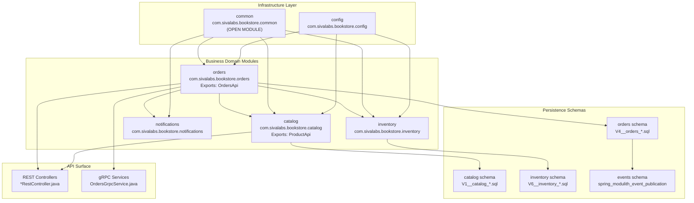
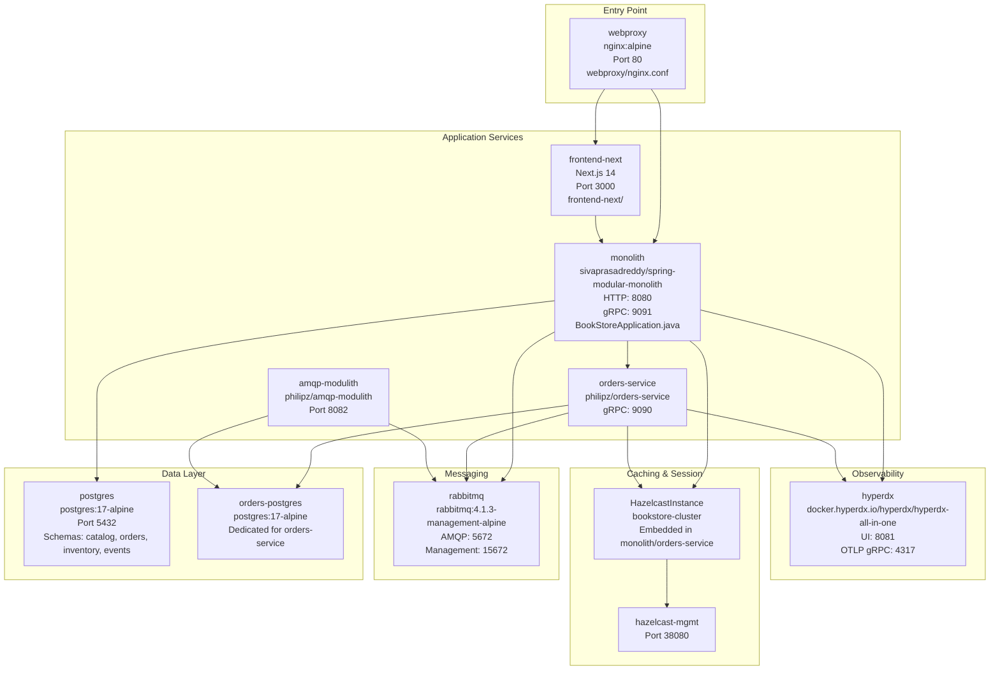
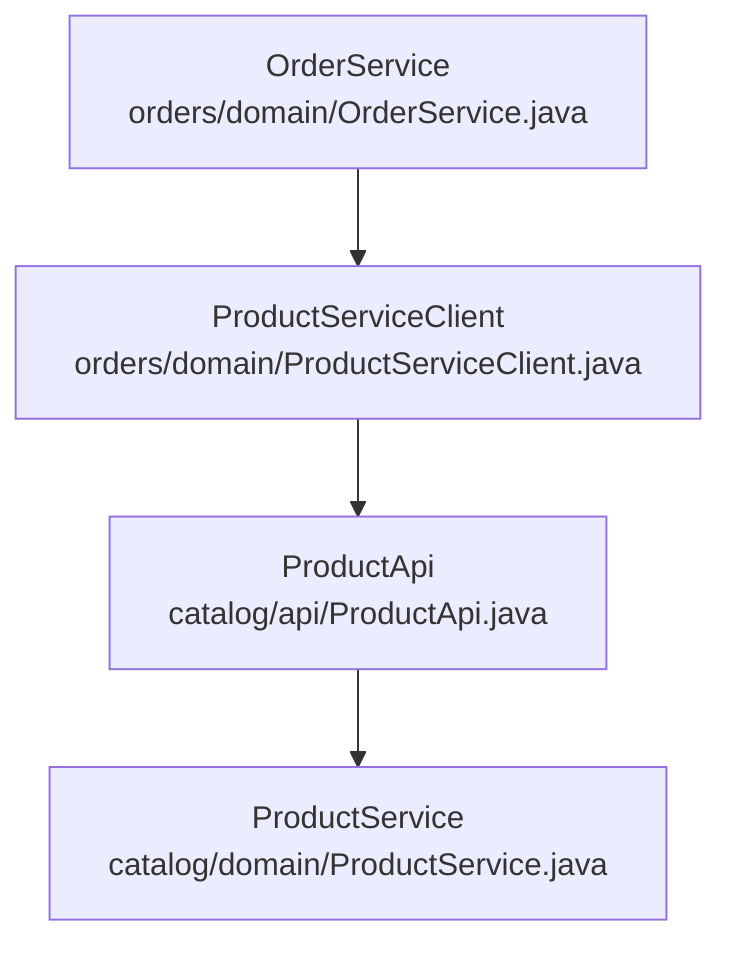
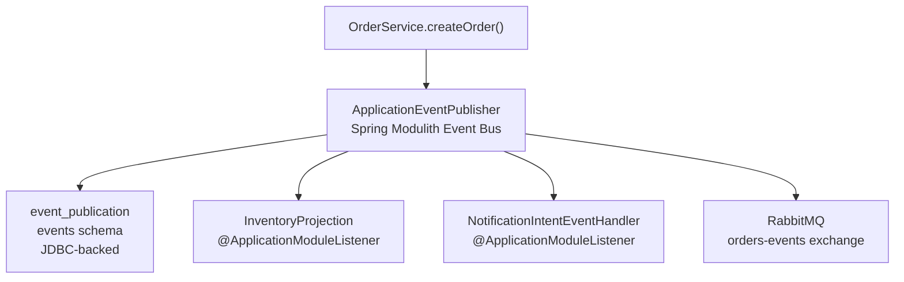
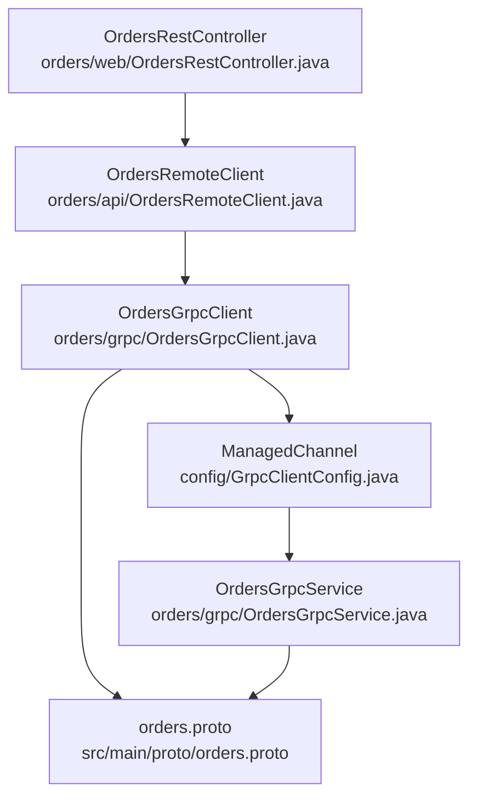

# Overview

> **Relevant source files**
> * [README-API.md](https://github.com/philipz/spring-modular-monolith/blob/30c9bf30/README-API.md)
> * [README.md](https://github.com/philipz/spring-modular-monolith/blob/30c9bf30/README.md)
> * [compose.yml](https://github.com/philipz/spring-modular-monolith/blob/30c9bf30/compose.yml)
> * [docs/API_ANALYSIS_SUMMARY.txt](https://github.com/philipz/spring-modular-monolith/blob/30c9bf30/docs/API_ANALYSIS_SUMMARY.txt)
> * [docs/REST_API_ANALYSIS.md](https://github.com/philipz/spring-modular-monolith/blob/30c9bf30/docs/REST_API_ANALYSIS.md)
> * [docs/bookstore-microservices.png](https://github.com/philipz/spring-modular-monolith/blob/30c9bf30/docs/bookstore-microservices.png)
> * [docs/improvement.md](https://github.com/philipz/spring-modular-monolith/blob/30c9bf30/docs/improvement.md)
> * [docs/orders-data-ownership-analysis.md](https://github.com/philipz/spring-modular-monolith/blob/30c9bf30/docs/orders-data-ownership-analysis.md)
> * [docs/orders-module-boundary-analysis.md](https://github.com/philipz/spring-modular-monolith/blob/30c9bf30/docs/orders-module-boundary-analysis.md)
> * [docs/orders-traffic-migration.md](https://github.com/philipz/spring-modular-monolith/blob/30c9bf30/docs/orders-traffic-migration.md)
> * [k6.js](https://github.com/philipz/spring-modular-monolith/blob/30c9bf30/k6.js)
> * [pom.xml](https://github.com/philipz/spring-modular-monolith/blob/30c9bf30/pom.xml)
> * [src/main/resources/application.properties](https://github.com/philipz/spring-modular-monolith/blob/30c9bf30/src/main/resources/application.properties)
> * [src/test/java/com/sivalabs/bookstore/BookStoreApplicationTests.java](https://github.com/philipz/spring-modular-monolith/blob/30c9bf30/src/test/java/com/sivalabs/bookstore/BookStoreApplicationTests.java)
> * [src/test/java/com/sivalabs/bookstore/TestcontainersConfiguration.java](https://github.com/philipz/spring-modular-monolith/blob/30c9bf30/src/test/java/com/sivalabs/bookstore/TestcontainersConfiguration.java)

This document introduces the Spring Modular Monolith repository, a bookstore e-commerce application demonstrating the modular monolith architectural pattern using Spring Modulith. It provides a high-level understanding of the system architecture, deployment topology, and how business capabilities are organized into independently-developed modules within a single deployable unit.

For detailed information about specific aspects:

* Technology stack details → [Technology Stack](/philipz/spring-modular-monolith/1.1-technology-stack)
* Architecture diagrams and historical design decisions → [System Architecture Diagrams](/philipz/spring-modular-monolith/1.2-system-architecture-diagrams)
* Development setup and local execution → [Getting Started](/philipz/spring-modular-monolith/2-getting-started)
* Module-specific implementation details → [Business Modules](/philipz/spring-modular-monolith/8-business-modules)

## System Purpose

The **spring-modular-monolith** is an e-commerce bookstore application that serves as a reference implementation for:

* **Modular Monolith Pattern**: Organizing a Spring Boot application into well-bounded business modules (`catalog`, `orders`, `inventory`, `notifications`) that communicate through explicit APIs and domain events
* **Hybrid Architecture**: Demonstrating the transition path from monolith to microservices, with the `orders-service` extracted as an independent gRPC microservice
* **Event-Driven Design**: Using Spring Modulith's event publication log and RabbitMQ for guaranteed event delivery and asynchronous processing
* **Production-Grade Infrastructure**: Integrating distributed caching (Hazelcast), message queuing (RabbitMQ), observability (OpenTelemetry + HyperDX), and session management

The application exposes both REST APIs (`/api/**`) and gRPC services for order management, with a Next.js 14 frontend consuming the REST endpoints.

**Sources:** [README.md L1-L16](https://github.com/philipz/spring-modular-monolith/blob/30c9bf30/README.md#L1-L16)

 [pom.xml L1-L39](https://github.com/philipz/spring-modular-monolith/blob/30c9bf30/pom.xml#L1-L39)

## System Architecture

The system follows a modular monolith architecture where business capabilities are organized into Spring Modulith modules within a single Spring Boot application. Each module owns its database schema, cache configuration, and event handlers while communicating through well-defined boundaries.

### Module Organization

The following diagram maps the conceptual business domains to their actual package structure in the codebase:

**Module Responsibilities:**

| Module | Package | Responsibility |
| --- | --- | --- |
| `config` | `com.sivalabs.bookstore.config` | Infrastructure wiring: `HazelcastConfig`, `GrpcServerConfig`, `OtlpGrpcTracingConfig`, `OpenApiConfig` |
| `common` | `com.sivalabs.bookstore.common` | Shared utilities: `SpringAwareMapStoreConfig`, `ExceptionHandling`, cache helpers |
| `catalog` | `com.sivalabs.bookstore.catalog` | Product catalog: `ProductService`, `ProductApi`, `ProductRestController`, `ProductMapStore` |
| `orders` | `com.sivalabs.bookstore.orders` | Order lifecycle: `OrderService`, `OrdersApi`, cart management, `OrdersGrpcService`, `OrderMapStore` |
| `inventory` | `com.sivalabs.bookstore.inventory` | Stock tracking: `InventoryService`, `InventoryProjection`, event listeners, `InventoryMapStore` |
| `notifications` | `com.sivalabs.bookstore.notifications` | Event logging: `NotificationIntentEventHandler` |

**Sources:** [README.md L7-L35](https://github.com/philipz/spring-modular-monolith/blob/30c9bf30/README.md#L7-L35)

 [src/main/java/com/sivalabs/bookstore/](https://github.com/philipz/spring-modular-monolith/blob/30c9bf30/src/main/java/com/sivalabs/bookstore/)

 [src/main/resources/db/migration/](https://github.com/philipz/spring-modular-monolith/blob/30c9bf30/src/main/resources/db/migration/)

### Deployment Architecture

The application deploys as a Docker Compose stack with the monolith alongside supporting infrastructure and an extracted microservice:

**Key Services:**

| Service | Image/Build | Ports | Configuration Source |
| --- | --- | --- | --- |
| `monolith` | `sivaprasadreddy/spring-modular-monolith:0.0.1-SNAPSHOT` | 8080 (HTTP), 9091 (gRPC) | [compose.yml L58-L86](https://github.com/philipz/spring-modular-monolith/blob/30c9bf30/compose.yml#L58-L86) |
| `orders-service` | `philipz/orders-service:0.0.1-SNAPSHOT` | 9090 (gRPC) | [compose.yml L88-L117](https://github.com/philipz/spring-modular-monolith/blob/30c9bf30/compose.yml#L88-L117) |
| `frontend-next` | Built from `frontend-next/` | 3000 | [compose.yml L140-L158](https://github.com/philipz/spring-modular-monolith/blob/30c9bf30/compose.yml#L140-L158) |
| `webproxy` | Built from `webproxy/Dockerfile` | 80 | [compose.yml L160-L173](https://github.com/philipz/spring-modular-monolith/blob/30c9bf30/compose.yml#L160-L173) |
| `postgres` | `postgres:17-alpine` | 5432 | [compose.yml L2-L17](https://github.com/philipz/spring-modular-monolith/blob/30c9bf30/compose.yml#L2-L17) |
| `rabbitmq` | `rabbitmq:4.1.3-management-alpine` | 5672, 15672 | [compose.yml L34-L48](https://github.com/philipz/spring-modular-monolith/blob/30c9bf30/compose.yml#L34-L48) |
| `hyperdx` | `docker.hyperdx.io/hyperdx/hyperdx-all-in-one` | 8081, 4317, 4318 | [compose.yml L49-L56](https://github.com/philipz/spring-modular-monolith/blob/30c9bf30/compose.yml#L49-L56) |

**Sources:** [compose.yml L1-L189](https://github.com/philipz/spring-modular-monolith/blob/30c9bf30/compose.yml#L1-L189)

 [webproxy/nginx.conf](https://github.com/philipz/spring-modular-monolith/blob/30c9bf30/webproxy/nginx.conf)

 [README.md L18-L28](https://github.com/philipz/spring-modular-monolith/blob/30c9bf30/README.md#L18-L28)

## Module Communication Patterns

Spring Modulith enforces strict module boundaries while allowing three communication mechanisms:

### 1. Direct API Calls

Modules expose typed interfaces in their `api` packages. For example, `orders` module calls `catalog`:

**Sources:** [src/main/java/com/sivalabs/bookstore/orders/domain/ProductServiceClient.java](https://github.com/philipz/spring-modular-monolith/blob/30c9bf30/src/main/java/com/sivalabs/bookstore/orders/domain/ProductServiceClient.java)

 [src/main/java/com/sivalabs/bookstore/catalog/api/ProductApi.java](https://github.com/philipz/spring-modular-monolith/blob/30c9bf30/src/main/java/com/sivalabs/bookstore/catalog/api/ProductApi.java)

### 2. Domain Events

Modules publish events to Spring Modulith's event bus, which persists them to the `events` schema for guaranteed delivery:

**Configuration:**

* Event storage: `spring.modulith.events.jdbc.schema=events` ([application.properties L37](https://github.com/philipz/spring-modular-monolith/blob/30c9bf30/application.properties#L37-L37) )
* Guaranteed delivery: `spring.modulith.events.republish-outstanding-events-on-restart=true` ([application.properties L39](https://github.com/philipz/spring-modular-monolith/blob/30c9bf30/application.properties#L39-L39) )

**Sources:** [src/main/java/com/sivalabs/bookstore/orders/domain/OrderService.java](https://github.com/philipz/spring-modular-monolith/blob/30c9bf30/src/main/java/com/sivalabs/bookstore/orders/domain/OrderService.java)

 [src/main/java/com/sivalabs/bookstore/inventory/InventoryProjection.java](https://github.com/philipz/spring-modular-monolith/blob/30c9bf30/src/main/java/com/sivalabs/bookstore/inventory/InventoryProjection.java)

 [application.properties L36-L40](https://github.com/philipz/spring-modular-monolith/blob/30c9bf30/application.properties#L36-L40)

### 3. gRPC Communication

The `orders` module exposes gRPC services for external consumption and internal delegation:

The gRPC client target is configurable via `bookstore.grpc.client.target`, allowing the monolith to call either:

* In-process: `localhost:9091` (for monolithic operation)
* External: `orders-service:9090` (for microservice delegation)

**Sources:** [src/main/java/com/sivalabs/bookstore/orders/grpc/OrdersGrpcClient.java](https://github.com/philipz/spring-modular-monolith/blob/30c9bf30/src/main/java/com/sivalabs/bookstore/orders/grpc/OrdersGrpcClient.java)

 [src/main/java/com/sivalabs/bookstore/orders/grpc/OrdersGrpcService.java](https://github.com/philipz/spring-modular-monolith/blob/30c9bf30/src/main/java/com/sivalabs/bookstore/orders/grpc/OrdersGrpcService.java)

 [src/main/proto/orders.proto](https://github.com/philipz/spring-modular-monolith/blob/30c9bf30/src/main/proto/orders.proto)

 [application.properties L114-L126](https://github.com/philipz/spring-modular-monolith/blob/30c9bf30/application.properties#L114-L126)

## Data Architecture

Each module owns its database schema and cache configuration, managed independently through Liquibase and Hazelcast:

| Module | Schema | Liquibase Changelog | Cache | MapStore |
| --- | --- | --- | --- | --- |
| `catalog` | `catalog` | `V1__catalog_create_products_table.sql` | `products-cache` | `ProductMapStore` |
| `orders` | `orders` | `V4__orders_create_orders_table.sql` | `orders-cache` | `OrderMapStore` |
| `inventory` | `inventory` | `V6__inventory_create_inventory_table.sql` | `inventory-cache` | `InventoryMapStore` |
| Spring Modulith | `events` | Auto-created by Spring Modulith | N/A | N/A |

**Hazelcast Configuration:**

* Each module contributes a `MapConfig` bean via `@Bean` methods in module-specific config classes
* `config/HazelcastConfig` aggregates all `MapConfig` beans using `ObjectProvider<MapConfig>`
* Write-through caching: `bookstore.cache.write-through=true`, `write-delay-seconds=0`
* TTL: 3600s for products/orders, 1800s for inventory

**Session Management:**

* Type: `spring.session.store-type=hazelcast`
* Map name: `spring:session:sessions`
* Cookie: `BOOKSTORE_SESSION` (HttpOnly, SameSite=Strict, 30-minute timeout)

**Sources:** [src/main/resources/db/migration/](https://github.com/philipz/spring-modular-monolith/blob/30c9bf30/src/main/resources/db/migration/)

 [src/main/java/com/sivalabs/bookstore/config/HazelcastConfig.java](https://github.com/philipz/spring-modular-monolith/blob/30c9bf30/src/main/java/com/sivalabs/bookstore/config/HazelcastConfig.java)

 [src/main/java/com/sivalabs/bookstore/config/LiquibaseConfig.java](https://github.com/philipz/spring-modular-monolith/blob/30c9bf30/src/main/java/com/sivalabs/bookstore/config/LiquibaseConfig.java)

 [application.properties L42-L68](https://github.com/philipz/spring-modular-monolith/blob/30c9bf30/application.properties#L42-L68)

 [application.properties L89-L99](https://github.com/philipz/spring-modular-monolith/blob/30c9bf30/application.properties#L89-L99)

## API Surface

The application exposes multiple API types for different consumers:

### REST API (/api/**)

Served by Spring MVC controllers in each module:

| Endpoint Pattern | Controller | Module | Purpose |
| --- | --- | --- | --- |
| `/api/products` | `ProductRestController` | `catalog` | Product catalog browsing |
| `/api/cart/**` | `CartRestController` | `orders` | Shopping cart management (session-based) |
| `/api/orders/**` | `OrdersRestController` | `orders` | Order creation and retrieval |

**Documentation:**

* OpenAPI spec: `http://localhost:8080/api-docs` (configured via `springdoc.api-docs.path`)
* Swagger UI: `http://localhost:8080/swagger-ui.html`

**Sources:** [src/main/java/com/sivalabs/bookstore/catalog/web/ProductRestController.java](https://github.com/philipz/spring-modular-monolith/blob/30c9bf30/src/main/java/com/sivalabs/bookstore/catalog/web/ProductRestController.java)

 [src/main/java/com/sivalabs/bookstore/orders/web/CartRestController.java](https://github.com/philipz/spring-modular-monolith/blob/30c9bf30/src/main/java/com/sivalabs/bookstore/orders/web/CartRestController.java)

 [src/main/java/com/sivalabs/bookstore/orders/web/OrdersRestController.java](https://github.com/philipz/spring-modular-monolith/blob/30c9bf30/src/main/java/com/sivalabs/bookstore/orders/web/OrdersRestController.java)

 [application.properties L128-L149](https://github.com/philipz/spring-modular-monolith/blob/30c9bf30/application.properties#L128-L149)

### gRPC API

Binary protocol for inter-service communication:

* **Service Definition:** `OrdersService` in [src/main/proto/orders.proto](https://github.com/philipz/spring-modular-monolith/blob/30c9bf30/src/main/proto/orders.proto)
* **Server:** `OrdersGrpcService` runs on port 9091 (monolith) or 9090 (orders-service)
* **Client:** `OrdersGrpcClient` with retry logic and deadline configuration
* **Health Checks:** gRPC health protocol enabled via `bookstore.grpc.server.health-check-enabled=true`

**Sources:** [src/main/proto/orders.proto](https://github.com/philipz/spring-modular-monolith/blob/30c9bf30/src/main/proto/orders.proto)

 [src/main/java/com/sivalabs/bookstore/orders/grpc/OrdersGrpcService.java](https://github.com/philipz/spring-modular-monolith/blob/30c9bf30/src/main/java/com/sivalabs/bookstore/orders/grpc/OrdersGrpcService.java)

 [src/main/java/com/sivalabs/bookstore/config/GrpcServerConfig.java](https://github.com/philipz/spring-modular-monolith/blob/30c9bf30/src/main/java/com/sivalabs/bookstore/config/GrpcServerConfig.java)

 [application.properties L113-L126](https://github.com/philipz/spring-modular-monolith/blob/30c9bf30/application.properties#L113-L126)

## Observability

The system uses OpenTelemetry for distributed tracing with HyperDX as the observability backend:

**Configuration:**

* Protocol: OTLP gRPC (`otlp.grpc.endpoint=http://localhost:4317`)
* Compression: gzip (`otlp.grpc.compression=gzip`)
* Sampling: 100% (`management.tracing.sampling.probability=1.0`)
* Instrumentation: Spring Boot auto-configuration + Spring Modulith observability module

**Components:**

* `OtlpGrpcTracingConfig`: Configures OTLP exporter with authentication and timeout
* `OtlpProperties`: Externalizes OTLP configuration properties
* Spring Actuator: All endpoints exposed (`management.endpoints.web.exposure.include=*`)

**Trace Context:**

* Logs include trace/span IDs via pattern: `[${spring.application.name:},%X{traceId:-},%X{spanId:-}]`
* Session cookie includes trace context for request correlation

**Sources:** [src/main/java/com/sivalabs/bookstore/config/OtlpGrpcTracingConfig.java](https://github.com/philipz/spring-modular-monolith/blob/30c9bf30/src/main/java/com/sivalabs/bookstore/config/OtlpGrpcTracingConfig.java)

 [src/main/java/com/sivalabs/bookstore/config/OtlpProperties.java](https://github.com/philipz/spring-modular-monolith/blob/30c9bf30/src/main/java/com/sivalabs/bookstore/config/OtlpProperties.java)

 [application.properties L70-L82](https://github.com/philipz/spring-modular-monolith/blob/30c9bf30/application.properties#L70-L82)

 [compose.yml L49-L56](https://github.com/philipz/spring-modular-monolith/blob/30c9bf30/compose.yml#L49-L56)

 [compose.yml L71-L73](https://github.com/philipz/spring-modular-monolith/blob/30c9bf30/compose.yml#L71-L73)

## Hybrid Architecture: Monolith + Microservice

The system demonstrates a strangler pattern migration, where `orders-service` is extracted as an independent microservice while maintaining backward compatibility:

**Integration Points:**

1. **REST to gRPC Bridge:** `OrdersRestController` delegates to `OrdersGrpcClient`, which targets either the in-process server (monolith mode) or external service (microservice mode)
2. **Shared Infrastructure:** Both monolith and orders-service connect to: * RabbitMQ for event publishing * Hazelcast for distributed caching and sessions * HyperDX for traces/metrics/logs
3. **Database Separation:** * Monolith: `postgres:5432` with schemas `catalog`, `orders`, `inventory`, `events` * Orders-service: `orders-postgres:5432` (dedicated instance)
4. **Traffic Migration:** nginx can route `/api/orders/**` traffic based on headers, cookies, or percentage splits (see [Traffic Migration Strategy](/philipz/spring-modular-monolith/10.4-traffic-migration-strategy))

**Sources:** [compose.yml L58-L117](https://github.com/philipz/spring-modular-monolith/blob/30c9bf30/compose.yml#L58-L117)

 [docs/orders-traffic-migration.md L1-L69](https://github.com/philipz/spring-modular-monolith/blob/30c9bf30/docs/orders-traffic-migration.md#L1-L69)

 [README.md L37-L41](https://github.com/philipz/spring-modular-monolith/blob/30c9bf30/README.md#L37-L41)

## Testing Strategy

The system employs multiple testing approaches:

| Test Type | Tool | Location | Purpose |
| --- | --- | --- | --- |
| Modularity Verification | Spring Modulith | `src/test/java/com/sivalabs/bookstore/ModularityTests.java` | Verify module boundaries |
| Integration Tests | `@ApplicationModuleTest` | `src/test/java/com/sivalabs/bookstore/*/` | Test individual modules in isolation |
| Container Tests | Testcontainers | `TestcontainersConfiguration` | Spin up PostgreSQL and RabbitMQ |
| Load Tests | k6 | `k6.js` | End-to-end order creation flow |
| Frontend Tests | Playwright | `frontend-next/` | Next.js UI testing |

**Testcontainers Configuration:**

* PostgreSQL: `postgres:17-alpine` ([TestcontainersConfiguration.java L17](https://github.com/philipz/spring-modular-monolith/blob/30c9bf30/TestcontainersConfiguration.java#L17-L17) )
* RabbitMQ: `rabbitmq:4.1.3-alpine` ([TestcontainersConfiguration.java L20](https://github.com/philipz/spring-modular-monolith/blob/30c9bf30/TestcontainersConfiguration.java#L20-L20) )

**Sources:** [src/test/java/com/sivalabs/bookstore/TestcontainersConfiguration.java L1-L33](https://github.com/philipz/spring-modular-monolith/blob/30c9bf30/src/test/java/com/sivalabs/bookstore/TestcontainersConfiguration.java#L1-L33)

 [k6.js L1-L93](https://github.com/philipz/spring-modular-monolith/blob/30c9bf30/k6.js#L1-L93)

 [src/test/java/com/sivalabs/bookstore/BookStoreApplicationTests.java L1-L17](https://github.com/philipz/spring-modular-monolith/blob/30c9bf30/src/test/java/com/sivalabs/bookstore/BookStoreApplicationTests.java#L1-L17)

## Key Technology Versions

| Technology | Version | Purpose |
| --- | --- | --- |
| Spring Boot | 3.5.5 | Application framework |
| Spring Modulith | 1.4.3 | Module boundaries and events |
| Java | 21 | Runtime |
| PostgreSQL | 17-alpine | Relational database |
| RabbitMQ | 4.1.3-management-alpine | Message broker |
| Hazelcast | 5.5.6 | Distributed cache and sessions |
| gRPC | 1.65.1 | Inter-service communication |
| OpenTelemetry | (via Spring Boot) | Observability |
| Next.js | 14 | Frontend framework |
| nginx | alpine | Reverse proxy |

**Sources:** [pom.xml L10](https://github.com/philipz/spring-modular-monolith/blob/30c9bf30/pom.xml#L10-L10)

 [pom.xml L22](https://github.com/philipz/spring-modular-monolith/blob/30c9bf30/pom.xml#L22-L22)

 [pom.xml L26-L28](https://github.com/philipz/spring-modular-monolith/blob/30c9bf30/pom.xml#L26-L28)

 [compose.yml L2-L56](https://github.com/philipz/spring-modular-monolith/blob/30c9bf30/compose.yml#L2-L56)

 [frontend-next/](https://github.com/philipz/spring-modular-monolith/blob/30c9bf30/frontend-next/)

## Quick Access

Once the Docker Compose stack is running (`task start`), access:

| Component | URL | Purpose |
| --- | --- | --- |
| Storefront | [http://localhost](http://localhost) | Next.js frontend via nginx |
| REST API | [http://localhost:8080/api/](http://localhost:8080/api/)** | Backend API endpoints |
| Swagger UI | [http://localhost:8080/swagger-ui.html](http://localhost:8080/swagger-ui.html) | Interactive API documentation |
| Actuator | [http://localhost:8080/actuator](http://localhost:8080/actuator) | Spring Boot management endpoints |
| Modulith Info | [http://localhost:8080/actuator/modulith](http://localhost:8080/actuator/modulith) | Module structure visualization |
| HyperDX | [http://localhost:8081](http://localhost:8081) | Traces, metrics, logs |
| RabbitMQ | [http://localhost:15672](http://localhost:15672) | Message queue management (guest/guest) |
| Hazelcast | [http://localhost:38080](http://localhost:38080) | Cache cluster monitoring |

**Sources:** [README.md L76-L89](https://github.com/philipz/spring-modular-monolith/blob/30c9bf30/README.md#L76-L89)

 [compose.yml L1-L189](https://github.com/philipz/spring-modular-monolith/blob/30c9bf30/compose.yml#L1-L189)