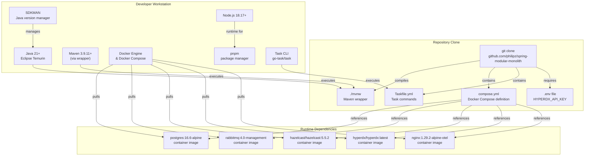
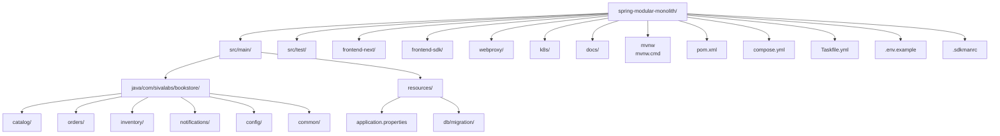
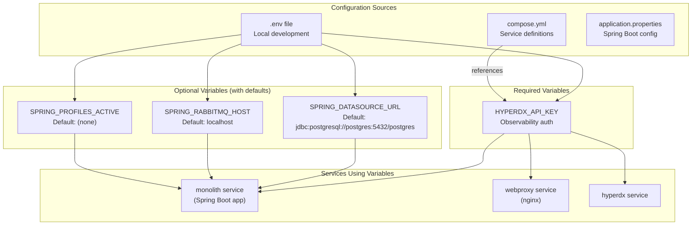

# Prerequisites and Installation

> **Relevant source files**
> * [.env.example](https://github.com/philipz/spring-modular-monolith/blob/30c9bf30/.env.example)
> * [.github/workflows/maven.yml](https://github.com/philipz/spring-modular-monolith/blob/30c9bf30/.github/workflows/maven.yml)
> * [.sdkmanrc](https://github.com/philipz/spring-modular-monolith/blob/30c9bf30/.sdkmanrc)
> * [README-API.md](https://github.com/philipz/spring-modular-monolith/blob/30c9bf30/README-API.md)
> * [README.md](https://github.com/philipz/spring-modular-monolith/blob/30c9bf30/README.md)
> * [docs/API_ANALYSIS_SUMMARY.txt](https://github.com/philipz/spring-modular-monolith/blob/30c9bf30/docs/API_ANALYSIS_SUMMARY.txt)
> * [docs/REST_API_ANALYSIS.md](https://github.com/philipz/spring-modular-monolith/blob/30c9bf30/docs/REST_API_ANALYSIS.md)
> * [docs/bookstore-microservices.png](https://github.com/philipz/spring-modular-monolith/blob/30c9bf30/docs/bookstore-microservices.png)
> * [docs/improvement.md](https://github.com/philipz/spring-modular-monolith/blob/30c9bf30/docs/improvement.md)
> * [docs/orders-data-ownership-analysis.md](https://github.com/philipz/spring-modular-monolith/blob/30c9bf30/docs/orders-data-ownership-analysis.md)
> * [docs/orders-module-boundary-analysis.md](https://github.com/philipz/spring-modular-monolith/blob/30c9bf30/docs/orders-module-boundary-analysis.md)
> * [docs/orders-traffic-migration.md](https://github.com/philipz/spring-modular-monolith/blob/30c9bf30/docs/orders-traffic-migration.md)
> * [k6.js](https://github.com/philipz/spring-modular-monolith/blob/30c9bf30/k6.js)
> * [renovate.json](https://github.com/philipz/spring-modular-monolith/blob/30c9bf30/renovate.json)
> * [src/main/java/com/sivalabs/bookstore/catalog/domain/ProductService.java](https://github.com/philipz/spring-modular-monolith/blob/30c9bf30/src/main/java/com/sivalabs/bookstore/catalog/domain/ProductService.java)
> * [webproxy/Dockerfile](https://github.com/philipz/spring-modular-monolith/blob/30c9bf30/webproxy/Dockerfile)
> * [webproxy/entrypoint.sh](https://github.com/philipz/spring-modular-monolith/blob/30c9bf30/webproxy/entrypoint.sh)
> * [webproxy/nginx.conf](https://github.com/philipz/spring-modular-monolith/blob/30c9bf30/webproxy/nginx.conf)

## Purpose and Scope

This page documents the required tools, recommended versions, and installation procedures for developing and running the Spring Modular Monolith locally. It covers both backend Java development and frontend Next.js work, as well as the infrastructure dependencies needed to run the complete stack via Docker Compose.

For instructions on actually running the application once prerequisites are met, see [Running Locally with Docker Compose](/philipz/spring-modular-monolith/2.2-running-locally-with-docker-compose). For information about building and testing code, see [Building and Testing](/philipz/spring-modular-monolith/11.1-building-and-testing).

---

## Overview: Development Environment Components

The following diagram shows the relationship between development tools, the repository structure, and the runtime dependencies:



**Sources:** [README.md L43-L59](https://github.com/philipz/spring-modular-monolith/blob/30c9bf30/README.md#L43-L59)

 [.sdkmanrc L1-L3](https://github.com/philipz/spring-modular-monolith/blob/30c9bf30/.sdkmanrc#L1-L3)

 [compose.yml](https://github.com/philipz/spring-modular-monolith/blob/30c9bf30/compose.yml)

 [Taskfile.yml](https://github.com/philipz/spring-modular-monolith/blob/30c9bf30/Taskfile.yml)

---

## Required Tools

The following table lists mandatory software for running the complete Spring Modular Monolith stack:

| Tool | Minimum Version | Recommended Version | Purpose |
| --- | --- | --- | --- |
| **Java JDK** | 21 | 21 (Temurin 21.x or 24.0.1-tem) | Backend compilation and runtime |
| **Maven** | 3.9+ | 3.9.11 | Build automation (via `./mvnw` wrapper) |
| **Docker** | 24.0+ | Latest stable | Container runtime |
| **Docker Compose** | 2.20+ | Latest stable | Multi-container orchestration |
| **Node.js** | 18.17 | 20.x LTS | Frontend build tooling |
| **pnpm** | 8.0+ | Latest stable | Frontend package manager |
| **Task** | 3.0+ | Latest stable | Development automation (`task` commands) |

**Sources:** [README.md L43-L59](https://github.com/philipz/spring-modular-monolith/blob/30c9bf30/README.md#L43-L59)

 [.sdkmanrc L1-L3](https://github.com/philipz/spring-modular-monolith/blob/30c9bf30/.sdkmanrc#L1-L3)

 [.github/workflows/maven.yml L34-L38](https://github.com/philipz/spring-modular-monolith/blob/30c9bf30/.github/workflows/maven.yml#L34-L38)

---

## Optional Tools

These tools enhance the development experience but are not required for basic operation:

| Tool | Purpose |
| --- | --- |
| **k6** | Load testing (`k6 run k6.js`) |
| **Playwright** | Frontend end-to-end testing |
| **SDKMAN** | Java version management |
| **Git** | Version control (for cloning repository) |

**Sources:** [README.md L49](https://github.com/philipz/spring-modular-monolith/blob/30c9bf30/README.md#L49-L49)

 [k6.js L1-L93](https://github.com/philipz/spring-modular-monolith/blob/30c9bf30/k6.js#L1-L93)

---

## Installation Instructions

### Java Development Kit

**Option 1: Using SDKMAN (Recommended)**

```markdown
# Install SDKMAN
curl -s "https://get.sdkman.io" | bash
source "$HOME/.sdkman/bin/sdkman-init.sh"

# Install Java (Temurin distribution)
sdk install java 21.0.1-tem

# Or use the version specified in .sdkmanrc
sdk install java 24.0.1-tem

# Set default
sdk default java 21.0.1-tem
```

**Option 2: Direct Download**

Download Eclipse Temurin 21 from [adoptium.net](https://adoptium.net/) and install according to your operating system.

**Verification:**

```markdown
java -version
# Expected output: openjdk version "21.x.x" or "24.0.1"
```

**Sources:** [README.md L51-L59](https://github.com/philipz/spring-modular-monolith/blob/30c9bf30/README.md#L51-L59)

 [.sdkmanrc L1](https://github.com/philipz/spring-modular-monolith/blob/30c9bf30/.sdkmanrc#L1-L1)

---

### Maven

Maven is included via the Maven wrapper (`./mvnw`), so no separate installation is required. However, if you want a global Maven installation:

```go
# Using SDKMAN
sdk install maven 3.9.11

# Or using package managers
# macOS:
brew install maven

# Ubuntu/Debian:
sudo apt-get install maven
```

**Verification:**

```markdown
./mvnw --version
# Expected output: Apache Maven 3.9.x
```

**Sources:** [README.md L113](https://github.com/philipz/spring-modular-monolith/blob/30c9bf30/README.md#L113-L113)

 [.sdkmanrc L2](https://github.com/philipz/spring-modular-monolith/blob/30c9bf30/.sdkmanrc#L2-L2)

 [.github/workflows/maven.yml L40-L44](https://github.com/philipz/spring-modular-monolith/blob/30c9bf30/.github/workflows/maven.yml#L40-L44)

---

### Docker and Docker Compose

**macOS:**

```python
# Install Docker Desktop
brew install --cask docker

# Or download from https://www.docker.com/products/docker-desktop
```

**Linux (Ubuntu/Debian):**

```sql
# Install Docker Engine
sudo apt-get update
sudo apt-get install docker-ce docker-ce-cli containerd.io docker-buildx-plugin docker-compose-plugin

# Add user to docker group
sudo usermod -aG docker $USER
newgrp docker
```

**Windows:**

Download and install Docker Desktop from [docker.com](https://www.docker.com/products/docker-desktop).

**Verification:**

```markdown
docker --version
# Expected: Docker version 24.x or later

docker compose version
# Expected: Docker Compose version v2.x or later

docker info
# Should show running Docker daemon
```

**Sources:** [README.md L46](https://github.com/philipz/spring-modular-monolith/blob/30c9bf30/README.md#L46-L46)

 [README.md L55-L56](https://github.com/philipz/spring-modular-monolith/blob/30c9bf30/README.md#L55-L56)

---

### Node.js and pnpm

**Node.js:**

```go
# Using nvm (recommended)
curl -o- https://raw.githubusercontent.com/nvm-sh/nvm/v0.39.0/install.sh | bash
nvm install 18.17
nvm use 18.17

# Or using package managers
# macOS:
brew install node@18

# Ubuntu/Debian:
curl -fsSL https://deb.nodesource.com/setup_18.x | sudo -E bash -
sudo apt-get install -y nodejs
```

**pnpm:**

```go
# Enable Corepack (comes with Node.js 16.13+)
corepack enable

# Or install globally
npm install -g pnpm

# Or using package managers
# macOS:
brew install pnpm
```

**Verification:**

```markdown
node --version
# Expected: v18.17.x or later

pnpm --version
# Expected: 8.x or later
```

**Sources:** [README.md L47](https://github.com/philipz/spring-modular-monolith/blob/30c9bf30/README.md#L47-L47)

 [README.md L103-L109](https://github.com/philipz/spring-modular-monolith/blob/30c9bf30/README.md#L103-L109)

---

### Task CLI

**macOS:**

```
brew install go-task
```

**Linux:**

```go
# Using Go (if installed)
go install github.com/go-task/task/v3/cmd/task@latest

# Or download binary
sh -c "$(curl --location https://taskfile.dev/install.sh)" -- -d -b /usr/local/bin
```

**Windows:**

```markdown
# Using Chocolatey
choco install go-task

# Or using Scoop
scoop install task
```

**Verification:**

```markdown
task --version
# Expected: Task version v3.x
```

**Sources:** [README.md L48](https://github.com/philipz/spring-modular-monolith/blob/30c9bf30/README.md#L48-L48)

 [README.md L58](https://github.com/philipz/spring-modular-monolith/blob/30c9bf30/README.md#L58-L58)

---

## Repository Setup

### Clone the Repository

```
git clone https://github.com/philipz/spring-modular-monolith.git
cd spring-modular-monolith
```

### Repository Structure Overview



**Sources:** [README.md L119-L134](https://github.com/philipz/spring-modular-monolith/blob/30c9bf30/README.md#L119-L134)

---

## Environment Configuration

### Required Environment Variables

The application requires specific environment variables for observability and external integrations. The primary mandatory variable is `HYPERDX_API_KEY` for distributed tracing.

#### Create Environment File

```markdown
# Copy the example file
cp .env.example .env

# Edit with your values
nano .env  # or vim, code, etc.
```

#### Environment Variable Reference



**Obtaining HyperDX API Key:**

When you start the HyperDX service for the first time via Docker Compose, it will generate an API key. Alternatively, you can set a custom key in your `.env` file:

```markdown
# .env file
HYPERDX_API_KEY=your-secret-key-here
```

The nginx webproxy requires this variable and will fail to start without it:

```php
# From webproxy/entrypoint.sh
if [ -z "${HYPERDX_API_KEY}" ]; then
  echo "ERROR: HYPERDX_API_KEY environment variable is not set"
  exit 1
fi
```

**Sources:** [.env.example L1](https://github.com/philipz/spring-modular-monolith/blob/30c9bf30/.env.example#L1-L1)

 [webproxy/entrypoint.sh L4-L8](https://github.com/philipz/spring-modular-monolith/blob/30c9bf30/webproxy/entrypoint.sh#L4-L8)

 [compose.yml](https://github.com/philipz/spring-modular-monolith/blob/30c9bf30/compose.yml)

---

### Development Profile Configuration

For local development without Docker, configure these environment variables:

```javascript
# Backend development without Docker Compose
export SPRING_DATASOURCE_URL=jdbc:postgresql://localhost:5432/postgres
export SPRING_DATASOURCE_USERNAME=postgres
export SPRING_DATASOURCE_PASSWORD=postgres
export SPRING_RABBITMQ_HOST=localhost
export SPRING_RABBITMQ_PORT=5672
export SPRING_RABBITMQ_USERNAME=guest
export SPRING_RABBITMQ_PASSWORD=guest

# Enable dev profile for CORS support
export SPRING_PROFILES_ACTIVE=dev
```

The `dev` profile activates `CorsConfig` which allows `http://localhost:3000` to access the backend API during frontend development.

**Sources:** [README.md L92-L99](https://github.com/philipz/spring-modular-monolith/blob/30c9bf30/README.md#L92-L99)

 [README.md L109](https://github.com/philipz/spring-modular-monolith/blob/30c9bf30/README.md#L109-L109)

 [docs/REST_API_ANALYSIS.md L52-L56](https://github.com/philipz/spring-modular-monolith/blob/30c9bf30/docs/REST_API_ANALYSIS.md#L52-L56)

---

## Verification Steps

After installing all prerequisites, verify your setup:

```python
# Navigate to project directory
cd spring-modular-monolith

# Verify Java
java -version
# ✓ Should show Java 21 or later

# Verify Maven wrapper
./mvnw --version
# ✓ Should show Maven 3.9.x and Java 21

# Verify Docker
docker --version
docker compose version
docker info
# ✓ Should show Docker 24+ and Compose v2+
# ✓ docker info should show running daemon

# Verify Task
task --version
# ✓ Should show Task v3.x

# Verify Node.js and pnpm (if doing frontend work)
node --version
pnpm --version
# ✓ Should show Node.js 18.17+ and pnpm 8+

# Verify environment file exists
ls -la .env
# ✓ Should show .env file (if not, copy from .env.example)
```

**Complete Verification Matrix:**

| Check | Command | Expected Output | Status |
| --- | --- | --- | --- |
| Java version | `java -version` | `openjdk version "21.x.x"` or later | Required |
| Maven wrapper | `./mvnw --version` | `Apache Maven 3.9.x` | Required |
| Docker engine | `docker --version` | `Docker version 24.x` or later | Required |
| Docker Compose | `docker compose version` | `v2.x` or later | Required |
| Docker daemon | `docker info` | Shows system info without errors | Required |
| Task CLI | `task --version` | `Task version: v3.x` | Required |
| Node.js | `node --version` | `v18.17.x` or later | Frontend only |
| pnpm | `pnpm --version` | `8.x` or later | Frontend only |
| Environment | `cat .env` | Contains `HYPERDX_API_KEY=...` | Required |

**Sources:** [README.md L51-L59](https://github.com/philipz/spring-modular-monolith/blob/30c9bf30/README.md#L51-L59)

---

## Next Steps

Once all prerequisites are installed and verified:

1. **Run the application:** See [Running Locally with Docker Compose](/philipz/spring-modular-monolith/2.2-running-locally-with-docker-compose) for instructions on starting the complete stack with `task start`.
2. **Backend development:** Refer to [Building and Testing](/philipz/spring-modular-monolith/11.1-building-and-testing) for Maven build commands and test execution.
3. **Frontend development:** See [Frontend Integration](/philipz/spring-modular-monolith/14-frontend-integration) for Next.js setup and development workflow.
4. **Review configuration:** Check [Application Properties](/philipz/spring-modular-monolith/15.1-application-properties) for a complete reference of available configuration options.

---

## Troubleshooting

### Java Version Issues

**Problem:** Wrong Java version active

```markdown
# Check current Java version
java -version

# If using SDKMAN, list installed versions
sdk list java

# Switch to correct version
sdk use java 21.0.1-tem
```

### Docker Permission Issues

**Problem:** `permission denied while trying to connect to the Docker daemon`

```markdown
# Linux: Add user to docker group
sudo usermod -aG docker $USER
newgrp docker

# Verify
docker ps
```

### Maven Wrapper Not Executable

**Problem:** `./mvnw: Permission denied`

```markdown
# Make wrapper executable
chmod +x mvnw mvnw.cmd

# Verify
./mvnw --version
```

### Task Command Not Found

**Problem:** `task: command not found`

```javascript
# macOS: Install via Homebrew
brew install go-task

# Linux: Download and install
sh -c "$(curl --location https://taskfile.dev/install.sh)" -- -d -b ~/.local/bin
export PATH="$HOME/.local/bin:$PATH"
```

### Environment Variable Not Set

**Problem:** `ERROR: HYPERDX_API_KEY environment variable is not set`

```javascript
# Ensure .env file exists
cp .env.example .env

# Edit and add your API key
echo "HYPERDX_API_KEY=your-key-here" > .env

# For Docker Compose, variables are loaded automatically
# For local development, export manually
export HYPERDX_API_KEY=your-key-here
```

**Sources:** [README.md L142-L148](https://github.com/philipz/spring-modular-monolith/blob/30c9bf30/README.md#L142-L148)

 [webproxy/entrypoint.sh L4-L8](https://github.com/philipz/spring-modular-monolith/blob/30c9bf30/webproxy/entrypoint.sh#L4-L8)

---

## Additional Resources

* **CI/CD Reference:** See [.github/workflows/maven.yml L1-L48](https://github.com/philipz/spring-modular-monolith/blob/30c9bf30/.github/workflows/maven.yml#L1-L48)  for the GitHub Actions build configuration that validates prerequisites.
* **Docker Images:** See [compose.yml](https://github.com/philipz/spring-modular-monolith/blob/30c9bf30/compose.yml)  for the complete list of container images and their versions.
* **SDKMAN Configuration:** See [.sdkmanrc L1-L3](https://github.com/philipz/spring-modular-monolith/blob/30c9bf30/.sdkmanrc#L1-L3)  for the specific Java and Maven versions used in this project.
* **Load Testing:** See [k6.js L1-L93](https://github.com/philipz/spring-modular-monolith/blob/30c9bf30/k6.js#L1-L93)  for k6 load test prerequisites and usage.

**Sources:** [.github/workflows/maven.yml L1-L48](https://github.com/philipz/spring-modular-monolith/blob/30c9bf30/.github/workflows/maven.yml#L1-L48)

 [compose.yml](https://github.com/philipz/spring-modular-monolith/blob/30c9bf30/compose.yml)

 [.sdkmanrc L1-L3](https://github.com/philipz/spring-modular-monolith/blob/30c9bf30/.sdkmanrc#L1-L3)

 [k6.js L1-L93](https://github.com/philipz/spring-modular-monolith/blob/30c9bf30/k6.js#L1-L93)