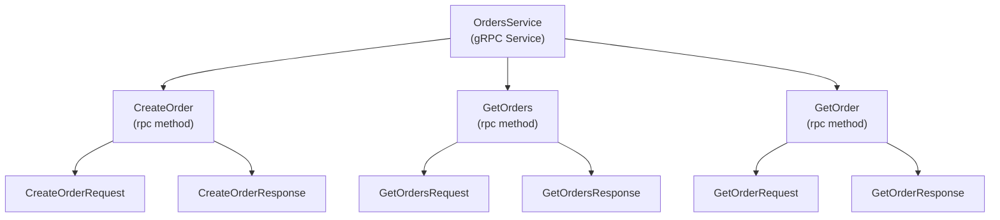
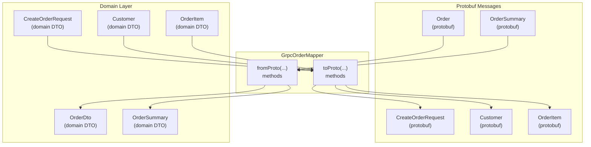
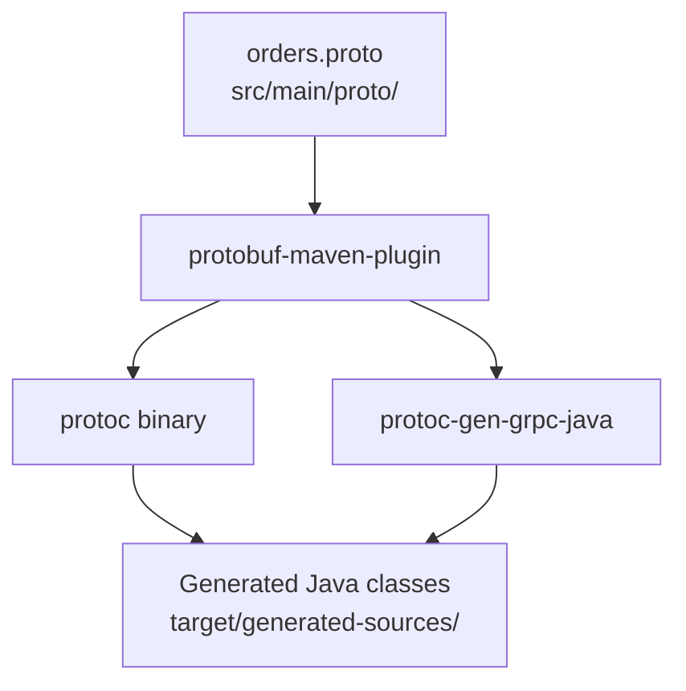
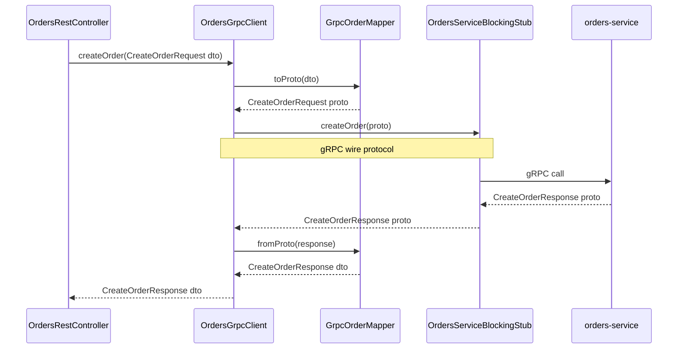
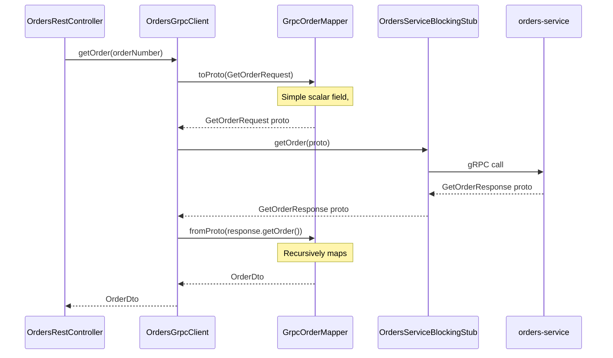

# Protocol Buffer Messages and Mapping

> **Relevant source files**
> * [README-API.md](https://github.com/philipz/spring-modular-monolith/blob/30c9bf30/README-API.md)
> * [README.md](https://github.com/philipz/spring-modular-monolith/blob/30c9bf30/README.md)
> * [docs/API_ANALYSIS_SUMMARY.txt](https://github.com/philipz/spring-modular-monolith/blob/30c9bf30/docs/API_ANALYSIS_SUMMARY.txt)
> * [docs/REST_API_ANALYSIS.md](https://github.com/philipz/spring-modular-monolith/blob/30c9bf30/docs/REST_API_ANALYSIS.md)
> * [docs/bookstore-microservices.png](https://github.com/philipz/spring-modular-monolith/blob/30c9bf30/docs/bookstore-microservices.png)
> * [docs/improvement.md](https://github.com/philipz/spring-modular-monolith/blob/30c9bf30/docs/improvement.md)
> * [docs/orders-data-ownership-analysis.md](https://github.com/philipz/spring-modular-monolith/blob/30c9bf30/docs/orders-data-ownership-analysis.md)
> * [docs/orders-module-boundary-analysis.md](https://github.com/philipz/spring-modular-monolith/blob/30c9bf30/docs/orders-module-boundary-analysis.md)
> * [docs/orders-traffic-migration.md](https://github.com/philipz/spring-modular-monolith/blob/30c9bf30/docs/orders-traffic-migration.md)
> * [k6.js](https://github.com/philipz/spring-modular-monolith/blob/30c9bf30/k6.js)
> * [src/main/java/com/sivalabs/bookstore/config/GrpcRetryInterceptor.java](https://github.com/philipz/spring-modular-monolith/blob/30c9bf30/src/main/java/com/sivalabs/bookstore/config/GrpcRetryInterceptor.java)
> * [src/main/java/com/sivalabs/bookstore/config/GrpcServerConfig.java](https://github.com/philipz/spring-modular-monolith/blob/30c9bf30/src/main/java/com/sivalabs/bookstore/config/GrpcServerConfig.java)
> * [src/main/java/com/sivalabs/bookstore/orders/grpc/GrpcExceptionHandler.java](https://github.com/philipz/spring-modular-monolith/blob/30c9bf30/src/main/java/com/sivalabs/bookstore/orders/grpc/GrpcExceptionHandler.java)

This page documents the Protocol Buffer (protobuf) message definitions used for gRPC communication in the orders domain, the mapping layer that translates between domain DTOs and protobuf messages, and the build process that generates Java code from `.proto` files.

For gRPC server configuration and service registration, see [gRPC Server Configuration](/philipz/spring-modular-monolith/12.1-grpc-server-configuration). For client implementation and retry logic, see [gRPC Client and Retry Logic](/philipz/spring-modular-monolith/12.2-grpc-client-and-retry-logic). For how gRPC exceptions are translated to HTTP status codes in REST endpoints, see [Exception Handling and Error Responses](/philipz/spring-modular-monolith/7.3-exception-handling-and-error-responses).

---

## Protocol Buffer Schema Definition

The orders service contract is defined in `src/main/proto/orders.proto`, which specifies the gRPC service interface and all request/response message types.

### Service Interface



**Sources:** Inferred from README.md:39-41, REST_API_ANALYSIS.md:39-41

### Message Structure

The protocol buffer schema defines hierarchical message types mirroring the orders domain model:

| Message Type | Purpose | Key Fields |
| --- | --- | --- |
| `CreateOrderRequest` | Submit a new order | `Customer customer`, `string deliveryAddress`, `OrderItem item` |
| `CreateOrderResponse` | Order creation result | `string orderNumber` |
| `GetOrdersRequest` | Paginated order list query | `int32 page`, `int32 pageSize` |
| `GetOrdersResponse` | Paginated order list result | `repeated OrderSummary data`, pagination metadata |
| `GetOrderRequest` | Single order query | `string orderNumber` |
| `GetOrderResponse` | Full order details | `Order order` |
| `Customer` | Customer information | `string name`, `string email`, `string phone` |
| `OrderItem` | Line item details | `string code`, `string name`, `double price`, `int32 quantity` |
| `Order` | Complete order entity | `string orderNumber`, `OrderItem item`, `Customer customer`, `string deliveryAddress`, `string status`, `string createdAt` |
| `OrderSummary` | Abbreviated order view | `string orderNumber`, `string status`, `Customer customer` |

The protobuf compiler (`protoc`) generates Java classes from these definitions, producing builders, getters, and serialization logic. Generated classes reside in the Maven build output directory and follow protobuf naming conventions (e.g., `CreateOrderRequest.Builder`).

**Sources:** README.md:11, REST_API_ANALYSIS.md:98-99, README-API.md:95-149

---

## Message-to-DTO Mapping Layer

The `GrpcOrderMapper` class provides bidirectional translation between domain DTOs (used internally by the monolith) and protobuf messages (used for gRPC wire protocol).

### Mapper Architecture



### Mapping Responsibilities

The mapper is stateless and provides pure transformation functions:

| Method Category | Direction | Usage Context |
| --- | --- | --- |
| `toProto(CreateOrderRequest dto)` | DTO → Protobuf | `OrdersGrpcClient` preparing outbound requests to `orders-service` |
| `toProto(Customer dto)` | DTO → Protobuf | Nested mapping within order creation |
| `toProto(OrderItem dto)` | DTO → Protobuf | Line item serialization |
| `fromProto(Order proto)` | Protobuf → DTO | `OrdersGrpcClient` parsing responses from `orders-service` |
| `fromProto(OrderSummary proto)` | Protobuf → DTO | List endpoint response parsing |
| `fromProto(Customer proto)` | Protobuf → DTO | Nested deserialization |

The mapper handles:

* **Type conversions**: Java `BigDecimal` ↔ protobuf `double` for prices
* **Null safety**: Protobuf defaults (empty strings, zero values) vs. Java nulls
* **Nested objects**: Customer and OrderItem embedded within Order messages
* **Collection mapping**: `repeated` protobuf fields → Java `List<T>`

**Sources:** README.md:39-41, docs/orders-traffic-migration.md:63-66

---

## Build Process and Code Generation

Protocol buffer compilation is integrated into the Maven build lifecycle via the `protobuf-maven-plugin`.

### Maven Plugin Configuration



### Compilation Steps

| Phase | Tool | Output |
| --- | --- | --- |
| 1. Parse `.proto` | `protoc` compiler | Validated schema |
| 2. Generate message classes | `protoc` with Java plugin | `*OuterClass.java`, message builders, serializers |
| 3. Generate service stubs | `protoc-gen-grpc-java` | `*Grpc.java`, service base classes, blocking/async stubs |
| 4. Add to classpath | Maven | Generated sources available to application code |

The plugin is bound to the `generate-sources` phase, ensuring protobuf code generation occurs before Java compilation. This allows `GrpcOrderMapper`, `OrdersGrpcService`, and `OrdersGrpcClient` to reference the generated classes at compile time.

### Generated Artifacts

From a single `orders.proto` file, the build process produces:

* **Message classes**: Immutable protobuf message objects with nested `Builder` classes
* **Service definition**: `OrdersServiceGrpc` containing service descriptors and method constants
* **Stub implementations**: * `OrdersServiceGrpc.OrdersServiceBlockingStub` for synchronous calls * `OrdersServiceGrpc.OrdersServiceStub` for async streaming (if defined) * `OrdersServiceGrpc.OrdersServiceImplBase` for server-side service implementation

**Sources:** README.md:39-41

---

## Message Flow Examples

### Order Creation Flow



### Order Retrieval Flow



**Sources:** README.md:39-41, REST_API_ANALYSIS.md:69

---

## Data Type Mapping Reference

### Scalar Types

| Java Type | Protobuf Type | Notes |
| --- | --- | --- |
| `String` | `string` | UTF-8 encoded |
| `int` | `int32` | Signed 32-bit integer |
| `BigDecimal` | `double` | Precision loss acceptable for prices in this domain |
| `LocalDateTime` | `string` | ISO-8601 format via `toString()` / `parse()` |

### Complex Types

| Java Type | Protobuf Type | Mapping Strategy |
| --- | --- | --- |
| `Customer` (DTO) | `Customer` (message) | Field-by-field copy via `GrpcOrderMapper` |
| `OrderItem` (DTO) | `OrderItem` (message) | Field-by-field copy via `GrpcOrderMapper` |
| `List<OrderSummary>` | `repeated OrderSummary` | Stream map in `GrpcOrderMapper.fromProto()` |
| `PagedResult<T>` | Custom message with `repeated` + metadata | Manual construction with pagination fields |

### Enumeration Handling

Protocol buffers support enumerations, but the current `orders.proto` schema uses string fields for `status` to maintain flexibility. If status values become fixed, converting to a protobuf `enum OrderStatus` would provide stronger typing and reduce wire size.

**Sources:** README-API.md:26-79, REST_API_ANALYSIS.md:79

---

## Validation and Error Mapping

Protobuf messages undergo validation in two stages:

### Client-Side Validation

Before invoking gRPC stubs, `OrdersGrpcClient` can apply Jakarta Bean Validation annotations to DTOs. Any `ConstraintViolationException` is caught and translated by `GrpcExceptionHandler` into `Status.INVALID_ARGUMENT`.

### Server-Side Validation

The `OrdersGrpcService` implementation validates incoming protobuf messages and throws domain exceptions (`InvalidOrderException`, `OrderNotFoundException`). These are caught by `GrpcExceptionHandler` and mapped to appropriate gRPC status codes:

| Exception Type | gRPC Status | Description |
| --- | --- | --- |
| `OrderNotFoundException` | `NOT_FOUND` | Order number does not exist |
| `InvalidOrderException` | `INVALID_ARGUMENT` | Business rule violation |
| `ConstraintViolationException` | `INVALID_ARGUMENT` | Validation failure with field details |
| Any other `Exception` | `INTERNAL` | Unexpected server error |

See [Exception Handling and Error Responses](/philipz/spring-modular-monolith/7.3-exception-handling-and-error-responses) for details on how these gRPC statuses are further translated to HTTP status codes when proxied through REST controllers.

**Sources:** [src/main/java/com/sivalabs/bookstore/orders/grpc/GrpcExceptionHandler.java L1-L78](https://github.com/philipz/spring-modular-monolith/blob/30c9bf30/src/main/java/com/sivalabs/bookstore/orders/grpc/GrpcExceptionHandler.java#L1-L78)

---

## Performance Considerations

### Binary Serialization

Protocol buffers use a compact binary format, reducing message size compared to JSON:

* **Typical order creation request**: ~200 bytes (protobuf) vs. ~400 bytes (JSON)
* **Paginated order list response**: ~50% size reduction due to field numbering and varint encoding

### Wire Compression

gRPC applies gzip compression by default when message size exceeds a threshold. The `GrpcRetryInterceptor` configuration specifies compression settings:

```
otel.exporter.otlp.compression=gzip
```

This applies to both application gRPC traffic and observability telemetry export.

**Sources:** README.md:27

---

## Evolution and Compatibility

### Backward Compatibility Rules

Protocol buffers provide strong backward compatibility guarantees:

* **Adding fields**: New optional fields can be added without breaking existing clients
* **Removing fields**: Deprecated fields should remain in the schema with reserved numbers
* **Changing field types**: Not allowed; requires new field with different number
* **Renaming fields**: Safe, as serialization uses field numbers, not names

### Versioning Strategy

Currently, the system uses a single `orders.proto` without explicit versioning. If breaking changes become necessary:

1. Create `orders_v2.proto` with a new package namespace
2. Register both service versions in `GrpcServerConfig`
3. Update `OrdersGrpcClient` to target the new service version
4. Maintain `v1` until all consumers migrate

**Sources:** README.md:149, docs/improvement.md:11-16

---

## Testing Protobuf Mappings

Mapper correctness is verified through unit tests that exercise bidirectional conversions:

```
// Example test structure (inferred)
@Test
void testOrderDtoToProtoMapping() {
    OrderDto dto = createSampleOrderDto();
    Order proto = GrpcOrderMapper.toProto(dto);
    
    assertThat(proto.getOrderNumber()).isEqualTo(dto.orderNumber());
    assertThat(proto.getCustomer().getName()).isEqualTo(dto.customer().name());
    // ... additional assertions
}

@Test
void testOrderProtoToDtoMapping() {
    Order proto = createSampleOrderProto();
    OrderDto dto = GrpcOrderMapper.fromProto(proto);
    
    assertThat(dto.orderNumber()).isEqualTo(proto.getOrderNumber());
    // ... roundtrip verification
}
```

Integration tests in `@ApplicationModuleTest` verify end-to-end gRPC communication by invoking `OrdersGrpcClient` against a running `OrdersGrpcService` instance.

**Sources:** README.md:111-117