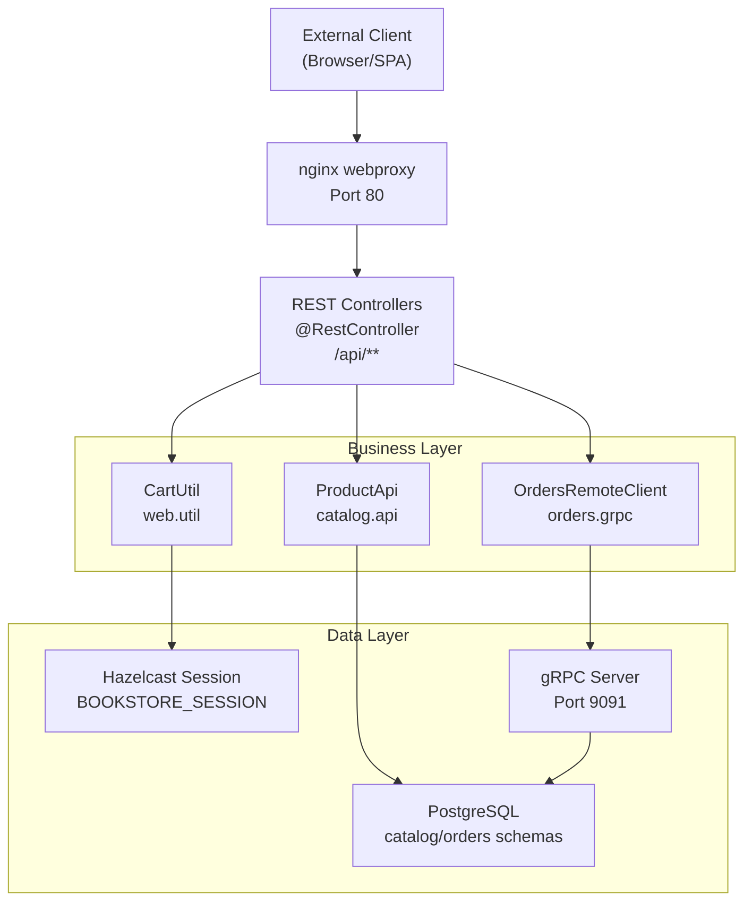
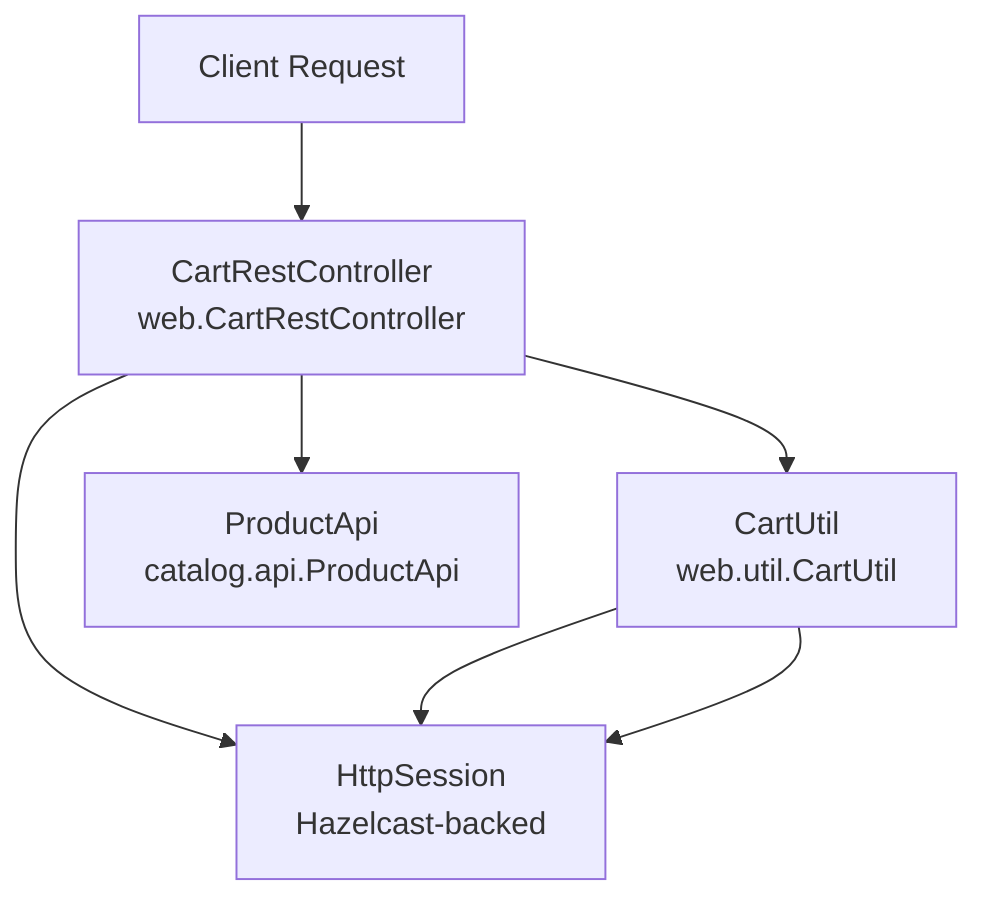
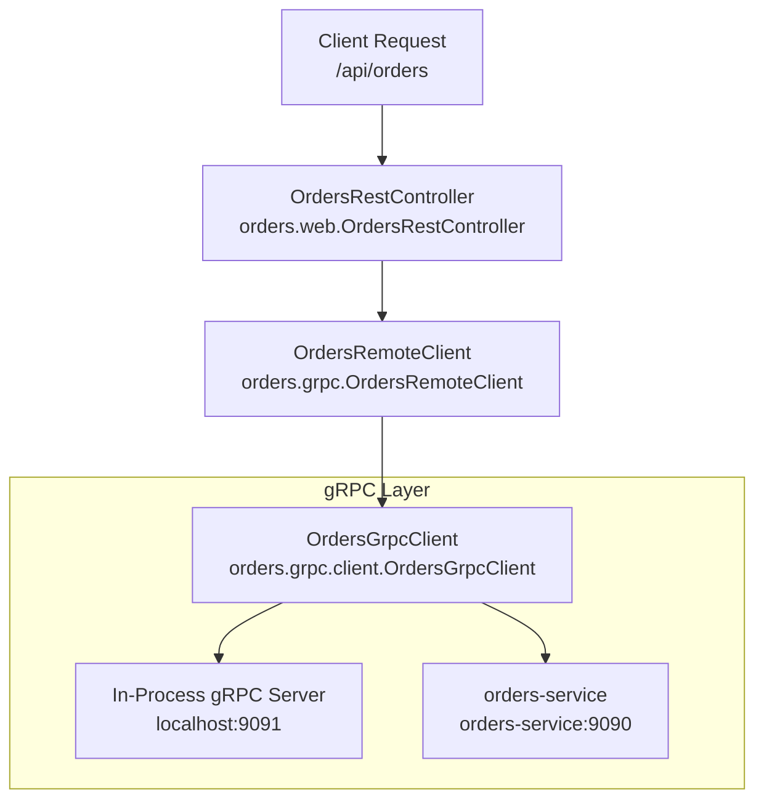

# REST API Endpoints

> **Relevant source files**
> * [.gitignore](https://github.com/philipz/spring-modular-monolith/blob/30c9bf30/.gitignore)
> * [.spec-workflow/archive/specs/openapi-rest-api/design.md](https://github.com/philipz/spring-modular-monolith/blob/30c9bf30/.spec-workflow/archive/specs/openapi-rest-api/design.md)
> * [.spec-workflow/archive/specs/openapi-rest-api/requirements.md](https://github.com/philipz/spring-modular-monolith/blob/30c9bf30/.spec-workflow/archive/specs/openapi-rest-api/requirements.md)
> * [.spec-workflow/archive/specs/openapi-rest-api/tasks.md](https://github.com/philipz/spring-modular-monolith/blob/30c9bf30/.spec-workflow/archive/specs/openapi-rest-api/tasks.md)
> * [README-API.md](https://github.com/philipz/spring-modular-monolith/blob/30c9bf30/README-API.md)
> * [README.md](https://github.com/philipz/spring-modular-monolith/blob/30c9bf30/README.md)
> * [docs/API_ANALYSIS_SUMMARY.txt](https://github.com/philipz/spring-modular-monolith/blob/30c9bf30/docs/API_ANALYSIS_SUMMARY.txt)
> * [docs/REST_API_ANALYSIS.md](https://github.com/philipz/spring-modular-monolith/blob/30c9bf30/docs/REST_API_ANALYSIS.md)
> * [docs/bookstore-microservices.png](https://github.com/philipz/spring-modular-monolith/blob/30c9bf30/docs/bookstore-microservices.png)
> * [docs/improvement.md](https://github.com/philipz/spring-modular-monolith/blob/30c9bf30/docs/improvement.md)
> * [docs/orders-data-ownership-analysis.md](https://github.com/philipz/spring-modular-monolith/blob/30c9bf30/docs/orders-data-ownership-analysis.md)
> * [docs/orders-module-boundary-analysis.md](https://github.com/philipz/spring-modular-monolith/blob/30c9bf30/docs/orders-module-boundary-analysis.md)
> * [docs/orders-traffic-migration.md](https://github.com/philipz/spring-modular-monolith/blob/30c9bf30/docs/orders-traffic-migration.md)
> * [http_requests.http](http_requests.http)
> * [k6.js](https://github.com/philipz/spring-modular-monolith/blob/30c9bf30/k6.js)
> * [openapi.json](https://github.com/philipz/spring-modular-monolith/blob/30c9bf30/openapi.json)
> * [openapitools.json](https://github.com/philipz/spring-modular-monolith/blob/30c9bf30/openapitools.json)
> * [src/main/java/com/sivalabs/bookstore/orders/domain/ProductServiceClient.java](https://github.com/philipz/spring-modular-monolith/blob/30c9bf30/src/main/java/com/sivalabs/bookstore/orders/domain/ProductServiceClient.java)

This document catalogs all REST API endpoints exposed by the Spring Modular Monolith backend under the `/api/**` prefix. These endpoints provide JSON-based interfaces for product browsing, shopping cart management, and order lifecycle operations. All endpoints are designed to be consumed by the Next.js frontend and external API clients.

For information about gRPC services, see [gRPC Services and Protocol Buffers](/philipz/spring-modular-monolith/7.2-grpc-services-and-protocol-buffers). For details on exception handling patterns, see [Exception Handling and Error Responses](/philipz/spring-modular-monolith/7.3-exception-handling-and-error-responses). For the server-rendered web interface, see [Web Interface and Thymeleaf Templates](/philipz/spring-modular-monolith/7.4-web-interface-and-thymeleaf-templates).

## API Overview

The REST API is organized into three primary resource groups:

| Resource Group | Base Path | Controller | Purpose |
| --- | --- | --- | --- |
| Products | `/api/products` | `ProductRestController` | Product catalog queries |
| Cart | `/api/cart` | `CartRestController` | Shopping cart operations |
| Orders | `/api/orders` | `OrdersRestController` | Order creation and retrieval |

All endpoints return JSON responses with `Content-Type: application/json`. Session state is maintained via the `BOOKSTORE_SESSION` cookie (Hazelcast-backed), which must be included in requests for stateful operations (cart, orders).

**API Documentation:**

* OpenAPI specification: `http://localhost:8080/api-docs`
* Swagger UI: `http://localhost:8080/swagger-ui.html`
* Base URL (Docker Compose): `http://localhost` (proxied via nginx)
* Base URL (direct): `http://localhost:8080`

**Sources:**

* [README-API.md L1-L166](https://github.com/philipz/spring-modular-monolith/blob/30c9bf30/README-API.md#L1-L166)
* [docs/REST_API_ANALYSIS.md L1-L102](https://github.com/philipz/spring-modular-monolith/blob/30c9bf30/docs/REST_API_ANALYSIS.md#L1-L102)
* [openapi.json L1](https://github.com/philipz/spring-modular-monolith/blob/30c9bf30/openapi.json#L1-L1)

## REST API Request Flow



**Sources:**

* [README-API.md L1-L15](https://github.com/philipz/spring-modular-monolith/blob/30c9bf30/README-API.md#L1-L15)
* [docs/REST_API_ANALYSIS.md L48-L70](https://github.com/philipz/spring-modular-monolith/blob/30c9bf30/docs/REST_API_ANALYSIS.md#L48-L70)
* [.spec-workflow/archive/specs/openapi-rest-api/design.md L86-L157](https://github.com/philipz/spring-modular-monolith/blob/30c9bf30/.spec-workflow/archive/specs/openapi-rest-api/design.md#L86-L157)

## Products API

The Products API provides read-only access to the product catalog. It is implemented in the `catalog` module and delegates to `ProductService` for data access.

### GET /api/products

Retrieves a paginated list of products.

**Request Parameters:**

| Parameter | Type | Required | Default | Description |
| --- | --- | --- | --- | --- |
| `page` | integer | No | 1 | Page number (1-based) |

**Response:** `200 OK` with `PagedResult<ProductDto>`

**Example Request:**

```
curl "http://localhost:8080/api/products?page=1" \
  -H "Accept: application/json"
```

**Example Response:**

```json
{
  "data": [
    {
      "code": "P100",
      "name": "The Hunger Games",
      "description": "Winning will make you famous. Losing means certain death...",
      "imageUrl": "https://images.sivalabs.in/products/the-hunger-games.jpg",
      "price": 34.0
    }
  ],
  "totalElements": 100,
  "pageNumber": 1,
  "totalPages": 10,
  "isFirst": true,
  "isLast": false,
  "hasNext": true,
  "hasPrevious": false
}
```

**Controller Implementation:**

* File: [src/main/java/com/sivalabs/bookstore/catalog/web/ProductRestController.java](https://github.com/philipz/spring-modular-monolith/blob/30c9bf30/src/main/java/com/sivalabs/bookstore/catalog/web/ProductRestController.java)
* Method: `getProducts(int page)`
* Delegates to: `ProductService.getProducts(page)`

**Sources:**

* [README-API.md L18-L51](https://github.com/philipz/spring-modular-monolith/blob/30c9bf30/README-API.md#L18-L51)
* [openapi.json L1](https://github.com/philipz/spring-modular-monolith/blob/30c9bf30/openapi.json#L1-L1)  (paths: "/api/products")
* [docs/REST_API_ANALYSIS.md L20-L26](https://github.com/philipz/spring-modular-monolith/blob/30c9bf30/docs/REST_API_ANALYSIS.md#L20-L26)

### GET /api/products/{code}

Retrieves a single product by its unique code.

**Path Parameters:**

| Parameter | Type | Required | Description |
| --- | --- | --- | --- |
| `code` | string | Yes | Product code (e.g., "P100") |

**Response:**

* `200 OK` with `ProductDto`
* `404 Not Found` if product does not exist

**Example Request:**

```
curl "http://localhost:8080/api/products/P100" \
  -H "Accept: application/json"
```

**Example Response:**

```json
{
  "code": "P100",
  "name": "The Hunger Games",
  "description": "Winning will make you famous. Losing means certain death...",
  "imageUrl": "https://images.sivalabs.in/products/the-hunger-games.jpg",
  "price": 34.0
}
```

**Controller Implementation:**

* File: [src/main/java/com/sivalabs/bookstore/catalog/web/ProductRestController.java](https://github.com/philipz/spring-modular-monolith/blob/30c9bf30/src/main/java/com/sivalabs/bookstore/catalog/web/ProductRestController.java)
* Method: `getProductByCode(String code)`
* Delegates to: `ProductService.getByCode(code)`

**Sources:**

* [http_requests.http L4-L5](https://github.com/philipz/spring-modular-monolith/blob/30c9bf30/http_requests.http#L4-L5)
* [openapi.json L1](https://github.com/philipz/spring-modular-monolith/blob/30c9bf30/openapi.json#L1-L1)  (paths: "/api/products/{code}")

## Cart API

The Cart API manages shopping cart state stored in the Hazelcast-backed HTTP session. All cart operations require the `BOOKSTORE_SESSION` cookie to maintain state across requests.

### Cart Request/Response Flow



**Sources:**

* [docs/REST_API_ANALYSIS.md L28-L36](https://github.com/philipz/spring-modular-monolith/blob/30c9bf30/docs/REST_API_ANALYSIS.md#L28-L36)
* [.spec-workflow/archive/specs/openapi-rest-api/design.md L206-L237](https://github.com/philipz/spring-modular-monolith/blob/30c9bf30/.spec-workflow/archive/specs/openapi-rest-api/design.md#L206-L237)

### POST /api/cart/items

Adds a product to the cart or replaces the current item if one exists.

**Request Body:** `AddToCartRequest`

```json
{
  "code": "P100",
  "quantity": 1
}
```

**Response:**

* `201 Created` with `CartDto` and `Set-Cookie: BOOKSTORE_SESSION=...`
* `404 Not Found` if product code is invalid
* `400 Bad Request` if validation fails (quantity < 1)

**Example Request:**

```
curl -i -X POST "http://localhost:8080/api/cart/items" \
  -H "Content-Type: application/json" \
  -d '{"code":"P100","quantity":1}'
```

**Example Response:**

```json
{
  "items": [
    {
      "code": "P100",
      "name": "The Hunger Games",
      "price": 34.0,
      "quantity": 1,
      "subtotal": 34.0
    }
  ],
  "totalAmount": 34.0,
  "itemCount": 1
}
```

**Controller Implementation:**

* File: [src/main/java/com/sivalabs/bookstore/web/CartRestController.java](https://github.com/philipz/spring-modular-monolith/blob/30c9bf30/src/main/java/com/sivalabs/bookstore/web/CartRestController.java)
* Method: `addItem(AddToCartRequest request, HttpSession session)`
* Validates product via: `ProductApi.getByCode(request.code())`
* Updates session via: `CartUtil.updateCart(session, cart)`

**Sources:**

* [README-API.md L53-L89](https://github.com/philipz/spring-modular-monolith/blob/30c9bf30/README-API.md#L53-L89)
* [k6.js L19-L32](https://github.com/philipz/spring-modular-monolith/blob/30c9bf30/k6.js#L19-L32)
* [openapi.json L1](https://github.com/philipz/spring-modular-monolith/blob/30c9bf30/openapi.json#L1-L1)  (paths: "/api/cart/items")

### PUT /api/cart/items/{code}

Updates the quantity of an existing cart item.

**Path Parameters:**

| Parameter | Type | Required | Description |
| --- | --- | --- | --- |
| `code` | string | Yes | Product code of item to update |

**Request Body:** `UpdateQuantityRequest`

```json
{
  "quantity": 2
}
```

**Response:**

* `200 OK` with updated `CartDto`
* `404 Not Found` if item not in cart
* `400 Bad Request` if quantity < 1

**Controller Implementation:**

* File: [src/main/java/com/sivalabs/bookstore/web/CartRestController.java](https://github.com/philipz/spring-modular-monolith/blob/30c9bf30/src/main/java/com/sivalabs/bookstore/web/CartRestController.java)
* Method: `updateItemQuantity(String code, UpdateQuantityRequest request, HttpSession session)`

**Sources:**

* [README-API.md L57-L62](https://github.com/philipz/spring-modular-monolith/blob/30c9bf30/README-API.md#L57-L62)
* [openapi.json L1](https://github.com/philipz/spring-modular-monolith/blob/30c9bf30/openapi.json#L1-L1)  (paths: "/api/cart/items/{code}")

### GET /api/cart

Retrieves the current cart contents. Returns an empty cart if no session exists.

**Response:** `200 OK` with `CartDto`

**Example Response (empty cart):**

```json
{
  "items": [],
  "totalAmount": 0.0,
  "itemCount": 0
}
```

**Controller Implementation:**

* File: [src/main/java/com/sivalabs/bookstore/web/CartRestController.java](https://github.com/philipz/spring-modular-monolith/blob/30c9bf30/src/main/java/com/sivalabs/bookstore/web/CartRestController.java)
* Method: `getCart(HttpSession session)`
* Retrieves via: `CartUtil.getCart(session)` (creates empty if missing)

**Sources:**

* [README-API.md L57-L59](https://github.com/philipz/spring-modular-monolith/blob/30c9bf30/README-API.md#L57-L59)
* [docs/REST_API_ANALYSIS.md L32-L33](https://github.com/philipz/spring-modular-monolith/blob/30c9bf30/docs/REST_API_ANALYSIS.md#L32-L33)

### DELETE /api/cart

Clears all items from the cart.

**Response:** `204 No Content`

**Example Request:**

```sql
curl -i -X DELETE "http://localhost:8080/api/cart" \
  -b "BOOKSTORE_SESSION=..."
```

**Controller Implementation:**

* File: [src/main/java/com/sivalabs/bookstore/web/CartRestController.java](https://github.com/philipz/spring-modular-monolith/blob/30c9bf30/src/main/java/com/sivalabs/bookstore/web/CartRestController.java)
* Method: `clearCart(HttpSession session)`
* Clears via: `CartUtil.updateCart(session, new Cart())`

**Sources:**

* [README-API.md L57-L62](https://github.com/philipz/spring-modular-monolith/blob/30c9bf30/README-API.md#L57-L62)
* [openapi.json L1](https://github.com/philipz/spring-modular-monolith/blob/30c9bf30/openapi.json#L1-L1)  (paths: "/api/cart")

## Orders API

The Orders API manages the order lifecycle. It is implemented in the `orders` module and delegates to `OrdersRemoteClient`, which communicates with either the in-process gRPC server (port 9091) or the extracted `orders-service` (port 9090) depending on configuration.

### Orders API Delegation Pattern



**Sources:**

* [README-API.md L157-L159](https://github.com/philipz/spring-modular-monolith/blob/30c9bf30/README-API.md#L157-L159)
* [docs/REST_API_ANALYSIS.md L39-L44](https://github.com/philipz/spring-modular-monolith/blob/30c9bf30/docs/REST_API_ANALYSIS.md#L39-L44)
* [.spec-workflow/archive/specs/openapi-rest-api/design.md L238-L269](https://github.com/philipz/spring-modular-monolith/blob/30c9bf30/.spec-workflow/archive/specs/openapi-rest-api/design.md#L238-L269)

### POST /api/orders

Creates a new order from the provided order details. Requires a valid session cookie.

**Request Body:** `CreateOrderRequest`

```json
{
  "customer": {
    "name": "Jane Doe",
    "email": "jane@example.com",
    "phone": "+1-555-0100"
  },
  "deliveryAddress": "123 Main Street, Springfield",
  "item": {
    "code": "P100",
    "name": "The Hunger Games",
    "price": 34.0,
    "quantity": 1
  }
}
```

**Response:**

* `201 Created` with `CreateOrderResponse` and `Location` header
* `400 Bad Request` if validation fails or business rules violated
* `503 Service Unavailable` if gRPC backend is down

**Example Response:**

```json
{
  "orderNumber": "ORD-2025-000123"
}
```

**Controller Implementation:**

* File: [src/main/java/com/sivalabs/bookstore/orders/web/OrdersRestController.java](https://github.com/philipz/spring-modular-monolith/blob/30c9bf30/src/main/java/com/sivalabs/bookstore/orders/web/OrdersRestController.java)
* Method: `createOrder(CreateOrderRequest request)`
* Delegates to: `OrdersRemoteClient.createOrder(request)`
* Maps gRPC exceptions to HTTP status codes

**Sources:**

* [README-API.md L91-L125](https://github.com/philipz/spring-modular-monolith/blob/30c9bf30/README-API.md#L91-L125)
* [http_requests.http L7-L24](https://github.com/philipz/spring-modular-monolith/blob/30c9bf30/http_requests.http#L7-L24)
* [k6.js L49-L88](https://github.com/philipz/spring-modular-monolith/blob/30c9bf30/k6.js#L49-L88)
* [openapi.json L1](https://github.com/philipz/spring-modular-monolith/blob/30c9bf30/openapi.json#L1-L1)  (paths: "/api/orders", method: "post")

### GET /api/orders

Retrieves a paginated list of order summaries.

**Request Parameters:**

| Parameter | Type | Required | Default | Description |
| --- | --- | --- | --- | --- |
| `page` | integer | No | 1 | Page number (1-based) |
| `pageSize` | integer | No | 10 | Number of items per page |

**Response:** `200 OK` with `PagedResult<OrderView>`

**Example Response:**

```json
{
  "data": [
    {
      "orderNumber": "ORD-2025-000123",
      "status": "NEW",
      "customer": {
        "name": "Jane Doe",
        "email": "jane@example.com",
        "phone": "+1-555-0100"
      }
    }
  ],
  "totalElements": 42,
  "pageNumber": 1,
  "totalPages": 5,
  "isFirst": true,
  "isLast": false,
  "hasNext": true,
  "hasPrevious": false
}
```

**Controller Implementation:**

* File: [src/main/java/com/sivalabs/bookstore/orders/web/OrdersRestController.java](https://github.com/philipz/spring-modular-monolith/blob/30c9bf30/src/main/java/com/sivalabs/bookstore/orders/web/OrdersRestController.java)
* Method: `listOrders(int page, int pageSize)`
* Delegates to: `OrdersRemoteClient.getOrders(page, pageSize)`

**Sources:**

* [README-API.md L91-L149](https://github.com/philipz/spring-modular-monolith/blob/30c9bf30/README-API.md#L91-L149)
* [openapi.json L1](https://github.com/philipz/spring-modular-monolith/blob/30c9bf30/openapi.json#L1-L1)  (paths: "/api/orders", method: "get")

### GET /api/orders/{orderNumber}

Retrieves detailed information about a specific order.

**Path Parameters:**

| Parameter | Type | Required | Description |
| --- | --- | --- | --- |
| `orderNumber` | string | Yes | Order number (e.g., "ORD-2025-000123") |

**Response:**

* `200 OK` with `OrderDto`
* `404 Not Found` if order does not exist
* `503 Service Unavailable` if gRPC backend is down

**Example Response:**

```json
{
  "orderNumber": "ORD-2025-000123",
  "item": {
    "code": "P100",
    "name": "The Hunger Games",
    "price": 34.0,
    "quantity": 1
  },
  "customer": {
    "name": "Jane Doe",
    "email": "jane@example.com",
    "phone": "+1-555-0100"
  },
  "deliveryAddress": "123 Main Street, Springfield",
  "status": "NEW",
  "createdAt": "2025-10-19T12:34:56",
  "totalAmount": 34.0
}
```

**Controller Implementation:**

* File: [src/main/java/com/sivalabs/bookstore/orders/web/OrdersRestController.java](https://github.com/philipz/spring-modular-monolith/blob/30c9bf30/src/main/java/com/sivalabs/bookstore/orders/web/OrdersRestController.java)
* Method: `getOrder(String orderNumber)`
* Delegates to: `OrdersRemoteClient.getOrder(orderNumber)`

**Sources:**

* [README-API.md L95-L99](https://github.com/philipz/spring-modular-monolith/blob/30c9bf30/README-API.md#L95-L99)
* [openapi.json L1](https://github.com/philipz/spring-modular-monolith/blob/30c9bf30/openapi.json#L1-L1)  (paths: "/api/orders/{orderNumber}")

## Session Management

All cart and order operations rely on HTTP session state maintained by Hazelcast. The session cookie is named `BOOKSTORE_SESSION` and has the following properties:

| Property | Value | Configuration |
| --- | --- | --- |
| Name | `BOOKSTORE_SESSION` | `server.servlet.session.cookie.name` |
| HttpOnly | `true` | `server.servlet.session.cookie.http-only` |
| SameSite | `Strict` | `server.servlet.session.cookie.same-site` |
| Secure | Configurable via `USE_SECURE_COOKIES` | `server.servlet.session.cookie.secure` |
| Max Age | 30 minutes | `spring.session.timeout` |

**Session Storage:**

* Technology: Spring Session with Hazelcast
* Store type: `spring.session.store-type=hazelcast`
* Cluster: `bookstore-cluster` (Hazelcast instance name)

**Client Requirements:**

* **Browser clients:** Use `credentials: 'include'` in fetch/Axios requests
* **Non-browser clients:** Extract `Set-Cookie` header from first response and include `Cookie` header in subsequent requests

**Example (curl):**

```css
# First request creates session
curl -i -X POST "http://localhost:8080/api/cart/items" \
  -H "Content-Type: application/json" \
  -d '{"code":"P100","quantity":1}' \
  -c cookies.txt

# Subsequent requests reuse session
curl -b cookies.txt "http://localhost:8080/api/cart"
curl -b cookies.txt -X POST "http://localhost:8080/api/orders" \
  -H "Content-Type: application/json" \
  -d '{...}'
```

**Sources:**

* [README-API.md L10-L14](https://github.com/philipz/spring-modular-monolith/blob/30c9bf30/README-API.md#L10-L14)
* [docs/REST_API_ANALYSIS.md L48-L56](https://github.com/philipz/spring-modular-monolith/blob/30c9bf30/docs/REST_API_ANALYSIS.md#L48-L56)
* [k6.js L34-L39](https://github.com/philipz/spring-modular-monolith/blob/30c9bf30/k6.js#L34-L39)

## Data Transfer Objects (DTOs)

### Product DTOs

**ProductDto** ([catalog/api/ProductDto.java](https://github.com/philipz/spring-modular-monolith/blob/30c9bf30/catalog/api/ProductDto.java)

):

```yaml
code: String (required) - Unique product code
name: String (required) - Product name
description: String - Product description
imageUrl: String - Product image URL
price: BigDecimal (required) - Product price
```

**PagedResult** ([common/models/PagedResult.java](https://github.com/philipz/spring-modular-monolith/blob/30c9bf30/common/models/PagedResult.java)

):

```yaml
data: List<T> (required) - List of items for current page
totalElements: long (required) - Total number of elements
pageNumber: int (required) - Current page number (1-based)
totalPages: int (required) - Total number of pages
isFirst: boolean (required) - Whether this is the first page
isLast: boolean (required) - Whether this is the last page
hasNext: boolean (required) - Whether there is a next page
hasPrevious: boolean (required) - Whether there is a previous page
```

**Sources:**

* [openapi.json L1](https://github.com/philipz/spring-modular-monolith/blob/30c9bf30/openapi.json#L1-L1)  (components.schemas.ProductDto)
* [openapi.json L1](https://github.com/philipz/spring-modular-monolith/blob/30c9bf30/openapi.json#L1-L1)  (components.schemas.PagedResult)

### Cart DTOs

**CartDto** ([web/dto/CartDto.java](https://github.com/philipz/spring-modular-monolith/blob/30c9bf30/web/dto/CartDto.java)

):

```yaml
items: List<CartItemDto> (required) - Cart items
totalAmount: BigDecimal - Total amount
itemCount: int - Number of items in cart
```

**CartItemDto** ([web/dto/CartItemDto.java](https://github.com/philipz/spring-modular-monolith/blob/30c9bf30/web/dto/CartItemDto.java)

):

```yaml
code: String - Product code
name: String - Product name
price: BigDecimal - Unit price
quantity: int (min: 1) - Quantity
subtotal: BigDecimal - Subtotal (price × quantity)
```

**AddToCartRequest** ([web/dto/AddToCartRequest.java](https://github.com/philipz/spring-modular-monolith/blob/30c9bf30/web/dto/AddToCartRequest.java)

):

```yaml
code: String (required) - Product code
quantity: int (required, min: 1) - Quantity to add
```

**UpdateQuantityRequest** ([web/dto/UpdateQuantityRequest.java](https://github.com/philipz/spring-modular-monolith/blob/30c9bf30/web/dto/UpdateQuantityRequest.java)

):

```yaml
quantity: int (required, min: 1) - New quantity
```

**Sources:**

* [openapi.json L1](https://github.com/philipz/spring-modular-monolith/blob/30c9bf30/openapi.json#L1-L1)  (components.schemas.CartDto, CartItemDto)
* [.spec-workflow/archive/specs/openapi-rest-api/design.md L300-L362](https://github.com/philipz/spring-modular-monolith/blob/30c9bf30/.spec-workflow/archive/specs/openapi-rest-api/design.md#L300-L362)

### Order DTOs

**CreateOrderRequest** ([orders/api/CreateOrderRequest.java](https://github.com/philipz/spring-modular-monolith/blob/30c9bf30/orders/api/CreateOrderRequest.java)

):

```yaml
customer: Customer (required) - Customer information
deliveryAddress: String (required) - Delivery address
item: OrderItem (required) - Order line item
```

**Customer** ([orders/api/model/Customer.java](https://github.com/philipz/spring-modular-monolith/blob/30c9bf30/orders/api/model/Customer.java)

):

```yaml
name: String (required) - Customer full name
email: String (required) - Customer email address
phone: String (required) - Customer phone number
```

**OrderItem** ([orders/api/model/OrderItem.java](https://github.com/philipz/spring-modular-monolith/blob/30c9bf30/orders/api/model/OrderItem.java)

):

```yaml
code: String (required) - Product code
name: String (required) - Product name
price: BigDecimal (required) - Product price
quantity: int (required, min: 1) - Order quantity
```

**CreateOrderResponse** ([orders/api/CreateOrderResponse.java](https://github.com/philipz/spring-modular-monolith/blob/30c9bf30/orders/api/CreateOrderResponse.java)

):

```yaml
orderNumber: String (required) - Unique order number
```

**OrderDto** ([orders/api/OrderDto.java](https://github.com/philipz/spring-modular-monolith/blob/30c9bf30/orders/api/OrderDto.java)

):

```yaml
orderNumber: String (required) - Unique order number
item: OrderItem (required) - Order line item
customer: Customer (required) - Customer information
deliveryAddress: String (required) - Delivery address
status: String (required) - Order status (NEW, IN_PROCESS, DELIVERED, CANCELLED, ERROR)
createdAt: LocalDateTime (required) - Order creation timestamp
totalAmount: BigDecimal (readOnly) - Total order amount (price × quantity)
```

**OrderView** ([orders/api/OrderView.java](https://github.com/philipz/spring-modular-monolith/blob/30c9bf30/orders/api/OrderView.java)

):

```yaml
orderNumber: String (required) - Unique order number
status: String (required) - Order status
customer: Customer (required) - Customer information
```

**Sources:**

* [openapi.json L1](https://github.com/philipz/spring-modular-monolith/blob/30c9bf30/openapi.json#L1-L1)  (components.schemas.CreateOrderRequest, OrderDto, OrderView)
* [http_requests.http L11-L24](https://github.com/philipz/spring-modular-monolith/blob/30c9bf30/http_requests.http#L11-L24)

## Error Responses

All error responses follow a consistent JSON structure:

**ErrorResponse Format:**

```json
{
  "status": 404,
  "message": "Product with code 'INVALID' not found",
  "timestamp": "2025-10-19T12:34:56"
}
```

### HTTP Status Code Mapping

| HTTP Status | Scenario | Example Message |
| --- | --- | --- |
| `400 Bad Request` | Validation failure | "Validation failed: quantity must be >= 1" |
| `400 Bad Request` | Business rule violation | "Insufficient stock for product P100" |
| `404 Not Found` | Resource not found | "Product with code 'INVALID' not found" |
| `404 Not Found` | Order not found | "Order with number 'ORD-999' not found" |
| `503 Service Unavailable` | gRPC backend unavailable | "Orders service unavailable. Please retry." |
| `504 Gateway Timeout` | gRPC deadline exceeded | "Request timeout. Please retry." |

### gRPC to HTTP Status Mapping

When REST controllers delegate to gRPC clients, gRPC `StatusRuntimeException` codes are mapped to HTTP status codes:

| gRPC Status | HTTP Status | Description |
| --- | --- | --- |
| `NOT_FOUND` | 404 | Resource does not exist |
| `INVALID_ARGUMENT` | 400 | Invalid request parameters |
| `FAILED_PRECONDITION` | 400 | Business rule validation failed |
| `UNAVAILABLE` | 503 | Service is temporarily unavailable |
| `DEADLINE_EXCEEDED` | 504 | Request timed out |
| `INTERNAL` | 500 | Internal server error |

**Error Handling Implementation:**

* File: [src/main/java/com/sivalabs/bookstore/orders/web/OrdersRestExceptionHandler.java](https://github.com/philipz/spring-modular-monolith/blob/30c9bf30/src/main/java/com/sivalabs/bookstore/orders/web/OrdersRestExceptionHandler.java)
* Maps exceptions via `@ExceptionHandler` methods
* Returns `ResponseEntity<ErrorResponse>` with appropriate status codes

**Sources:**

* [README-API.md L151-L156](https://github.com/philipz/spring-modular-monolith/blob/30c9bf30/README-API.md#L151-L156)
* [docs/REST_API_ANALYSIS.md L63-L68](https://github.com/philipz/spring-modular-monolith/blob/30c9bf30/docs/REST_API_ANALYSIS.md#L63-L68)
* [.spec-workflow/archive/specs/openapi-rest-api/design.md L400-L442](https://github.com/philipz/spring-modular-monolith/blob/30c9bf30/.spec-workflow/archive/specs/openapi-rest-api/design.md#L400-L442)

## OpenAPI Documentation

The API is fully documented using OpenAPI 3.0 specification with interactive Swagger UI.

### Accessing Documentation

| Resource | URL | Description |
| --- | --- | --- |
| Swagger UI | `http://localhost:8080/swagger-ui.html` | Interactive API explorer |
| OpenAPI JSON | `http://localhost:8080/api-docs` | OpenAPI 3.0 specification |
| Actuator | `http://localhost:8080/actuator` | Spring Boot management endpoints |

### OpenAPI Configuration

**Configuration Class:**

* File: [src/main/java/com/sivalabs/bookstore/config/OpenApiConfig.java](https://github.com/philipz/spring-modular-monolith/blob/30c9bf30/src/main/java/com/sivalabs/bookstore/config/OpenApiConfig.java)
* Defines API metadata (title, version, description, servers)
* Configures endpoint grouping by tags

**Application Properties:**

```
springdoc.api-docs.path=/api-docs
springdoc.swagger-ui.path=/swagger-ui.html
springdoc.group-configs[0].group=catalog
springdoc.group-configs[1].group=cart
springdoc.group-configs[2].group=orders
```

**Controller Annotations:**

* `@Tag(name = "Products")` - Groups endpoints in Swagger UI
* `@Operation(summary = "...")` - Describes endpoint purpose
* `@ApiResponses({@ApiResponse(...)})` - Documents response codes
* `@Schema(description = "...")` - Documents DTO fields

**Sources:**

* [README-API.md L7-L9](https://github.com/philipz/spring-modular-monolith/blob/30c9bf30/README-API.md#L7-L9)
* [openapi.json L1](https://github.com/philipz/spring-modular-monolith/blob/30c9bf30/openapi.json#L1-L1)
* [.spec-workflow/archive/specs/openapi-rest-api/design.md L161-L184](https://github.com/philipz/spring-modular-monolith/blob/30c9bf30/.spec-workflow/archive/specs/openapi-rest-api/design.md#L161-L184)

### Generating Client SDKs

The OpenAPI specification can be used to generate type-safe client SDKs for various languages:

**TypeScript SDK Generation:**

```markdown
# Export OpenAPI spec
curl http://localhost:8080/api-docs > openapi.json

# Generate TypeScript SDK (in frontend-next/)
pnpm gen:types
```

Generated SDK location: `frontend-sdk/` (excluded from Git via `.gitignore`)

**Configuration:**

* File: [openapitools.json L1-L8](https://github.com/philipz/spring-modular-monolith/blob/30c9bf30/openapitools.json#L1-L8)
* Generator: `openapi-generator-cli` version 7.16.0

**Sources:**

* [README-API.md L161-L166](https://github.com/philipz/spring-modular-monolith/blob/30c9bf30/README-API.md#L161-L166)
* [docs/REST_API_ANALYSIS.md L76-L80](https://github.com/philipz/spring-modular-monolith/blob/30c9bf30/docs/REST_API_ANALYSIS.md#L76-L80)
* [openapitools.json L1-L8](https://github.com/philipz/spring-modular-monolith/blob/30c9bf30/openapitools.json#L1-L8)

## CORS Configuration

For local development, CORS is configured to allow cross-origin requests from the Next.js frontend.

**Development Profile:**

* Profile: `dev` (activate via `SPRING_PROFILES_ACTIVE=dev`)
* Allowed origins: `http://localhost:3000` (configurable via `cors.allowed-origins`)
* Configuration class: [src/main/java/com/sivalabs/bookstore/config/CorsConfig.java](https://github.com/philipz/spring-modular-monolith/blob/30c9bf30/src/main/java/com/sivalabs/bookstore/config/CorsConfig.java)

**Production (Docker Compose):**

* CORS is not required; nginx proxies both frontend and backend on same origin
* Frontend: `http://localhost` → `frontend-next:3000`
* Backend: `http://localhost/api/**` → `monolith:8080`

**Sources:**

* [README.md L109](https://github.com/philipz/spring-modular-monolith/blob/30c9bf30/README.md#L109-L109)
* [docs/REST_API_ANALYSIS.md L52-L56](https://github.com/philipz/spring-modular-monolith/blob/30c9bf30/docs/REST_API_ANALYSIS.md#L52-L56)

## Complete Endpoint Reference

### Products Endpoints

| Method | Path | Description | Response |
| --- | --- | --- | --- |
| `GET` | `/api/products?page={page}` | Paginated product list | `PagedResult<ProductDto>` |
| `GET` | `/api/products/{code}` | Single product by code | `ProductDto` |

### Cart Endpoints

| Method | Path | Description | Response |
| --- | --- | --- | --- |
| `POST` | `/api/cart/items` | Add item to cart | `CartDto` (201) |
| `PUT` | `/api/cart/items/{code}` | Update item quantity | `CartDto` |
| `GET` | `/api/cart` | Retrieve cart | `CartDto` |
| `DELETE` | `/api/cart` | Clear cart | 204 No Content |

### Orders Endpoints

| Method | Path | Description | Response |
| --- | --- | --- | --- |
| `POST` | `/api/orders` | Create order | `CreateOrderResponse` (201) |
| `GET` | `/api/orders?page={page}&pageSize={size}` | Paginated order list | `PagedResult<OrderView>` |
| `GET` | `/api/orders/{orderNumber}` | Order details | `OrderDto` |

**Sources:**

* [README-API.md L16-L99](https://github.com/philipz/spring-modular-monolith/blob/30c9bf30/README-API.md#L16-L99)
* [docs/API_ANALYSIS_SUMMARY.txt L186-L211](https://github.com/philipz/spring-modular-monolith/blob/30c9bf30/docs/API_ANALYSIS_SUMMARY.txt#L186-L211)