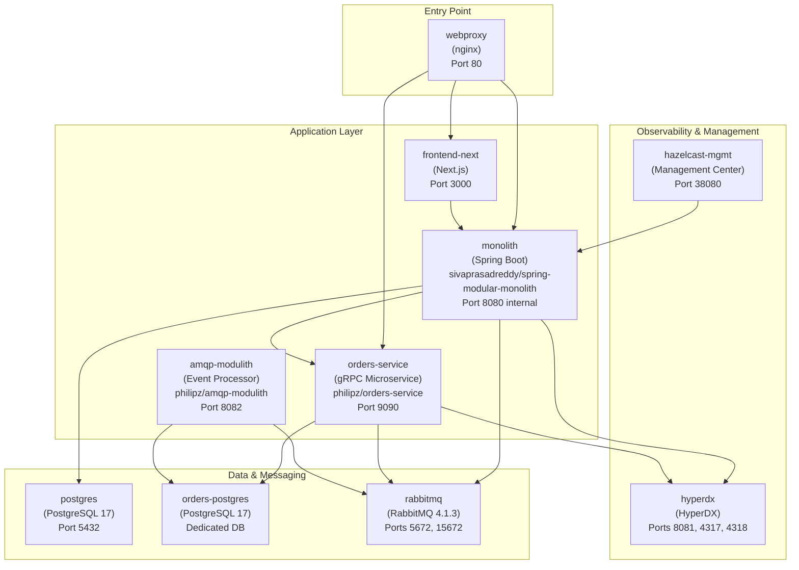
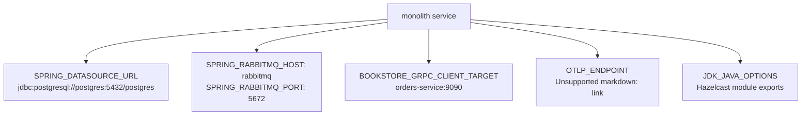
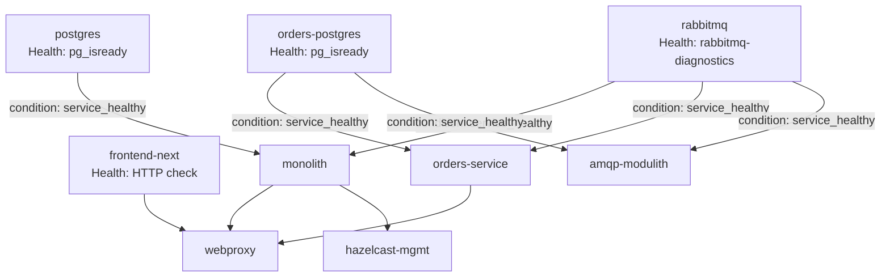
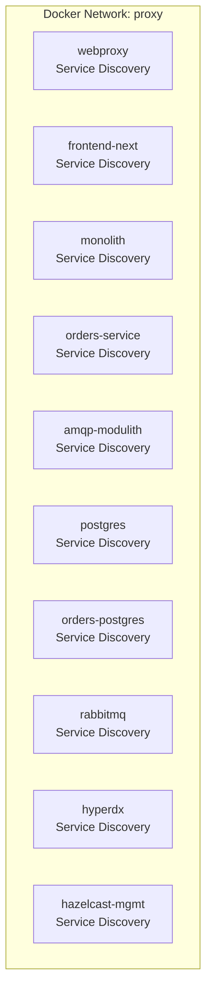

# Running Locally with Docker Compose

> **Relevant source files**
> * [Taskfile.yml](https://github.com/philipz/spring-modular-monolith/blob/30c9bf30/Taskfile.yml)
> * [compose.yml](https://github.com/philipz/spring-modular-monolith/blob/30c9bf30/compose.yml)
> * [pom.xml](https://github.com/philipz/spring-modular-monolith/blob/30c9bf30/pom.xml)
> * [src/main/resources/application.properties](https://github.com/philipz/spring-modular-monolith/blob/30c9bf30/src/main/resources/application.properties)
> * [src/test/java/com/sivalabs/bookstore/BookStoreApplicationTests.java](https://github.com/philipz/spring-modular-monolith/blob/30c9bf30/src/test/java/com/sivalabs/bookstore/BookStoreApplicationTests.java)
> * [src/test/java/com/sivalabs/bookstore/TestcontainersConfiguration.java](https://github.com/philipz/spring-modular-monolith/blob/30c9bf30/src/test/java/com/sivalabs/bookstore/TestcontainersConfiguration.java)

This document explains how to start and manage the complete Spring Modular Monolith application stack using Docker Compose. It covers service configuration, dependencies, port mappings, and how to access the running system.

For information about building Docker images and development tasks, see [Development Workflow and Build Tasks](/philipz/spring-modular-monolith/2.3-development-workflow-and-build-tasks). For deployment to Kubernetes environments, see [Docker Compose Deployment](/philipz/spring-modular-monolith/10.1-docker-compose-deployment) and [Kubernetes Deployment with Kind](/philipz/spring-modular-monolith/10.2-kubernetes-deployment-with-kind).

## Overview

The Docker Compose configuration defines a complete multi-service architecture with 10 containerized services orchestrated through [compose.yml L1-L189](https://github.com/philipz/spring-modular-monolith/blob/30c9bf30/compose.yml#L1-L189)

 The stack includes:

* **Application Services**: Spring Boot monolith, orders microservice, AMQP event processor, Next.js frontend
* **Infrastructure Services**: PostgreSQL databases (2 instances), RabbitMQ message broker, Hazelcast management center
* **Gateway**: nginx reverse proxy for unified entry point
* **Observability**: HyperDX all-in-one platform for tracing, metrics, and logs

All services connect through a shared Docker network named `proxy` [compose.yml L187-L188](https://github.com/philipz/spring-modular-monolith/blob/30c9bf30/compose.yml#L187-L188)

**Sources**: compose.yml:1-189

## Service Architecture



**Sources**: compose.yml:1-189

## Service Definitions

### Database Services

#### postgres

The primary PostgreSQL database instance for the Spring monolith, hosting multiple schemas for different business modules.

[compose.yml L2-L17](https://github.com/philipz/spring-modular-monolith/blob/30c9bf30/compose.yml#L2-L17)

| Configuration | Value |
| --- | --- |
| Image | `postgres:17-alpine` |
| Port Mapping | `5432:5432` |
| Database Name | `postgres` |
| Credentials | `postgres/postgres` |
| Max Connections | `300` |
| Health Check | `pg_isready -U postgres -d postgres` every 10s |

The monolith connects using `SPRING_DATASOURCE_URL=jdbc:postgresql://postgres:5432/postgres` [compose.yml L63](https://github.com/philipz/spring-modular-monolith/blob/30c9bf30/compose.yml#L63-L63)

#### orders-postgres

Dedicated PostgreSQL instance for the extracted orders microservice, demonstrating database-per-service pattern.

[compose.yml L19-L32](https://github.com/philipz/spring-modular-monolith/blob/30c9bf30/compose.yml#L19-L32)

| Configuration | Value |
| --- | --- |
| Image | `postgres:17-alpine` |
| Port Mapping | None (internal only) |
| Database Name | `postgres` |
| Credentials | `postgres/postgres` |
| Max Connections | `300` |

Both `orders-service` and `amqp-modulith` connect to this instance [compose.yml L97-L127](https://github.com/philipz/spring-modular-monolith/blob/30c9bf30/compose.yml#L97-L127)

**Sources**: compose.yml:2-32

### Messaging Infrastructure

#### rabbitmq

RabbitMQ message broker serving as the external event bus for asynchronous communication between modules and services.

[compose.yml L34-L48](https://github.com/philipz/spring-modular-monolith/blob/30c9bf30/compose.yml#L34-L48)

| Configuration | Value |
| --- | --- |
| Image | `rabbitmq:4.1.3-management-alpine` |
| AMQP Port | `5672:5672` |
| Management UI Port | `15672:15672` |
| Credentials | `guest/guest` |
| Health Check | `rabbitmq-diagnostics check_running` every 10s |

All application services (`monolith`, `orders-service`, `amqp-modulith`) depend on RabbitMQ being healthy before starting [compose.yml L82-L125](https://github.com/philipz/spring-modular-monolith/blob/30c9bf30/compose.yml#L82-L125)

**Management Console**: Access at [http://localhost:15672](http://localhost:15672) with credentials `guest/guest`.

**Sources**: compose.yml:34-48

### Observability Platform

#### hyperdx

HyperDX all-in-one observability platform collecting traces, metrics, and logs from all services via OpenTelemetry.

[compose.yml L49-L56](https://github.com/philipz/spring-modular-monolith/blob/30c9bf30/compose.yml#L49-L56)

| Port | Purpose |
| --- | --- |
| `8081:8080` | HyperDX web UI (remapped to avoid conflict with webproxy) |
| `4317:4317` | OpenTelemetry gRPC receiver |
| `4318:4318` | OpenTelemetry HTTP receiver |

All application services export telemetry to `http://hyperdx:4317` using OTLP gRPC protocol [compose.yml L72-L108](https://github.com/philipz/spring-modular-monolith/blob/30c9bf30/compose.yml#L72-L108)

 Authentication requires setting `HYPERDX_API_KEY` environment variable.

**UI Access**: [http://localhost:8081](http://localhost:8081)

**Sources**: compose.yml:49-56

### Application Services

#### monolith

The Spring Boot modular monolith application serving REST API, gRPC server, and web controllers.

[compose.yml L58-L86](https://github.com/philipz/spring-modular-monolith/blob/30c9bf30/compose.yml#L58-L86)



| Configuration | Value |
| --- | --- |
| Image | `sivaprasadreddy/spring-modular-monolith:0.0.1-SNAPSHOT` |
| Port | 8080 (internal only, accessed via nginx) |
| gRPC Port | 9091 (internal) |
| Dependencies | `postgres`, `rabbitmq` must be healthy |
| Restart Policy | `unless-stopped` |

**Key Environment Variables**:

* `SPRING_DATASOURCE_POOL_SIZE=200` - Connection pool size [compose.yml L66](https://github.com/philipz/spring-modular-monolith/blob/30c9bf30/compose.yml#L66-L66)
* `BOOKSTORE_GRPC_CLIENT_TARGET=orders-service:9090` - gRPC client target for orders delegation [compose.yml L76](https://github.com/philipz/spring-modular-monolith/blob/30c9bf30/compose.yml#L76-L76)
* `JDK_JAVA_OPTIONS` - Hazelcast module exports for Java 21 [compose.yml L78](https://github.com/philipz/spring-modular-monolith/blob/30c9bf30/compose.yml#L78-L78)

**Note**: The REST API URL for orders (`ORDERS_SERVICE_API_URL`) was removed during gRPC migration on 2025-10-04 [compose.yml L74-L75](https://github.com/philipz/spring-modular-monolith/blob/30c9bf30/compose.yml#L74-L75)

**Sources**: compose.yml:58-86

#### orders-service

Extracted gRPC microservice handling order operations, demonstrating the strangler pattern for gradual migration from monolith to microservices.

[compose.yml L88-L117](https://github.com/philipz/spring-modular-monolith/blob/30c9bf30/compose.yml#L88-L117)

| Configuration | Value |
| --- | --- |
| Image | `philipz/orders-service:0.0.1-SNAPSHOT` |
| Port Mapping | `9090:9090` (gRPC) |
| Profile | `docker` |
| Dependencies | `orders-postgres`, `rabbitmq` must be healthy |

**Key Environment Variables**:

* `SPRING_DATASOURCE_URL=jdbc:postgresql://orders-postgres:5432/postgres` [compose.yml L97](https://github.com/philipz/spring-modular-monolith/blob/30c9bf30/compose.yml#L97-L97)
* `SPRING_DATASOURCE_POOL_SIZE=200` [compose.yml L100](https://github.com/philipz/spring-modular-monolith/blob/30c9bf30/compose.yml#L100-L100)
* `SPRING_RABBITMQ_CACHE_CHANNEL_SIZE=300` - Increased for high throughput [compose.yml L105](https://github.com/philipz/spring-modular-monolith/blob/30c9bf30/compose.yml#L105-L105)
* `SPRING_MODULITH_EVENTS_SCHEMA=orders_events` - Dedicated event publication schema [compose.yml L112](https://github.com/philipz/spring-modular-monolith/blob/30c9bf30/compose.yml#L112-L112)
* `PRODUCT_API_BASE_URL=http://monolith:8080` - For product price validation [compose.yml L113](https://github.com/philipz/spring-modular-monolith/blob/30c9bf30/compose.yml#L113-L113)

The REST port configuration was removed during migration [compose.yml L109-L111](https://github.com/philipz/spring-modular-monolith/blob/30c9bf30/compose.yml#L109-L111)

**Sources**: compose.yml:88-117

#### amqp-modulith

Specialized event processor consuming RabbitMQ messages and persisting them to the orders database.

[compose.yml L119-L138](https://github.com/philipz/spring-modular-monolith/blob/30c9bf30/compose.yml#L119-L138)

| Configuration | Value |
| --- | --- |
| Image | `philipz/amqp-modulith:0.0.1-SNAPSHOT` |
| Port Mapping | `8082:8082` |
| Dependencies | `orders-postgres`, `rabbitmq` must be healthy |

Connects to the same `orders-postgres` instance as `orders-service` for event processing consistency.

**Sources**: compose.yml:119-138

#### frontend-next

Next.js 14 frontend application providing the user interface.

[compose.yml L140-L158](https://github.com/philipz/spring-modular-monolith/blob/30c9bf30/compose.yml#L140-L158)

| Configuration | Value |
| --- | --- |
| Build Context | `./frontend-next` |
| Port Mapping | `3000:3000` |
| Node Environment | `production` |
| API Proxy Target | `http://monolith:8080` |
| Health Check | HTTP GET to `localhost:3000` every 10s |

The `NEXT_PUBLIC_API_URL=/api` environment variable configures client-side API calls to use the relative path, which nginx routes to the backend [compose.yml L148](https://github.com/philipz/spring-modular-monolith/blob/30c9bf30/compose.yml#L148-L148)

**Sources**: compose.yml:140-158

#### webproxy

nginx reverse proxy serving as the unified entry point, implementing path-based routing and traffic splitting.

[compose.yml L160-L173](https://github.com/philipz/spring-modular-monolith/blob/30c9bf30/compose.yml#L160-L173)

| Configuration | Value |
| --- | --- |
| Build Context | `./webproxy/Dockerfile` |
| Port Mapping | `80:80` |
| Dependencies | `monolith`, `orders-service`, `frontend-next` |

Requires `HYPERDX_API_KEY` environment variable for OpenTelemetry authentication [compose.yml L162](https://github.com/philipz/spring-modular-monolith/blob/30c9bf30/compose.yml#L162-L162)

 For detailed routing configuration, see [Nginx Reverse Proxy](/philipz/spring-modular-monolith/10.3-nginx-reverse-proxy).

**Sources**: compose.yml:160-173

#### hazelcast-mgmt

Hazelcast Management Center for monitoring the distributed cache cluster.

[compose.yml L175-L185](https://github.com/philipz/spring-modular-monolith/blob/30c9bf30/compose.yml#L175-L185)

| Configuration | Value |
| --- | --- |
| Image | `hazelcast/management-center:latest` |
| Port Mapping | `38080:8080` |
| Cluster Name | `bookstore-cluster` |
| Dependency | `monolith` (creates the Hazelcast cluster) |

**UI Access**: [http://localhost:38080](http://localhost:38080)

**Sources**: compose.yml:175-185

## Service Dependencies and Health Checks



Health check intervals are configured at 10 seconds with 5-second timeouts and 5 retries [compose.yml L9-L158](https://github.com/philipz/spring-modular-monolith/blob/30c9bf30/compose.yml#L9-L158)

**Sources**: compose.yml:1-189

## Starting the Stack

### Prerequisites

Ensure the following are installed:

* Docker Engine 20.10+
* Docker Compose V2
* (Optional) Task runner for automated builds

For prerequisite installation details, see [Prerequisites and Installation](/philipz/spring-modular-monolith/2.1-prerequisites-and-installation).

### Environment Variables

Create a `.env` file in the project root or export the following variable:

```
HYPERDX_API_KEY=<your-hyperdx-api-key>
```

This key is used by `webproxy` [compose.yml L162](https://github.com/philipz/spring-modular-monolith/blob/30c9bf30/compose.yml#L162-L162)

 `monolith` [compose.yml L73](https://github.com/philipz/spring-modular-monolith/blob/30c9bf30/compose.yml#L73-L73)

 and `orders-service` [compose.yml L108](https://github.com/philipz/spring-modular-monolith/blob/30c9bf30/compose.yml#L108-L108)

 for OpenTelemetry authentication.

**Sources**: compose.yml:73, 108, 162

### Building Application Images

Before starting, build the Docker images for the application services:

```go
# Build monolith image using Spring Boot Maven plugin
./mvnw clean package spring-boot:build-image -DskipTests

# Or use the Task runner
task build_image
```

This creates the image `sivaprasadreddy/spring-modular-monolith:0.0.1-SNAPSHOT` as configured in [pom.xml L21](https://github.com/philipz/spring-modular-monolith/blob/30c9bf30/pom.xml#L21-L21)

The `orders-service` and `amqp-modulith` images should already be available in Docker Hub as `philipz/orders-service:0.0.1-SNAPSHOT` and `philipz/amqp-modulith:0.0.1-SNAPSHOT`.

**Sources**: pom.xml:21, Taskfile.yml:22-24

### Starting Services

```markdown
# Start all services
docker compose up -d

# Or use the Task runner (includes image rebuild)
task start
```

The `task start` command executes [Taskfile.yml L26-L29](https://github.com/philipz/spring-modular-monolith/blob/30c9bf30/Taskfile.yml#L26-L29)

 which builds images and forces recreation of containers.

**Sources**: Taskfile.yml:26-29

### Verification

Monitor service startup:

```markdown
# View logs for all services
docker compose logs -f

# Check specific service
docker compose logs -f monolith

# View service status
docker compose ps
```

Expected output when all services are healthy:

```
NAME                      IMAGE                                           STATUS
bookstore-postgres-1      postgres:17-alpine                              Up (healthy)
bookstore-orders-postgres-1  postgres:17-alpine                           Up (healthy)
bookstore-rabbitmq-1      rabbitmq:4.1.3-management-alpine                Up (healthy)
bookstore-hyperdx-1       docker.hyperdx.io/hyperdx/hyperdx-all-in-one   Up
bookstore-monolith-1      sivaprasadreddy/spring-modular-monolith:0.0.1   Up
bookstore-orders-service-1  philipz/orders-service:0.0.1-SNAPSHOT         Up
bookstore-amqp-modulith-1   philipz/amqp-modulith:0.0.1-SNAPSHOT          Up
bookstore-frontend-next-1   bookstore-frontend-next                       Up (healthy)
bookstore-webproxy-1        bookstore-webproxy                            Up
bookstore-hazelcast-mgmt-1  hazelcast/management-center:latest           Up
```

**Sources**: compose.yml:1-189

## Accessing the Application

### Port Reference Table

| Service | Port(s) | Purpose | Access URL |
| --- | --- | --- | --- |
| webproxy | 80 | Unified entry point | [http://localhost](http://localhost) |
| frontend-next | 3000 | Next.js UI (direct) | [http://localhost:3000](http://localhost:3000) |
| postgres | 5432 | PostgreSQL monolith DB | `jdbc:postgresql://localhost:5432/postgres` |
| rabbitmq | 5672 | AMQP protocol | `amqp://localhost:5672` |
| rabbitmq | 15672 | Management UI | [http://localhost:15672](http://localhost:15672) |
| hyperdx | 8081 | Observability UI | [http://localhost:8081](http://localhost:8081) |
| hyperdx | 4317 | OTLP gRPC | `http://localhost:4317` |
| hyperdx | 4318 | OTLP HTTP | `http://localhost:4318` |
| amqp-modulith | 8082 | Event processor API | [http://localhost:8082](http://localhost:8082) |
| orders-service | 9090 | gRPC server | `localhost:9090` |
| hazelcast-mgmt | 38080 | Cache management UI | [http://localhost:38080](http://localhost:38080) |

**Sources**: compose.yml:14-15, 39-41, 51-54, 114-115, 135-136, 150-151, 172-173, 184-185

### Primary Access Points

**Web Application**: [http://localhost](http://localhost) (via nginx)

* UI served by frontend-next
* API requests to `/api/**` routed to monolith
* Automatic session management with Hazelcast-backed sessions

**API Documentation**:

* Swagger UI: [http://localhost/swagger-ui.html](http://localhost/swagger-ui.html)
* OpenAPI Spec: [http://localhost/api-docs](http://localhost/api-docs)

**Management Interfaces**:

* RabbitMQ Management: [http://localhost:15672](http://localhost:15672) (guest/guest)
* HyperDX Observability: [http://localhost:8081](http://localhost:8081)
* Hazelcast Management: [http://localhost:38080](http://localhost:38080)
* Spring Boot Actuator: [http://localhost/actuator](http://localhost/actuator)

For detailed API endpoint documentation, see [REST API Endpoints](/philipz/spring-modular-monolith/7.1-rest-api-endpoints).

**Sources**: compose.yml:14-185, application.properties:129-149

## Configuration Details

### Database Connection Pooling

Both PostgreSQL instances are configured with `max_connections=300` [compose.yml L13-L30](https://github.com/philipz/spring-modular-monolith/blob/30c9bf30/compose.yml#L13-L30)

 to support high connection pooling from application services:

* `monolith`: `SPRING_DATASOURCE_POOL_SIZE=200` [compose.yml L66](https://github.com/philipz/spring-modular-monolith/blob/30c9bf30/compose.yml#L66-L66)
* `orders-service`: `SPRING_DATASOURCE_POOL_SIZE=200` [compose.yml L100](https://github.com/philipz/spring-modular-monolith/blob/30c9bf30/compose.yml#L100-L100)

This configuration supports the virtual thread model enabled in Spring Boot 3 [application.properties L2](https://github.com/philipz/spring-modular-monolith/blob/30c9bf30/application.properties#L2-L2)

**Sources**: compose.yml:13, 30, 66, 100; application.properties:2

### RabbitMQ Channel Caching

The `orders-service` uses increased channel cache size for high-throughput event publishing:

```
SPRING_RABBITMQ_CACHE_CHANNEL_SIZE=300
```

[compose.yml L105](https://github.com/philipz/spring-modular-monolith/blob/30c9bf30/compose.yml#L105-L105)

**Sources**: compose.yml:105

### OpenTelemetry Configuration

All application services export telemetry data using identical OTLP gRPC configuration:

```
OTLP_ENDPOINT=http://hyperdx:4317
OTLP_GRPC_HEADERS_AUTHORIZATION=${HYPERDX_API_KEY}
```

[compose.yml L72-L108](https://github.com/philipz/spring-modular-monolith/blob/30c9bf30/compose.yml#L72-L108)

This corresponds to application configuration in [application.properties L78-L82](https://github.com/philipz/spring-modular-monolith/blob/30c9bf30/application.properties#L78-L82)

:

* Protocol: gRPC (port 4317, not HTTP 4318)
* Compression: gzip
* Timeout: 10s

**Sources**: compose.yml:72-73, 107-108; application.properties:78-82

### Hazelcast JVM Configuration

The monolith requires specific JVM module exports for Hazelcast compatibility with Java 21:

```
JDK_JAVA_OPTIONS=--add-modules java.se --add-exports java.base/jdk.internal.ref=ALL-UNNAMED --add-opens java.base/java.lang=ALL-UNNAMED --add-opens java.base/sun.nio.ch=ALL-UNNAMED --add-opens java.management/sun.management=ALL-UNNAMED --add-opens jdk.management/com.sun.management.internal=ALL-UNNAMED
```

[compose.yml L78](https://github.com/philipz/spring-modular-monolith/blob/30c9bf30/compose.yml#L78-L78)

This is required due to Hazelcast's deep JVM introspection for distributed caching.

**Sources**: compose.yml:78

## Network Architecture

All services connect through a single Docker bridge network named `proxy` [compose.yml L187-L188](https://github.com/philipz/spring-modular-monolith/blob/30c9bf30/compose.yml#L187-L188)



Docker's embedded DNS server resolves service names (e.g., `postgres`, `rabbitmq`, `orders-service`) to container IP addresses within this network, enabling service discovery without hardcoded IPs.

**Sources**: compose.yml:187-188

## Stopping and Cleanup

### Stop Services

```markdown
# Stop all services (containers remain)
docker compose stop

# Stop and remove containers
docker compose down

# Or use Task runner
task stop
```

The `task stop` command [Taskfile.yml L31-L34](https://github.com/philipz/spring-modular-monolith/blob/30c9bf30/Taskfile.yml#L31-L34)

 stops services and removes containers but preserves volumes.

**Sources**: Taskfile.yml:31-34

### Remove Volumes

```markdown
# Remove containers, networks, and volumes
docker compose down -v
```

This deletes all data including PostgreSQL databases and RabbitMQ queues.

### Restart Services

```markdown
# Restart all services
docker compose restart

# Restart specific service
docker compose restart monolith

# Or use Task runner (includes rebuild)
task restart
```

The `task restart` command [Taskfile.yml L36-L40](https://github.com/philipz/spring-modular-monolith/blob/30c9bf30/Taskfile.yml#L36-L40)

 performs stop, sleep, and start sequence.

**Sources**: Taskfile.yml:36-40

## Troubleshooting

### Service Dependency Issues

If services fail to start, check dependency health:

```markdown
# Check PostgreSQL health
docker compose exec postgres pg_isready -U postgres

# Check RabbitMQ health
docker compose exec rabbitmq rabbitmq-diagnostics check_running
```

All dependent services wait for health checks to pass before starting [compose.yml L79-L125](https://github.com/philipz/spring-modular-monolith/blob/30c9bf30/compose.yml#L79-L125)

**Sources**: compose.yml:79-94, 121-125

### Database Connection Failures

Verify connection string format in logs:

```
docker compose logs monolith | grep "jdbc:postgresql"
```

Expected: `jdbc:postgresql://postgres:5432/postgres` [compose.yml L63](https://github.com/philipz/spring-modular-monolith/blob/30c9bf30/compose.yml#L63-L63)

**Sources**: compose.yml:63

### gRPC Communication Issues

Check that the monolith can reach the orders-service gRPC endpoint:

```markdown
# From monolith container
docker compose exec monolith curl -v telnet://orders-service:9090
```

The `BOOKSTORE_GRPC_CLIENT_TARGET` should point to `orders-service:9090` [compose.yml L76](https://github.com/philipz/spring-modular-monolith/blob/30c9bf30/compose.yml#L76-L76)

**Sources**: compose.yml:76

### Memory Issues

If containers are OOM killed, increase Docker Desktop memory allocation or reduce connection pool sizes:

* Postgres `max_connections` [compose.yml L13-L30](https://github.com/philipz/spring-modular-monolith/blob/30c9bf30/compose.yml#L13-L30)
* Application `SPRING_DATASOURCE_POOL_SIZE` [compose.yml L66-L100](https://github.com/philipz/spring-modular-monolith/blob/30c9bf30/compose.yml#L66-L100)
* RabbitMQ `SPRING_RABBITMQ_CACHE_CHANNEL_SIZE` [compose.yml L105](https://github.com/philipz/spring-modular-monolith/blob/30c9bf30/compose.yml#L105-L105)

**Sources**: compose.yml:13, 30, 66, 100, 105

### Port Conflicts

If port 80 is already in use:

```yaml
# Check port usage
lsof -i :80

# Modify compose.yml port mapping
ports:
  - "8080:80"  # Map to different host port
```

Similarly for other exposed ports: 3000, 5432, 5672, 8081, 8082, 9090, 15672, 38080.

**Sources**: compose.yml:14-185

### View All Container Logs

```markdown
# Follow all logs
docker compose logs -f

# Logs for last 5 minutes
docker compose logs --since 5m

# Specific service with timestamps
docker compose logs -f -t monolith
```

### HyperDX Not Receiving Traces

Verify the `HYPERDX_API_KEY` environment variable is set:

```php
echo $HYPERDX_API_KEY
```

Check that application services are exporting to correct endpoint:

```
docker compose exec monolith env | grep OTLP
```

Expected output:

```
OTLP_ENDPOINT=http://hyperdx:4317
OTLP_GRPC_HEADERS_AUTHORIZATION=<your-key>
```

**Sources**: compose.yml:72-73, 107-108, 162