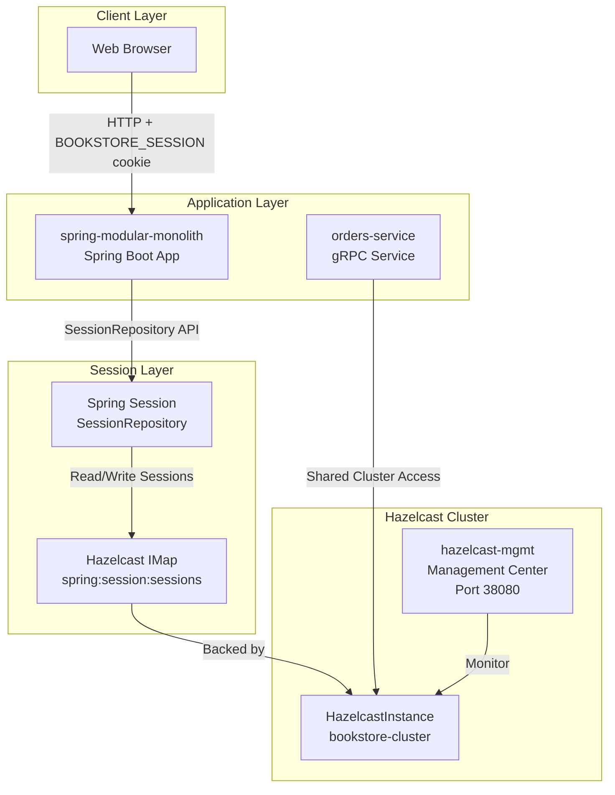
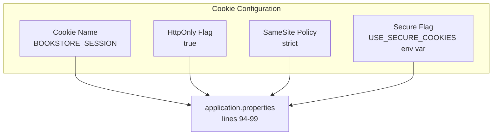
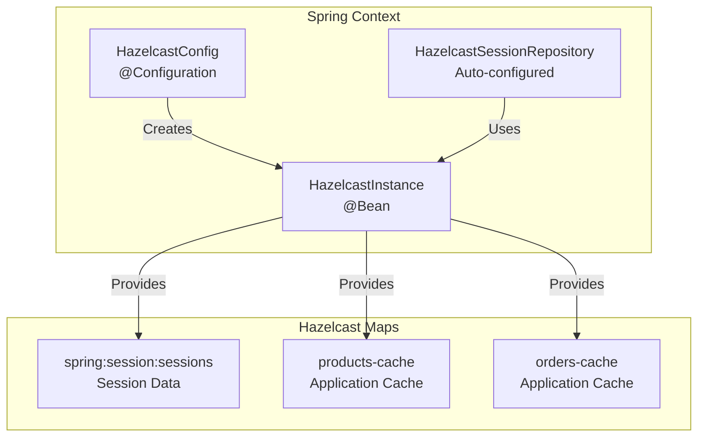
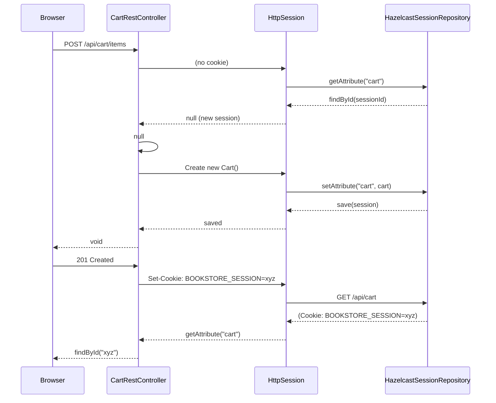
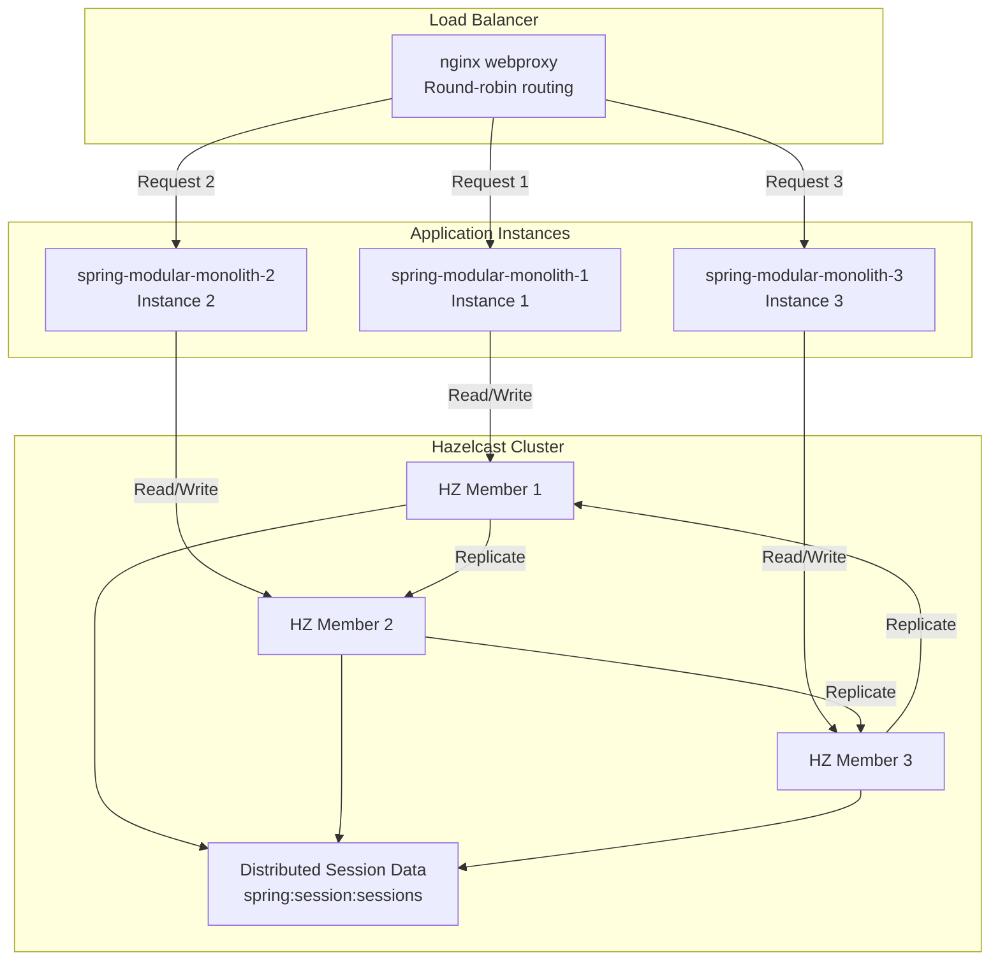
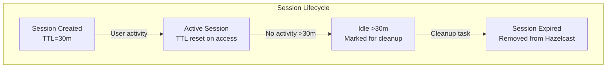
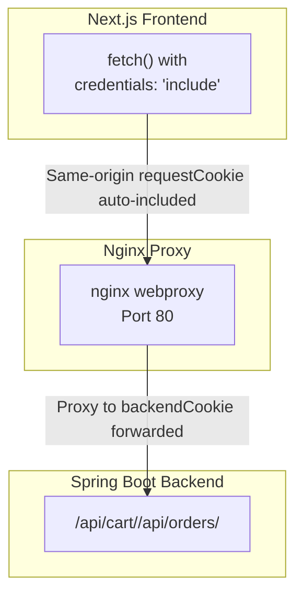

# Session Management with Hazelcast

> **Relevant source files**
> * [README-API.md](https://github.com/philipz/spring-modular-monolith/blob/30c9bf30/README-API.md)
> * [README.md](https://github.com/philipz/spring-modular-monolith/blob/30c9bf30/README.md)
> * [compose.yml](https://github.com/philipz/spring-modular-monolith/blob/30c9bf30/compose.yml)
> * [docs/API_ANALYSIS_SUMMARY.txt](https://github.com/philipz/spring-modular-monolith/blob/30c9bf30/docs/API_ANALYSIS_SUMMARY.txt)
> * [docs/REST_API_ANALYSIS.md](https://github.com/philipz/spring-modular-monolith/blob/30c9bf30/docs/REST_API_ANALYSIS.md)
> * [docs/bookstore-microservices.png](https://github.com/philipz/spring-modular-monolith/blob/30c9bf30/docs/bookstore-microservices.png)
> * [docs/improvement.md](https://github.com/philipz/spring-modular-monolith/blob/30c9bf30/docs/improvement.md)
> * [docs/orders-data-ownership-analysis.md](https://github.com/philipz/spring-modular-monolith/blob/30c9bf30/docs/orders-data-ownership-analysis.md)
> * [docs/orders-module-boundary-analysis.md](https://github.com/philipz/spring-modular-monolith/blob/30c9bf30/docs/orders-module-boundary-analysis.md)
> * [docs/orders-traffic-migration.md](https://github.com/philipz/spring-modular-monolith/blob/30c9bf30/docs/orders-traffic-migration.md)
> * [k6.js](https://github.com/philipz/spring-modular-monolith/blob/30c9bf30/k6.js)
> * [pom.xml](https://github.com/philipz/spring-modular-monolith/blob/30c9bf30/pom.xml)
> * [src/main/resources/application.properties](https://github.com/philipz/spring-modular-monolith/blob/30c9bf30/src/main/resources/application.properties)
> * [src/test/java/com/sivalabs/bookstore/BookStoreApplicationTests.java](https://github.com/philipz/spring-modular-monolith/blob/30c9bf30/src/test/java/com/sivalabs/bookstore/BookStoreApplicationTests.java)
> * [src/test/java/com/sivalabs/bookstore/TestcontainersConfiguration.java](https://github.com/philipz/spring-modular-monolith/blob/30c9bf30/src/test/java/com/sivalabs/bookstore/TestcontainersConfiguration.java)

## Purpose and Scope

This document explains how Spring Session integrates with Hazelcast to provide distributed session storage for the Spring Modular Monolith application. Session management is critical for maintaining stateful shopping cart functionality and enabling horizontal scaling without session affinity requirements.

For details on Hazelcast cache configuration and MapStore patterns, see [Cache Configuration and MapConfigs](/philipz/spring-modular-monolith/5.1-cache-configuration-and-mapconfigs). For information on the overall caching architecture, see [Caching with Hazelcast](/philipz/spring-modular-monolith/5-caching-with-hazelcast).

---

## Session Storage Architecture

The application uses **Spring Session** with Hazelcast as the backing store to maintain HTTP session state across multiple application instances. This enables stateless horizontal scaling while preserving user-specific data such as shopping cart contents.



**Architecture Overview:**

The session management flow works as follows:

1. **Client Request**: Browser sends HTTP request with `BOOKSTORE_SESSION` cookie
2. **Session Retrieval**: Spring Session intercepts the request and retrieves session data from Hazelcast
3. **Business Logic**: Application code accesses session attributes (e.g., cart contents) via standard `HttpSession` API
4. **Session Persistence**: On response, Spring Session automatically saves modified session data to Hazelcast
5. **Cross-Instance Access**: Any application instance can access the session via the distributed Hazelcast cluster

**Sources:**

* [src/main/resources/application.properties L89-L99](https://github.com/philipz/spring-modular-monolith/blob/30c9bf30/src/main/resources/application.properties#L89-L99)
* [compose.yml L175-L185](https://github.com/philipz/spring-modular-monolith/blob/30c9bf30/compose.yml#L175-L185)
* [README.md L22-L23](https://github.com/philipz/spring-modular-monolith/blob/30c9bf30/README.md#L22-L23)

---

## Spring Session Configuration

### Maven Dependency

The application includes the Spring Session Hazelcast dependency:

[pom.xml L168-L170](https://github.com/philipz/spring-modular-monolith/blob/30c9bf30/pom.xml#L168-L170)

### Application Properties

Session configuration is defined in application properties:

| Property | Value | Description |
| --- | --- | --- |
| `spring.session.store-type` | `hazelcast` | Configures Spring Session to use Hazelcast as the session repository |
| `spring.session.hazelcast.map-name` | `spring:session:sessions` | Name of the Hazelcast IMap storing session data |
| `spring.session.timeout` | `30m` | Session inactivity timeout (30 minutes) |
| `server.servlet.session.timeout` | `30m` | Servlet container session timeout (must match Spring Session timeout) |

[src/main/resources/application.properties L89-L92](https://github.com/philipz/spring-modular-monolith/blob/30c9bf30/src/main/resources/application.properties#L89-L92)

**Key Configuration Points:**

* **Map Name**: The `spring:session:sessions` map is automatically created by Spring Session in the Hazelcast cluster
* **Timeout Alignment**: Both `spring.session.timeout` and `server.servlet.session.timeout` are set to 30 minutes to ensure consistent behavior
* **Automatic Serialization**: Spring Session handles serialization/deserialization of session attributes to/from Hazelcast

**Sources:**

* [src/main/resources/application.properties L89-L92](https://github.com/philipz/spring-modular-monolith/blob/30c9bf30/src/main/resources/application.properties#L89-L92)

---

## Session Cookie Configuration

The `BOOKSTORE_SESSION` cookie carries the session identifier and is configured for security and compatibility:



### Cookie Properties

| Property | Value | Purpose |
| --- | --- | --- |
| `server.servlet.session.cookie.name` | `BOOKSTORE_SESSION` | Custom cookie name for identification |
| `server.servlet.session.cookie.http-only` | `true` | Prevents JavaScript access to cookie (XSS protection) |
| `server.servlet.session.cookie.secure` | `${USE_SECURE_COOKIES:false}` | Enables HTTPS-only transmission when set to `true` |
| `server.servlet.session.cookie.same-site` | `strict` | Prevents cross-site request forgery (CSRF) attacks |

[src/main/resources/application.properties L94-L99](https://github.com/philipz/spring-modular-monolith/blob/30c9bf30/src/main/resources/application.properties#L94-L99)

**Security Considerations:**

* **HttpOnly**: The `http-only=true` flag prevents client-side JavaScript from accessing the session cookie, mitigating XSS attacks
* **SameSite=Strict**: Ensures the cookie is only sent for same-site requests, providing CSRF protection
* **Secure Flag**: In production environments, set `USE_SECURE_COOKIES=true` to restrict cookie transmission to HTTPS connections only
* **Local Development**: The `secure` flag defaults to `false` for local HTTP testing; nginx in Docker Compose shares origin, eliminating CORS issues

**Sources:**

* [src/main/resources/application.properties L94-L99](https://github.com/philipz/spring-modular-monolith/blob/30c9bf30/src/main/resources/application.properties#L94-L99)
* [README.md L22-L23](https://github.com/philipz/spring-modular-monolith/blob/30c9bf30/README.md#L22-L23)

---

## Hazelcast Integration for Sessions

### HazelcastInstance Bean

Spring Session automatically uses the `HazelcastInstance` bean provided by the application's Hazelcast configuration. The same Hazelcast cluster serves both session storage and application-level caching.



**Integration Details:**

1. **Single Cluster**: Both sessions and application caches share the same Hazelcast cluster (`bookstore-cluster`)
2. **Automatic Discovery**: Spring Session auto-configuration detects the `HazelcastInstance` bean
3. **Separate Map**: Sessions are stored in a dedicated IMap (`spring:session:sessions`) separate from application caches
4. **No MapStore**: Unlike application caches (products, orders, inventory), session data is **not** backed by a MapStore and exists only in memory

**Sources:**

* [src/main/resources/application.properties L89-L91](https://github.com/philipz/spring-modular-monolith/blob/30c9bf30/src/main/resources/application.properties#L89-L91)
* [compose.yml L175-L185](https://github.com/philipz/spring-modular-monolith/blob/30c9bf30/compose.yml#L175-L185)

---

## Cart Session Management

The shopping cart is stored as a session attribute, demonstrating the practical use of distributed sessions:



### Cart Implementation

The cart is managed via session attributes in [src/main/java/com/sivalabs/bookstore/orders/web/CartRestController.java](https://github.com/philipz/spring-modular-monolith/blob/30c9bf30/src/main/java/com/sivalabs/bookstore/orders/web/CartRestController.java)

:

**Key Operations:**

1. **Add to Cart** (`POST /api/cart/items`): * Retrieves or creates cart from session * Adds/updates cart item * Saves cart back to session * Returns updated cart DTO
2. **Get Cart** (`GET /api/cart`): * Retrieves cart from session * Returns empty cart if none exists * No explicit save needed
3. **Update Quantity** (`PUT /api/cart/items/{code}`): * Modifies cart in session * Returns updated cart DTO
4. **Clear Cart** (`DELETE /api/cart`): * Removes cart from session * Returns 204 No Content

**Session Attribute Key:**

The cart is stored under the session attribute key `"cart"` as a `Cart` domain object. Spring Session automatically serializes/deserializes this object to/from Hazelcast.

**Sources:**

* [src/main/java/com/sivalabs/bookstore/orders/web/CartRestController.java](https://github.com/philipz/spring-modular-monolith/blob/30c9bf30/src/main/java/com/sivalabs/bookstore/orders/web/CartRestController.java)
* [README-API.md L53-L90](https://github.com/philipz/spring-modular-monolith/blob/30c9bf30/README-API.md#L53-L90)

---

## Horizontal Scaling and Session Distribution

Hazelcast-backed sessions enable **stateless horizontal scaling** without sticky session requirements:



**Scaling Benefits:**

1. **No Sticky Sessions**: Requests with the same session ID can be routed to any application instance
2. **Automatic Replication**: Session data is replicated across Hazelcast cluster members (configured by `bookstore.cache.backup-count=1`)
3. **High Availability**: If one instance fails, session data remains accessible from other cluster members
4. **Consistent View**: All instances see the same session state via the distributed IMap

**Configuration for Scaling:**

The Hazelcast backup configuration ensures session resilience:

| Property | Value | Impact |
| --- | --- | --- |
| `bookstore.cache.backup-count` | `1` | Each session has 1 backup copy on a different cluster member |
| Session TTL | `30m` | Sessions expire 30 minutes after last access, freeing memory |

**Sources:**

* [src/main/resources/application.properties L42-L64](https://github.com/philipz/spring-modular-monolith/blob/30c9bf30/src/main/resources/application.properties#L42-L64)
* [compose.yml L58-L87](https://github.com/philipz/spring-modular-monolith/blob/30c9bf30/compose.yml#L58-L87)

---

## Docker Compose Deployment

In the Docker Compose setup, Hazelcast runs embedded within each application instance:

```yaml
# compose.yml excerpt
monolith:
  image: sivaprasadreddy/spring-modular-monolith:0.0.1-SNAPSHOT
  environment:
    # JVM options required for Hazelcast in Java 21 modular environment
    JDK_JAVA_OPTIONS: "--add-modules java.se --add-exports java.base/jdk.internal.ref=ALL-UNNAMED ..."
  networks:
    - proxy

hazelcast-mgmt:
  image: hazelcast/management-center:latest
  environment:
    - HZ_CLUSTERNAME=bookstore-cluster
  ports:
    - "38080:8080"
```

[compose.yml L58-L87](https://github.com/philipz/spring-modular-monolith/blob/30c9bf30/compose.yml#L58-L87)

[compose.yml L175-L185](https://github.com/philipz/spring-modular-monolith/blob/30c9bf30/compose.yml#L175-L185)

**Deployment Details:**

* **Embedded Mode**: Each `monolith` container runs its own Hazelcast member as part of the application process
* **Cluster Name**: All members join the `bookstore-cluster` cluster via multicast discovery (Docker network)
* **Management Center**: The `hazelcast-mgmt` service provides a web UI at `http://localhost:38080` for monitoring sessions and cache metrics
* **JVM Flags**: Java 21 requires additional module exports for Hazelcast's internal reflection operations

**Sources:**

* [compose.yml L58-L87](https://github.com/philipz/spring-modular-monolith/blob/30c9bf30/compose.yml#L58-L87)
* [compose.yml L175-L185](https://github.com/philipz/spring-modular-monolith/blob/30c9bf30/compose.yml#L175-L185)
* [README.md L89](https://github.com/philipz/spring-modular-monolith/blob/30c9bf30/README.md#L89-L89)

---

## Session Lifecycle and Expiration

Session expiration is managed by both Spring Session and Hazelcast:



**Expiration Mechanism:**

1. **Initial Creation**: When a new session is created, it receives a 30-minute TTL
2. **Activity Refresh**: Each request that accesses the session resets the TTL to 30 minutes
3. **Idle Timeout**: Sessions idle for 30 minutes are marked as expired
4. **Cleanup**: Spring Session's scheduled cleanup task removes expired sessions from Hazelcast
5. **New Session**: Subsequent requests with an expired session ID create a new session (new cart)

**Configuration Alignment:**

Both timeouts must match to ensure consistent behavior:

```
spring.session.timeout=30m
server.servlet.session.timeout=30m
```

[src/main/resources/application.properties L91-L92](https://github.com/philipz/spring-modular-monolith/blob/30c9bf30/src/main/resources/application.properties#L91-L92)

**Sources:**

* [src/main/resources/application.properties L91-L92](https://github.com/philipz/spring-modular-monolith/blob/30c9bf30/src/main/resources/application.properties#L91-L92)

---

## Frontend Integration

Frontend applications must include credentials in requests to maintain session continuity:



**Integration Requirements:**

1. **Credentials Mode**: Frontend HTTP clients must use `credentials: 'include'` (browser) or `withCredentials: true` (Axios)
2. **Same Origin**: In Docker Compose, nginx serves both frontend (`:80/`) and backend (`:80/api/**`) on the same origin, eliminating CORS issues
3. **Development CORS**: When running frontend locally (`http://localhost:3000`), enable the `dev` profile which activates `CorsConfig` to allow cross-origin requests

**Example Usage:**

```javascript
// Frontend API client configuration
const response = await fetch('/api/cart/items', {
  method: 'POST',
  headers: { 'Content-Type': 'application/json' },
  credentials: 'include',  // Include session cookie
  body: JSON.stringify({ code: 'P100', quantity: 1 })
});
```

**Sources:**

* [README.md L22-L23](https://github.com/philipz/spring-modular-monolith/blob/30c9bf30/README.md#L22-L23)
* [README-API.md L14](https://github.com/philipz/spring-modular-monolith/blob/30c9bf30/README-API.md#L14-L14)
* [docs/REST_API_ANALYSIS.md L49-L57](https://github.com/philipz/spring-modular-monolith/blob/30c9bf30/docs/REST_API_ANALYSIS.md#L49-L57)

---

## Monitoring Sessions

The Hazelcast Management Center provides visibility into session storage:

### Management Center Access

* **URL**: `http://localhost:38080`
* **Map Name**: `spring:session:sessions`

### Available Metrics

| Metric | Description |
| --- | --- |
| Map Size | Current number of active sessions |
| Entry Count | Total sessions (including replicas) |
| Hit Rate | Session cache hit ratio |
| Memory Usage | Memory consumed by session data |

### Querying Sessions

The Management Center allows querying the session map to inspect active sessions:

```sql
-- Example query (Management Center console)
SELECT * FROM "spring:session:sessions"
```

**Sources:**

* [compose.yml L175-L185](https://github.com/philipz/spring-modular-monolith/blob/30c9bf30/compose.yml#L175-L185)
* [README.md L89](https://github.com/philipz/spring-modular-monolith/blob/30c9bf30/README.md#L89-L89)

---

## Troubleshooting

### Session Issues

| Problem | Possible Cause | Solution |
| --- | --- | --- |
| Cart contents lost after refresh | Session cookie not being sent | Verify `credentials: 'include'` in frontend requests |
| "Session not found" errors | Session expired (>30m idle) | Expected behavior; user must recreate cart |
| Different carts on each request | Cookie not set/sent | Check browser console for `Set-Cookie` header; verify `http-only` allows cookie storage |
| Session data not persisting | Hazelcast cluster not formed | Check Hazelcast logs for cluster formation; verify JVM flags in Docker |

### Common Configuration Errors

**Missing Credentials in Fetch:**

```
// ❌ Wrong: Cookie won't be sent
fetch('/api/cart')

// ✅ Correct: Cookie included
fetch('/api/cart', { credentials: 'include' })
```

**CORS Issues in Development:**

When running frontend on `http://localhost:3000` and backend on `http://localhost:8080`:

```javascript
# Enable CORS for local development
export SPRING_PROFILES_ACTIVE=dev
./mvnw spring-boot:run
```

[src/main/resources/application.properties L89-L99](https://github.com/philipz/spring-modular-monolith/blob/30c9bf30/src/main/resources/application.properties#L89-L99)

**Hazelcast JVM Configuration Missing:**

If running outside Docker, ensure JVM flags are set for Java 21:

```javascript
export JDK_JAVA_OPTIONS="--add-modules java.se --add-exports java.base/jdk.internal.ref=ALL-UNNAMED --add-opens java.base/java.lang=ALL-UNNAMED ..."
```

[compose.yml L78](https://github.com/philipz/spring-modular-monolith/blob/30c9bf30/compose.yml#L78-L78)

**Sources:**

* [README.md L144-L147](https://github.com/philipz/spring-modular-monolith/blob/30c9bf30/README.md#L144-L147)
* [compose.yml L78](https://github.com/philipz/spring-modular-monolith/blob/30c9bf30/compose.yml#L78-L78)
* [k6.js L34-L39](https://github.com/philipz/spring-modular-monolith/blob/30c9bf30/k6.js#L34-L39)

---

## Load Testing Sessions

The k6 load test demonstrates session-based cart operations:

```javascript
// k6.js excerpt
const cartResponse = http.post(`${baseUrl}/api/cart/items`, addToCartPayload, {
  headers: {
    'Content-Type': 'application/json',
    Accept: 'application/json',
  },
})

const sessionCookie = cartResponse.cookies['BOOKSTORE_SESSION']?.[0]

const orderResponse = http.post(`${baseUrl}/api/orders`, orderPayload, {
  headers: {
    'Content-Type': 'application/json',
    Accept: 'application/json',
    Cookie: `BOOKSTORE_SESSION=${sessionCookie.value}`,  // Reuse session
  },
})
```

[k6.js L23-L72](https://github.com/philipz/spring-modular-monolith/blob/30c9bf30/k6.js#L23-L72)

**Test Flow:**

1. Add item to cart (receives `BOOKSTORE_SESSION` cookie)
2. Extract session cookie from response
3. Create order using same session cookie
4. Verify order creation succeeds with cart data

**Sources:**

* [k6.js L1-L92](https://github.com/philipz/spring-modular-monolith/blob/30c9bf30/k6.js#L1-L92)

---

## Summary

The Spring Modular Monolith uses Spring Session with Hazelcast to provide:

* **Distributed session storage** enabling stateless horizontal scaling
* **Secure cookie-based sessions** with HttpOnly, SameSite, and optional Secure flags
* **Shopping cart persistence** across requests and application instances
* **30-minute session timeout** with automatic cleanup
* **Unified Hazelcast cluster** serving both sessions and application caches
* **Management Center** for monitoring session metrics

Session management is transparent to application code, using the standard `HttpSession` API while benefiting from Hazelcast's distributed capabilities.

**Sources:**

* [src/main/resources/application.properties L89-L99](https://github.com/philipz/spring-modular-monolith/blob/30c9bf30/src/main/resources/application.properties#L89-L99)
* [pom.xml L168-L170](https://github.com/philipz/spring-modular-monolith/blob/30c9bf30/pom.xml#L168-L170)
* [compose.yml L58-L87](https://github.com/philipz/spring-modular-monolith/blob/30c9bf30/compose.yml#L58-L87)
* [compose.yml L175-L185](https://github.com/philipz/spring-modular-monolith/blob/30c9bf30/compose.yml#L175-L185)
* [README.md L22-L23](https://github.com/philipz/spring-modular-monolith/blob/30c9bf30/README.md#L22-L23)