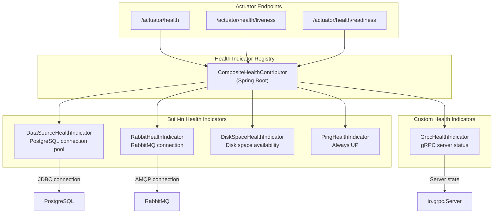
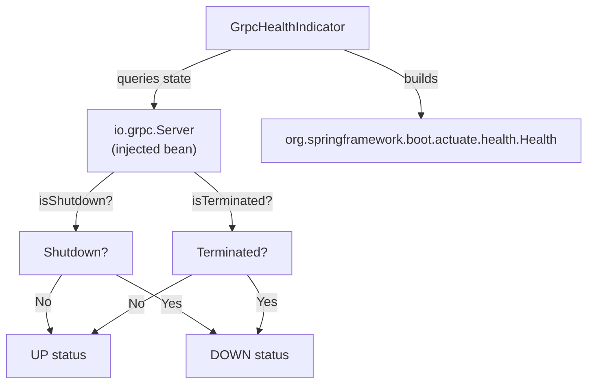
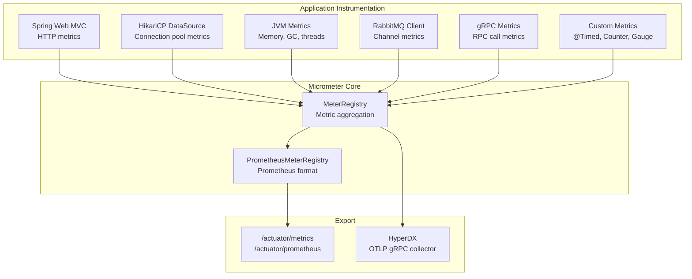
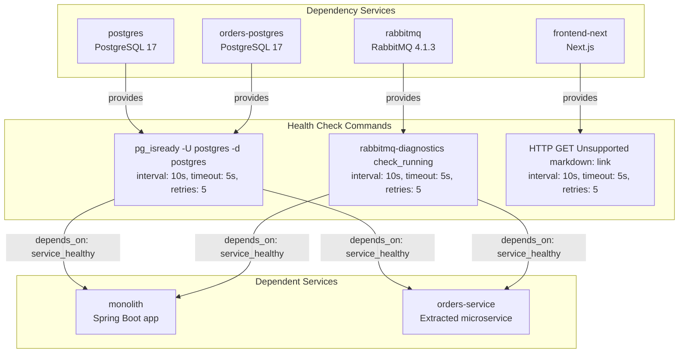
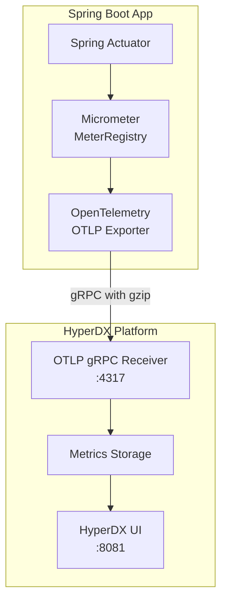

# Spring Actuator and Health Checks

> **Relevant source files**
> * [compose.yml](https://github.com/philipz/spring-modular-monolith/blob/30c9bf30/compose.yml)
> * [pom.xml](https://github.com/philipz/spring-modular-monolith/blob/30c9bf30/pom.xml)
> * [src/main/java/com/sivalabs/bookstore/config/GrpcHealthIndicator.java](https://github.com/philipz/spring-modular-monolith/blob/30c9bf30/src/main/java/com/sivalabs/bookstore/config/GrpcHealthIndicator.java)
> * [src/main/java/com/sivalabs/bookstore/config/GrpcProperties.java](https://github.com/philipz/spring-modular-monolith/blob/30c9bf30/src/main/java/com/sivalabs/bookstore/config/GrpcProperties.java)
> * [src/main/java/com/sivalabs/bookstore/orders/api/OrdersRemoteClient.java](https://github.com/philipz/spring-modular-monolith/blob/30c9bf30/src/main/java/com/sivalabs/bookstore/orders/api/OrdersRemoteClient.java)
> * [src/main/java/com/sivalabs/bookstore/orders/grpc/OrdersGrpcClient.java](https://github.com/philipz/spring-modular-monolith/blob/30c9bf30/src/main/java/com/sivalabs/bookstore/orders/grpc/OrdersGrpcClient.java)
> * [src/main/java/com/sivalabs/bookstore/orders/grpc/OrdersGrpcService.java](https://github.com/philipz/spring-modular-monolith/blob/30c9bf30/src/main/java/com/sivalabs/bookstore/orders/grpc/OrdersGrpcService.java)
> * [src/main/resources/application.properties](https://github.com/philipz/spring-modular-monolith/blob/30c9bf30/src/main/resources/application.properties)
> * [src/test/java/com/sivalabs/bookstore/BookStoreApplicationTests.java](https://github.com/philipz/spring-modular-monolith/blob/30c9bf30/src/test/java/com/sivalabs/bookstore/BookStoreApplicationTests.java)
> * [src/test/java/com/sivalabs/bookstore/TestcontainersConfiguration.java](https://github.com/philipz/spring-modular-monolith/blob/30c9bf30/src/test/java/com/sivalabs/bookstore/TestcontainersConfiguration.java)
> * [src/test/java/com/sivalabs/bookstore/orders/grpc/OrdersGrpcClientIntegrationTest.java](https://github.com/philipz/spring-modular-monolith/blob/30c9bf30/src/test/java/com/sivalabs/bookstore/orders/grpc/OrdersGrpcClientIntegrationTest.java)
> * [src/test/java/com/sivalabs/bookstore/orders/grpc/OrdersGrpcServiceIntegrationTest.java](https://github.com/philipz/spring-modular-monolith/blob/30c9bf30/src/test/java/com/sivalabs/bookstore/orders/grpc/OrdersGrpcServiceIntegrationTest.java)

## Purpose and Scope

This document describes the Spring Boot Actuator configuration, health check implementations, and metrics collection used throughout the Spring modular monolith. It covers endpoint exposure, built-in and custom health indicators, Kubernetes probe integration, and metrics export to the observability platform.

For distributed tracing configuration, see [OpenTelemetry Configuration](/philipz/spring-modular-monolith/9.1-opentelemetry-configuration). For the complete observability stack deployment, see [Distributed Tracing with HyperDX](/philipz/spring-modular-monolith/9.2-distributed-tracing-with-hyperdx).

---

## Actuator Endpoint Configuration

Spring Boot Actuator provides production-ready endpoints for monitoring and managing the application. The monolith exposes all actuator endpoints to facilitate comprehensive observability.

### Endpoint Exposure

All actuator endpoints are exposed via HTTP as configured in [src/main/resources/application.properties L70-L74](https://github.com/philipz/spring-modular-monolith/blob/30c9bf30/src/main/resources/application.properties#L70-L74)

:

```
management.endpoints.web.exposure.include=*
management.endpoint.health.probes.enabled=true
management.tracing.enabled=true
management.tracing.sampling.probability=1.0
```

**Key Settings:**

| Property | Value | Description |
| --- | --- | --- |
| `management.endpoints.web.exposure.include` | `*` | Exposes all actuator endpoints including health, metrics, info, env, beans, etc. |
| `management.endpoint.health.probes.enabled` | `true` | Enables Kubernetes-style liveness and readiness probe endpoints at `/actuator/health/liveness` and `/actuator/health/readiness` |
| `management.tracing.enabled` | `true` | Activates distributed tracing integration with Micrometer Tracing |
| `management.tracing.sampling.probability` | `1.0` | Captures 100% of traces (appropriate for development/staging environments) |

### Available Actuator Endpoints

With the wildcard exposure, the following endpoints are accessible at `/actuator/<endpoint>`:

* **`/health`** - Application health status and component checks
* **`/health/liveness`** - Kubernetes liveness probe (indicates if app should be restarted)
* **`/health/readiness`** - Kubernetes readiness probe (indicates if app can accept traffic)
* **`/metrics`** - Micrometer metrics in Prometheus format
* **`/info`** - Application information including build details
* **`/env`** - Environment properties
* **`/beans`** - Spring bean registry
* **`/modulith`** - Spring Modulith module structure (see [pom.xml L121-L123](https://github.com/philipz/spring-modular-monolith/blob/30c9bf30/pom.xml#L121-L123) )

**Sources:**

* [src/main/resources/application.properties L70-L74](https://github.com/philipz/spring-modular-monolith/blob/30c9bf30/src/main/resources/application.properties#L70-L74)
* [pom.xml L64-L65](https://github.com/philipz/spring-modular-monolith/blob/30c9bf30/pom.xml#L64-L65)  (actuator dependency)
* [pom.xml L121-L123](https://github.com/philipz/spring-modular-monolith/blob/30c9bf30/pom.xml#L121-L123)  (spring-modulith-actuator dependency)

---

## Health Indicator Architecture

The application's health status is determined by a composite of built-in and custom health indicators. Each indicator reports its own status, which is aggregated into an overall application health state.



**Sources:**

* [src/main/java/com/sivalabs/bookstore/config/GrpcHealthIndicator.java L1-L39](https://github.com/philipz/spring-modular-monolith/blob/30c9bf30/src/main/java/com/sivalabs/bookstore/config/GrpcHealthIndicator.java#L1-L39)
* [src/main/resources/application.properties L70-L74](https://github.com/philipz/spring-modular-monolith/blob/30c9bf30/src/main/resources/application.properties#L70-L74)

---

## Built-in Health Indicators

Spring Boot automatically registers health indicators for detected components. The monolith includes the following auto-configured health checks:

### DataSource Health Indicator

Verifies the PostgreSQL connection pool is healthy by executing a validation query. This indicator fails if the database connection cannot be established or the pool is exhausted.

**Configuration:**

* Database URL: [src/main/resources/application.properties L8](https://github.com/philipz/spring-modular-monolith/blob/30c9bf30/src/main/resources/application.properties#L8-L8)  - `spring.datasource.url`
* Pool size: [src/main/resources/application.properties L11](https://github.com/philipz/spring-modular-monolith/blob/30c9bf30/src/main/resources/application.properties#L11-L11)  - `spring.datasource.hikari.maximum-pool-size`
* Default validation query: `SELECT 1` (PostgreSQL)

### RabbitMQ Health Indicator

Checks the RabbitMQ connection status by verifying the AMQP channel is open and the broker is reachable.

**Configuration:**

* Host/port: [src/main/resources/application.properties L28-L29](https://github.com/philipz/spring-modular-monolith/blob/30c9bf30/src/main/resources/application.properties#L28-L29)
* Connection parameters: [compose.yml L67-L70](https://github.com/philipz/spring-modular-monolith/blob/30c9bf30/compose.yml#L67-L70)

### Disk Space Health Indicator

Monitors available disk space and reports DOWN if free space falls below a threshold (default: 10MB).

### Additional Indicators

* **Ping Health Indicator** - Always returns UP, useful for smoke tests
* **Liquibase Health Indicator** - Reports database migration status

**Sources:**

* [src/main/resources/application.properties L8-L11](https://github.com/philipz/spring-modular-monolith/blob/30c9bf30/src/main/resources/application.properties#L8-L11)  (datasource config)
* [src/main/resources/application.properties L28-L31](https://github.com/philipz/spring-modular-monolith/blob/30c9bf30/src/main/resources/application.properties#L28-L31)  (RabbitMQ config)
* [pom.xml L96-L105](https://github.com/philipz/spring-modular-monolith/blob/30c9bf30/pom.xml#L96-L105)  (data-jpa and postgresql dependencies)

---

## Custom Health Indicator: GrpcHealthIndicator

The `GrpcHealthIndicator` provides health status for the embedded gRPC server, reporting whether the server is running and accepting connections.

### Implementation



**Code Structure:**

The indicator implements `HealthIndicator` interface from Spring Boot Actuator at [src/main/java/com/sivalabs/bookstore/config/GrpcHealthIndicator.java L1-L39](https://github.com/philipz/spring-modular-monolith/blob/30c9bf30/src/main/java/com/sivalabs/bookstore/config/GrpcHealthIndicator.java#L1-L39)

:

```python
@Component
@ConditionalOnClass(Server.class)
@ConditionalOnBean(Server.class)
public class GrpcHealthIndicator implements HealthIndicator {
    private final Server server;
    
    public Health health() {
        boolean running = !server.isShutdown() && !server.isTerminated();
        if (running) {
            return Health.up()
                .withDetail("port", server.getPort())
                .withDetail("services", server.getServices().size())
                .build();
        }
        return Health.down()
            .withDetail("reason", "gRPC server not running")
            .withDetail("port", server.getPort())
            .build();
    }
}
```

**Health Response Example:**

When the gRPC server is running, the health endpoint returns:

```json
{
  "status": "UP",
  "components": {
    "grpc": {
      "status": "UP",
      "details": {
        "port": 9091,
        "services": 1
      }
    }
  }
}
```

**Conditional Registration:**

The indicator is only registered when:

1. `io.grpc.Server` class is on the classpath (`@ConditionalOnClass`)
2. A `Server` bean exists in the application context (`@ConditionalOnBean`)

This allows the health check to be automatically disabled when the gRPC server is not enabled (e.g., in tests where `bookstore.grpc.server.enabled=false`).

**Sources:**

* [src/main/java/com/sivalabs/bookstore/config/GrpcHealthIndicator.java L1-L39](https://github.com/philipz/spring-modular-monolith/blob/30c9bf30/src/main/java/com/sivalabs/bookstore/config/GrpcHealthIndicator.java#L1-L39)
* [src/main/java/com/sivalabs/bookstore/config/GrpcProperties.java L30-L41](https://github.com/philipz/spring-modular-monolith/blob/30c9bf30/src/main/java/com/sivalabs/bookstore/config/GrpcProperties.java#L30-L41)  (server properties)
* [src/test/java/com/sivalabs/bookstore/orders/grpc/OrdersGrpcServiceIntegrationTest.java L46-L48](https://github.com/philipz/spring-modular-monolith/blob/30c9bf30/src/test/java/com/sivalabs/bookstore/orders/grpc/OrdersGrpcServiceIntegrationTest.java#L46-L48)  (test with gRPC disabled)

---

## Kubernetes Health Probes

The application exposes Kubernetes-compatible liveness and readiness probes through dedicated actuator endpoints, enabling container orchestrators to manage application lifecycle.

### Probe Endpoints

| Probe Type | Endpoint | Purpose | When to Use |
| --- | --- | --- | --- |
| Liveness | `/actuator/health/liveness` | Indicates if the application process is healthy | Kubernetes restarts the pod if this fails |
| Readiness | `/actuator/health/readiness` | Indicates if the application can accept traffic | Kubernetes removes pod from service endpoints if this fails |

### Probe Configuration in Kubernetes

The Docker Compose configuration demonstrates health check patterns that translate to Kubernetes probes. For example, the frontend service at [compose.yml L154-L158](https://github.com/philipz/spring-modular-monolith/blob/30c9bf30/compose.yml#L154-L158)

:

```javascript
healthcheck:
  test: ["CMD", "node", "-e", "require('http').get('http://localhost:3000/', (r) => process.exit(r.statusCode === 200 ? 0 : 1))"]
  interval: 10s
  timeout: 5s
  retries: 5
```

**Equivalent Kubernetes Probe (Conceptual):**

```yaml
livenessProbe:
  httpGet:
    path: /actuator/health/liveness
    port: 8080
  initialDelaySeconds: 30
  periodSeconds: 10
  timeoutSeconds: 5
  failureThreshold: 3

readinessProbe:
  httpGet:
    path: /actuator/health/readiness
    port: 8080
  initialDelaySeconds: 10
  periodSeconds: 5
  timeoutSeconds: 3
  failureThreshold: 3
```

### Liveness vs. Readiness Semantics

**Liveness Probe:**

* Checks if the application is in a broken state requiring a restart
* Failure triggers pod termination and restart
* Should only fail for non-recoverable errors (e.g., deadlock, corrupted state)

**Readiness Probe:**

* Checks if the application is ready to serve requests
* Failure removes pod from service load balancer
* May temporarily fail during startup, dependency unavailability, or overload

**In this application:**

* Liveness includes core application state (JVM health, critical threads)
* Readiness includes external dependency health (PostgreSQL, RabbitMQ, gRPC server)

**Sources:**

* [src/main/resources/application.properties L72](https://github.com/philipz/spring-modular-monolith/blob/30c9bf30/src/main/resources/application.properties#L72-L72)  (`management.endpoint.health.probes.enabled=true`)
* [compose.yml L154-L158](https://github.com/philipz/spring-modular-monolith/blob/30c9bf30/compose.yml#L154-L158)  (frontend health check example)
* [compose.yml L8-L12](https://github.com/philipz/spring-modular-monolith/blob/30c9bf30/compose.yml#L8-L12)  (PostgreSQL health check)
* [compose.yml L42-L46](https://github.com/philipz/spring-modular-monolith/blob/30c9bf30/compose.yml#L42-L46)  (RabbitMQ health check)

---

## Metrics Collection with Micrometer

Spring Boot Actuator integrates with Micrometer to collect application metrics and export them in Prometheus-compatible format for scraping by observability platforms.

### Metrics Architecture



### Metrics Configuration

**Prometheus Registry:**

The Prometheus metrics registry is enabled via dependency at [pom.xml L66-L70](https://github.com/philipz/spring-modular-monolith/blob/30c9bf30/pom.xml#L66-L70)

:

```xml
<dependency>
    <groupId>io.micrometer</groupId>
    <artifactId>micrometer-registry-prometheus</artifactId>
    <scope>runtime</scope>
</dependency>
```

**Datasource Metrics:**

Database query metrics are collected using the `datasource-micrometer-spring-boot` library at [pom.xml L90-L93](https://github.com/philipz/spring-modular-monolith/blob/30c9bf30/pom.xml#L90-L93)

:

```xml
<dependency>
    <groupId>net.ttddyy.observation</groupId>
    <artifactId>datasource-micrometer-spring-boot</artifactId>
    <version>${datasource-micrometer-spring-boot.version}</version>
</dependency>
```

**Metric Tag Configuration:**

Common tags are applied to all metrics for filtering and aggregation at [src/main/resources/application.properties L110](https://github.com/philipz/spring-modular-monolith/blob/30c9bf30/src/main/resources/application.properties#L110-L110)

:

```
management.metrics.tags.common.application=${spring.application.name}
```

### Metric Tag Conflict Resolution

To avoid Prometheus cardinality issues with module-specific datasource metrics, the application disables certain metric collection at [src/main/resources/application.properties L103-L107](https://github.com/philipz/spring-modular-monolith/blob/30c9bf30/src/main/resources/application.properties#L103-L107)

:

```markdown
# Disable module-specific datasource metrics to avoid Prometheus tag conflicts
spring.modulith.observability.instrumentation.datasource.enabled=false

# Alternative approach: Disable JDBC connection metrics entirely
management.metrics.enable.jdbc=false
management.metrics.enable.hikaricp=false
```

This prevents duplicate metrics with conflicting tag schemas that would cause issues in the Prometheus registry.

### Accessing Metrics

Metrics are exposed through two actuator endpoints:

1. **`/actuator/metrics`** - JSON format listing all available metrics
2. **`/actuator/prometheus`** - Prometheus scrape endpoint with all metrics in Prometheus exposition format

**Example Metrics Available:**

| Metric Name | Type | Description |
| --- | --- | --- |
| `jvm.memory.used` | Gauge | JVM heap and non-heap memory usage |
| `jvm.gc.pause` | Timer | Garbage collection pause duration |
| `hikaricp.connections.active` | Gauge | Active JDBC connections in pool |
| `http.server.requests` | Timer | HTTP request duration and count by endpoint |
| `rabbitmq.channels` | Gauge | Active RabbitMQ channels |
| `grpc.server.calls` | Timer | gRPC call duration and count by method |

**Sources:**

* [pom.xml L66-L70](https://github.com/philipz/spring-modular-monolith/blob/30c9bf30/pom.xml#L66-L70)  (prometheus registry dependency)
* [pom.xml L90-L93](https://github.com/philipz/spring-modular-monolith/blob/30c9bf30/pom.xml#L90-L93)  (datasource metrics dependency)
* [src/main/resources/application.properties L103-L110](https://github.com/philipz/spring-modular-monolith/blob/30c9bf30/src/main/resources/application.properties#L103-L110)  (metrics configuration)
* [src/main/resources/application.properties L70-L74](https://github.com/philipz/spring-modular-monolith/blob/30c9bf30/src/main/resources/application.properties#L70-L74)  (actuator exposure)

---

## Dependency Health Checks in Docker Compose

The Docker Compose deployment defines health checks for all infrastructure dependencies, ensuring the application only starts when dependencies are ready.

### Health Check Configuration Pattern



### PostgreSQL Health Check

The main PostgreSQL instance at [compose.yml L8-L17](https://github.com/philipz/spring-modular-monolith/blob/30c9bf30/compose.yml#L8-L17)

 uses `pg_isready` to verify database availability:

```yaml
healthcheck:
  test: ["CMD-SHELL", "pg_isready -U postgres -d postgres"]
  interval: 10s
  timeout: 5s
  retries: 5
```

**Check Semantics:**

* **Command:** `pg_isready` - PostgreSQL client utility that checks if the server is ready to accept connections
* **Interval:** 10 seconds between checks
* **Timeout:** 5 seconds maximum for check execution
* **Retries:** 5 consecutive failures before marking unhealthy

The orders-service dedicated database uses an identical check at [compose.yml L25-L29](https://github.com/philipz/spring-modular-monolith/blob/30c9bf30/compose.yml#L25-L29)

### RabbitMQ Health Check

RabbitMQ health verification at [compose.yml L42-L46](https://github.com/philipz/spring-modular-monolith/blob/30c9bf30/compose.yml#L42-L46)

:

```yaml
healthcheck:
  test: ["CMD", "rabbitmq-diagnostics", "check_running"]
  interval: 10s
  timeout: 5s
  retries: 5
```

**Check Semantics:**

* **Command:** `rabbitmq-diagnostics check_running` - RabbitMQ CLI tool that verifies the broker is running and operational
* Checks node status, virtual hosts, and core processes

### Frontend Health Check

Next.js application health check at [compose.yml L154-L158](https://github.com/philipz/spring-modular-monolith/blob/30c9bf30/compose.yml#L154-L158)

:

```javascript
healthcheck:
  test: ["CMD", "node", "-e", "require('http').get('http://localhost:3000/', (r) => process.exit(r.statusCode === 200 ? 0 : 1))"]
  interval: 10s
  timeout: 5s
  retries: 5
```

**Check Semantics:**

* **Command:** Node.js inline script that makes an HTTP GET request to the root path
* Exits with code 0 (success) if HTTP 200, code 1 (failure) otherwise
* Verifies the Next.js server is responding to requests

### Service Dependencies

The monolith and orders-service wait for their dependencies to be healthy before starting, using Docker Compose's `depends_on` with `service_healthy` condition:

**Monolith dependencies** at [compose.yml L79-L83](https://github.com/philipz/spring-modular-monolith/blob/30c9bf30/compose.yml#L79-L83)

:

```yaml
depends_on:
  postgres:
    condition: service_healthy
  rabbitmq:
    condition: service_healthy
```

**Orders-service dependencies** at [compose.yml L90-L94](https://github.com/philipz/spring-modular-monolith/blob/30c9bf30/compose.yml#L90-L94)

:

```yaml
depends_on:
  orders-postgres:
    condition: service_healthy
  rabbitmq:
    condition: service_healthy
```

This ensures database migrations (Liquibase) and RabbitMQ queue setup complete successfully on startup.

**Sources:**

* [compose.yml L8-L17](https://github.com/philipz/spring-modular-monolith/blob/30c9bf30/compose.yml#L8-L17)  (PostgreSQL health check)
* [compose.yml L25-L29](https://github.com/philipz/spring-modular-monolith/blob/30c9bf30/compose.yml#L25-L29)  (orders-postgres health check)
* [compose.yml L42-L46](https://github.com/philipz/spring-modular-monolith/blob/30c9bf30/compose.yml#L42-L46)  (RabbitMQ health check)
* [compose.yml L154-L158](https://github.com/philipz/spring-modular-monolith/blob/30c9bf30/compose.yml#L154-L158)  (frontend health check)
* [compose.yml L79-L83](https://github.com/philipz/spring-modular-monolith/blob/30c9bf30/compose.yml#L79-L83)  (monolith dependencies)
* [compose.yml L90-L94](https://github.com/philipz/spring-modular-monolith/blob/30c9bf30/compose.yml#L90-L94)  (orders-service dependencies)

---

## Integration Testing Health Checks

Integration tests use Testcontainers to provide real PostgreSQL and RabbitMQ instances, relying on container health checks to ensure dependencies are ready before test execution.

### Testcontainers Health Waiting Strategy

The `TestcontainersConfiguration` class at [src/test/java/com/sivalabs/bookstore/TestcontainersConfiguration.java L14-L33](https://github.com/philipz/spring-modular-monolith/blob/30c9bf30/src/test/java/com/sivalabs/bookstore/TestcontainersConfiguration.java#L14-L33)

 defines shared containers:

```
@Container
static PostgreSQLContainer<?> postgres = 
    new PostgreSQLContainer<>(DockerImageName.parse("postgres:17-alpine"));

@Container
static RabbitMQContainer rabbitmq = 
    new RabbitMQContainer(DockerImageName.parse("rabbitmq:4.1.3-alpine"));
```

Testcontainers automatically waits for these containers to be healthy using their built-in health checks before allowing tests to proceed. The `@ServiceConnection` annotation auto-configures Spring Boot datasource and RabbitMQ connection properties from the running containers.

### Test-Specific Health Check Overrides

Tests can disable health checks for components not under test. For example, [src/test/java/com/sivalabs/bookstore/orders/grpc/OrdersGrpcServiceIntegrationTest.java L46-L48](https://github.com/philipz/spring-modular-monolith/blob/30c9bf30/src/test/java/com/sivalabs/bookstore/orders/grpc/OrdersGrpcServiceIntegrationTest.java#L46-L48)

 disables the gRPC server and Hazelcast:

```
properties = {
    "bookstore.cache.enabled=false",
    "bookstore.session.hazelcast.enabled=false",
    "bookstore.grpc.server.enabled=false"
}
```

This prevents `GrpcHealthIndicator` and Hazelcast health checks from affecting test health status when those components are not relevant to the test scenario.

**Sources:**

* [src/test/java/com/sivalabs/bookstore/TestcontainersConfiguration.java L14-L33](https://github.com/philipz/spring-modular-monolith/blob/30c9bf30/src/test/java/com/sivalabs/bookstore/TestcontainersConfiguration.java#L14-L33)
* [src/test/java/com/sivalabs/bookstore/orders/grpc/OrdersGrpcServiceIntegrationTest.java L43-L53](https://github.com/philipz/spring-modular-monolith/blob/30c9bf30/src/test/java/com/sivalabs/bookstore/orders/grpc/OrdersGrpcServiceIntegrationTest.java#L43-L53)
* [src/test/java/com/sivalabs/bookstore/orders/grpc/OrdersGrpcClientIntegrationTest.java L51-L64](https://github.com/philipz/spring-modular-monolith/blob/30c9bf30/src/test/java/com/sivalabs/bookstore/orders/grpc/OrdersGrpcClientIntegrationTest.java#L51-L64)

---

## Observability Platform Integration

Actuator metrics and health checks integrate with the HyperDX observability platform, providing unified visibility into application health alongside traces and logs.

### Health Check Export to HyperDX

The OpenTelemetry exporter configuration at [src/main/resources/application.properties L76-L82](https://github.com/philipz/spring-modular-monolith/blob/30c9bf30/src/main/resources/application.properties#L76-L82)

 automatically exports metrics (including health indicator states) to HyperDX:

```
otlp.grpc.enabled=true
otlp.grpc.endpoint=${OTLP_ENDPOINT:http://localhost:4317}
otlp.grpc.timeout=10s
otlp.grpc.compression=gzip
otlp.grpc.headers.authorization=${OTLP_GRPC_HEADERS_AUTHORIZATION:}
```

### Metrics Flow to HyperDX



The metrics include:

* Application health status (UP/DOWN states)
* Component health details (gRPC server port, connection pool stats)
* Performance metrics (request rates, response times)
* Resource utilization (memory, CPU, threads)

### Correlation with Traces and Logs

Metrics share common tags (`application=${spring.application.name}`) with traces and logs, enabling correlation in the HyperDX UI. For example, when investigating a spike in error rates:

1. **Metrics** show when error rate increased
2. **Traces** reveal which requests failed
3. **Logs** provide error messages and stack traces
4. **Health checks** indicate if component failures occurred

This correlation is enabled by the common observability configuration at [src/main/resources/application.properties L73-L74](https://github.com/philipz/spring-modular-monolith/blob/30c9bf30/src/main/resources/application.properties#L73-L74)

:

```
management.tracing.enabled=true
management.tracing.sampling.probability=1.0
```

And the correlation pattern in logs at [src/main/resources/application.properties L3](https://github.com/philipz/spring-modular-monolith/blob/30c9bf30/src/main/resources/application.properties#L3-L3)

:

```
logging.pattern.correlation=[${spring.application.name:},%X{traceId:-},%X{spanId:-}]
```

**Sources:**

* [src/main/resources/application.properties L76-L82](https://github.com/philipz/spring-modular-monolith/blob/30c9bf30/src/main/resources/application.properties#L76-L82)  (OTLP configuration)
* [src/main/resources/application.properties L73-L74](https://github.com/philipz/spring-modular-monolith/blob/30c9bf30/src/main/resources/application.properties#L73-L74)  (tracing configuration)
* [src/main/resources/application.properties L3](https://github.com/philipz/spring-modular-monolith/blob/30c9bf30/src/main/resources/application.properties#L3-L3)  (log correlation pattern)
* [compose.yml L49-L56](https://github.com/philipz/spring-modular-monolith/blob/30c9bf30/compose.yml#L49-L56)  (HyperDX deployment)
* [compose.yml L72-L73](https://github.com/philipz/spring-modular-monolith/blob/30c9bf30/compose.yml#L72-L73)  (monolith OTLP endpoint)

---

## Summary

The Spring modular monolith implements comprehensive health checking and metrics collection through Spring Boot Actuator:

1. **All actuator endpoints exposed** including health, metrics, and Spring Modulith module status
2. **Kubernetes-compatible probes** at `/actuator/health/liveness` and `/actuator/health/readiness`
3. **Built-in health indicators** for PostgreSQL, RabbitMQ, disk space, and application state
4. **Custom GrpcHealthIndicator** monitors embedded gRPC server status
5. **Micrometer metrics** exported in Prometheus format and to HyperDX via OTLP
6. **Docker Compose health checks** ensure dependencies are ready before application startup
7. **Testcontainers health waiting** enables reliable integration testing with real infrastructure
8. **Unified observability** correlates health status with traces, logs, and metrics in HyperDX

This health check and metrics infrastructure provides production-ready monitoring, enabling operators to detect failures, investigate performance issues, and ensure application reliability across the modular monolith and extracted microservices.