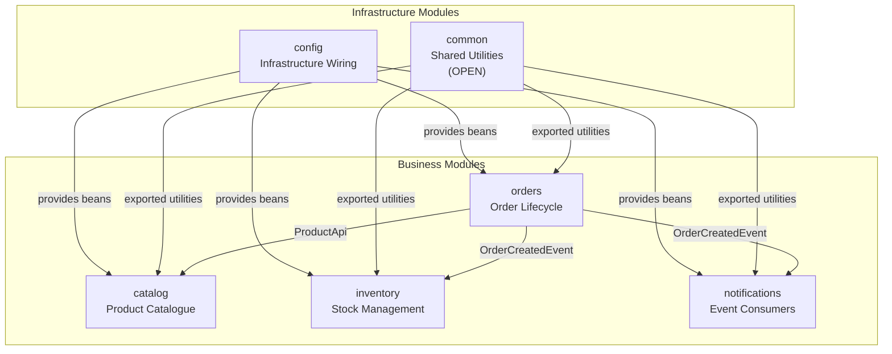
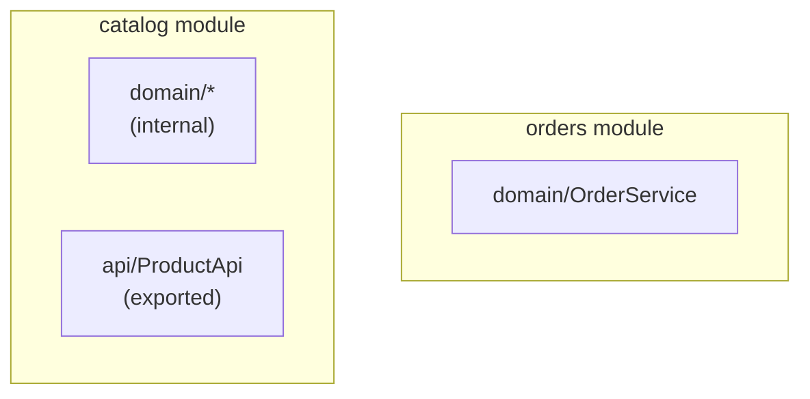
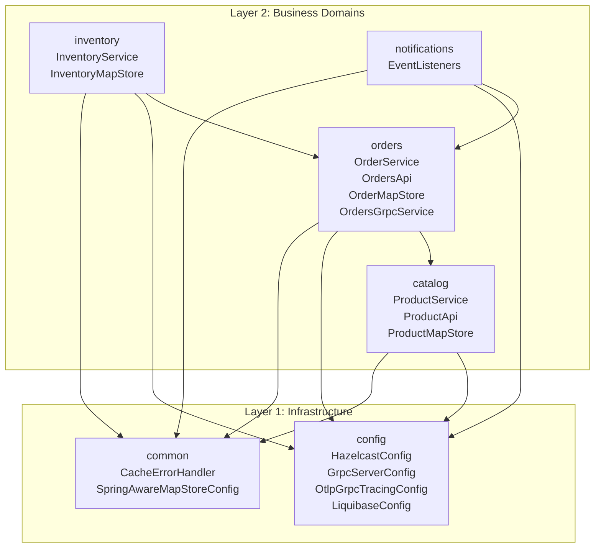

# Spring Modulith Architecture

> **Relevant source files**
> * [CLAUDE.md](https://github.com/philipz/spring-modular-monolith/blob/30c9bf30/CLAUDE.md)
> * [README-API.md](https://github.com/philipz/spring-modular-monolith/blob/30c9bf30/README-API.md)
> * [README.md](https://github.com/philipz/spring-modular-monolith/blob/30c9bf30/README.md)
> * [docs/API_ANALYSIS_SUMMARY.txt](https://github.com/philipz/spring-modular-monolith/blob/30c9bf30/docs/API_ANALYSIS_SUMMARY.txt)
> * [docs/REST_API_ANALYSIS.md](https://github.com/philipz/spring-modular-monolith/blob/30c9bf30/docs/REST_API_ANALYSIS.md)
> * [docs/bookstore-microservices.png](https://github.com/philipz/spring-modular-monolith/blob/30c9bf30/docs/bookstore-microservices.png)
> * [docs/improvement.md](https://github.com/philipz/spring-modular-monolith/blob/30c9bf30/docs/improvement.md)
> * [docs/orders-data-ownership-analysis.md](https://github.com/philipz/spring-modular-monolith/blob/30c9bf30/docs/orders-data-ownership-analysis.md)
> * [docs/orders-module-boundary-analysis.md](https://github.com/philipz/spring-modular-monolith/blob/30c9bf30/docs/orders-module-boundary-analysis.md)
> * [docs/orders-traffic-migration.md](https://github.com/philipz/spring-modular-monolith/blob/30c9bf30/docs/orders-traffic-migration.md)
> * [k6.js](https://github.com/philipz/spring-modular-monolith/blob/30c9bf30/k6.js)
> * [src/main/java/com/sivalabs/bookstore/config/LiquibaseConfig.java](https://github.com/philipz/spring-modular-monolith/blob/30c9bf30/src/main/java/com/sivalabs/bookstore/config/LiquibaseConfig.java)
> * [src/main/java/com/sivalabs/bookstore/config/OtlpGrpcTracingConfig.java](https://github.com/philipz/spring-modular-monolith/blob/30c9bf30/src/main/java/com/sivalabs/bookstore/config/OtlpGrpcTracingConfig.java)
> * [src/main/java/com/sivalabs/bookstore/config/OtlpProperties.java](https://github.com/philipz/spring-modular-monolith/blob/30c9bf30/src/main/java/com/sivalabs/bookstore/config/OtlpProperties.java)

## Purpose and Scope

This page explains the modular monolith architecture pattern as implemented in this codebase using Spring Modulith. It covers how the application is organized into distinct business modules, how module boundaries are defined and enforced, and the overall architectural principles that govern module interactions.

For detailed information about individual modules and their responsibilities, see [Module Structure and Boundaries](/philipz/spring-modular-monolith/3.1-module-structure-and-boundaries). For communication patterns between modules, see [Inter-Module Communication](/philipz/spring-modular-monolith/3.2-inter-module-communication). For the event-driven aspects, see [Event-Driven Architecture](/philipz/spring-modular-monolith/3.3-event-driven-architecture).

## What is Spring Modulith

Spring Modulith is a framework that enables building modular monolithic applications with explicit module boundaries. Unlike traditional monoliths where all code can access all other code, Spring Modulith enforces architectural boundaries at compile-time and runtime, ensuring modules interact only through well-defined APIs.

This codebase uses Spring Modulith **1.4.3** as defined in [pom.xml](https://github.com/philipz/spring-modular-monolith/blob/30c9bf30/pom.xml)

 to achieve:

* **Explicit module boundaries** defined via `package-info.java` annotations
* **Compile-time verification** that modules respect declared dependencies
* **Event-driven communication** between modules using Spring's application events
* **Independent testing** of modules using `@ApplicationModuleTest`
* **Documentation generation** of module structure and dependencies

**Sources:** [README.md L7-L36](https://github.com/philipz/spring-modular-monolith/blob/30c9bf30/README.md#L7-L36)

 [CLAUDE.md L114-L180](https://github.com/philipz/spring-modular-monolith/blob/30c9bf30/CLAUDE.md#L114-L180)

## Module Organization

The application is organized into six primary modules, each owning its domain logic, data access, and API surface:



**Sources:** [README.md L9-L14](https://github.com/philipz/spring-modular-monolith/blob/30c9bf30/README.md#L9-L14)

 [CLAUDE.md L117-L123](https://github.com/philipz/spring-modular-monolith/blob/30c9bf30/CLAUDE.md#L117-L123)

### Module Responsibilities

| Module | Package | Schema | Purpose |
| --- | --- | --- | --- |
| **common** | `com.sivalabs.bookstore.common` | N/A | Shared utilities, exception handling, cache helpers, Hazelcast session integration. Explicitly OPEN for use by all modules. |
| **config** | `com.sivalabs.bookstore.config` | N/A | Infrastructure wiring including `HazelcastConfig`, `OpenApiConfig`, `GrpcServerConfig`, observability setup, health checks, and CORS/session configuration. |
| **catalog** | `com.sivalabs.bookstore.catalog` | `catalog` | Product catalogue management with Liquibase migrations, REST API via `ProductRestController`, and exported `ProductApi` for cross-module access. |
| **orders** | `com.sivalabs.bookstore.orders` | `orders` | Order lifecycle, cart operations, gRPC client/server adapters, `OrdersApi` facade, and `OrderMapStore` for Hazelcast write-through caching. |
| **inventory** | `com.sivalabs.bookstore.inventory` | `inventory` | Inventory projections that consume `OrderCreatedEvent`, inventory cache configuration via `InventoryMapStore`, and stock level management. |
| **notifications** | `com.sivalabs.bookstore.notifications` | N/A | Event listeners that consume `OrderCreatedEvent` and record notification intents (currently logging, ready for email integration). |

**Sources:** [README.md L9-L14](https://github.com/philipz/spring-modular-monolith/blob/30c9bf30/README.md#L9-L14)

 [CLAUDE.md L119-L123](https://github.com/philipz/spring-modular-monolith/blob/30c9bf30/CLAUDE.md#L119-L123)

## Module Boundary Enforcement

Spring Modulith enforces module boundaries through several mechanisms:

### 1. Package-Based Module Definition

Each module is defined by its package structure under `com.sivalabs.bookstore.*`. By default, only types in the module's root package and explicitly exported sub-packages are visible to other modules.

**Example from orders module:**

```javascript
@ApplicationModule(allowedDependencies = {"catalog::product-api", "common::common-cache"})
package com.sivalabs.bookstore.orders;

import org.springframework.modulith.ApplicationModule;
```

This declaration states that the orders module may only depend on the `product-api` named interface from catalog and the `common-cache` interface from common.

**Sources:** [CLAUDE.md L246-L255](https://github.com/philipz/spring-modular-monolith/blob/30c9bf30/CLAUDE.md#L246-L255)

### 2. Named Interfaces for Exported APIs

Modules expose functionality through named interfaces, typically in an `api` sub-package:



The catalog module exports `ProductApi` in [src/main/java/com/sivalabs/bookstore/catalog/api/ProductApi.java](https://github.com/philipz/spring-modular-monolith/blob/30c9bf30/src/main/java/com/sivalabs/bookstore/catalog/api/ProductApi.java)

 which is consumed by the orders module in [src/main/java/com/sivalabs/bookstore/orders/domain/ProductServiceClient.java](https://github.com/philipz/spring-modular-monolith/blob/30c9bf30/src/main/java/com/sivalabs/bookstore/orders/domain/ProductServiceClient.java)

**Sources:** [README.md L30-L35](https://github.com/philipz/spring-modular-monolith/blob/30c9bf30/README.md#L30-L35)

 [CLAUDE.md L126-L130](https://github.com/philipz/spring-modular-monolith/blob/30c9bf30/CLAUDE.md#L126-L130)

 [docs/orders-module-boundary-analysis.md L9-L15](https://github.com/philipz/spring-modular-monolith/blob/30c9bf30/docs/orders-module-boundary-analysis.md#L9-L15)

### 3. Compile-Time Verification

The `ModularityTests` class verifies module boundaries at build time:

```
ApplicationModules.of(BookStoreApplication.class).verify();
```

This test ensures that:

* Modules only access explicitly allowed dependencies
* Internal implementation classes are not accessed across module boundaries
* Event types are properly declared in API packages

If a module violates boundaries (e.g., orders directly accessing catalog's `ProductRepository`), the test fails with a detailed error message.

**Sources:** [CLAUDE.md L158-L161](https://github.com/philipz/spring-modular-monolith/blob/30c9bf30/CLAUDE.md#L158-L161)

## Module Hierarchy and Dependencies

The module hierarchy follows a layered approach where infrastructure modules provide foundational capabilities, and business modules build on top:



### Dependency Rules

1. **Infrastructure modules provide, never consume**: The `config` module supplies beans like `HazelcastInstance`, `ManagedChannel`, and `OtlpProperties` without depending on business module implementations.
2. **Common is explicitly open**: The `common` module is marked as open (not verified for inbound dependencies), allowing all modules to use shared utilities without explicit declarations.
3. **Business modules depend on APIs only**: When orders needs product information, it consumes `catalog.api.ProductApi`, not the internal `ProductService` or `ProductRepository`.
4. **Event-driven cross-module communication**: Modules like inventory and notifications consume `OrderCreatedEvent` from `orders.api.events`, avoiding direct service-to-service calls.

**Sources:** [README.md L30-L35](https://github.com/philipz/spring-modular-monolith/blob/30c9bf30/README.md#L30-L35)

 [CLAUDE.md L235-L247](https://github.com/philipz/spring-modular-monolith/blob/30c9bf30/CLAUDE.md#L235-L247)

 [docs/orders-module-boundary-analysis.md L9-L23](https://github.com/philipz/spring-modular-monolith/blob/30c9bf30/docs/orders-module-boundary-analysis.md#L9-L23)

## Database Schema Organization

Each business module owns its database schema, enforcing data isolation:

| Module | Schema Name | Tables | Migration Path |
| --- | --- | --- | --- |
| catalog | `catalog` | `products` | `src/main/resources/db/migration/catalog/` |
| orders | `orders` | `orders`, `order_items` | `src/main/resources/db/migration/orders/` |
| inventory | `inventory` | `inventory` | `src/main/resources/db/migration/inventory/` |
| (events) | `events` | `event_publication` | Managed by Spring Modulith |

The `LiquibaseConfig` in [src/main/java/com/sivalabs/bookstore/config/LiquibaseConfig.java L42-L75](https://github.com/philipz/spring-modular-monolith/blob/30c9bf30/src/main/java/com/sivalabs/bookstore/config/LiquibaseConfig.java#L42-L75)

 manages schema migrations, with each module maintaining its own Liquibase changelogs under `db/migration/{module}/`.

**Key principles:**

* **No cross-schema foreign keys**: Modules cannot create referential integrity constraints across schemas
* **No cross-schema queries**: Services access only their own schema via their repository
* **Data sharing via events**: When inventory needs order data, it receives `OrderCreatedEvent` with necessary information

```css
#mermaid-z0j749ipqn{font-family:ui-sans-serif,-apple-system,system-ui,Segoe UI,Helvetica;font-size:16px;fill:#333;}@keyframes edge-animation-frame{from{stroke-dashoffset:0;}}@keyframes dash{to{stroke-dashoffset:0;}}#mermaid-z0j749ipqn .edge-animation-slow{stroke-dasharray:9,5!important;stroke-dashoffset:900;animation:dash 50s linear infinite;stroke-linecap:round;}#mermaid-z0j749ipqn .edge-animation-fast{stroke-dasharray:9,5!important;stroke-dashoffset:900;animation:dash 20s linear infinite;stroke-linecap:round;}#mermaid-z0j749ipqn .error-icon{fill:#dddddd;}#mermaid-z0j749ipqn .error-text{fill:#222222;stroke:#222222;}#mermaid-z0j749ipqn .edge-thickness-normal{stroke-width:1px;}#mermaid-z0j749ipqn .edge-thickness-thick{stroke-width:3.5px;}#mermaid-z0j749ipqn .edge-pattern-solid{stroke-dasharray:0;}#mermaid-z0j749ipqn .edge-thickness-invisible{stroke-width:0;fill:none;}#mermaid-z0j749ipqn .edge-pattern-dashed{stroke-dasharray:3;}#mermaid-z0j749ipqn .edge-pattern-dotted{stroke-dasharray:2;}#mermaid-z0j749ipqn .marker{fill:#999;stroke:#999;}#mermaid-z0j749ipqn .marker.cross{stroke:#999;}#mermaid-z0j749ipqn svg{font-family:ui-sans-serif,-apple-system,system-ui,Segoe UI,Helvetica;font-size:16px;}#mermaid-z0j749ipqn p{margin:0;}#mermaid-z0j749ipqn .entityBox{fill:#ffffff;stroke:#dddddd;}#mermaid-z0j749ipqn .relationshipLabelBox{fill:#dddddd;opacity:0.7;background-color:#dddddd;}#mermaid-z0j749ipqn .relationshipLabelBox rect{opacity:0.5;}#mermaid-z0j749ipqn .labelBkg{background-color:rgba(221, 221, 221, 0.5);}#mermaid-z0j749ipqn .edgeLabel .label{fill:#dddddd;font-size:14px;}#mermaid-z0j749ipqn .label{font-family:ui-sans-serif,-apple-system,system-ui,Segoe UI,Helvetica;color:#333;}#mermaid-z0j749ipqn .edge-pattern-dashed{stroke-dasharray:8,8;}#mermaid-z0j749ipqn .node rect,#mermaid-z0j749ipqn .node circle,#mermaid-z0j749ipqn .node ellipse,#mermaid-z0j749ipqn .node polygon{fill:#ffffff;stroke:#dddddd;stroke-width:1px;}#mermaid-z0j749ipqn .relationshipLine{stroke:#999;stroke-width:1;fill:none;}#mermaid-z0j749ipqn .marker{fill:none!important;stroke:#999!important;stroke-width:1;}#mermaid-z0j749ipqn :root{--mermaid-font-family:"trebuchet ms",verdana,arial,sans-serif;}CATALOG_PRODUCTSstringcodePKstringnamenumericpriceORDERS_ORDERSbigintorder_idPKstringorder_numberUKstringcustomer_namenumerictotal_amountINVENTORY_INVENTORYbigintidPKstringproduct_codeUKintquantityEVENTS_PUBLICATIONuuididPKtimestamppublication_datestringevent_type
```

**Sources:** [README.md L135-L139](https://github.com/philipz/spring-modular-monolith/blob/30c9bf30/README.md#L135-L139)

 [CLAUDE.md L282-L287](https://github.com/philipz/spring-modular-monolith/blob/30c9bf30/CLAUDE.md#L282-L287)

 [src/main/java/com/sivalabs/bookstore/config/LiquibaseConfig.java L42-L75](https://github.com/philipz/spring-modular-monolith/blob/30c9bf30/src/main/java/com/sivalabs/bookstore/config/LiquibaseConfig.java#L42-L75)

## Testing and Verification

Spring Modulith provides specialized testing support to verify module boundaries and test modules in isolation:

### Module Boundary Tests

The `ModularityTests` class in [src/test/java/com/sivalabs/bookstore/ModularityTests.java](https://github.com/philipz/spring-modular-monolith/blob/30c9bf30/src/test/java/com/sivalabs/bookstore/ModularityTests.java)

 uses `ApplicationModules.verify()` to ensure:

* No unauthorized dependencies between modules
* All exposed APIs are properly annotated
* Internal packages are not accessed externally

### Isolated Module Tests

Using `@ApplicationModuleTest`, modules can be tested without loading the entire application context:

```python
@ApplicationModuleTest
class CatalogIntegrationTests {
    // Only catalog module components are loaded
}
```

This approach:

* Reduces test execution time
* Validates module independence
* Ensures modules can function with only their declared dependencies
* Detects hidden coupling early

**Sources:** [CLAUDE.md L158-L180](https://github.com/philipz/spring-modular-monolith/blob/30c9bf30/CLAUDE.md#L158-L180)

 [CLAUDE.md L288-L293](https://github.com/philipz/spring-modular-monolith/blob/30c9bf30/CLAUDE.md#L288-L293)

## Observability of Module Interactions

Spring Modulith's observability module (enabled via `spring-modulith-observability` dependency) automatically instruments:

* **Module boundary crossings**: Each call across module boundaries is traced
* **Event publication**: Publishing of `@ApplicationModuleListener` events
* **Async event processing**: Tracking of event handler execution

This telemetry integrates with the OpenTelemetry setup configured in [src/main/java/com/sivalabs/bookstore/config/OtlpGrpcTracingConfig.java L49-L62](https://github.com/philipz/spring-modular-monolith/blob/30c9bf30/src/main/java/com/sivalabs/bookstore/config/OtlpGrpcTracingConfig.java#L49-L62)

 and [src/main/java/com/sivalabs/bookstore/config/OtlpProperties.java L9-L63](https://github.com/philipz/spring-modular-monolith/blob/30c9bf30/src/main/java/com/sivalabs/bookstore/config/OtlpProperties.java#L9-L63)

 allowing developers to visualize module interactions in the HyperDX UI at `http://localhost:8081`.

The actuator endpoint `/actuator/modulith` exposes the module structure and dependency graph at runtime.

**Sources:** [README.md L86](https://github.com/philipz/spring-modular-monolith/blob/30c9bf30/README.md#L86-L86)

 [src/main/java/com/sivalabs/bookstore/config/OtlpGrpcTracingConfig.java L49-L62](https://github.com/philipz/spring-modular-monolith/blob/30c9bf30/src/main/java/com/sivalabs/bookstore/config/OtlpGrpcTracingConfig.java#L49-L62)

 [src/main/java/com/sivalabs/bookstore/config/OtlpProperties.java L9-L63](https://github.com/philipz/spring-modular-monolith/blob/30c9bf30/src/main/java/com/sivalabs/bookstore/config/OtlpProperties.java#L9-L63)

## Next Steps

* For detailed information about each module's internal structure, exported APIs, and responsibilities, see [Module Structure and Boundaries](/philipz/spring-modular-monolith/3.1-module-structure-and-boundaries)
* For patterns of communication between modules (API calls, gRPC, events), see [Inter-Module Communication](/philipz/spring-modular-monolith/3.2-inter-module-communication)
* For the dual event bus architecture (internal + RabbitMQ), see [Event-Driven Architecture](/philipz/spring-modular-monolith/3.3-event-driven-architecture)