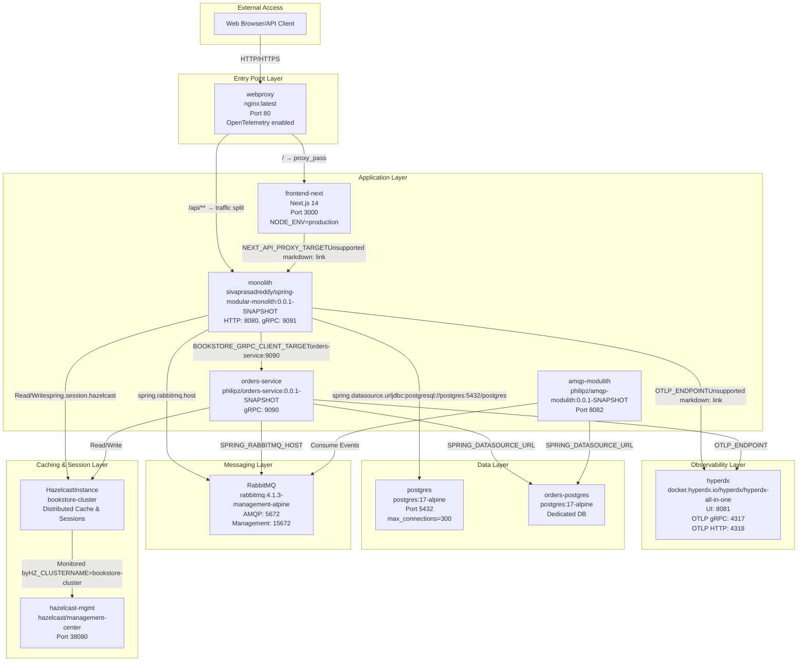
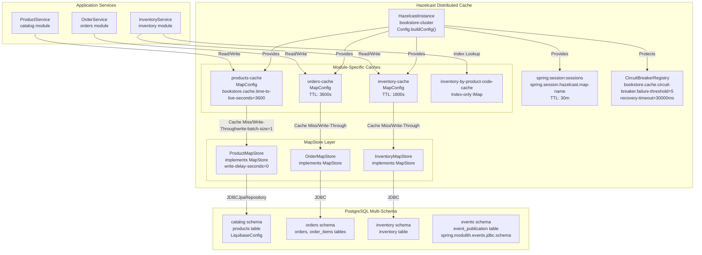
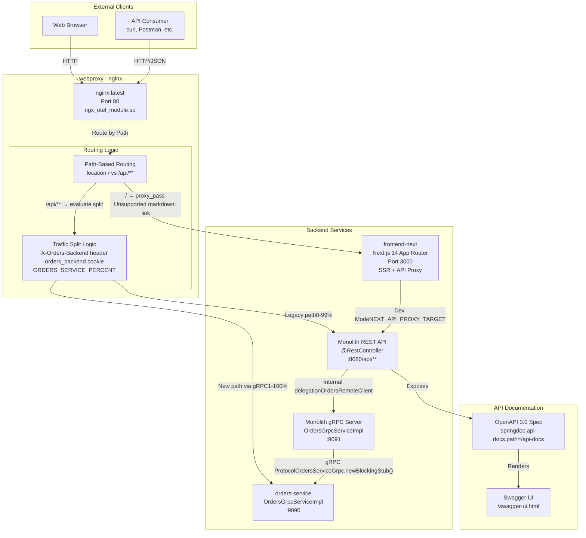

# System Architecture Diagrams

> **Relevant source files**
> * [compose.yml](https://github.com/philipz/spring-modular-monolith/blob/30c9bf30/compose.yml)
> * [docs/1.png](https://github.com/philipz/spring-modular-monolith/blob/30c9bf30/docs/1.png)
> * [docs/2.png](https://github.com/philipz/spring-modular-monolith/blob/30c9bf30/docs/2.png)
> * [docs/3.png](https://github.com/philipz/spring-modular-monolith/blob/30c9bf30/docs/3.png)
> * [docs/4.png](https://github.com/philipz/spring-modular-monolith/blob/30c9bf30/docs/4.png)
> * [docs/5.png](https://github.com/philipz/spring-modular-monolith/blob/30c9bf30/docs/5.png)
> * [docs/6.png](https://github.com/philipz/spring-modular-monolith/blob/30c9bf30/docs/6.png)
> * [docs/history.md](https://github.com/philipz/spring-modular-monolith/blob/30c9bf30/docs/history.md)
> * [pom.xml](https://github.com/philipz/spring-modular-monolith/blob/30c9bf30/pom.xml)
> * [src/main/resources/application.properties](https://github.com/philipz/spring-modular-monolith/blob/30c9bf30/src/main/resources/application.properties)
> * [src/test/java/com/sivalabs/bookstore/BookStoreApplicationTests.java](https://github.com/philipz/spring-modular-monolith/blob/30c9bf30/src/test/java/com/sivalabs/bookstore/BookStoreApplicationTests.java)
> * [src/test/java/com/sivalabs/bookstore/TestcontainersConfiguration.java](https://github.com/philipz/spring-modular-monolith/blob/30c9bf30/src/test/java/com/sivalabs/bookstore/TestcontainersConfiguration.java)

This page provides visual representations of the system's architecture at multiple levels of abstraction, from the complete deployment topology down to internal module communication patterns. These diagrams illustrate how the Spring Modular Monolith transitions toward a microservices architecture while maintaining operational simplicity.

For detailed information about individual business modules, see [Business Modules](/philipz/spring-modular-monolith/8-business-modules). For deployment procedures, see [Deployment and Infrastructure](/philipz/spring-modular-monolith/10-deployment-and-infrastructure). For module boundaries and communication patterns, see [Spring Modulith Architecture](/philipz/spring-modular-monolith/3-spring-modulith-architecture).

---

## Complete System Deployment Architecture

The following diagram shows the full Docker Compose deployment topology, including all services, networking, and external dependencies:

**Key Configuration Properties:**

| Service | Key Properties | File Reference |
| --- | --- | --- |
| `monolith` | `SPRING_DATASOURCE_URL`, `BOOKSTORE_GRPC_CLIENT_TARGET`, `OTLP_ENDPOINT` | [compose.yml L58-L86](https://github.com/philipz/spring-modular-monolith/blob/30c9bf30/compose.yml#L58-L86) |
| `orders-service` | `SPRING_DATASOURCE_URL`, `PRODUCT_API_BASE_URL`, `SPRING_MODULITH_EVENTS_SCHEMA` | [compose.yml L88-L117](https://github.com/philipz/spring-modular-monolith/blob/30c9bf30/compose.yml#L88-L117) |
| `frontend-next` | `NEXT_PUBLIC_API_URL=/api`, `NEXT_API_PROXY_TARGET` | [compose.yml L140-L158](https://github.com/philipz/spring-modular-monolith/blob/30c9bf30/compose.yml#L140-L158) |
| `webproxy` | `HYPERDX_API_KEY` | [compose.yml L160-L173](https://github.com/philipz/spring-modular-monolith/blob/30c9bf30/compose.yml#L160-L173) |

**Sources:** [compose.yml L1-L189](https://github.com/philipz/spring-modular-monolith/blob/30c9bf30/compose.yml#L1-L189)

---

## Spring Modulith Module Communication Architecture

This diagram shows the internal structure of the Spring Boot monolith, focusing on module boundaries enforced by Spring Modulith:

```mermaid
flowchart TD

RestAPI["REST Controllers<br>/api/** endpoints<br>@RestController"]
GrpcAPI["OrdersGrpcServiceImpl<br>@GrpcService<br>Port 9091"]
HazelcastConfig["HazelcastConfig<br>@Configuration"]
GrpcServerConfig["GrpcServerConfig<br>bookstore.grpc.server.*"]
OtlpGrpcConfig["OtlpGrpcTracingConfig<br>otlp.grpc.*"]
CacheService["CacheService<br>Utility methods"]
ExceptionHandling["GlobalExceptionHandler<br>@RestControllerAdvice"]
ProductApi["ProductApi<br>@ApplicationModuleListener.AllowedDependencies"]
ProductService["ProductService<br>@Service"]
ProductMapStore["ProductMapStore<br>MapStore<String, Product>"]
ProductRepo["ProductRepository<br>JpaRepository"]
OrdersApi["OrdersApi<br>Exported API"]
OrderService["OrderService<br>@Transactional"]
OrderMapStore["OrderMapStore<br>MapStore<String, OrderDTO>"]
OrdersGrpcClient["OrdersGrpcClient<br>ManagedChannel"]
OrderRepo["OrderRepository<br>JpaRepository"]
InventoryService["InventoryService<br>@Service"]
InventoryMapStore["InventoryMapStore<br>MapStore<Long, Inventory>"]
InventoryRepo["InventoryRepository<br>JpaRepository"]
NotificationEventListener["NotificationEventListener<br>@ApplicationModuleListener"]
ModulithEvents["ApplicationEvents<br>spring.modulith.events.jdbc.schema=events"]
RabbitExternalization["RabbitMQ Externalization<br>@Externalized"]
CatalogSchema["catalog schema<br>Liquibase migrations<br>db/catalog/"]
OrdersSchema["orders schema<br>db/orders/"]
InventorySchema["inventory schema<br>db/inventory/"]
EventsSchema["events schema<br>EVENT_PUBLICATION table"]

RestAPI --> OrderService
RestAPI --> ProductService
GrpcAPI --> OrderService
OrderService -->|"PublishesOrderCreatedEvent"| ModulithEvents
ModulithEvents -->|"@ApplicationModuleListener"| InventoryService
ModulithEvents -->|"@ApplicationModuleListener"| NotificationEventListener
ProductRepo --> CatalogSchema
OrderRepo --> OrdersSchema
InventoryRepo --> InventorySchema
ModulithEvents --> EventsSchema

subgraph subGraph9 ["Data Schemas"]
    CatalogSchema
    OrdersSchema
    InventorySchema
    EventsSchema
end

subgraph subGraph8 ["Event Bus"]
    ModulithEvents
    RabbitExternalization
    ModulithEvents -->|"@Externalized"| RabbitExternalization
end

subgraph subGraph7 ["Spring Modulith Modules"]
    HazelcastConfig -->|"Provides beans"| ProductMapStore
    HazelcastConfig -->|"Provides beans"| OrderMapStore
    HazelcastConfig -->|"Provides beans"| InventoryMapStore
    CacheService -->|"Used by"| ProductMapStore
    CacheService -->|"Used by"| OrderMapStore
    OrderService -->|"API callproductApi.getProductByCode()"| ProductApi

subgraph subGraph6 ["notifications module"]
    NotificationEventListener
end

subgraph subGraph5 ["inventory module"]
    InventoryService
    InventoryMapStore
    InventoryRepo
    InventoryService --> InventoryRepo
end

subgraph subGraph4 ["orders module"]
    OrdersApi
    OrderService
    OrderMapStore
    OrdersGrpcClient
    OrderRepo
    OrderService --> OrderRepo
end

subgraph subGraph3 ["catalog module"]
    ProductApi
    ProductService
    ProductMapStore
    ProductRepo
    ProductService --> ProductRepo
end

subgraph subGraph2 ["common module [OPEN]"]
    CacheService
    ExceptionHandling
end

subgraph subGraph1 ["config module"]
    HazelcastConfig
    GrpcServerConfig
    OtlpGrpcConfig
end
end

subgraph subGraph0 ["Presentation Layer"]
    RestAPI
    GrpcAPI
end
```

**Module Access Rules:**

| Module | Type | Exports | Dependencies |
| --- | --- | --- | --- |
| `config` | Infrastructure | Configuration beans | None (base module) |
| `common` | Shared | All classes (`@ApplicationModule(type = OPEN)`) | None |
| `catalog` | Business | `ProductApi` | `common` |
| `orders` | Business | `OrdersApi` | `common`, `catalog` (via `ProductApi`) |
| `inventory` | Business | None (internal) | `common`, listens to `orders` events |
| `notifications` | Business | None (internal) | `common`, listens to events |

**Sources:** [src/main/java/com/sivalabs/bookstore/config/](https://github.com/philipz/spring-modular-monolith/blob/30c9bf30/src/main/java/com/sivalabs/bookstore/config/)

 [src/main/java/com/sivalabs/bookstore/catalog/](https://github.com/philipz/spring-modular-monolith/blob/30c9bf30/src/main/java/com/sivalabs/bookstore/catalog/)

 [src/main/java/com/sivalabs/bookstore/orders/](https://github.com/philipz/spring-modular-monolith/blob/30c9bf30/src/main/java/com/sivalabs/bookstore/orders/)

 [src/main/java/com/sivalabs/bookstore/inventory/](https://github.com/philipz/spring-modular-monolith/blob/30c9bf30/src/main/java/com/sivalabs/bookstore/inventory/)

 [src/main/java/com/sivalabs/bookstore/notifications/](https://github.com/philipz/spring-modular-monolith/blob/30c9bf30/src/main/java/com/sivalabs/bookstore/notifications/)

 [src/main/resources/application.properties L36-L40](https://github.com/philipz/spring-modular-monolith/blob/30c9bf30/src/main/resources/application.properties#L36-L40)

---

## Data, Caching, and Persistence Architecture

This diagram illustrates the three-tier data architecture with Hazelcast distributed caching and PostgreSQL multi-schema design:

**Cache Configuration Properties:**

| Property | Value | Purpose |
| --- | --- | --- |
| `bookstore.cache.enabled` | `true` | Global cache enablement |
| `bookstore.cache.max-size` | `1000` | Max entries per cache |
| `bookstore.cache.time-to-live-seconds` | `3600` (products/orders), `1800` (inventory) | Entry TTL |
| `bookstore.cache.write-through` | `true` | Synchronous write to DB |
| `bookstore.cache.write-delay-seconds` | `0` | Immediate persistence |
| `bookstore.cache.backup-count` | `1` | Cluster backup copies |
| `bookstore.cache.circuit-breaker.failure-threshold` | `5` | Circuit breaker threshold |

**Sources:** [src/main/java/com/sivalabs/bookstore/config/HazelcastConfig.java](https://github.com/philipz/spring-modular-monolith/blob/30c9bf30/src/main/java/com/sivalabs/bookstore/config/HazelcastConfig.java)

 [src/main/java/com/sivalabs/bookstore/catalog/domain/ProductMapStore.java](https://github.com/philipz/spring-modular-monolith/blob/30c9bf30/src/main/java/com/sivalabs/bookstore/catalog/domain/ProductMapStore.java)

 [src/main/java/com/sivalabs/bookstore/orders/domain/OrderMapStore.java](https://github.com/philipz/spring-modular-monolith/blob/30c9bf30/src/main/java/com/sivalabs/bookstore/orders/domain/OrderMapStore.java)

 [src/main/java/com/sivalabs/bookstore/inventory/domain/InventoryMapStore.java](https://github.com/philipz/spring-modular-monolith/blob/30c9bf30/src/main/java/com/sivalabs/bookstore/inventory/domain/InventoryMapStore.java)

 [src/main/resources/application.properties L42-L68](https://github.com/philipz/spring-modular-monolith/blob/30c9bf30/src/main/resources/application.properties#L42-L68)

---

## API Gateway and Traffic Management

This diagram shows nginx routing logic and the progressive traffic migration pattern for orders:

**Traffic Split Configuration:**

Traffic to `/api/orders/**` can be split between the monolith and `orders-service`:

* **Header override:** `X-Orders-Backend: orders` forces routing to `orders-service`
* **Cookie persistence:** `orders_backend=orders` maintains routing across requests
* **Percentage split:** `ORDERS_SERVICE_PERCENT` environment variable (0-100) controls gradual rollout

**Sources:** [webproxy/nginx.conf](https://github.com/philipz/spring-modular-monolith/blob/30c9bf30/webproxy/nginx.conf)

 [compose.yml L160-L173](https://github.com/philipz/spring-modular-monolith/blob/30c9bf30/compose.yml#L160-L173)

 [src/main/java/com/sivalabs/bookstore/orders/grpc/OrdersGrpcClient.java](https://github.com/philipz/spring-modular-monolith/blob/30c9bf30/src/main/java/com/sivalabs/bookstore/orders/grpc/OrdersGrpcClient.java)

 [src/main/resources/application.properties L113-L126](https://github.com/philipz/spring-modular-monolith/blob/30c9bf30/src/main/resources/application.properties#L113-L126)

---

## Observability and Distributed Tracing

This diagram shows the comprehensive observability setup using OpenTelemetry and HyperDX:

```mermaid
flowchart TD

Monolith["spring-modular-monolith<br>Port 8080"]
OrdersSvc["orders-service<br>Port 9090"]
Nginx["nginx webproxy<br>Port 80"]
SpringBootAuto1["Spring Boot Auto-Config<br>management.tracing.enabled=true"]
MicrometerBridge1["Micrometer OTLP Bridge<br>micrometer-tracing-bridge-otel"]
ModulithObs1["Spring Modulith Observability<br>spring-modulith-observability"]
SpringBootAuto2["Spring Boot Auto-Config"]
MicrometerBridge2["Micrometer OTLP Bridge"]
OTelModule["ngx_otel_module.so<br>otel_exporter_endpoint"]
WebMVC["Spring Web MVC<br>@RestController"]
JDBC["JDBC/DataSource<br>datasource-micrometer-spring-boot"]
RabbitClient["RabbitMQ Client<br>spring-rabbit"]
gRPCComm["gRPC Client/Server<br>io.grpc:grpc-netty-shaded"]
Actuator["Spring Actuator<br>management.endpoints.web.exposure.include=*"]
Prometheus["Prometheus Registry<br>micrometer-registry-prometheus"]
HyperDX["HyperDX UI<br>Port 8081"]
OTLPGrpc["OTLP gRPC Receiver<br>Port 4317<br>otlp.grpc.endpoint"]
OTLPHttp["OTLP HTTP Receiver<br>Port 4318"]
Traces["Distributed Traces<br>management.tracing.sampling.probability=1.0"]
Metrics["Application Metrics"]
Logs["Structured Logs<br>logging.pattern.correlation"]

Monolith --> SpringBootAuto1
Monolith --> Actuator
SpringBootAuto1 --> WebMVC
SpringBootAuto1 --> JDBC
SpringBootAuto1 --> RabbitClient
SpringBootAuto1 --> gRPCComm
OrdersSvc --> SpringBootAuto2
SpringBootAuto2 --> WebMVC
SpringBootAuto2 --> JDBC
SpringBootAuto2 --> RabbitClient
SpringBootAuto2 --> gRPCComm
Nginx --> OTelModule
SpringBootAuto1 -->|"gRPCotlp.grpc.compression=gzipotlp.grpc.timeout=10s"| OTLPGrpc
SpringBootAuto2 -->|"gRPCOTLP_ENDPOINT"| OTLPGrpc
OTelModule -->|"gRPCHYPERDX_API_KEY"| OTLPGrpc

subgraph subGraph9 ["HyperDX All-in-One"]
    HyperDX
    OTLPGrpc --> Traces
    OTLPGrpc --> Metrics
    OTLPGrpc --> Logs
    OTLPHttp --> Traces
    HyperDX --> Traces
    HyperDX --> Metrics
    HyperDX --> Logs

subgraph subGraph8 ["Data Storage"]
    Traces
    Metrics
    Logs
end

subgraph subGraph7 ["Ingestion Endpoints"]
    OTLPGrpc
    OTLPHttp
end
end

subgraph subGraph6 ["Metrics Collection"]
    Actuator
    Prometheus
    Actuator --> Prometheus
end

subgraph subGraph5 ["Auto-Instrumented Components"]
    WebMVC
    JDBC
    RabbitClient
    gRPCComm
end

subgraph subGraph4 ["OpenTelemetry Instrumentation"]

subgraph subGraph3 ["Nginx Instrumentation"]
    OTelModule
end

subgraph subGraph2 ["orders-service Instrumentation"]
    SpringBootAuto2
    MicrometerBridge2
end

subgraph subGraph1 ["Monolith Instrumentation"]
    SpringBootAuto1
    MicrometerBridge1
    ModulithObs1
    SpringBootAuto1 --> ModulithObs1
end
end

subgraph subGraph0 ["Application Services"]
    Monolith
    OrdersSvc
    Nginx
end
```

**Key Observability Configuration:**

| Property | Value | Purpose |
| --- | --- | --- |
| `management.tracing.enabled` | `true` | Enable distributed tracing |
| `management.tracing.sampling.probability` | `1.0` | 100% trace sampling (dev/staging) |
| `otlp.grpc.endpoint` | `http://hyperdx:4317` | OTLP collector endpoint |
| `otlp.grpc.compression` | `gzip` | Compress trace payloads |
| `otlp.grpc.timeout` | `10s` | Export timeout |
| `logging.pattern.correlation` | `[${spring.application.name:},%X{traceId:-},%X{spanId:-}]` | Trace ID injection in logs |

**Sources:** [compose.yml L49-L56](https://github.com/philipz/spring-modular-monolith/blob/30c9bf30/compose.yml#L49-L56)

 [compose.yml L72-L73](https://github.com/philipz/spring-modular-monolith/blob/30c9bf30/compose.yml#L72-L73)

 [compose.yml L107-L108](https://github.com/philipz/spring-modular-monolith/blob/30c9bf30/compose.yml#L107-L108)

 [src/main/java/com/sivalabs/bookstore/config/OtlpProperties.java](https://github.com/philipz/spring-modular-monolith/blob/30c9bf30/src/main/java/com/sivalabs/bookstore/config/OtlpProperties.java)

 [src/main/java/com/sivalabs/bookstore/config/OtlpGrpcTracingConfig.java](https://github.com/philipz/spring-modular-monolith/blob/30c9bf30/src/main/java/com/sivalabs/bookstore/config/OtlpGrpcTracingConfig.java)

 [src/main/resources/application.properties L70-L82](https://github.com/philipz/spring-modular-monolith/blob/30c9bf30/src/main/resources/application.properties#L70-L82)

 [pom.xml L81-L92](https://github.com/philipz/spring-modular-monolith/blob/30c9bf30/pom.xml#L81-L92)

---

## Code-to-Architecture Mapping

The following table maps high-level architectural concepts to specific code entities:

| Architectural Concept | Code Entity | Location |
| --- | --- | --- |
| Module Boundary Enforcement | `@ApplicationModule` annotations | Each module's `package-info.java` |
| Exported APIs | `ProductApi`, `OrdersApi` interfaces | `catalog/api/`, `orders/api/` |
| Event Publication | `ApplicationEventPublisher.publishEvent()` | `OrderService`, `InventoryService` |
| Event Consumption | `@ApplicationModuleListener` methods | `InventoryEventHandler`, `NotificationEventListener` |
| Cache Configuration | `MapConfig` beans | `HazelcastConfig`, module-specific configs |
| Write-Through Caching | `MapStore<K, V>` implementations | `ProductMapStore`, `OrderMapStore`, `InventoryMapStore` |
| gRPC Service | `@GrpcService` + `OrdersServiceGrpc.OrdersServiceImplBase` | `OrdersGrpcServiceImpl` |
| gRPC Client | `ManagedChannel` + `OrdersServiceGrpc.newBlockingStub()` | `OrdersGrpcClient` |
| Schema Migration | `Liquibase` + module-specific changelogs | `db/catalog/`, `db/orders/`, `db/inventory/` |
| Session Distribution | `@EnableHazelcastHttpSession` | `HazelcastConfig` |
| Circuit Breaker | `CircuitBreakerRegistry` | `HazelcastConfig.circuitBreaker()` |
| Tracing Instrumentation | `OtlpGrpcSpanExporter` | `OtlpGrpcTracingConfig` |

**Sources:** [src/main/java/com/sivalabs/bookstore/](https://github.com/philipz/spring-modular-monolith/blob/30c9bf30/src/main/java/com/sivalabs/bookstore/)

 (various modules), [src/main/resources/db/](https://github.com/philipz/spring-modular-monolith/blob/30c9bf30/src/main/resources/db/)

 [src/main/resources/application.properties](https://github.com/philipz/spring-modular-monolith/blob/30c9bf30/src/main/resources/application.properties)