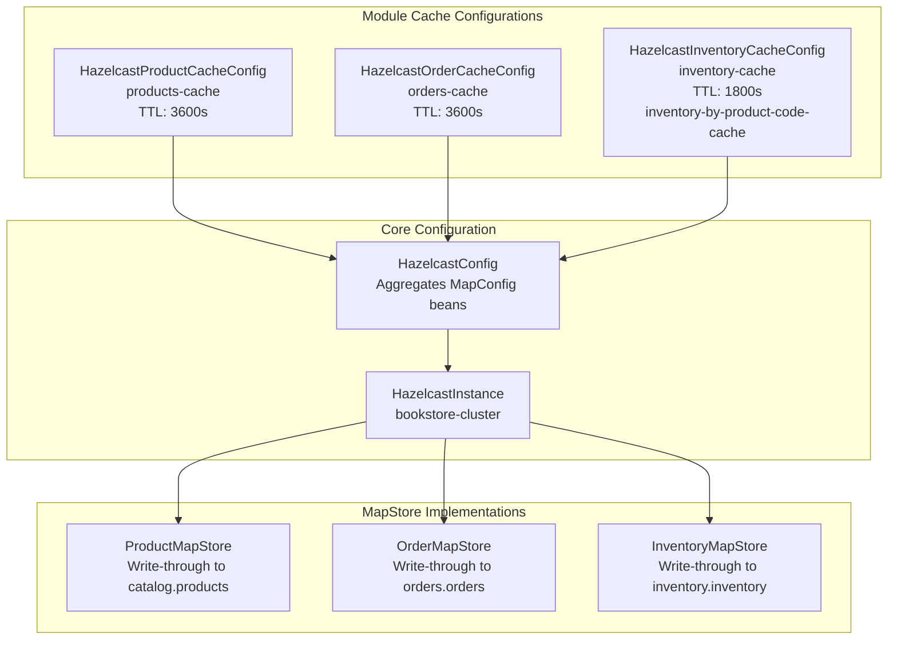
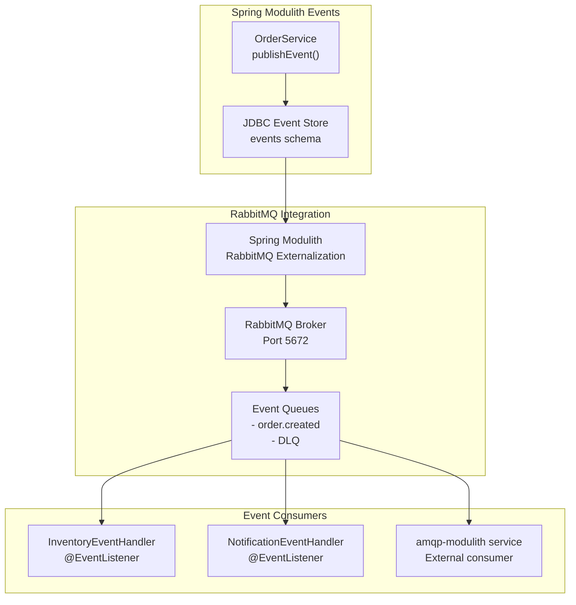
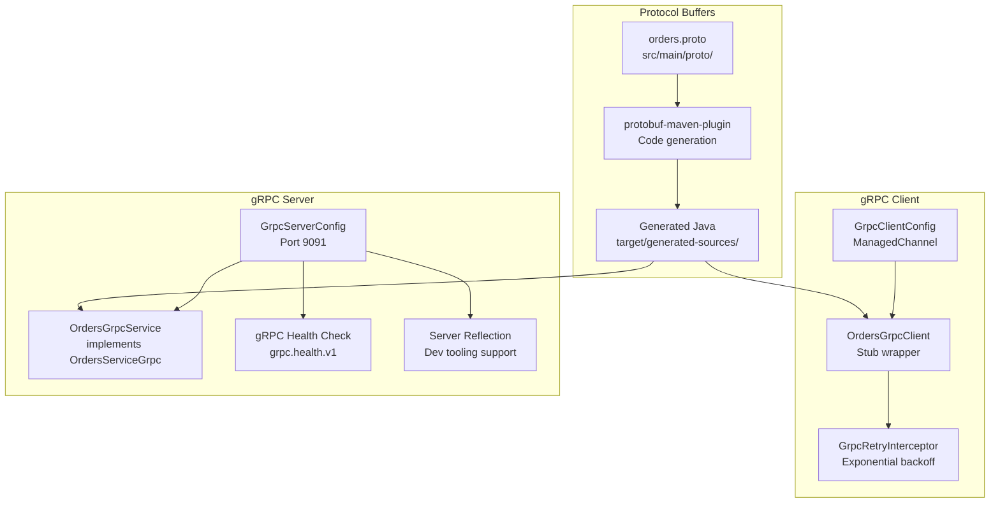
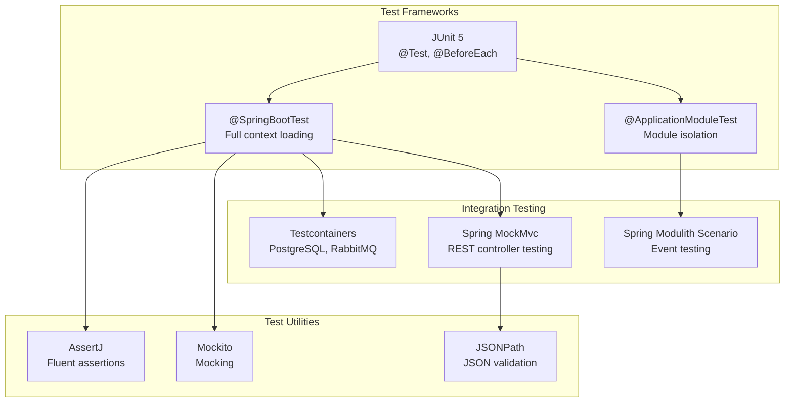

# Technology Stack

> **Relevant source files**
> * [CLAUDE.md](https://github.com/philipz/spring-modular-monolith/blob/30c9bf30/CLAUDE.md)
> * [README-API.md](https://github.com/philipz/spring-modular-monolith/blob/30c9bf30/README-API.md)
> * [README.md](https://github.com/philipz/spring-modular-monolith/blob/30c9bf30/README.md)
> * [docs/API_ANALYSIS_SUMMARY.txt](https://github.com/philipz/spring-modular-monolith/blob/30c9bf30/docs/API_ANALYSIS_SUMMARY.txt)
> * [docs/REST_API_ANALYSIS.md](https://github.com/philipz/spring-modular-monolith/blob/30c9bf30/docs/REST_API_ANALYSIS.md)
> * [docs/bookstore-microservices.png](https://github.com/philipz/spring-modular-monolith/blob/30c9bf30/docs/bookstore-microservices.png)
> * [docs/improvement.md](https://github.com/philipz/spring-modular-monolith/blob/30c9bf30/docs/improvement.md)
> * [docs/orders-data-ownership-analysis.md](https://github.com/philipz/spring-modular-monolith/blob/30c9bf30/docs/orders-data-ownership-analysis.md)
> * [docs/orders-module-boundary-analysis.md](https://github.com/philipz/spring-modular-monolith/blob/30c9bf30/docs/orders-module-boundary-analysis.md)
> * [docs/orders-traffic-migration.md](https://github.com/philipz/spring-modular-monolith/blob/30c9bf30/docs/orders-traffic-migration.md)
> * [k6.js](https://github.com/philipz/spring-modular-monolith/blob/30c9bf30/k6.js)
> * [src/main/java/com/sivalabs/bookstore/config/LiquibaseConfig.java](https://github.com/philipz/spring-modular-monolith/blob/30c9bf30/src/main/java/com/sivalabs/bookstore/config/LiquibaseConfig.java)
> * [src/main/java/com/sivalabs/bookstore/config/OtlpGrpcTracingConfig.java](https://github.com/philipz/spring-modular-monolith/blob/30c9bf30/src/main/java/com/sivalabs/bookstore/config/OtlpGrpcTracingConfig.java)
> * [src/main/java/com/sivalabs/bookstore/config/OtlpProperties.java](https://github.com/philipz/spring-modular-monolith/blob/30c9bf30/src/main/java/com/sivalabs/bookstore/config/OtlpProperties.java)

This page documents the technologies, frameworks, libraries, and tools used throughout the Spring Modular Monolith system. It provides version numbers, configuration details, and references to key configuration classes that wire these technologies together.

For deployment architecture and how these technologies are orchestrated in production, see [Deployment and Infrastructure](/philipz/spring-modular-monolith/10-deployment-and-infrastructure). For observability-specific configuration, see [Observability and Monitoring](/philipz/spring-modular-monolith/9-observability-and-monitoring).

---

## Core Framework and Runtime

### Spring Boot 3.5.5

The application is built on Spring Boot 3.5.5 with Java 21 as the target runtime. The Spring Boot parent POM provides dependency management and auto-configuration for all Spring ecosystem libraries.

**Key Configuration Classes:**

* Application entrypoint: [src/main/java/com/sivalabs/bookstore/BookStoreApplication.java L1-L20](https://github.com/philipz/spring-modular-monolith/blob/30c9bf30/src/main/java/com/sivalabs/bookstore/BookStoreApplication.java#L1-L20)
* Main properties: [src/main/resources/application.properties L1-L100](https://github.com/philipz/spring-modular-monolith/blob/30c9bf30/src/main/resources/application.properties#L1-L100)

**Runtime Requirements:**

* Java 21+ (tested with Eclipse Temurin via SDKMAN)
* Maven 3.9+ (Maven Wrapper included: `./mvnw`)

### Spring Modulith 1.4.3

Spring Modulith enforces modular boundaries within the monolith and provides event publication infrastructure with JDBC-backed guaranteed delivery.

**Module Definition:**

* Modules are defined via package structure under [src/main/java/com/sivalabs/bookstore/](https://github.com/philipz/spring-modular-monolith/blob/30c9bf30/src/main/java/com/sivalabs/bookstore/)
* Module boundaries are verified at build time via `ModularityTests`
* Event publication registry stored in the `events` schema

**Key Features Used:**

* `@ApplicationModuleTest` for isolated module testing
* JDBC-based event publication log with automatic replay
* Module dependency verification
* Actuator endpoint: `http://localhost:8080/actuator/modulith`

**Configuration:**

```
spring.modulith.events.jdbc.schema-initialization.enabled=true
```

Sources: [README.md L183-L190](https://github.com/philipz/spring-modular-monolith/blob/30c9bf30/README.md#L183-L190)

 [CLAUDE.md L155-L180](https://github.com/philipz/spring-modular-monolith/blob/30c9bf30/CLAUDE.md#L155-L180)

---

## Technology Dependency Map

```mermaid
flowchart TD

Java21["Java 21<br>Eclipse Temurin"]
SpringBoot["Spring Boot 3.5.5<br>spring-boot-starter-parent"]
SpringModulith["Spring Modulith 1.4.3<br>org.springframework.modulith:*"]
SpringData["Spring Data JPA<br>spring-boot-starter-data-jpa"]
SpringAMQP["Spring AMQP<br>spring-boot-starter-amqp"]
PostgreSQL["PostgreSQL 16<br>JDBC Driver: postgresql"]
Liquibase["Liquibase 4.x<br>liquibase-core"]
HikariCP["HikariCP<br>Connection Pooling"]
Hazelcast["Hazelcast 5.x<br>hazelcast-spring"]
SpringSession["Spring Session<br>spring-session-hazelcast"]
RabbitMQ["RabbitMQ 3.x<br>AMQP 0-9-1"]
SpringWeb["Spring Web MVC<br>spring-boot-starter-web"]
SpringDoc["SpringDoc OpenAPI 2.x<br>springdoc-openapi-starter-webmvc-ui"]
gRPC["gRPC Java<br>io.grpc:grpc-*"]
Protobuf["Protocol Buffers 3.x<br>protobuf-java"]
Micrometer["Micrometer 1.x<br>micrometer-registry-prometheus"]
OpenTelemetry["OpenTelemetry 1.x<br>opentelemetry-exporter-otlp"]
SpringActuator["Spring Boot Actuator<br>spring-boot-starter-actuator"]
JUnit5["JUnit 5<br>junit-jupiter"]
Testcontainers["Testcontainers<br>testcontainers-postgresql"]
MockMvc["Spring MockMvc<br>spring-boot-starter-test"]

Java21 --> SpringBoot
SpringBoot --> SpringWeb
SpringBoot --> SpringActuator
SpringData --> PostgreSQL
SpringData --> HikariCP
SpringModulith --> Liquibase
SpringBoot --> Hazelcast
SpringBoot --> SpringSession
SpringAMQP --> RabbitMQ
SpringBoot --> gRPC
SpringBoot --> OpenTelemetry
SpringBoot --> JUnit5
SpringBoot --> MockMvc

subgraph Testing ["Testing"]
    JUnit5
    Testcontainers
    MockMvc
    JUnit5 --> Testcontainers
end

subgraph Observability ["Observability"]
    Micrometer
    OpenTelemetry
    SpringActuator
    SpringActuator --> Micrometer
end

subgraph subGraph5 ["API Technologies"]
    SpringWeb
    SpringDoc
    gRPC
    Protobuf
    SpringWeb --> SpringDoc
    gRPC --> Protobuf
end

subgraph Messaging ["Messaging"]
    RabbitMQ
end

subgraph subGraph3 ["Caching & Session"]
    Hazelcast
    SpringSession
    SpringSession --> Hazelcast
end

subgraph Persistence ["Persistence"]
    PostgreSQL
    Liquibase
    HikariCP
end

subgraph subGraph1 ["Core Framework"]
    SpringBoot
    SpringModulith
    SpringData
    SpringAMQP
    SpringBoot --> SpringModulith
    SpringBoot --> SpringData
    SpringBoot --> SpringAMQP
end

subgraph subGraph0 ["JVM Runtime"]
    Java21
end
```



**Dependency Management:**

* Maven POM: [pom.xml L1-L200](https://github.com/philipz/spring-modular-monolith/blob/30c9bf30/pom.xml#L1-L200)
* Parent: `spring-boot-starter-parent:3.5.5`
* Spring Modulith BOM: version `1.4.3`

Sources: [README.md L183-L190](https://github.com/philipz/spring-modular-monolith/blob/30c9bf30/README.md#L183-L190)

 [CLAUDE.md L183-L229](https://github.com/philipz/spring-modular-monolith/blob/30c9bf30/CLAUDE.md#L183-L229)

---

## Persistence Layer Technologies

### PostgreSQL 16

Multi-schema PostgreSQL database provides data isolation per module while maintaining operational simplicity.

**Schema Organization:**

| Schema | Owner Module | Purpose |
| --- | --- | --- |
| `catalog` | catalog | Product catalog tables |
| `orders` | orders | Orders and order items |
| `inventory` | inventory | Stock levels and inventory projections |
| `events` | Spring Modulith | Event publication log |

**Connection Configuration:**

```
spring.datasource.url=jdbc:postgresql://localhost:5432/postgres
spring.datasource.username=postgres
spring.datasource.password=postgres
spring.datasource.driver-class-name=org.postgresql.Driver
```

**Connection Pooling:**

* HikariCP is the default connection pool (auto-configured by Spring Boot)
* Default pool size: 10 connections
* Configuration prefix: `spring.datasource.hikari.*`

### Liquibase

Liquibase manages database schema migrations independently per module.

**Configuration Class:** [src/main/java/com/sivalabs/bookstore/config/LiquibaseConfig.java L1-L77](https://github.com/philipz/spring-modular-monolith/blob/30c9bf30/src/main/java/com/sivalabs/bookstore/config/LiquibaseConfig.java#L1-L77)

**Migration Organization:**

```markdown
src/main/resources/db/
├── db.changelog-master.xml          # Master changelog
└── migration/
    ├── catalog/
    │   ├── V1__catalog_create_products_table.sql
    │   └── V2__catalog_add_sample_data.sql
    ├── orders/
    │   ├── V4__orders_create_orders_table.sql
    │   └── V5__orders_add_orders_data.sql
    └── inventory/
        └── V6__inventory_create_inventory_table.sql
```

**Key Properties:**

```sql
spring.liquibase.enabled=true
spring.liquibase.change-log=classpath:db/db.changelog-master.xml
spring.liquibase.drop-first=false
```

**Execution:**

* Automatic on application startup
* Manual via Maven: `./mvnw liquibase:update`

### Spring Data JPA

JPA/Hibernate abstraction for database access with repository pattern.

**Repository Example:**

```
// Catalog module
com.sivalabs.bookstore.catalog.domain.ProductRepository

// Orders module
com.sivalabs.bookstore.orders.domain.OrderRepository
```

**JPA Configuration:**

```
spring.jpa.hibernate.ddl-auto=none
spring.jpa.show-sql=false
spring.jpa.properties.hibernate.format_sql=false
```

Sources: [src/main/java/com/sivalabs/bookstore/config/LiquibaseConfig.java L1-L77](https://github.com/philipz/spring-modular-monolith/blob/30c9bf30/src/main/java/com/sivalabs/bookstore/config/LiquibaseConfig.java#L1-L77)

 [README.md L136-L140](https://github.com/philipz/spring-modular-monolith/blob/30c9bf30/README.md#L136-L140)

 [CLAUDE.md L195-L201](https://github.com/philipz/spring-modular-monolith/blob/30c9bf30/CLAUDE.md#L195-L201)

---

## Caching Infrastructure

### Hazelcast 5.x

Hazelcast provides distributed in-memory caching with write-through persistence via MapStore pattern. The cache cluster name is `bookstore-cluster`.

**Configuration Class:** [src/main/java/com/sivalabs/bookstore/config/HazelcastConfig.java L1-L100](https://github.com/philipz/spring-modular-monolith/blob/30c9bf30/src/main/java/com/sivalabs/bookstore/config/HazelcastConfig.java#L1-L100)

**Module-Specific Cache Configuration:**

Each module contributes its own `MapConfig` bean for cache isolation:



**Cache Configuration Summary:**

| Cache Name | Key Type | Value Type | TTL | Backup Count | MapStore |
| --- | --- | --- | --- | --- | --- |
| `products-cache` | `String` | `Object` | 3600s | 1 | `ProductMapStore` |
| `orders-cache` | `String` | `Object` | 3600s | 1 | `OrderMapStore` |
| `inventory-cache` | `Long` | `Object` | 1800s | 1 | `InventoryMapStore` |
| `inventory-by-product-code-cache` | `String` | `Object` | 1800s | 1 | None (index only) |

**Cache Properties:**

```
bookstore.cache.enabled=true
bookstore.cache.write-through=true
bookstore.cache.write-delay-seconds=0
bookstore.cache.max-size=1000
bookstore.cache.time-to-live-seconds=3600
bookstore.cache.eviction-policy=LRU
bookstore.cache.backup-count=1
bookstore.cache.circuit-breaker.failure-threshold=5
bookstore.cache.circuit-breaker.recovery-timeout=30000
```

**Management Center:**

* Hazelcast Management Center runs on port `38080` in Docker Compose
* Monitors cache metrics, cluster health, and memory usage

### Spring Session with Hazelcast

Distributed HTTP session storage enabling stateful shopping cart across horizontal instances.

**Session Configuration:**

```
spring.session.store-type=hazelcast
server.servlet.session.cookie.name=BOOKSTORE_SESSION
server.servlet.session.cookie.http-only=true
server.servlet.session.cookie.same-site=strict
server.servlet.session.timeout=30m
```

**Cookie Details:**

* Name: `BOOKSTORE_SESSION`
* Attributes: `HttpOnly`, `SameSite=Strict`
* TTL: 30 minutes
* Storage: Hazelcast distributed map `spring:session:sessions`

Sources: [README.md L26-L28](https://github.com/philipz/spring-modular-monolith/blob/30c9bf30/README.md#L26-L28)

 [CLAUDE.md L189-L213](https://github.com/philipz/spring-modular-monolith/blob/30c9bf30/CLAUDE.md#L189-L213)

---

## Messaging Infrastructure

### RabbitMQ 3.x

RabbitMQ serves as the external event bus for asynchronous cross-module and inter-service communication.

**Spring AMQP Configuration:**

```
spring.rabbitmq.host=localhost
spring.rabbitmq.port=5672
spring.rabbitmq.username=guest
spring.rabbitmq.password=guest
```

**Event Flow:**



**RabbitMQ Management UI:**

* URL: `http://localhost:15672`
* Credentials: `guest/guest`
* Features: Queue inspection, message browsing, connection monitoring

**Event Publication Pattern:**

* Internal: Spring Modulith event bus (synchronous + JDBC persistence)
* External: RabbitMQ republication for downstream consumers
* Guaranteed delivery via JDBC event store with automatic replay

**Dead Letter Queues (DLQ):**

* Failed message routing automatically creates DLQ
* Manual inspection and replay via RabbitMQ management UI

Sources: [README.md L28](https://github.com/philipz/spring-modular-monolith/blob/30c9bf30/README.md#L28-L28)

 [CLAUDE.md L203-L206](https://github.com/philipz/spring-modular-monolith/blob/30c9bf30/CLAUDE.md#L203-L206)

---

## API Technologies

### REST APIs with Spring Web MVC

**Technology Stack:**

* Spring Web MVC (embedded Tomcat on port 8080)
* JSON serialization via Jackson
* Bean Validation (Jakarta Validation API)

**REST Controller Examples:**

```
// Catalog module
com.sivalabs.bookstore.catalog.web.ProductRestController

// Orders module
com.sivalabs.bookstore.orders.web.OrdersRestController
com.sivalabs.bookstore.orders.web.CartRestController
```

**Base URL:** `http://localhost:8080/api/**`

**Server Configuration:**

```
server.port=8080
server.servlet.context-path=/
server.compression.enabled=true
```

### OpenAPI 3.0 and Swagger UI

SpringDoc OpenAPI generates interactive API documentation from controller annotations.

**Configuration Class:** [src/main/java/com/sivalabs/bookstore/config/OpenApiConfig.java L1-L50](https://github.com/philipz/spring-modular-monolith/blob/30c9bf30/src/main/java/com/sivalabs/bookstore/config/OpenApiConfig.java#L1-L50)

**Endpoints:**

* OpenAPI JSON spec: `http://localhost:8080/api-docs`
* Swagger UI: `http://localhost:8080/swagger-ui.html`

**SpringDoc Properties:**

```
springdoc.api-docs.path=/api-docs
springdoc.swagger-ui.path=/swagger-ui.html
springdoc.show-actuator=true
```

### gRPC Services

gRPC provides high-performance RPC for orders microservice extraction.

**gRPC Technology Stack:**



**gRPC Server Configuration:**

```
bookstore.grpc.server.port=9091
bookstore.grpc.server.health-check-enabled=true
bookstore.grpc.server.reflection-enabled=true
bookstore.grpc.server.max-inbound-message-size=4MB
```

**gRPC Client Configuration:**

```
bookstore.grpc.client.target=orders-service:9090
bookstore.grpc.client.deadline-seconds=5
bookstore.grpc.client.max-retry-attempts=3
bookstore.grpc.client.retry-backoff-multiplier=2.0
```

**Protocol Buffer Compilation:**

* Maven plugin: `protobuf-maven-plugin`
* Execution phase: `compile`
* Generated sources: [target/generated-sources/protobuf/java/](https://github.com/philipz/spring-modular-monolith/blob/30c9bf30/target/generated-sources/protobuf/java/)
* gRPC stubs: [target/generated-sources/protobuf/grpc-java/](https://github.com/philipz/spring-modular-monolith/blob/30c9bf30/target/generated-sources/protobuf/grpc-java/)

**gRPC Tools:**

* `grpcurl` for CLI testing: `grpcurl -plaintext localhost:9090 list`
* Server reflection enabled for development
* Health checks via `grpc.health.v1.Health` service

Sources: [CLAUDE.md L223-L229](https://github.com/philipz/spring-modular-monolith/blob/30c9bf30/CLAUDE.md#L223-L229)

 [README.md L37-L42](https://github.com/philipz/spring-modular-monolith/blob/30c9bf30/README.md#L37-L42)

---

## Observability Stack

### OpenTelemetry

OpenTelemetry Java agent provides automatic instrumentation for distributed tracing.

**Instrumentation Configuration Class:** [src/main/java/com/sivalabs/bookstore/config/OtlpGrpcTracingConfig.java L1-L64](https://github.com/philipz/spring-modular-monolith/blob/30c9bf30/src/main/java/com/sivalabs/bookstore/config/OtlpGrpcTracingConfig.java#L1-L64)

**OTLP Properties Class:** [src/main/java/com/sivalabs/bookstore/config/OtlpProperties.java L1-L64](https://github.com/philipz/spring-modular-monolith/blob/30c9bf30/src/main/java/com/sivalabs/bookstore/config/OtlpProperties.java#L1-L64)

**OTLP gRPC Exporter Configuration:**

```
otlp.grpc.enabled=true
otlp.grpc.endpoint=http://localhost:4317
otlp.grpc.timeout=10s
otlp.grpc.compression=gzip
otlp.grpc.headers.authorization=Bearer ${HYPERDX_API_KEY}
```

**Auto-Instrumented Components:**

* Spring Web MVC (HTTP requests/responses)
* JDBC queries and connection pooling
* RabbitMQ message publishing/consumption
* gRPC client and server calls
* Spring Modulith event publication

**Tracing Configuration:**

```
management.tracing.sampling.probability=1.0
management.tracing.baggage.remote-fields=trace-id,span-id
```

### HyperDX

All-in-one observability platform collecting traces, metrics, and logs.

**HyperDX Endpoints:**

* Web UI: `http://localhost:8081`
* OTLP gRPC receiver: `localhost:4317`
* OTLP HTTP receiver: `localhost:4318`

**Integration:**

* All services export telemetry to HyperDX via OTLP gRPC
* Correlation via trace/span IDs in logs
* 100% sampling in development (configurable for production)

### Spring Boot Actuator

Actuator exposes operational endpoints for health checks, metrics, and module information.

**Actuator Configuration:**

```
management.endpoints.web.exposure.include=*
management.endpoint.health.show-details=always
management.health.defaults.enabled=true
```

**Key Endpoints:**

| Endpoint | URL | Purpose |
| --- | --- | --- |
| Health | `/actuator/health` | Health status with components |
| Metrics | `/actuator/metrics` | Micrometer metrics |
| Modulith | `/actuator/modulith` | Spring Modulith module graph |
| Info | `/actuator/info` | Application metadata |

**Health Indicators:**

* Database connectivity
* RabbitMQ connection
* Hazelcast cluster status
* gRPC service availability (orders-service health check on port 9090)

### Micrometer

Micrometer provides metrics collection with Prometheus-compatible registry.

**Metrics Configuration:**

```
management.metrics.export.prometheus.enabled=true
management.metrics.distribution.percentiles-histogram.http.server.requests=true
```

**Custom Metrics:**

* Cache hit/miss ratios per module
* gRPC request latency
* Event publication lag

Sources: [src/main/java/com/sivalabs/bookstore/config/OtlpGrpcTracingConfig.java L1-L64](https://github.com/philipz/spring-modular-monolith/blob/30c9bf30/src/main/java/com/sivalabs/bookstore/config/OtlpGrpcTracingConfig.java#L1-L64)

 [src/main/java/com/sivalabs/bookstore/config/OtlpProperties.java L1-L64](https://github.com/philipz/spring-modular-monolith/blob/30c9bf30/src/main/java/com/sivalabs/bookstore/config/OtlpProperties.java#L1-L64)

 [CLAUDE.md L207-L213](https://github.com/philipz/spring-modular-monolith/blob/30c9bf30/CLAUDE.md#L207-L213)

---

## Frontend Technologies

### Next.js 14

Modern React framework with App Router for the storefront UI.

**Location:** [frontend-next/](https://github.com/philipz/spring-modular-monolith/blob/30c9bf30/frontend-next/)

**Technology Stack:**

* Next.js 14 with App Router
* React 18
* TypeScript 5.x
* TanStack Query (React Query) for data fetching
* pnpm as package manager

**Development Server:**

```markdown
cd frontend-next
pnpm install
pnpm dev  # http://localhost:3000
```

**API Integration:**

* Generated TypeScript SDK: [frontend-sdk/](https://github.com/philipz/spring-modular-monolith/blob/30c9bf30/frontend-sdk/)
* SDK generation: `pnpm gen:types` (uses `openapi-typescript`)
* HTTP client includes `credentials: 'include'` for session cookies

**Build and Deployment:**

```markdown
pnpm build    # Production build
pnpm start    # Production server
```

### Nginx Reverse Proxy

Nginx acts as the unified entry point, routing UI and API traffic.

**Configuration:** [webproxy/nginx.conf L1-L100](https://github.com/philipz/spring-modular-monolith/blob/30c9bf30/webproxy/nginx.conf#L1-L100)

**Routing Rules:**

* `/` → Next.js frontend (port 3000)
* `/api/**` → Spring Boot monolith (port 8080)

**Features:**

* OpenTelemetry instrumentation via `ngx_otel_module.so`
* Progressive traffic migration support for orders-service
* Request header forwarding (`X-Real-IP`, `X-Forwarded-For`, `X-Forwarded-Proto`)

**Traffic Migration Headers:**

* `X-Orders-Backend: orders` forces routing to orders-service
* Cookie: `orders_backend=orders` persists routing preference
* Environment variable: `ORDERS_SERVICE_PERCENT=0-100` controls gradual rollout

Sources: [README.md L18-L23](https://github.com/philipz/spring-modular-monolith/blob/30c9bf30/README.md#L18-L23)

 [docs/orders-traffic-migration.md L1-L69](https://github.com/philipz/spring-modular-monolith/blob/30c9bf30/docs/orders-traffic-migration.md#L1-L69)

---

## Build and Development Tools

### Maven

Maven handles dependency management, compilation, testing, and packaging.

**Build Commands:**

```sql
./mvnw clean verify                 # Full build with tests
./mvnw spring-boot:run              # Run application locally
./mvnw spotless:apply               # Format code
./mvnw liquibase:update             # Apply migrations
```

**Maven Plugins:**

| Plugin | Purpose |
| --- | --- |
| `spring-boot-maven-plugin` | Package executable JAR |
| `protobuf-maven-plugin` | Compile `.proto` files |
| `spotless-maven-plugin` | Code formatting |
| `maven-surefire-plugin` | Unit test execution |
| `maven-failsafe-plugin` | Integration test execution |

**Spotless Configuration:**

* Code formatter: Palantir Java Format
* Check on build: `./mvnw verify`
* Auto-fix: `./mvnw spotless:apply`

### Go Task Runner

Task automation via `Taskfile.yml` for common workflows.

**Installation:**

```go
brew install go-task
# or
go install github.com/go-task/task/v3/cmd/task@latest
```

**Common Tasks:**

```markdown
task start                          # Docker Compose up
task stop                           # Docker Compose down
task restart                        # Rebuild and restart
task test                           # Run tests
task format                         # Format code
task build                          # Build Docker images
```

### Testing Technologies

**Test Framework Stack:**



**Test Categories:**

* Unit tests: `src/test/java/**/*Tests.java`
* Integration tests: `@ApplicationModuleTest` for module isolation
* REST API tests: `MockMvc` with `@WebMvcTest` or `@SpringBootTest`
* Cache tests: Testcontainers PostgreSQL + Hazelcast embedded mode

**Test Execution:**

```markdown
./mvnw test                         # Unit tests only
./mvnw verify                       # All tests including integration
./mvnw test -Dtest=OrdersIntegrationTests  # Specific test class
```

**Test Reporting:**

* JUnit 5 console tree reporter for readable output
* Surefire reports: `target/surefire-reports/`
* Test coverage potential via JaCoCo (not currently enabled)

Sources: [CLAUDE.md L288-L300](https://github.com/philipz/spring-modular-monolith/blob/30c9bf30/CLAUDE.md#L288-L300)

 [README.md L112-L118](https://github.com/philipz/spring-modular-monolith/blob/30c9bf30/README.md#L112-L118)

---

## Containerization and Orchestration

### Docker and Docker Compose

Docker Compose orchestrates the complete application stack for local development.

**Compose File:** [compose.yml L1-L300](https://github.com/philipz/spring-modular-monolith/blob/30c9bf30/compose.yml#L1-L300)

**Services Defined:**

| Service | Image | Ports | Purpose |
| --- | --- | --- | --- |
| `monolith` | Custom build | 8080, 9091 | Spring Boot application |
| `orders-service` | Custom build | 9090 | Extracted orders microservice |
| `frontend-next` | Custom build | 3000 | Next.js storefront |
| `webproxy` | nginx + OpenTelemetry | 80 | Reverse proxy |
| `postgres` | postgres:16 | 5432 | PostgreSQL database |
| `rabbitmq` | rabbitmq:3-management | 5672, 15672 | Message broker |
| `hazelcast-mgmt` | hazelcast/management-center | 38080 | Cache management UI |
| `hyperdx` | hyperdx/hyperdx-api | 8081, 4317, 4318 | Observability platform |
| `amqp-modulith` | Custom build | 8082 | Event processor |

**Environment Variables:**

```
SPRING_PROFILES_ACTIVE=docker
HYPERDX_API_KEY=your-api-key
ORDERS_SERVICE_PERCENT=0
```

**Networking:**

* Default bridge network: `bookstore-network`
* Service discovery via Docker DNS
* Health checks enabled for all services

**Volume Mounts:**

* PostgreSQL data: `postgres-data`
* RabbitMQ data: `rabbitmq-data`
* HyperDX data: `hyperdx-data`

### Kubernetes Support

Kubernetes manifests for cluster deployment.

**Manifests Location:** [k8s/manifests/](https://github.com/philipz/spring-modular-monolith/blob/30c9bf30/k8s/manifests/)

**Deployment Strategy:**

* Kind (Kubernetes in Docker) for local testing
* Namespace: `bookstore`
* Service types: ClusterIP for internal, NodePort for external access

**Kind Cluster Commands:**

```sql
task kind_create                    # Create Kind cluster
task k8s_deploy                     # Apply manifests
task k8s_undeploy                   # Delete resources
task kind_destroy                   # Delete cluster
```

**Kubernetes Resources:**

* Deployments for all application services
* Services for network exposure
* ConfigMaps for configuration
* Secrets for credentials (not committed)
* PersistentVolumeClaims for stateful services

Sources: [compose.yml L1-L300](https://github.com/philipz/spring-modular-monolith/blob/30c9bf30/compose.yml#L1-L300)

 [CLAUDE.md L358-L365](https://github.com/philipz/spring-modular-monolith/blob/30c9bf30/CLAUDE.md#L358-L365)

---

## Code Quality and Formatting

### Spotless with Palantir Java Format

Enforces consistent code style across the codebase.

**Configuration:**

```html
<plugin>
    <groupId>com.diffplug.spotless</groupId>
    <artifactId>spotless-maven-plugin</artifactId>
    <configuration>
        <java>
            <palantirJavaFormat/>
        </java>
    </configuration>
</plugin>
```

**Usage:**

```markdown
./mvnw spotless:check               # Verify formatting
./mvnw spotless:apply               # Auto-format
task format                         # Task alias
```

**Formatting Rules:**

* 4-space indentation
* Max line length: 120 characters
* One class per file
* Automatic import organization
* No wildcard imports

### GitHub Actions CI

Automated build and test pipeline.

**Workflow File:** [.github/workflows/build.yml L1-L50](https://github.com/philipz/spring-modular-monolith/blob/30c9bf30/.github/workflows/build.yml#L1-L50)

**Pipeline Stages:**

1. Checkout code
2. Setup Java 21
3. Maven build with tests
4. Spotless format check
5. Spring Modulith verification
6. Docker image build (on main branch)

**Triggers:**

* Push to `main` branch
* Pull request creation
* Manual workflow dispatch

Sources: [CLAUDE.md L219-L223](https://github.com/philipz/spring-modular-monolith/blob/30c9bf30/CLAUDE.md#L219-L223)

 [README.md L112-L118](https://github.com/philipz/spring-modular-monolith/blob/30c9bf30/README.md#L112-L118)

---

## Version Summary Table

| Technology | Version | Purpose |
| --- | --- | --- |
| Java | 21+ | Runtime platform |
| Spring Boot | 3.5.5 | Core framework |
| Spring Modulith | 1.4.3 | Modular monolith architecture |
| PostgreSQL | 16 | Relational database |
| Liquibase | 4.x | Schema migrations |
| Hazelcast | 5.x | Distributed caching |
| Spring Session | (via Spring Boot) | Session management |
| RabbitMQ | 3.x | Message broker |
| gRPC Java | 1.x | RPC framework |
| Protocol Buffers | 3.x | Serialization |
| SpringDoc OpenAPI | 2.x | API documentation |
| OpenTelemetry | 1.x | Distributed tracing |
| Micrometer | 1.x | Metrics collection |
| Next.js | 14 | Frontend framework |
| React | 18 | UI library |
| TypeScript | 5.x | Type-safe JavaScript |
| Node.js | 18.17+ | JavaScript runtime |
| pnpm | Latest | Package manager |
| Maven | 3.9+ | Build tool |
| Docker | Latest | Containerization |
| Docker Compose | v2+ | Multi-container orchestration |
| JUnit | 5 | Test framework |
| Testcontainers | Latest | Integration testing |

Sources: [README.md L43-L60](https://github.com/philipz/spring-modular-monolith/blob/30c9bf30/README.md#L43-L60)

 [CLAUDE.md L183-L229](https://github.com/philipz/spring-modular-monolith/blob/30c9bf30/CLAUDE.md#L183-L229)

 [pom.xml L1-L200](https://github.com/philipz/spring-modular-monolith/blob/30c9bf30/pom.xml#L1-L200)