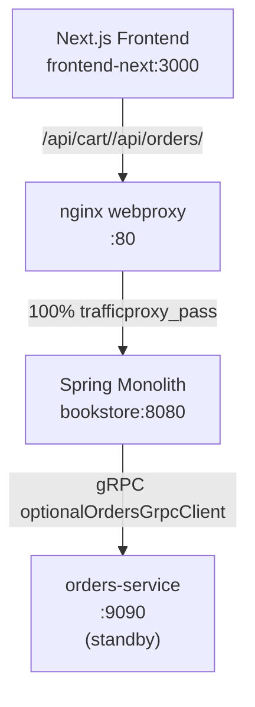
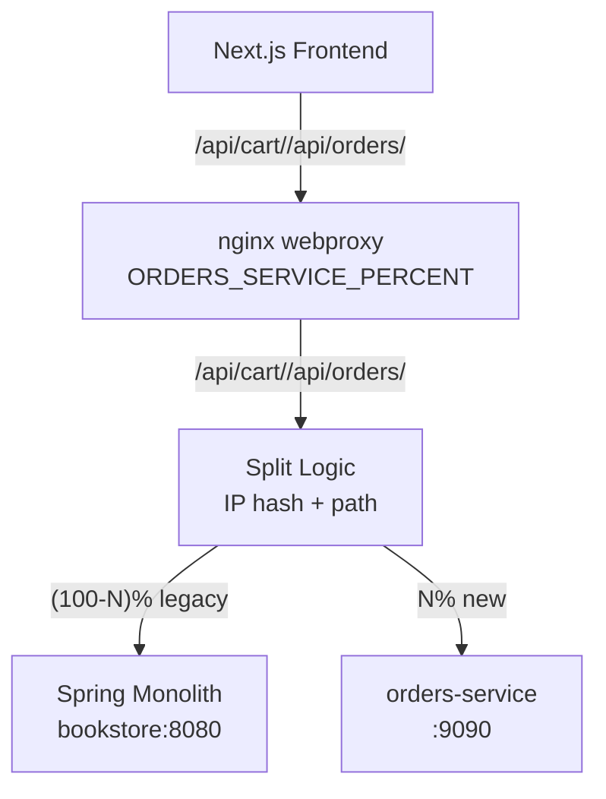
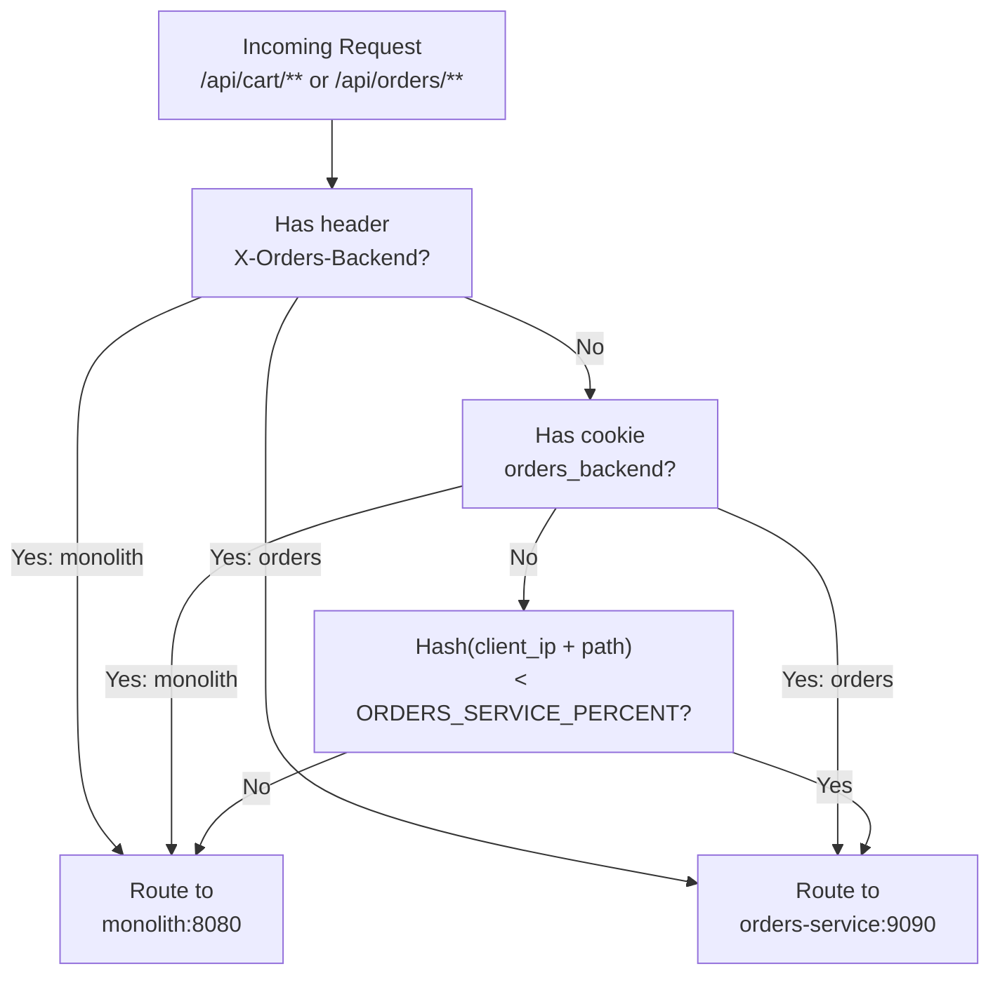
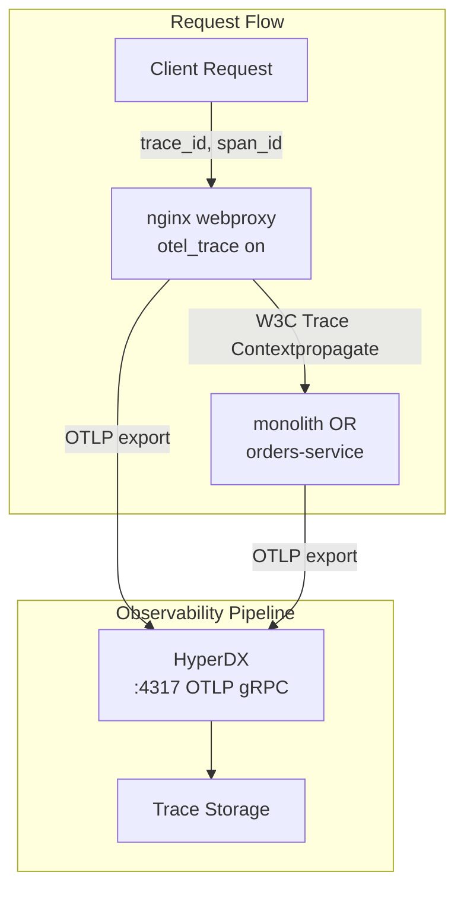

# Traffic Migration Strategy

> **Relevant source files**
> * [.env.example](https://github.com/philipz/spring-modular-monolith/blob/30c9bf30/.env.example)
> * [README-API.md](https://github.com/philipz/spring-modular-monolith/blob/30c9bf30/README-API.md)
> * [README.md](https://github.com/philipz/spring-modular-monolith/blob/30c9bf30/README.md)
> * [docs/API_ANALYSIS_SUMMARY.txt](https://github.com/philipz/spring-modular-monolith/blob/30c9bf30/docs/API_ANALYSIS_SUMMARY.txt)
> * [docs/REST_API_ANALYSIS.md](https://github.com/philipz/spring-modular-monolith/blob/30c9bf30/docs/REST_API_ANALYSIS.md)
> * [docs/bookstore-microservices.png](https://github.com/philipz/spring-modular-monolith/blob/30c9bf30/docs/bookstore-microservices.png)
> * [docs/improvement.md](https://github.com/philipz/spring-modular-monolith/blob/30c9bf30/docs/improvement.md)
> * [docs/orders-data-ownership-analysis.md](https://github.com/philipz/spring-modular-monolith/blob/30c9bf30/docs/orders-data-ownership-analysis.md)
> * [docs/orders-module-boundary-analysis.md](https://github.com/philipz/spring-modular-monolith/blob/30c9bf30/docs/orders-module-boundary-analysis.md)
> * [docs/orders-traffic-migration.md](https://github.com/philipz/spring-modular-monolith/blob/30c9bf30/docs/orders-traffic-migration.md)
> * [k6.js](https://github.com/philipz/spring-modular-monolith/blob/30c9bf30/k6.js)
> * [webproxy/Dockerfile](https://github.com/philipz/spring-modular-monolith/blob/30c9bf30/webproxy/Dockerfile)
> * [webproxy/entrypoint.sh](https://github.com/philipz/spring-modular-monolith/blob/30c9bf30/webproxy/entrypoint.sh)
> * [webproxy/nginx.conf](https://github.com/philipz/spring-modular-monolith/blob/30c9bf30/webproxy/nginx.conf)

## Purpose and Scope

This page documents the progressive traffic migration approach for gradually shifting orders-related API traffic from the Spring Boot monolith to the extracted `orders-service` microservice. The strategy implements a strangler pattern using nginx-based routing controls, enabling safe incremental rollout with observability and rollback capabilities.

For nginx proxy configuration details, see [Nginx Reverse Proxy](/philipz/spring-modular-monolith/10.3-nginx-reverse-proxy). For deployment architecture, see [Docker Compose Deployment](/philipz/spring-modular-monolith/10.1-docker-compose-deployment) and [Kubernetes Deployment with Kind](/philipz/spring-modular-monolith/10.2-kubernetes-deployment-with-kind). For the extracted microservice architecture, see [Orders Microservice Extraction](/philipz/spring-modular-monolith/13-orders-microservice-extraction).

**Sources:** [docs/orders-traffic-migration.md L1-L68](https://github.com/philipz/spring-modular-monolith/blob/30c9bf30/docs/orders-traffic-migration.md#L1-L68)

---

## Current vs Target Architecture

### Current State: All Traffic to Monolith



In the current configuration, `webproxy/nginx.conf` routes all `/api/**` requests to `monolith:8080`. The `orders-service` exists but receives no direct HTTP/REST traffic; the monolith's `OrdersGrpcClient` may delegate gRPC calls when configured via `bookstore.grpc.client.target=orders-service:9090`.

**Sources:** [webproxy/nginx.conf L40-L67](https://github.com/philipz/spring-modular-monolith/blob/30c9bf30/webproxy/nginx.conf#L40-L67)

 [docs/orders-traffic-migration.md L1-L6](https://github.com/philipz/spring-modular-monolith/blob/30c9bf30/docs/orders-traffic-migration.md#L1-L6)

### Target State: Percentage-Based Traffic Split



The target configuration introduces percentage-based routing at the nginx layer, distributing `/api/cart/**` and `/api/orders/**` traffic between monolith and orders-service based on the `ORDERS_SERVICE_PERCENT` environment variable (0-100).

**Sources:** [docs/orders-traffic-migration.md L6-L19](https://github.com/philipz/spring-modular-monolith/blob/30c9bf30/docs/orders-traffic-migration.md#L6-L19)

---

## Traffic Routing Mechanism

### Decision Logic with Overrides



**Priority Order:**

1. **Header override:** `X-Orders-Backend: monolith|orders` forces routing regardless of percentage
2. **Cookie override:** `orders_backend=monolith|orders` maintains consistent routing across session
3. **Percentage-based:** Hash of `client_ip + request_path` determines routing when `ORDERS_SERVICE_PERCENT` ∈ [1,99]

**Sources:** [docs/orders-traffic-migration.md L27-L32](https://github.com/philipz/spring-modular-monolith/blob/30c9bf30/docs/orders-traffic-migration.md#L27-L32)

 [docs/orders-traffic-migration.md L6-L19](https://github.com/philipz/spring-modular-monolith/blob/30c9bf30/docs/orders-traffic-migration.md#L6-L19)

### Nginx Configuration Template

The current `webproxy/nginx.conf` hardcodes the monolith target. To enable traffic splitting, the configuration must be templated using `envsubst` in the entrypoint:

| Configuration Element | Current Value | Templated Value |
| --- | --- | --- |
| Proxy target | `set $target http://monolith:8080;` | `set $target $upstream_backend;` |
| Backend selection | N/A | `map $orders_backend_header` block |
| Percentage logic | N/A | `split_clients` directive |
| Routing annotation | N/A | `set $backend_used` for logging |

**Sources:** [webproxy/nginx.conf L40-L67](https://github.com/philipz/spring-modular-monolith/blob/30c9bf30/webproxy/nginx.conf#L40-L67)

 [webproxy/entrypoint.sh L1-L20](https://github.com/philipz/spring-modular-monolith/blob/30c9bf30/webproxy/entrypoint.sh#L1-L20)

 [docs/orders-traffic-migration.md L6-L19](https://github.com/philipz/spring-modular-monolith/blob/30c9bf30/docs/orders-traffic-migration.md#L6-L19)

---

## Configuration Parameters

### Environment Variables

| Variable | Default | Range | Purpose |
| --- | --- | --- | --- |
| `ORDERS_SERVICE_PERCENT` | `0` | `0-100` | Percentage of traffic routed to orders-service |
| `HYPERDX_API_KEY` | (required) | string | OpenTelemetry authentication for nginx traces |

**Example Docker Compose Override:**

```
ORDERS_SERVICE_PERCENT=25 docker compose up webproxy
```

**Sources:** [docs/orders-traffic-migration.md L20-L25](https://github.com/philipz/spring-modular-monolith/blob/30c9bf30/docs/orders-traffic-migration.md#L20-L25)

 [webproxy/entrypoint.sh L4-L8](https://github.com/philipz/spring-modular-monolith/blob/30c9bf30/webproxy/entrypoint.sh#L4-L8)

### QA Override Mechanisms

**HTTP Header (per-request):**

```
X-Orders-Backend: monolith
X-Orders-Backend: orders
```

**Cookie (session-persistent):**

```
orders_backend=monolith
orders_backend=orders
```

These overrides bypass percentage logic and enable smoke testing specific backends before general rollout. The nginx configuration should set the `X-Orders-Backend` response header to indicate which backend served the request.

**Sources:** [docs/orders-traffic-migration.md L27-L32](https://github.com/philipz/spring-modular-monolith/blob/30c9bf30/docs/orders-traffic-migration.md#L27-L32)

### Affected API Routes

| Route Pattern | Operations | Current Backend | Migration Target |
| --- | --- | --- | --- |
| `/api/cart` | GET (retrieve cart) | `CartRestController` (monolith) | orders-service REST |
| `/api/cart/items` | POST (add item) | `CartRestController` (monolith) | orders-service REST |
| `/api/cart/items/{code}` | PUT (update quantity) | `CartRestController` (monolith) | orders-service REST |
| `/api/cart` | DELETE (clear cart) | `CartRestController` (monolith) | orders-service REST |
| `/api/orders` | POST (create order) | `OrdersRestController` (monolith) | orders-service REST |
| `/api/orders` | GET (list orders) | `OrdersRestController` (monolith) | orders-service REST |
| `/api/orders/{orderNumber}` | GET (order details) | `OrdersRestController` (monolith) | orders-service REST |

**Sources:** [docs/orders-traffic-migration.md L9-L12](https://github.com/philipz/spring-modular-monolith/blob/30c9bf30/docs/orders-traffic-migration.md#L9-L12)

 [README-API.md L53-L100](https://github.com/philipz/spring-modular-monolith/blob/30c9bf30/README-API.md#L53-L100)

---

## Rollout Process

### Step-by-Step Migration Plan

```css
#mermaid-ijz7gbv58w{font-family:ui-sans-serif,-apple-system,system-ui,Segoe UI,Helvetica;font-size:16px;fill:#333;}@keyframes edge-animation-frame{from{stroke-dashoffset:0;}}@keyframes dash{to{stroke-dashoffset:0;}}#mermaid-ijz7gbv58w .edge-animation-slow{stroke-dasharray:9,5!important;stroke-dashoffset:900;animation:dash 50s linear infinite;stroke-linecap:round;}#mermaid-ijz7gbv58w .edge-animation-fast{stroke-dasharray:9,5!important;stroke-dashoffset:900;animation:dash 20s linear infinite;stroke-linecap:round;}#mermaid-ijz7gbv58w .error-icon{fill:#dddddd;}#mermaid-ijz7gbv58w .error-text{fill:#222222;stroke:#222222;}#mermaid-ijz7gbv58w .edge-thickness-normal{stroke-width:1px;}#mermaid-ijz7gbv58w .edge-thickness-thick{stroke-width:3.5px;}#mermaid-ijz7gbv58w .edge-pattern-solid{stroke-dasharray:0;}#mermaid-ijz7gbv58w .edge-thickness-invisible{stroke-width:0;fill:none;}#mermaid-ijz7gbv58w .edge-pattern-dashed{stroke-dasharray:3;}#mermaid-ijz7gbv58w .edge-pattern-dotted{stroke-dasharray:2;}#mermaid-ijz7gbv58w .marker{fill:#999;stroke:#999;}#mermaid-ijz7gbv58w .marker.cross{stroke:#999;}#mermaid-ijz7gbv58w svg{font-family:ui-sans-serif,-apple-system,system-ui,Segoe UI,Helvetica;font-size:16px;}#mermaid-ijz7gbv58w p{margin:0;}#mermaid-ijz7gbv58w .mermaid-main-font{font-family:ui-sans-serif,-apple-system,system-ui,Segoe UI,Helvetica;}#mermaid-ijz7gbv58w .exclude-range{fill:#eeeeee;}#mermaid-ijz7gbv58w .section{stroke:none;opacity:0.2;}#mermaid-ijz7gbv58w .section0{fill:#dddddd;}#mermaid-ijz7gbv58w .section2{fill:#eaeaea;}#mermaid-ijz7gbv58w .section1,#mermaid-ijz7gbv58w .section3{fill:white;opacity:0.2;}#mermaid-ijz7gbv58w .sectionTitle0{fill:#444;}#mermaid-ijz7gbv58w .sectionTitle1{fill:#444;}#mermaid-ijz7gbv58w .sectionTitle2{fill:#444;}#mermaid-ijz7gbv58w .sectionTitle3{fill:#444;}#mermaid-ijz7gbv58w .sectionTitle{text-anchor:start;font-family:ui-sans-serif,-apple-system,system-ui,Segoe UI,Helvetica;}#mermaid-ijz7gbv58w .grid .tick{stroke:lightgrey;opacity:0.8;shape-rendering:crispEdges;}#mermaid-ijz7gbv58w .grid .tick text{font-family:ui-sans-serif,-apple-system,system-ui,Segoe UI,Helvetica;fill:#333;}#mermaid-ijz7gbv58w .grid path{stroke-width:0;}#mermaid-ijz7gbv58w .today{fill:none;stroke:red;stroke-width:2px;}#mermaid-ijz7gbv58w .task{stroke-width:2;}#mermaid-ijz7gbv58w .taskText{text-anchor:middle;font-family:ui-sans-serif,-apple-system,system-ui,Segoe UI,Helvetica;}#mermaid-ijz7gbv58w .taskTextOutsideRight{fill:#333;text-anchor:start;font-family:ui-sans-serif,-apple-system,system-ui,Segoe UI,Helvetica;}#mermaid-ijz7gbv58w .taskTextOutsideLeft{fill:#333;text-anchor:end;}#mermaid-ijz7gbv58w .task.clickable{cursor:pointer;}#mermaid-ijz7gbv58w .taskText.clickable{cursor:pointer;fill:#003163!important;font-weight:bold;}#mermaid-ijz7gbv58w .taskTextOutsideLeft.clickable{cursor:pointer;fill:#003163!important;font-weight:bold;}#mermaid-ijz7gbv58w .taskTextOutsideRight.clickable{cursor:pointer;fill:#003163!important;font-weight:bold;}#mermaid-ijz7gbv58w .taskText0,#mermaid-ijz7gbv58w .taskText1,#mermaid-ijz7gbv58w .taskText2,#mermaid-ijz7gbv58w .taskText3{fill:#333;}#mermaid-ijz7gbv58w .task0,#mermaid-ijz7gbv58w .task1,#mermaid-ijz7gbv58w .task2,#mermaid-ijz7gbv58w .task3{fill:#eaeaea;stroke:#ccc;}#mermaid-ijz7gbv58w .taskTextOutside0,#mermaid-ijz7gbv58w .taskTextOutside2{fill:#333;}#mermaid-ijz7gbv58w .taskTextOutside1,#mermaid-ijz7gbv58w .taskTextOutside3{fill:#333;}#mermaid-ijz7gbv58w .active0,#mermaid-ijz7gbv58w .active1,#mermaid-ijz7gbv58w .active2,#mermaid-ijz7gbv58w .active3{fill:hsl(0, 0%, 100%);stroke:#eaeaea;}#mermaid-ijz7gbv58w .activeText0,#mermaid-ijz7gbv58w .activeText1,#mermaid-ijz7gbv58w .activeText2,#mermaid-ijz7gbv58w .activeText3{fill:#333!important;}#mermaid-ijz7gbv58w .done0,#mermaid-ijz7gbv58w .done1,#mermaid-ijz7gbv58w .done2,#mermaid-ijz7gbv58w .done3{stroke:grey;fill:lightgrey;stroke-width:2;}#mermaid-ijz7gbv58w .doneText0,#mermaid-ijz7gbv58w .doneText1,#mermaid-ijz7gbv58w .doneText2,#mermaid-ijz7gbv58w .doneText3{fill:#333!important;}#mermaid-ijz7gbv58w .crit0,#mermaid-ijz7gbv58w .crit1,#mermaid-ijz7gbv58w .crit2,#mermaid-ijz7gbv58w .crit3{stroke:#ff8888;fill:red;stroke-width:2;}#mermaid-ijz7gbv58w .activeCrit0,#mermaid-ijz7gbv58w .activeCrit1,#mermaid-ijz7gbv58w .activeCrit2,#mermaid-ijz7gbv58w .activeCrit3{stroke:#ff8888;fill:hsl(0, 0%, 100%);stroke-width:2;}#mermaid-ijz7gbv58w .doneCrit0,#mermaid-ijz7gbv58w .doneCrit1,#mermaid-ijz7gbv58w .doneCrit2,#mermaid-ijz7gbv58w .doneCrit3{stroke:#ff8888;fill:lightgrey;stroke-width:2;cursor:pointer;shape-rendering:crispEdges;}#mermaid-ijz7gbv58w .milestone{transform:rotate(45deg) scale(0.8,0.8);}#mermaid-ijz7gbv58w .milestoneText{font-style:italic;}#mermaid-ijz7gbv58w .doneCritText0,#mermaid-ijz7gbv58w .doneCritText1,#mermaid-ijz7gbv58w .doneCritText2,#mermaid-ijz7gbv58w .doneCritText3{fill:#333!important;}#mermaid-ijz7gbv58w .activeCritText0,#mermaid-ijz7gbv58w .activeCritText1,#mermaid-ijz7gbv58w .activeCritText2,#mermaid-ijz7gbv58w .activeCritText3{fill:#333!important;}#mermaid-ijz7gbv58w .titleText{text-anchor:middle;font-size:18px;fill:#444;font-family:ui-sans-serif,-apple-system,system-ui,Segoe UI,Helvetica;}#mermaid-ijz7gbv58w :root{--mermaid-font-family:"trebuchet ms",verdana,arial,sans-serif;}0%0%1%1%2%2%3%3%4%4%5%5%6%Validation (0%) Canary (5-10%) Progressive (25%) Progressive (50%) Progressive (75%) Complete (100%) Phase 1Phase 2Phase 3Phase 4Traffic Migration Timeline
```

**Phase 1: Validation (0%)**

* **Action:** Deploy templated nginx.conf with `ORDERS_SERVICE_PERCENT=0`
* **Validation:** * Verify monolith `/actuator/health` returns 200 * Confirm orders-service gRPC health check passes * Check HyperDX for baseline traces * Validate `BOOKSTORE_SESSION` cookie issuance
* **Duration:** 1-2 hours

**Phase 2: Canary (5-10%)**

* **Action:** Set `ORDERS_SERVICE_PERCENT=5` or `ORDERS_SERVICE_PERCENT=10`
* **Validation:** * Monitor nginx access logs for `backend=orders-service` entries * Compare error rates between backends * Check RabbitMQ for `OrderCreatedEvent` from both sources * Run `k6 run k6.js` load test
* **Acceptance Criteria:** * HTTP 5xx rate < 0.1% * P95 latency increase < 20% * Zero session loss errors
* **Duration:** 6-24 hours

**Phase 3: Progressive (25% → 50% → 75%)**

* **Action:** Increase percentage incrementally
* **Validation at Each Step:** * Repeat Phase 2 validations * Check `orders-postgres` database connections * Verify Hazelcast cache coherence across backends * Test forced routing with `X-Orders-Backend` header
* **Rollback Trigger:** HTTP 5xx > 1% or P95 latency > 2x baseline
* **Duration:** 2-7 days per increment

**Phase 4: Complete (100%)**

* **Action:** Set `ORDERS_SERVICE_PERCENT=100`
* **Post-Migration:** * Monitor for 48 hours * Decommission monolith orders endpoints (optional) * Update OpenAPI documentation
* **Duration:** 2-3 days observation

**Sources:** [docs/orders-traffic-migration.md L55-L61](https://github.com/philipz/spring-modular-monolith/blob/30c9bf30/docs/orders-traffic-migration.md#L55-L61)

---

## Observability and Monitoring

### Nginx Access Logs

The templated nginx configuration should use a custom log format annotating backend routing decisions:

```
log_format orders_routing '$remote_addr - $remote_user [$time_local] "$request" '
                         '$status $body_bytes_sent "$http_referer" '
                         'backend=$backend_used';
```

**Tailing Logs:**

```
docker compose logs -f webproxy | grep backend=
```

**Expected Output:**

```
10.0.1.42 - [20/Oct/2025:14:23:01] "POST /api/orders HTTP/1.1" 201 87 backend=monolith
10.0.1.43 - [20/Oct/2025:14:23:02] "GET /api/cart HTTP/1.1" 200 156 backend=orders-service
```

**Sources:** [webproxy/nginx.conf L20-L21](https://github.com/philipz/spring-modular-monolith/blob/30c9bf30/webproxy/nginx.conf#L20-L21)

 [docs/orders-traffic-migration.md L34-L39](https://github.com/philipz/spring-modular-monolith/blob/30c9bf30/docs/orders-traffic-migration.md#L34-L39)

### Distributed Tracing with HyperDX



**Key Metrics to Monitor:**

| Metric | Monolith Source | orders-service Source |
| --- | --- | --- |
| Request rate | nginx logs + HyperDX spans | nginx logs + HyperDX spans |
| Error rate (5xx) | Spring Actuator `/metrics` | orders-service `/actuator/metrics` |
| Latency (P50, P95, P99) | HyperDX span duration | HyperDX span duration |
| Session misses | Application logs | Application logs |

**HyperDX Query Examples:**

* Compare latencies: `service.name IN ["nginx-webproxy"] AND http.target="/api/orders"`
* Error correlation: `status.code=ERROR AND http.route="/api/cart/items"`

**Sources:** [webproxy/nginx.conf L23-L29](https://github.com/philipz/spring-modular-monolith/blob/30c9bf30/webproxy/nginx.conf#L23-L29)

 [docs/orders-traffic-migration.md L34-L45](https://github.com/philipz/spring-modular-monolith/blob/30c9bf30/docs/orders-traffic-migration.md#L34-L45)

 [compose.yml (from context)](https://github.com/philipz/spring-modular-monolith/blob/30c9bf30/compose.yml (from context))

### Load Testing Validation

The repository includes `k6.js` for end-to-end load testing:

```
k6 run k6.js --env BASE_URL=http://localhost --duration 5m --vus 20
```

**Test Coverage:**

* Adds random product to cart via `POST /api/cart/items`
* Creates order via `POST /api/orders` with session cookie
* Validates `BOOKSTORE_SESSION` cookie forwarding
* Checks HTTP 201 responses and order number generation

**Sources:** [k6.js L1-L93](https://github.com/philipz/spring-modular-monolith/blob/30c9bf30/k6.js#L1-L93)

 [docs/orders-traffic-migration.md L44-L45](https://github.com/philipz/spring-modular-monolith/blob/30c9bf30/docs/orders-traffic-migration.md#L44-L45)

---

## Rollback Procedures

### Immediate Rollback (Emergency)

**Trigger Conditions:**

* HTTP 5xx error rate > 5%
* P95 latency > 3x baseline
* Session loss affecting > 10% of requests
* Database connection pool exhaustion
* RabbitMQ event publication failures

**Action:**

```markdown
# Set percentage to 0 (all traffic to monolith)
docker compose stop webproxy
ORDERS_SERVICE_PERCENT=0 docker compose up -d webproxy

# Or in Kubernetes:
kubectl set env deployment/webproxy ORDERS_SERVICE_PERCENT=0
kubectl rollout status deployment/webproxy
```

**Validation:**

* Confirm nginx logs show `backend=monolith` exclusively
* Check error rate returns to baseline within 2 minutes
* Verify no orders are lost (check `events` schema publication log)

**Sources:** [docs/orders-traffic-migration.md L56-L61](https://github.com/philipz/spring-modular-monolith/blob/30c9bf30/docs/orders-traffic-migration.md#L56-L61)

### Partial Rollback (Staged)

If issues appear at higher percentages (e.g., 75%), reduce to last known stable percentage (e.g., 50%):

```
ORDERS_SERVICE_PERCENT=50 docker compose up -d webproxy
```

### Forced Routing for Investigation

Use header override to isolate traffic for debugging:

```yaml
# Test specific backend
curl -H "X-Orders-Backend: orders" \
     -H "Cookie: BOOKSTORE_SESSION=abc123" \
     http://localhost/api/cart

# Compare behavior
curl -H "X-Orders-Backend: monolith" \
     -H "Cookie: BOOKSTORE_SESSION=abc123" \
     http://localhost/api/cart
```

**Sources:** [docs/orders-traffic-migration.md L27-L32](https://github.com/philipz/spring-modular-monolith/blob/30c9bf30/docs/orders-traffic-migration.md#L27-L32)

---

## Requirements and Considerations

### Session Affinity

**Requirement:** The `BOOKSTORE_SESSION` cookie must be honored by both backends.

| Backend | Session Store | Session ID Format |
| --- | --- | --- |
| Monolith | Hazelcast `bookstore-cluster` | `spring:session:sessions:<uuid>` |
| orders-service | Hazelcast `bookstore-cluster` | `spring:session:sessions:<uuid>` |

Both services connect to the same Hazelcast cluster, ensuring session consistency. However, cart state stored in HTTP session may require synchronization if carts are modified across backends.

**Current Limitation:** The monolith's `CartRestController` manages cart state in session. If orders-service does not implement identical cart session handling, cross-backend cart operations may fail.

**Sources:** [docs/orders-traffic-migration.md L63-L66](https://github.com/philipz/spring-modular-monolith/blob/30c9bf30/docs/orders-traffic-migration.md#L63-L66)

 [README.md L22-L23](https://github.com/philipz/spring-modular-monolith/blob/30c9bf30/README.md#L22-L23)

### Database Isolation

| Schema | Monolith Access | orders-service Access | Migration Impact |
| --- | --- | --- | --- |
| `catalog` | Read (ProductRepository) | Read (if needed) | No impact; products are read-only |
| `orders` | Read/Write (OrderRepository) | N/A (uses orders-postgres) | **Different databases** |
| `inventory` | Read/Write (InventoryRepository) | N/A | No impact |
| `events` | Write (Spring Modulith event log) | N/A | Event publication must succeed on both paths |

**Critical Consideration:** The monolith uses PostgreSQL with `orders` schema, while orders-service has a dedicated `orders-postgres` database. Order data will diverge during migration. Post-migration, the monolith's `orders` schema can be archived.

**Sources:** [docs/orders-traffic-migration.md L63-L67](https://github.com/philipz/spring-modular-monolith/blob/30c9bf30/docs/orders-traffic-migration.md#L63-L67)

 [README.md L135-L139](https://github.com/philipz/spring-modular-monolith/blob/30c9bf30/README.md#L135-L139)

### gRPC Client Configuration

The monolith's `OrdersGrpcClient` can target either:

* **In-process server:** `localhost:9091` (default for standalone operation)
* **External service:** `orders-service:9090` (for delegated operation)

During migration, the monolith may continue to serve REST requests while delegating gRPC calls to orders-service. This dual-mode operation is supported by `bookstore.grpc.client.target` configuration.

**Configuration Paths:**

* Monolith: [src/main/resources/application.properties](https://github.com/philipz/spring-modular-monolith/blob/30c9bf30/src/main/resources/application.properties)  → `bookstore.grpc.client.target=orders-service:9090`
* Docker Compose: Set via environment variable in `compose.yml`

**Sources:** [README.md L37-L41](https://github.com/philipz/spring-modular-monolith/blob/30c9bf30/README.md#L37-L41)

 [docs/orders-traffic-migration.md L63-L67](https://github.com/philipz/spring-modular-monolith/blob/30c9bf30/docs/orders-traffic-migration.md#L63-L67)

### OpenAPI Schema Synchronization

Both backends must expose compatible REST APIs. If orders-service evolves independently, the OpenAPI specification should be kept in sync:

**Monolith API:**

* Spec: `http://localhost:8080/api-docs`
* Swagger UI: `http://localhost:8080/swagger-ui.html`

**orders-service API:**

* (Should expose equivalent endpoints)

**Recommendation:** Run automated API compatibility checks in CI to detect breaking changes before deployment.

**Sources:** [README-API.md L8-L9](https://github.com/philipz/spring-modular-monolith/blob/30c9bf30/README-API.md#L8-L9)

 [docs/orders-traffic-migration.md L66](https://github.com/philipz/spring-modular-monolith/blob/30c9bf30/docs/orders-traffic-migration.md#L66-L66)

---

## Kubernetes Adaptation

The playbook can be adapted for Kubernetes deployments:

**Steps:**

1. **Build and Push Templated nginx Image:** ``` docker build -t registry.example.com/webproxy:traffic-split webproxy/ docker push registry.example.com/webproxy:traffic-split ```
2. **Update Deployment Manifest:** ```yaml apiVersion: apps/v1 kind: Deployment metadata:   name: webproxy spec:   template:     spec:       containers:       - name: nginx         env:         - name: ORDERS_SERVICE_PERCENT           value: "10"         - name: HYPERDX_API_KEY           valueFrom:             secretKeyRef:               name: hyperdx-secret               key: api-key ```
3. **Expose via Service/Ingress:** The existing Service on port 80 continues to route traffic through the updated nginx proxy.
4. **Gradual Rollout:** ```markdown kubectl set env deployment/webproxy ORDERS_SERVICE_PERCENT=25 kubectl rollout status deployment/webproxy # Monitor, then increase percentage ```

**Sources:** [docs/orders-traffic-migration.md L47-L53](https://github.com/philipz/spring-modular-monolith/blob/30c9bf30/docs/orders-traffic-migration.md#L47-L53)

---

## Implementation Checklist

* Template `webproxy/nginx.conf` with `ORDERS_SERVICE_PERCENT` variable substitution
* Add `split_clients` directive for IP-based hashing
* Implement `map` blocks for header/cookie override precedence
* Update `entrypoint.sh` to substitute multiple variables (not just `HYPERDX_API_KEY`)
* Test templating logic locally with various percentage values
* Add `backend=$backend_used` to nginx log format
* Verify orders-service exposes REST endpoints equivalent to monolith
* Confirm Hazelcast session sharing between monolith and orders-service
* Document RabbitMQ event publication from both backends
* Prepare rollback runbooks for each percentage threshold
* Set up HyperDX dashboards comparing monolith vs orders-service latency
* Schedule incremental rollout with stakeholder approval gates

**Sources:** [docs/orders-traffic-migration.md L1-L68](https://github.com/philipz/spring-modular-monolith/blob/30c9bf30/docs/orders-traffic-migration.md#L1-L68)

 [webproxy/nginx.conf L1-L96](https://github.com/philipz/spring-modular-monolith/blob/30c9bf30/webproxy/nginx.conf#L1-L96)

 [webproxy/entrypoint.sh L1-L20](https://github.com/philipz/spring-modular-monolith/blob/30c9bf30/webproxy/entrypoint.sh#L1-L20)