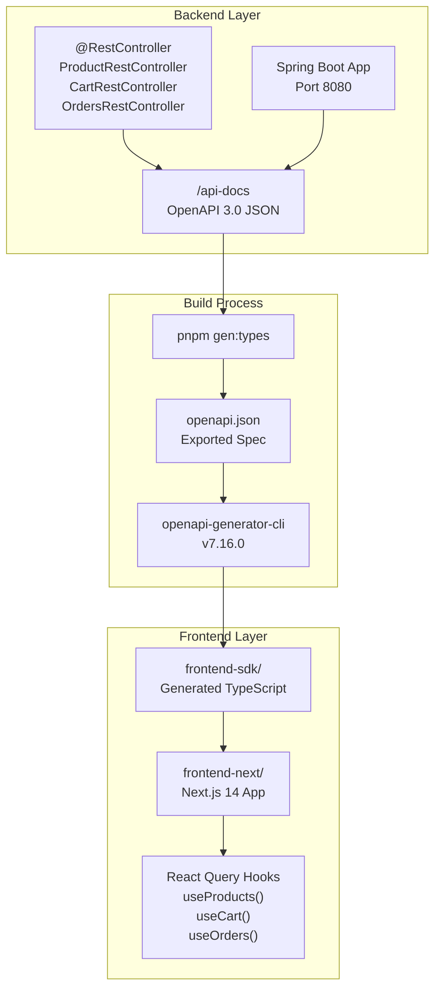
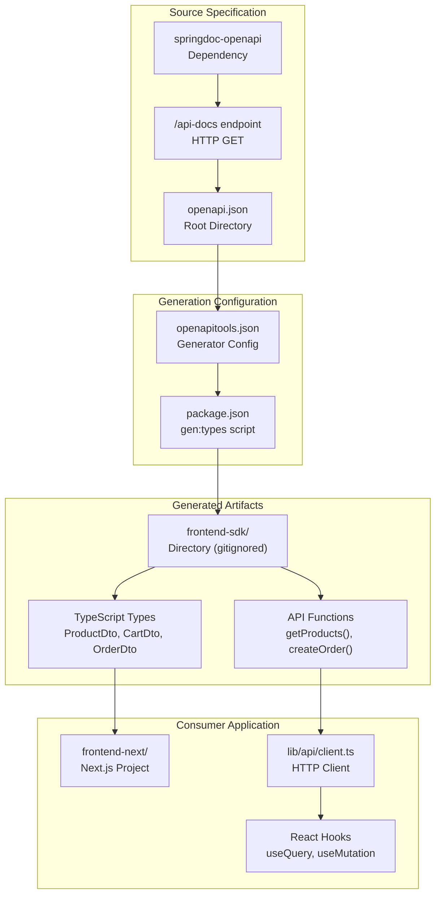
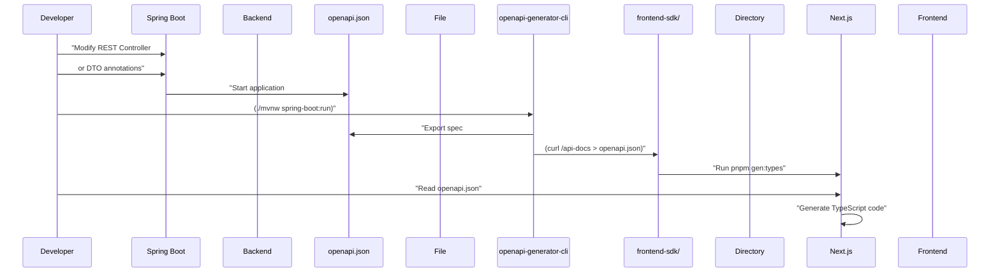

# TypeScript SDK Generation

> **Relevant source files**
> * [.gitignore](https://github.com/philipz/spring-modular-monolith/blob/30c9bf30/.gitignore)
> * [.spec-workflow/archive/specs/openapi-rest-api/design.md](https://github.com/philipz/spring-modular-monolith/blob/30c9bf30/.spec-workflow/archive/specs/openapi-rest-api/design.md)
> * [.spec-workflow/archive/specs/openapi-rest-api/requirements.md](https://github.com/philipz/spring-modular-monolith/blob/30c9bf30/.spec-workflow/archive/specs/openapi-rest-api/requirements.md)
> * [.spec-workflow/archive/specs/openapi-rest-api/tasks.md](https://github.com/philipz/spring-modular-monolith/blob/30c9bf30/.spec-workflow/archive/specs/openapi-rest-api/tasks.md)
> * [README-API.md](https://github.com/philipz/spring-modular-monolith/blob/30c9bf30/README-API.md)
> * [README.md](https://github.com/philipz/spring-modular-monolith/blob/30c9bf30/README.md)
> * [docs/API_ANALYSIS_SUMMARY.txt](https://github.com/philipz/spring-modular-monolith/blob/30c9bf30/docs/API_ANALYSIS_SUMMARY.txt)
> * [docs/REST_API_ANALYSIS.md](https://github.com/philipz/spring-modular-monolith/blob/30c9bf30/docs/REST_API_ANALYSIS.md)
> * [docs/bookstore-microservices.png](https://github.com/philipz/spring-modular-monolith/blob/30c9bf30/docs/bookstore-microservices.png)
> * [docs/improvement.md](https://github.com/philipz/spring-modular-monolith/blob/30c9bf30/docs/improvement.md)
> * [docs/orders-data-ownership-analysis.md](https://github.com/philipz/spring-modular-monolith/blob/30c9bf30/docs/orders-data-ownership-analysis.md)
> * [docs/orders-module-boundary-analysis.md](https://github.com/philipz/spring-modular-monolith/blob/30c9bf30/docs/orders-module-boundary-analysis.md)
> * [docs/orders-traffic-migration.md](https://github.com/philipz/spring-modular-monolith/blob/30c9bf30/docs/orders-traffic-migration.md)
> * [k6.js](https://github.com/philipz/spring-modular-monolith/blob/30c9bf30/k6.js)
> * [openapi.json](https://github.com/philipz/spring-modular-monolith/blob/30c9bf30/openapi.json)
> * [openapitools.json](https://github.com/philipz/spring-modular-monolith/blob/30c9bf30/openapitools.json)

This document describes the TypeScript SDK generation process for the BookStore REST API. The SDK provides type-safe API clients that enable the Next.js frontend to interact with backend endpoints without manual request construction. The generation process transforms the OpenAPI 3.0 specification exposed by the Spring Boot backend into TypeScript types and request functions.

For information about the REST API endpoints that the SDK consumes, see [7.1](/philipz/spring-modular-monolith/7.1-rest-api-endpoints). For details on the Next.js frontend architecture that uses the generated SDK, see [14.1](/philipz/spring-modular-monolith/14.1-next.js-frontend-architecture).

## Purpose and Scope

The TypeScript SDK generation automates the creation of type-safe API client code from the OpenAPI specification. This approach eliminates manual API client maintenance, ensures frontend-backend contract consistency, and provides compile-time type checking for API requests and responses.

**Sources:** [README.md L3-L23](https://github.com/philipz/spring-modular-monolith/blob/30c9bf30/README.md#L3-L23)

 [README-API.md L163-L166](https://github.com/philipz/spring-modular-monolith/blob/30c9bf30/README-API.md#L163-L166)

## SDK Generation Architecture

The SDK generation follows a three-stage pipeline: the Spring Boot backend exposes an OpenAPI 3.0 specification, a code generator transforms this specification into TypeScript code, and the Next.js frontend consumes the generated SDK.

### SDK Generation Flow



**Sources:** [README.md L20](https://github.com/philipz/spring-modular-monolith/blob/30c9bf30/README.md#L20-L20)

 [README-API.md L8-L9](https://github.com/philipz/spring-modular-monolith/blob/30c9bf30/README-API.md#L8-L9)

 [openapitools.json L1-L8](https://github.com/philipz/spring-modular-monolith/blob/30c9bf30/openapitools.json#L1-L8)

### Code Entity Bridge



**Sources:** [openapi.json L1](https://github.com/philipz/spring-modular-monolith/blob/30c9bf30/openapi.json#L1-L1)

 [openapitools.json L1-L8](https://github.com/philipz/spring-modular-monolith/blob/30c9bf30/openapitools.json#L1-L8)

 [.gitignore L46](https://github.com/philipz/spring-modular-monolith/blob/30c9bf30/.gitignore#L46-L46)

## OpenAPI Specification Source

The Spring Boot backend exposes the OpenAPI specification through two mechanisms: a runtime HTTP endpoint and a static JSON file.

### Runtime Endpoint

The backend serves the OpenAPI specification at `/api-docs` using SpringDoc OpenAPI integration. This endpoint dynamically generates the specification from controller annotations (`@Tag`, `@Operation`, `@ApiResponse`) and DTO schema annotations (`@Schema`).

| Aspect | Configuration |
| --- | --- |
| **Endpoint URL** | `http://localhost:8080/api-docs` |
| **Content Type** | `application/json` |
| **OpenAPI Version** | 3.0.1 |
| **Dependency** | `springdoc-openapi-starter-webmvc-ui` |
| **Configuration Class** | `OpenApiConfig.java` |

**Sources:** [README-API.md L8](https://github.com/philipz/spring-modular-monolith/blob/30c9bf30/README-API.md#L8-L8)

 [openapi.json L1](https://github.com/philipz/spring-modular-monolith/blob/30c9bf30/openapi.json#L1-L1)

 [.spec-workflow/archive/specs/openapi-rest-api/tasks.md L12-L28](https://github.com/philipz/spring-modular-monolith/blob/30c9bf30/.spec-workflow/archive/specs/openapi-rest-api/tasks.md#L12-L28)

### Static Specification File

The repository contains a committed `openapi.json` file in the root directory. This file represents a snapshot of the OpenAPI specification and serves as the generation source when the backend is not running.

```
{
  "openapi": "3.0.1",
  "info": {
    "title": "BookStore REST API",
    "version": "1.0.0"
  },
  "paths": {
    "/api/products": {...},
    "/api/cart": {...},
    "/api/orders": {...}
  }
}
```

**Sources:** [openapi.json L1](https://github.com/philipz/spring-modular-monolith/blob/30c9bf30/openapi.json#L1-L1)

## Generation Tooling

The SDK generation uses OpenAPI Generator CLI, configured via `openapitools.json` and executed through npm/pnpm scripts.

### OpenAPI Generator Configuration

The `openapitools.json` file specifies the generator CLI version:

```json
{
  "$schema": "./node_modules/@openapitools/openapi-generator-cli/config.schema.json",
  "spaces": 2,
  "generator-cli": {
    "version": "7.16.0"
  }
}
```

**Sources:** [openapitools.json L1-L8](https://github.com/philipz/spring-modular-monolith/blob/30c9bf30/openapitools.json#L1-L8)

### Generation Command

The SDK generation is triggered via a pnpm script. The typical workflow involves:

```python
# Export the current OpenAPI spec from running backend
curl http://localhost:8080/api-docs > openapi.json

# Generate TypeScript SDK (command varies by project setup)
pnpm gen:types
```

The `gen:types` command (referenced in documentation but not visible in provided files) likely invokes:

```
openapi-generator-cli generate \
  -i openapi.json \
  -g typescript-fetch \
  -o frontend-sdk/
```

| Option | Value | Purpose |
| --- | --- | --- |
| `-i` | `openapi.json` | Input OpenAPI specification file |
| `-g` | `typescript-fetch` | Generator for TypeScript with Fetch API |
| `-o` | `frontend-sdk/` | Output directory for generated code |

**Sources:** [README-API.md L163](https://github.com/philipz/spring-modular-monolith/blob/30c9bf30/README-API.md#L163-L163)

 [docs/API_ANALYSIS_SUMMARY.txt L78](https://github.com/philipz/spring-modular-monolith/blob/30c9bf30/docs/API_ANALYSIS_SUMMARY.txt#L78-L78)

### Generator Output Structure

The `frontend-sdk/` directory is gitignored and contains generated TypeScript code:

```
frontend-sdk/
├── apis/
│   ├── CartApi.ts
│   ├── OrdersApi.ts
│   └── ProductsApi.ts
├── models/
│   ├── ProductDto.ts
│   ├── CartDto.ts
│   ├── OrderDto.ts
│   ├── CreateOrderRequest.ts
│   └── PagedResult.ts
└── runtime.ts
```

**Sources:** [.gitignore L46](https://github.com/philipz/spring-modular-monolith/blob/30c9bf30/.gitignore#L46-L46)

 [README.md L132](https://github.com/philipz/spring-modular-monolith/blob/30c9bf30/README.md#L132-L132)

## Generated SDK Structure

The generated SDK provides two primary artifacts: TypeScript type definitions for all DTOs and API client functions for each endpoint.

### Type Definitions

Each DTO from the OpenAPI specification becomes a TypeScript interface. For example, `ProductDto` from [openapi.json L382-L399](https://github.com/philipz/spring-modular-monolith/blob/30c9bf30/openapi.json#L382-L399)

:

```typescript
// Generated in frontend-sdk/models/ProductDto.ts
export interface ProductDto {
    code: string;
    name: string;
    description?: string;
    imageUrl?: string;
    price: number;
}
```

Generic types like `PagedResult<T>` are also generated:

```typescript
// Generated in frontend-sdk/models/PagedResult.ts
export interface PagedResult {
    data: Array<object>;
    totalElements: number;
    pageNumber: number;
    totalPages: number;
    isFirst: boolean;
    isLast: boolean;
    hasNext: boolean;
    hasPrevious: boolean;
}
```

**Sources:** [openapi.json L382-L399](https://github.com/philipz/spring-modular-monolith/blob/30c9bf30/openapi.json#L382-L399)

 [openapi.json L303-L334](https://github.com/philipz/spring-modular-monolith/blob/30c9bf30/openapi.json#L303-L334)

### API Client Functions

Each REST controller endpoint becomes a typed function in an API class:

```javascript
// Generated in frontend-sdk/apis/ProductsApi.ts
export class ProductsApi {
    async getProducts(page?: number): Promise<PagedResult> {
        // Generated fetch logic
    }
    
    async getProductByCode(code: string): Promise<ProductDto> {
        // Generated fetch logic
    }
}

// Generated in frontend-sdk/apis/CartApi.ts
export class CartApi {
    async addItem(request: AddToCartRequest): Promise<CartDto> {
        // Generated fetch logic
    }
    
    async updateItemQuantity(code: string, request: UpdateQuantityRequest): Promise<CartDto> {
        // Generated fetch logic
    }
    
    async getCart(): Promise<CartDto> {
        // Generated fetch logic
    }
    
    async clearCart(): Promise<void> {
        // Generated fetch logic
    }
}

// Generated in frontend-sdk/apis/OrdersApi.ts
export class OrdersApi {
    async createOrder(request: CreateOrderRequest): Promise<CreateOrderResponse> {
        // Generated fetch logic
    }
    
    async listOrders(page?: number, pageSize?: number): Promise<PagedResult> {
        // Generated fetch logic
    }
    
    async getOrder(orderNumber: string): Promise<OrderDto> {
        // Generated fetch logic
    }
}
```

**Sources:** [openapi.json L23-L74](https://github.com/philipz/spring-modular-monolith/blob/30c9bf30/openapi.json#L23-L74)

 [openapi.json L75-L139](https://github.com/philipz/spring-modular-monolith/blob/30c9bf30/openapi.json#L75-L139)

## Frontend Integration

The Next.js frontend (`frontend-next/`) imports and uses the generated SDK to construct type-safe API calls. The integration follows a layered pattern: HTTP client configuration → SDK instantiation → React Query hooks.

### HTTP Client Configuration

The frontend configures a base HTTP client that the SDK uses for all requests:

```javascript
// Typical pattern in frontend-next/lib/api/client.ts
import { Configuration, ProductsApi, CartApi, OrdersApi } from 'frontend-sdk';

const config = new Configuration({
    basePath: process.env.NEXT_PUBLIC_API_URL || '/api',
    credentials: 'include', // For session cookies
    headers: {
        'Content-Type': 'application/json',
        'Accept': 'application/json'
    }
});

export const productsApi = new ProductsApi(config);
export const cartApi = new CartApi(config);
export const ordersApi = new OrdersApi(config);
```

The `credentials: 'include'` option ensures the `BOOKSTORE_SESSION` cookie is sent with requests, maintaining session-based cart state.

**Sources:** [README.md L22](https://github.com/philipz/spring-modular-monolith/blob/30c9bf30/README.md#L22-L22)

 [README-API.md L14](https://github.com/philipz/spring-modular-monolith/blob/30c9bf30/README-API.md#L14-L14)

 [docs/API_ANALYSIS_SUMMARY.txt L89-L90](https://github.com/philipz/spring-modular-monolith/blob/30c9bf30/docs/API_ANALYSIS_SUMMARY.txt#L89-L90)

### React Query Integration

The frontend wraps SDK calls in React Query hooks for caching, loading states, and error handling:

```javascript
// Typical pattern in frontend-next/hooks/useProducts.ts
import { useQuery } from '@tanstack/react-query';
import { productsApi } from '@/lib/api/client';

export function useProducts(page: number = 1) {
    return useQuery({
        queryKey: ['products', page],
        queryFn: () => productsApi.getProducts(page)
    });
}

// Typical pattern in frontend-next/hooks/useCart.ts
import { useMutation, useQuery, useQueryClient } from '@tanstack/react-query';
import { cartApi } from '@/lib/api/client';

export function useCart() {
    return useQuery({
        queryKey: ['cart'],
        queryFn: () => cartApi.getCart()
    });
}

export function useAddToCart() {
    const queryClient = useQueryClient();
    return useMutation({
        mutationFn: (request: AddToCartRequest) => cartApi.addItem(request),
        onSuccess: () => {
            queryClient.invalidateQueries({ queryKey: ['cart'] });
        }
    });
}

// Typical pattern in frontend-next/hooks/useOrders.ts
import { useMutation, useQuery } from '@tanstack/react-query';
import { ordersApi } from '@/lib/api/client';

export function useCreateOrder() {
    return useMutation({
        mutationFn: (request: CreateOrderRequest) => ordersApi.createOrder(request)
    });
}

export function useOrders(page: number = 1, pageSize: number = 10) {
    return useQuery({
        queryKey: ['orders', page, pageSize],
        queryFn: () => ordersApi.listOrders(page, pageSize)
    });
}
```

**Sources:** [README.md L20](https://github.com/philipz/spring-modular-monolith/blob/30c9bf30/README.md#L20-L20)

 [docs/API_ANALYSIS_SUMMARY.txt L92-L93](https://github.com/philipz/spring-modular-monolith/blob/30c9bf30/docs/API_ANALYSIS_SUMMARY.txt#L92-L93)

## Development Workflow

The typical development workflow for maintaining SDK consistency involves backend changes, specification regeneration, and frontend updates.

### Workflow Steps



**Sources:** [README-API.md L163-L166](https://github.com/philipz/spring-modular-monolith/blob/30c9bf30/README-API.md#L163-L166)

 [docs/API_ANALYSIS_SUMMARY.txt L156-L173](https://github.com/philipz/spring-modular-monolith/blob/30c9bf30/docs/API_ANALYSIS_SUMMARY.txt#L156-L173)

### Breaking Changes Handling

When the backend introduces breaking API changes (e.g., renaming fields, changing response structures), the SDK regeneration exposes these as TypeScript compilation errors in the frontend. The developer workflow for breaking changes:

1. **Backend Change:** Modify DTO or endpoint signature
2. **Regenerate SDK:** Run `pnpm gen:types`
3. **TypeScript Errors:** Frontend code that used old types fails to compile
4. **Update Frontend:** Fix all compilation errors by updating to new types
5. **Verify:** Test the updated frontend against the running backend

| Change Type | SDK Impact | Frontend Action |
| --- | --- | --- |
| New optional field | No errors | Optionally use new field |
| New required field | Compilation error | Provide value in requests |
| Renamed field | Compilation error | Update all usages |
| Removed endpoint | Compilation error | Remove or replace calls |
| Changed HTTP method | Runtime error | Regenerate SDK, update calls |

**Sources:** [.spec-workflow/archive/specs/openapi-rest-api/requirements.md L73-L76](https://github.com/philipz/spring-modular-monolith/blob/30c9bf30/.spec-workflow/archive/specs/openapi-rest-api/requirements.md#L73-L76)

 [docs/API_ANALYSIS_SUMMARY.txt L94-L101](https://github.com/philipz/spring-modular-monolith/blob/30c9bf30/docs/API_ANALYSIS_SUMMARY.txt#L94-L101)

### Continuous Integration

The SDK generation can be integrated into CI/CD pipelines to ensure frontend-backend compatibility:

```yaml
# Typical GitHub Actions workflow
- name: Generate TypeScript SDK
  run: |
    curl http://localhost:8080/api-docs > openapi.json
    pnpm gen:types

- name: Check for breaking changes
  run: |
    git diff --exit-code frontend-sdk/ || echo "SDK changed"

- name: Verify frontend compiles
  run: |
    cd frontend-next
    pnpm typecheck
```

**Sources:** [docs/improvement.md L20-L24](https://github.com/philipz/spring-modular-monolith/blob/30c9bf30/docs/improvement.md#L20-L24)

## Session Management Considerations

The generated SDK must preserve session-based authentication for cart and order operations. The `BOOKSTORE_SESSION` cookie is managed by Hazelcast and must be included in all API requests.

### Session Cookie Handling

The SDK configuration ensures session cookies are sent:

```javascript
// Configuration for session preservation
const config = new Configuration({
    credentials: 'include', // Critical for session cookies
    // ...
});
```

Without `credentials: 'include'`, the browser will not send the `BOOKSTORE_SESSION` cookie, causing cart operations to fail (each request would receive a new empty cart).

| Scenario | Cookie Behavior | Result |
| --- | --- | --- |
| `credentials: 'include'` | Cookie sent with every request | Cart state persists across requests |
| `credentials: 'omit'` | No cookies sent | Each request gets new empty cart |
| `credentials: 'same-origin'` | Cookies sent only for same-origin | Depends on nginx proxy configuration |

**Sources:** [README.md L22](https://github.com/philipz/spring-modular-monolith/blob/30c9bf30/README.md#L22-L22)

 [README-API.md L14](https://github.com/philipz/spring-modular-monolith/blob/30c9bf30/README-API.md#L14-L14)

 [docs/API_ANALYSIS_SUMMARY.txt L44-L53](https://github.com/philipz/spring-modular-monolith/blob/30c9bf30/docs/API_ANALYSIS_SUMMARY.txt#L44-L53)

## Testing Generated SDK

The SDK generation process should be validated through automated tests to ensure generated code compiles and functions correctly.

### Compilation Test

```javascript
// Typical test in frontend-next/tests/sdk.test.ts
import { ProductsApi, CartApi, OrdersApi } from 'frontend-sdk';
import { Configuration } from 'frontend-sdk';

describe('Generated SDK', () => {
    it('should compile without errors', () => {
        const config = new Configuration({ basePath: '/api' });
        const productsApi = new ProductsApi(config);
        const cartApi = new CartApi(config);
        const ordersApi = new OrdersApi(config);
        
        expect(productsApi).toBeDefined();
        expect(cartApi).toBeDefined();
        expect(ordersApi).toBeDefined();
    });
});
```

### Integration Test

```javascript
// Typical test validating SDK against live backend
describe('SDK Integration', () => {
    it('should fetch products successfully', async () => {
        const api = new ProductsApi(config);
        const result = await api.getProducts(1);
        
        expect(result.data).toBeDefined();
        expect(result.pageNumber).toBe(1);
        expect(result.totalElements).toBeGreaterThan(0);
    });
});
```

**Sources:** [.spec-workflow/archive/specs/openapi-rest-api/design.md L512-L517](https://github.com/philipz/spring-modular-monolith/blob/30c9bf30/.spec-workflow/archive/specs/openapi-rest-api/design.md#L512-L517)

 [k6.js L1-L93](https://github.com/philipz/spring-modular-monolith/blob/30c9bf30/k6.js#L1-L93)

## Configuration Reference

### openapitools.json

```json
{
  "$schema": "./node_modules/@openapitools/openapi-generator-cli/config.schema.json",
  "spaces": 2,
  "generator-cli": {
    "version": "7.16.0"
  }
}
```

**Sources:** [openapitools.json L1-L8](https://github.com/philipz/spring-modular-monolith/blob/30c9bf30/openapitools.json#L1-L8)

### Environment Variables

| Variable | Purpose | Example Value |
| --- | --- | --- |
| `NEXT_PUBLIC_API_URL` | Base URL for API requests | `http://localhost:8080` (dev) or `/api` (production) |
| `NEXT_API_PROXY_TARGET` | Docker Compose nginx proxy target | `http://monolith:8080` |

**Sources:** [docs/API_ANALYSIS_SUMMARY.txt L95-L98](https://github.com/philipz/spring-modular-monolith/blob/30c9bf30/docs/API_ANALYSIS_SUMMARY.txt#L95-L98)

### Git Configuration

The generated SDK directory is excluded from version control:

```markdown
# .gitignore
frontend-sdk/
```

This ensures generated code is not committed and must be regenerated in each environment, preventing stale generated code from being deployed.

**Sources:** [.gitignore L46](https://github.com/philipz/spring-modular-monolith/blob/30c9bf30/.gitignore#L46-L46)