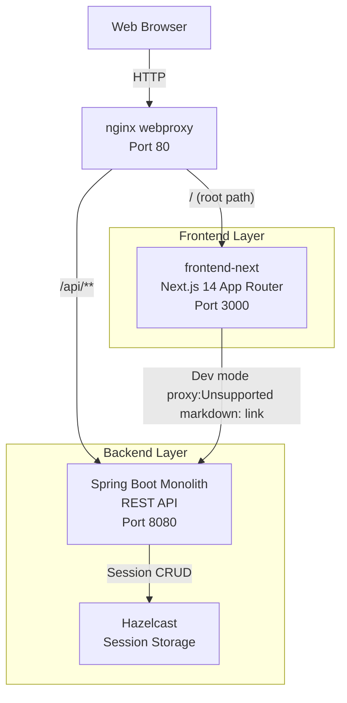
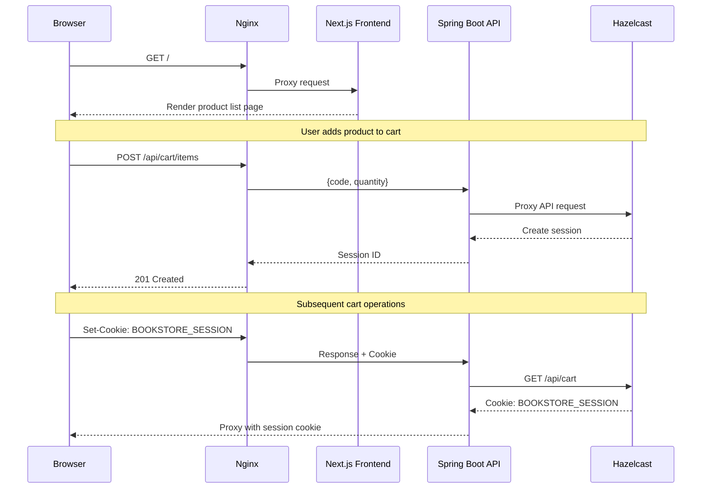
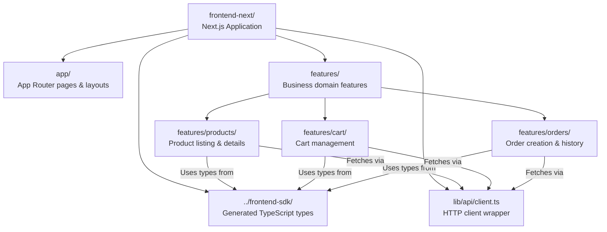
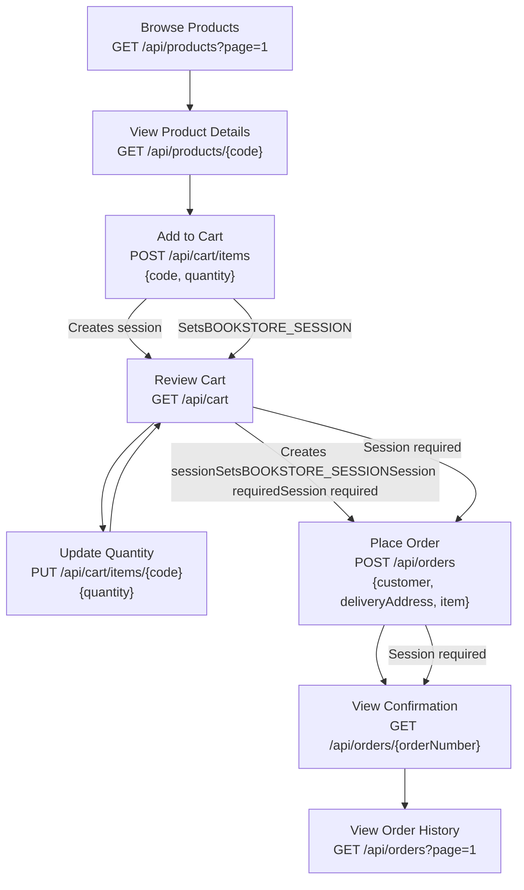

# Web Interface and Thymeleaf Templates

> **Relevant source files**
> * [README-API.md](https://github.com/philipz/spring-modular-monolith/blob/30c9bf30/README-API.md)
> * [README.md](https://github.com/philipz/spring-modular-monolith/blob/30c9bf30/README.md)
> * [docs/API_ANALYSIS_SUMMARY.txt](https://github.com/philipz/spring-modular-monolith/blob/30c9bf30/docs/API_ANALYSIS_SUMMARY.txt)
> * [docs/REST_API_ANALYSIS.md](https://github.com/philipz/spring-modular-monolith/blob/30c9bf30/docs/REST_API_ANALYSIS.md)
> * [docs/bookstore-microservices.png](https://github.com/philipz/spring-modular-monolith/blob/30c9bf30/docs/bookstore-microservices.png)
> * [docs/improvement.md](https://github.com/philipz/spring-modular-monolith/blob/30c9bf30/docs/improvement.md)
> * [docs/orders-data-ownership-analysis.md](https://github.com/philipz/spring-modular-monolith/blob/30c9bf30/docs/orders-data-ownership-analysis.md)
> * [docs/orders-module-boundary-analysis.md](https://github.com/philipz/spring-modular-monolith/blob/30c9bf30/docs/orders-module-boundary-analysis.md)
> * [docs/orders-traffic-migration.md](https://github.com/philipz/spring-modular-monolith/blob/30c9bf30/docs/orders-traffic-migration.md)
> * [http_requests.http](http_requests.http)
> * [k6.js](https://github.com/philipz/spring-modular-monolith/blob/30c9bf30/k6.js)
> * [src/main/java/com/sivalabs/bookstore/orders/domain/ProductServiceClient.java](https://github.com/philipz/spring-modular-monolith/blob/30c9bf30/src/main/java/com/sivalabs/bookstore/orders/domain/ProductServiceClient.java)

**Purpose and Scope**: This page documents the web interface architecture of the Spring modular monolith. The legacy Thymeleaf-based server-rendered UI has been fully retired. The current web interface consists of a Next.js 14 frontend (`frontend-next/`) that consumes REST APIs exposed by the Spring Boot backend under `/api/**`. For detailed API specifications, see [REST API Endpoints](/philipz/spring-modular-monolith/7.1-rest-api-endpoints). For frontend implementation details, see [Next.js Frontend Architecture](/philipz/spring-modular-monolith/14.1-next.js-frontend-architecture). For backend API integration patterns, see [Exception Handling and Error Responses](/philipz/spring-modular-monolith/7.3-exception-handling-and-error-responses).

---

## Historical Context: Thymeleaf Retirement

The original implementation included a server-rendered web module using Thymeleaf templates. This has been completely removed in favor of a modern client-side architecture. The migration involved:

* Removing all server-side view rendering with Thymeleaf
* Eliminating Spring MVC `@Controller` classes that returned view names
* Deleting `src/main/resources/templates/` directory
* Removing Thymeleaf dependencies from `pom.xml`

All UI is now client-side rendered by Next.js, consuming backend data exclusively through REST APIs under `/api/**`.

**Sources**: [README.md L16](https://github.com/philipz/spring-modular-monolith/blob/30c9bf30/README.md#L16-L16)

---

## Current Architecture: Next.js Frontend + REST Backend

### Deployment Architecture



**Unified Entry Point**: The nginx reverse proxy at port 80 routes requests by path, eliminating CORS complexity by ensuring all traffic originates from the same domain.

**Sources**: [README.md L16-L22](https://github.com/philipz/spring-modular-monolith/blob/30c9bf30/README.md#L16-L22)

 [docs/orders-traffic-migration.md L3-L11](https://github.com/philipz/spring-modular-monolith/blob/30c9bf30/docs/orders-traffic-migration.md#L3-L11)

### Request Routing Table

| Path Pattern | Destination | Port | Purpose |
| --- | --- | --- | --- |
| `/` | Next.js | 3000 | Storefront UI, product browsing, checkout |
| `/api/**` | Spring Boot | 8080 | REST API endpoints |
| `/swagger-ui.html` | Spring Boot | 8080 | Interactive API documentation |
| `/api-docs` | Spring Boot | 8080 | OpenAPI JSON specification |
| `/actuator/**` | Spring Boot | 8080 | Operational endpoints (health, metrics) |

This routing configuration is defined in `webproxy/nginx.conf` and templated with environment variables in the Docker Compose setup.

**Sources**: [README.md L78-L89](https://github.com/philipz/spring-modular-monolith/blob/30c9bf30/README.md#L78-L89)

 [docs/orders-traffic-migration.md L3-L11](https://github.com/philipz/spring-modular-monolith/blob/30c9bf30/docs/orders-traffic-migration.md#L3-L11)

---

## Session-Based Interaction Model

Unlike traditional stateless SPAs, the bookstore web interface uses Hazelcast-backed HTTP sessions to maintain shopping cart state across requests.

### Session Lifecycle



**Sources**: [README.md L22-L23](https://github.com/philipz/spring-modular-monolith/blob/30c9bf30/README.md#L22-L23)

 [README-API.md L11-L14](https://github.com/philipz/spring-modular-monolith/blob/30c9bf30/README-API.md#L11-L14)

 [docs/REST_API_ANALYSIS.md L48-L56](https://github.com/philipz/spring-modular-monolith/blob/30c9bf30/docs/REST_API_ANALYSIS.md#L48-L56)

### BOOKSTORE_SESSION Cookie Configuration

| Property | Value | Purpose |
| --- | --- | --- |
| Name | `BOOKSTORE_SESSION` | Identifies the Hazelcast session |
| HttpOnly | `true` | Prevents JavaScript access (XSS protection) |
| SameSite | `Strict` | Prevents CSRF attacks |
| TTL | 30 minutes | Automatic cleanup of abandoned carts |
| Secure | Configurable via `USE_SECURE_COOKIES` env var | HTTPS-only in production |
| Storage | Hazelcast distributed map `spring:session:sessions` | Enables horizontal scaling |

The session ID contains Hazelcast cluster identifiers enabling session replication across multiple backend instances. Configuration is managed through `application.properties` under `server.servlet.session.cookie.*` properties.

**Sources**: [README-API.md L11](https://github.com/philipz/spring-modular-monolith/blob/30c9bf30/README-API.md#L11-L11)

 [docs/API_ANALYSIS_SUMMARY.txt L35-L40](https://github.com/philipz/spring-modular-monolith/blob/30c9bf30/docs/API_ANALYSIS_SUMMARY.txt#L35-L40)

 [docs/REST_API_ANALYSIS.md L48-L56](https://github.com/philipz/spring-modular-monolith/blob/30c9bf30/docs/REST_API_ANALYSIS.md#L48-L56)

---

## Frontend Implementation Structure

### Directory Organization



**Sources**: [README.md L18-L23](https://github.com/philipz/spring-modular-monolith/blob/30c9bf30/README.md#L18-L23)

 [docs/API_ANALYSIS_SUMMARY.txt L86-L98](https://github.com/philipz/spring-modular-monolith/blob/30c9bf30/docs/API_ANALYSIS_SUMMARY.txt#L86-L98)

### API Client Configuration

The frontend HTTP client requires specific configuration to ensure session cookies are sent:

**Environment Variables**:

* **Production** (Docker Compose): `NEXT_PUBLIC_API_URL=/api` (relative path ensures same-origin)
* **Development**: `NEXT_PUBLIC_API_URL=http://localhost:8080` (requires backend CORS configuration)

**Fetch Options**:

```yaml
// In lib/api/client.ts or equivalent
fetch(url, {
  credentials: 'include',  // Required to send BOOKSTORE_SESSION cookie
  headers: {
    'Content-Type': 'application/json',
    'Accept': 'application/json'
  }
})
```

**CORS Development Mode**: When running the backend with `SPRING_PROFILES_ACTIVE=dev`, the `CorsConfig` class automatically enables CORS for `http://localhost:3000`, allowing local frontend development.

**Sources**: [README.md L109-L110](https://github.com/philipz/spring-modular-monolith/blob/30c9bf30/README.md#L109-L110)

 [docs/API_ANALYSIS_SUMMARY.txt L86-L98](https://github.com/philipz/spring-modular-monolith/blob/30c9bf30/docs/API_ANALYSIS_SUMMARY.txt#L86-L98)

 [docs/REST_API_ANALYSIS.md L54-L56](https://github.com/philipz/spring-modular-monolith/blob/30c9bf30/docs/REST_API_ANALYSIS.md#L54-L56)

---

## Web Interface User Flows

### Complete User Journey



**Sources**: [k6.js L19-L89](https://github.com/philipz/spring-modular-monolith/blob/30c9bf30/k6.js#L19-L89)

 [README-API.md L16-L173](https://github.com/philipz/spring-modular-monolith/blob/30c9bf30/README-API.md#L16-L173)

 [http_requests.http L1-L28](https://github.com/philipz/spring-modular-monolith/blob/30c9bf30/http_requests.http#L1-L28)

### Product Browsing (No Session Required)

Product endpoints do not require authentication or session state:

| Endpoint | Method | Query Parameters | Response Type |
| --- | --- | --- | --- |
| `/api/products` | GET | `page` (default: 1) | `PagedResult<ProductDto>` |
| `/api/products/{code}` | GET | - | `ProductDto` |

**ProductDto Structure**:

* `code`: String (unique product identifier)
* `name`: String
* `description`: String
* `imageUrl`: String (full URL to product image)
* `price`: BigDecimal

The Next.js frontend caches these responses using React Query with configurable stale times for performance.

**Sources**: [README-API.md L18-L51](https://github.com/philipz/spring-modular-monolith/blob/30c9bf30/README-API.md#L18-L51)

 [docs/REST_API_ANALYSIS.md L20-L25](https://github.com/philipz/spring-modular-monolith/blob/30c9bf30/docs/REST_API_ANALYSIS.md#L20-L25)

### Cart Management (Session Required)

All cart operations require the `BOOKSTORE_SESSION` cookie. The backend stores cart state in the Hazelcast session, not in the database.

| Operation | Endpoint | Method | Request Body | Response |
| --- | --- | --- | --- | --- |
| View cart | `/api/cart` | GET | - | `CartDto` |
| Add item | `/api/cart/items` | POST | `{code: String, quantity: Integer}` | `CartDto` (201) |
| Update quantity | `/api/cart/items/{code}` | PUT | `{quantity: Integer}` | `CartDto` |
| Clear cart | `/api/cart` | DELETE | - | 204 No Content |

**CartDto Structure**:

```json
{
  "items": [
    {
      "code": "P100",
      "name": "The Hunger Games",
      "price": 34.0,
      "quantity": 1,
      "subtotal": 34.0
    }
  ],
  "totalAmount": 34.0,
  "itemCount": 1
}
```

**Current Limitation**: The cart supports a single item. Multi-item support is tracked in the improvement backlog.

**Sources**: [README-API.md L53-L90](https://github.com/philipz/spring-modular-monolith/blob/30c9bf30/README-API.md#L53-L90)

 [docs/improvement.md L6](https://github.com/philipz/spring-modular-monolith/blob/30c9bf30/docs/improvement.md#L6-L6)

### Order Creation (Session Required)

The checkout flow reads cart contents from the session and delegates to `OrdersRestController`, which internally uses `OrdersRemoteClient` to communicate via gRPC.

**Request Example**:

```yaml
POST /api/orders
Content-Type: application/json
Cookie: BOOKSTORE_SESSION=<session-id>

{
  "customer": {
    "name": "Jane Doe",
    "email": "jane@example.com",
    "phone": "+1-555-0100"
  },
  "deliveryAddress": "123 Main Street, Springfield",
  "item": {
    "code": "P100",
    "name": "The Hunger Games",
    "price": 34.0,
    "quantity": 1
  }
}
```

**Response**:

```yaml
201 Created
Location: /api/orders/ORD-2025-000123

{
  "orderNumber": "ORD-2025-000123"
}
```

**Backend Flow**: The REST endpoint delegates to `OrdersRemoteClient`, which can target either:

* In-process gRPC server (`localhost:9091`) for monolithic operation
* External `orders-service` (`orders-service:9090`) for microservice operation

This is configured via `bookstore.grpc.client.target` in `application.properties`.

**Sources**: [README-API.md L91-L149](https://github.com/philipz/spring-modular-monolith/blob/30c9bf30/README-API.md#L91-L149)

 [http_requests.http L7-L24](https://github.com/philipz/spring-modular-monolith/blob/30c9bf30/http_requests.http#L7-L24)

 [docs/REST_API_ANALYSIS.md L36-L44](https://github.com/philipz/spring-modular-monolith/blob/30c9bf30/docs/REST_API_ANALYSIS.md#L36-L44)

---

## Development Workflow

### Running the Full Stack

```markdown
# Start all services (nginx, Next.js, Spring Boot, PostgreSQL, RabbitMQ, HyperDX)
task start

# Access the storefront
open http://localhost

# Access backend API directly
curl http://localhost:8080/api/products

# Stop all services
task stop
```

When the stack is running, access points are:

| Service | URL | Purpose |
| --- | --- | --- |
| Storefront (via nginx) | [http://localhost](http://localhost) | Production-like routing |
| Next.js (direct) | [http://localhost:3000](http://localhost:3000) | Frontend development |
| Spring Boot API | [http://localhost:8080](http://localhost:8080) | API testing |
| Swagger UI | [http://localhost:8080/swagger-ui.html](http://localhost:8080/swagger-ui.html) | Interactive docs |

**Sources**: [README.md L62-L89](https://github.com/philipz/spring-modular-monolith/blob/30c9bf30/README.md#L62-L89)

### Frontend-Only Development

For frontend feature development without Docker:

```markdown
cd frontend-next
pnpm install
pnpm dev  # Starts on http://localhost:3000
```

**Backend CORS Configuration**:

```javascript
export SPRING_PROFILES_ACTIVE=dev
./mvnw spring-boot:run
```

The `dev` profile activates `CorsConfig` class, which allows `http://localhost:3000` as an allowed origin. The `CorsConfig` bean is conditional on the `dev` profile being active.

**Frontend Configuration**:

* Set `NEXT_PUBLIC_API_URL=http://localhost:8080` in `.env.local`
* Ensure all fetch calls include `credentials: 'include'`

**Sources**: [README.md L101-L110](https://github.com/philipz/spring-modular-monolith/blob/30c9bf30/README.md#L101-L110)

 [docs/API_ANALYSIS_SUMMARY.txt L83-L98](https://github.com/philipz/spring-modular-monolith/blob/30c9bf30/docs/API_ANALYSIS_SUMMARY.txt#L83-L98)

### TypeScript SDK Generation

The frontend uses generated TypeScript types from the OpenAPI specification:

```markdown
cd frontend-next
pnpm gen:types  # Reads http://localhost:8080/api-docs, writes to frontend-sdk/
```

This command uses `openapi-typescript` to generate type-safe API client code. The generated SDK is located in `frontend-sdk/` directory (sibling to `frontend-next/`) and is imported by the Next.js application.

**Workflow**:

1. Backend exposes OpenAPI spec at `/api-docs` (configured by `OpenApiConfig` class)
2. Frontend runs `pnpm gen:types` to generate TypeScript interfaces
3. `lib/api/client.ts` imports types from `frontend-sdk/`
4. Feature code uses typed requests/responses

**Sources**: [README-API.md L162-L165](https://github.com/philipz/spring-modular-monolith/blob/30c9bf30/README-API.md#L162-L165)

 [docs/API_ANALYSIS_SUMMARY.txt L162-L169](https://github.com/philipz/spring-modular-monolith/blob/30c9bf30/docs/API_ANALYSIS_SUMMARY.txt#L162-L169)

---

## No Thymeleaf Templates in Current Codebase

### What Was Removed

The legacy Thymeleaf implementation has been completely removed:

* **Server-side views**: Spring MVC controllers returning view names
* **Template files**: `src/main/resources/templates/` directory
* **Thymeleaf dependencies**: Removed from `pom.xml`
* **Form submissions**: CSRF token handling for server-rendered forms
* **Web module**: Separate Spring Modulith module for web layer

### Architecture Comparison

| Aspect | Legacy (Thymeleaf) | Current (Next.js) |
| --- | --- | --- |
| **Rendering** | Server-side (Spring MVC) | Client-side (React) |
| **Session Binding** | Spring Session + Thymeleaf forms | Spring Session + REST API |
| **CSRF Protection** | Spring Security CSRF tokens in forms | SameSite=Strict cookie policy |
| **Dev Experience** | Server restart for template changes | Hot module replacement (HMR) |
| **Deployment** | Monolithic JAR (views + API) | Separate containers (nginx → Next.js / API) |
| **API Documentation** | Limited (manual HTML pages) | OpenAPI 3.0 / Swagger UI |
| **Type Safety** | None (runtime template evaluation) | Full (generated TypeScript SDK) |
| **Scaling** | Vertical (stateful sessions) | Horizontal (frontend CDN, stateless API with Hazelcast) |

**Sources**: [README.md L16](https://github.com/philipz/spring-modular-monolith/blob/30c9bf30/README.md#L16-L16)

 [docs/REST_API_ANALYSIS.md L1-L102](https://github.com/philipz/spring-modular-monolith/blob/30c9bf30/docs/REST_API_ANALYSIS.md#L1-L102)

---

## Integration Checklist for Frontend Developers

When integrating with the web interface:

### 1. API Client Setup

* Import types from `frontend-sdk/` for request/response payloads
* Configure `NEXT_PUBLIC_API_URL` environment variable
* Use generated `PagedResult<T>`, `ProductDto`, `CartDto`, `OrderDto` types

### 2. Session Cookie Handling

* **Always** include `credentials: 'include'` in fetch calls
* Verify `BOOKSTORE_SESSION` cookie is sent with every `/api/cart/**` and `/api/orders/**` request
* Handle 401 responses (though currently all endpoints are open)

### 3. Error Handling

* Expect structured `ErrorResponse` payloads for HTTP 400 (validation errors)
* Handle 404 for missing resources (`/api/products/{code}`, `/api/orders/{number}`)
* Log 503 errors (gRPC connectivity issues) with diagnostic details

### 4. CORS in Development

* Enable `SPRING_PROFILES_ACTIVE=dev` on backend when running frontend locally
* Alternatively, override `cors.allowed-origins` property if using custom origin

### 5. OpenAPI Documentation

* Consult `http://localhost:8080/swagger-ui.html` for live API reference
* Use Swagger UI's "Try it out" feature for testing endpoints
* Verify request/response payloads match generated SDK types

### 6. React Query Configuration

* Set appropriate `staleTime` for product queries (they change infrequently)
* Use shorter `staleTime` for cart/order queries (session-dependent)
* Handle loading/error states for all async operations

**Sources**: [README-API.md L167-L173](https://github.com/philipz/spring-modular-monolith/blob/30c9bf30/README-API.md#L167-L173)

 [docs/REST_API_ANALYSIS.md L83-L91](https://github.com/philipz/spring-modular-monolith/blob/30c9bf30/docs/REST_API_ANALYSIS.md#L83-L91)

---

## Related Documentation

* [REST API Endpoints](/philipz/spring-modular-monolith/7.1-rest-api-endpoints) - Complete REST API specification with request/response examples
* [gRPC Services and Protocol Buffers](/philipz/spring-modular-monolith/7.2-grpc-services-and-protocol-buffers) - Backend gRPC integration for orders
* [Exception Handling and Error Responses](/philipz/spring-modular-monolith/7.3-exception-handling-and-error-responses) - Error payloads and HTTP status code mapping
* [Session Management with Hazelcast](/philipz/spring-modular-monolith/5.3-session-management-with-hazelcast) - Distributed session storage mechanism
* [Next.js Frontend Architecture](/philipz/spring-modular-monolith/14.1-next.js-frontend-architecture) - Frontend application structure and patterns
* [TypeScript SDK Generation](/philipz/spring-modular-monolith/14.2-typescript-sdk-generation) - OpenAPI-based SDK generation workflow
* [Nginx Reverse Proxy](/philipz/spring-modular-monolith/10.3-nginx-reverse-proxy) - Request routing and traffic management configuration
* [Traffic Migration Strategy](/philipz/spring-modular-monolith/10.4-traffic-migration-strategy) - Progressive traffic shifting between monolith and orders-service

**Sources**: [README.md L1-L150](https://github.com/philipz/spring-modular-monolith/blob/30c9bf30/README.md#L1-L150)

 [docs/REST_API_ANALYSIS.md L1-L102](https://github.com/philipz/spring-modular-monolith/blob/30c9bf30/docs/REST_API_ANALYSIS.md#L1-L102)

 [docs/API_ANALYSIS_SUMMARY.txt L1-L284](https://github.com/philipz/spring-modular-monolith/blob/30c9bf30/docs/API_ANALYSIS_SUMMARY.txt#L1-L284)