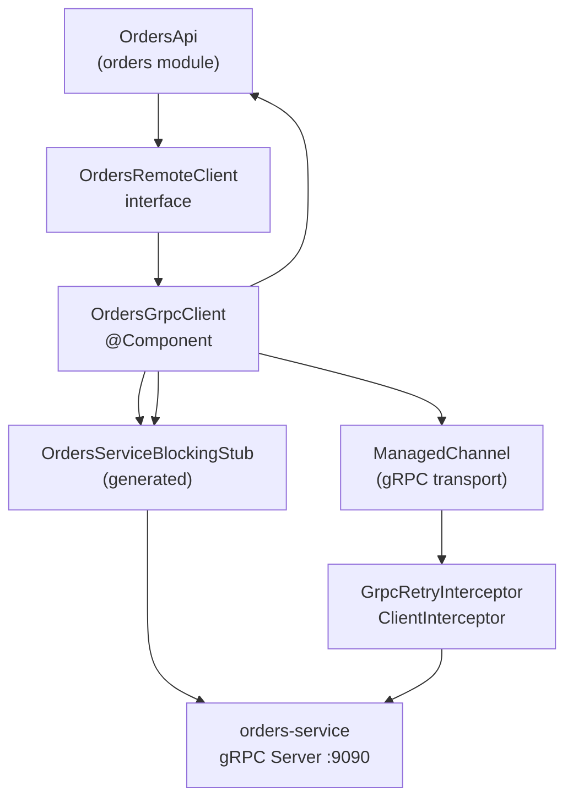
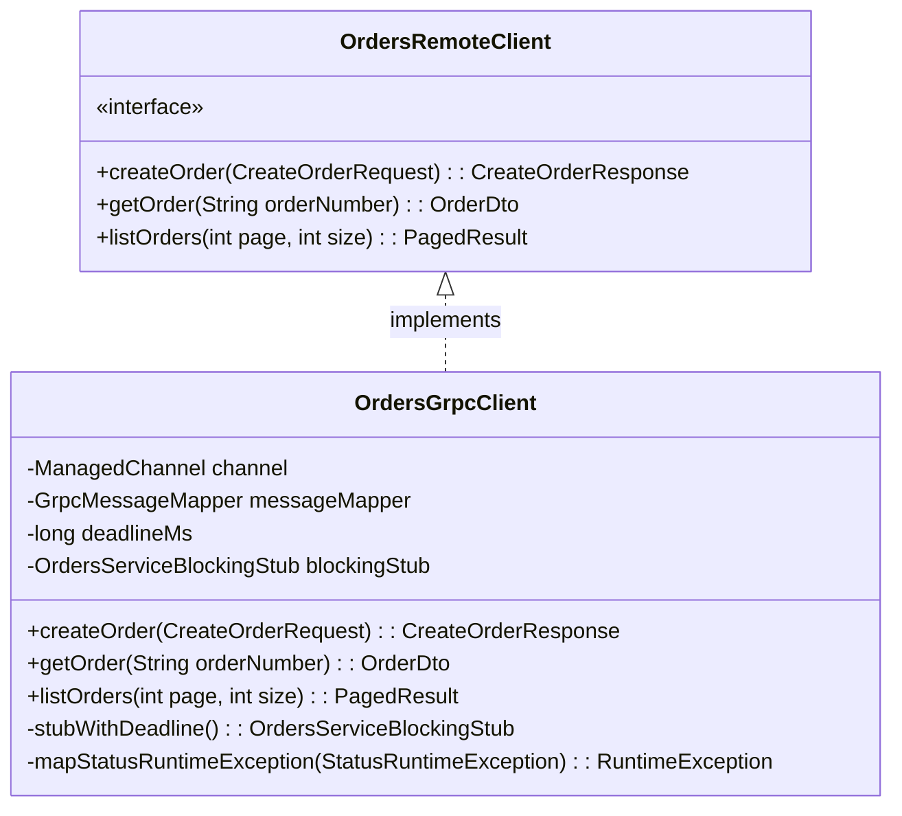
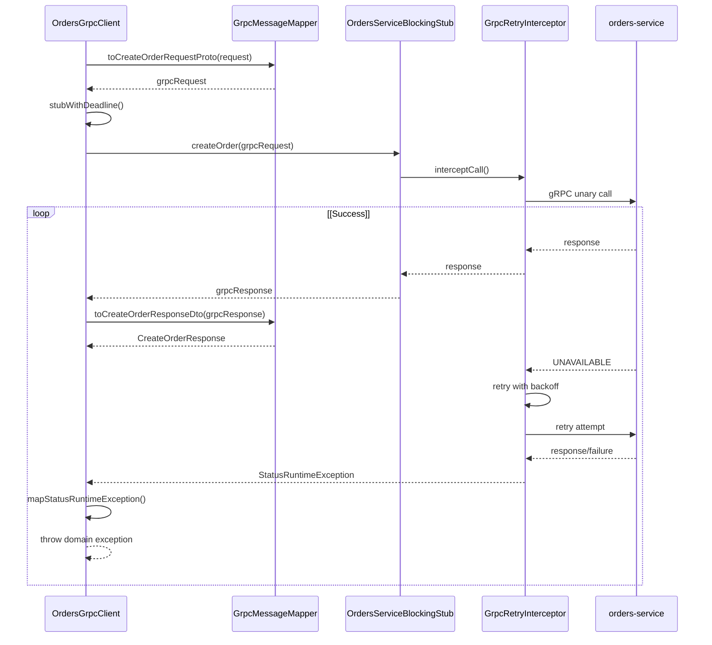
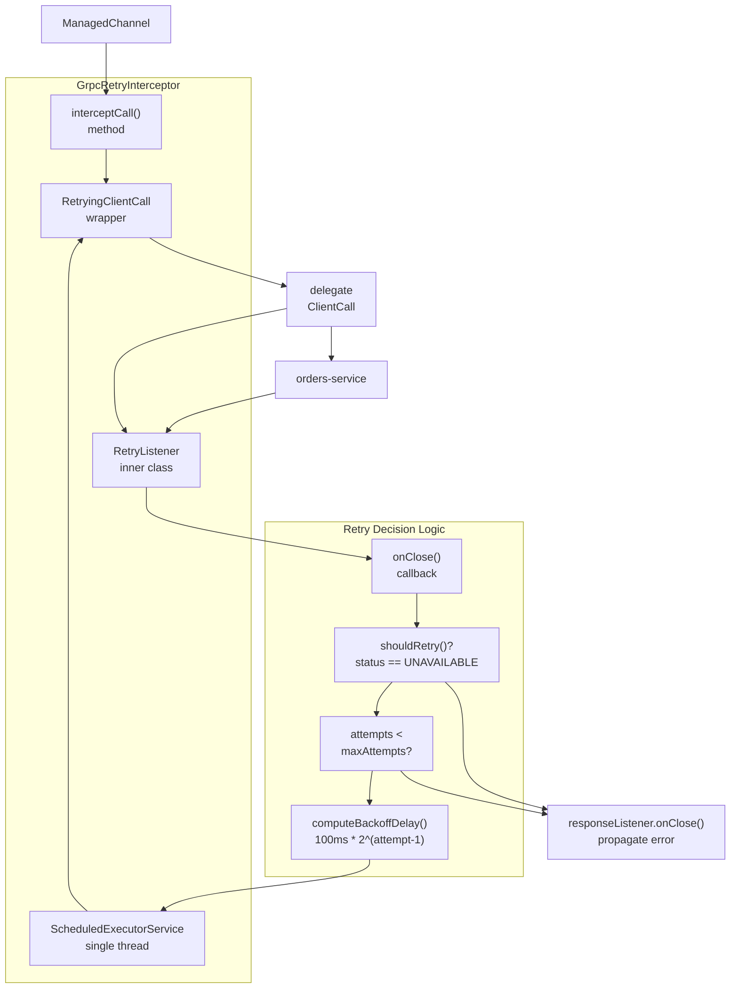
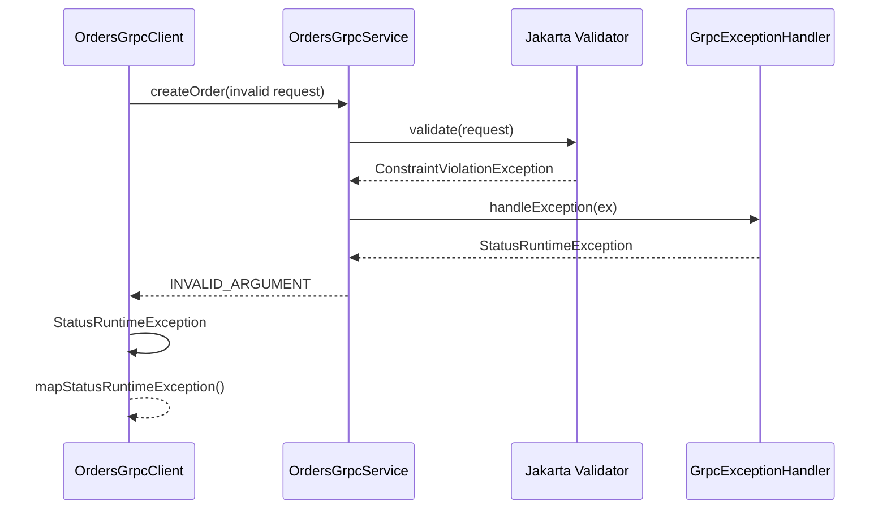
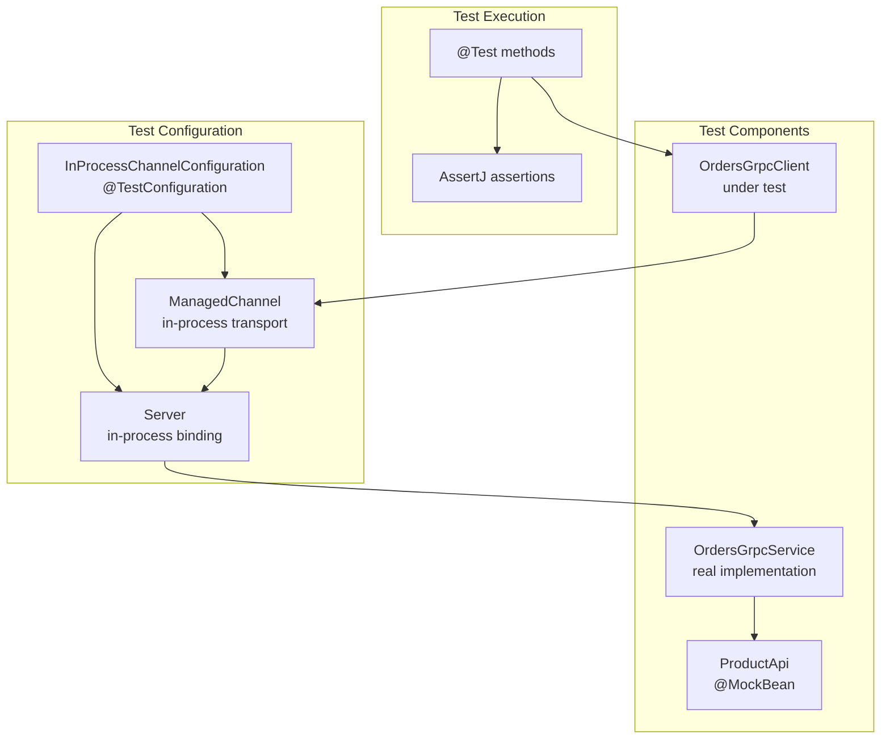

# gRPC Client and Retry Logic

> **Relevant source files**
> * [src/main/java/com/sivalabs/bookstore/config/GrpcHealthIndicator.java](https://github.com/philipz/spring-modular-monolith/blob/30c9bf30/src/main/java/com/sivalabs/bookstore/config/GrpcHealthIndicator.java)
> * [src/main/java/com/sivalabs/bookstore/config/GrpcProperties.java](https://github.com/philipz/spring-modular-monolith/blob/30c9bf30/src/main/java/com/sivalabs/bookstore/config/GrpcProperties.java)
> * [src/main/java/com/sivalabs/bookstore/config/GrpcRetryInterceptor.java](https://github.com/philipz/spring-modular-monolith/blob/30c9bf30/src/main/java/com/sivalabs/bookstore/config/GrpcRetryInterceptor.java)
> * [src/main/java/com/sivalabs/bookstore/config/GrpcServerConfig.java](https://github.com/philipz/spring-modular-monolith/blob/30c9bf30/src/main/java/com/sivalabs/bookstore/config/GrpcServerConfig.java)
> * [src/main/java/com/sivalabs/bookstore/orders/api/OrdersRemoteClient.java](https://github.com/philipz/spring-modular-monolith/blob/30c9bf30/src/main/java/com/sivalabs/bookstore/orders/api/OrdersRemoteClient.java)
> * [src/main/java/com/sivalabs/bookstore/orders/grpc/GrpcExceptionHandler.java](https://github.com/philipz/spring-modular-monolith/blob/30c9bf30/src/main/java/com/sivalabs/bookstore/orders/grpc/GrpcExceptionHandler.java)
> * [src/main/java/com/sivalabs/bookstore/orders/grpc/OrdersGrpcClient.java](https://github.com/philipz/spring-modular-monolith/blob/30c9bf30/src/main/java/com/sivalabs/bookstore/orders/grpc/OrdersGrpcClient.java)
> * [src/main/java/com/sivalabs/bookstore/orders/grpc/OrdersGrpcService.java](https://github.com/philipz/spring-modular-monolith/blob/30c9bf30/src/main/java/com/sivalabs/bookstore/orders/grpc/OrdersGrpcService.java)
> * [src/test/java/com/sivalabs/bookstore/orders/grpc/OrdersGrpcClientIntegrationTest.java](https://github.com/philipz/spring-modular-monolith/blob/30c9bf30/src/test/java/com/sivalabs/bookstore/orders/grpc/OrdersGrpcClientIntegrationTest.java)
> * [src/test/java/com/sivalabs/bookstore/orders/grpc/OrdersGrpcServiceIntegrationTest.java](https://github.com/philipz/spring-modular-monolith/blob/30c9bf30/src/test/java/com/sivalabs/bookstore/orders/grpc/OrdersGrpcServiceIntegrationTest.java)

## Purpose and Scope

This page documents the gRPC client infrastructure that enables the Spring Modular Monolith to communicate with the extracted orders-service via gRPC protocol. It covers the `OrdersGrpcClient` implementation, the `GrpcRetryInterceptor` that provides automatic retry with exponential backoff, deadline management, and exception mapping from gRPC status codes to domain exceptions.

For gRPC server configuration and lifecycle management, see [gRPC Server Configuration](/philipz/spring-modular-monolith/12.1-grpc-server-configuration). For protocol buffer message definitions and mapping between DTOs and protobuf, see [Protocol Buffer Messages and Mapping](/philipz/spring-modular-monolith/12.3-protocol-buffer-messages-and-mapping). For the overall orders-service extraction architecture, see [Orders Microservice Extraction](/philipz/spring-modular-monolith/13-orders-microservice-extraction).

## Client Architecture Overview

The gRPC client infrastructure consists of three main components:

1. **OrdersGrpcClient**: High-level client wrapper implementing the `OrdersRemoteClient` interface
2. **GrpcRetryInterceptor**: Client-side interceptor providing automatic retry with exponential backoff
3. **ManagedChannel**: gRPC channel with interceptors and deadline configuration

The following diagram illustrates the request flow through these components:



**Sources:**

* [src/main/java/com/sivalabs/bookstore/orders/grpc/OrdersGrpcClient.java L1-L111](https://github.com/philipz/spring-modular-monolith/blob/30c9bf30/src/main/java/com/sivalabs/bookstore/orders/grpc/OrdersGrpcClient.java#L1-L111)
* [src/main/java/com/sivalabs/bookstore/config/GrpcRetryInterceptor.java L1-L189](https://github.com/philipz/spring-modular-monolith/blob/30c9bf30/src/main/java/com/sivalabs/bookstore/config/GrpcRetryInterceptor.java#L1-L189)
* [src/main/java/com/sivalabs/bookstore/orders/api/OrdersRemoteClient.java L1-L15](https://github.com/philipz/spring-modular-monolith/blob/30c9bf30/src/main/java/com/sivalabs/bookstore/orders/api/OrdersRemoteClient.java#L1-L15)

## OrdersGrpcClient Implementation

The `OrdersGrpcClient` class serves as a thin wrapper around the generated `OrdersServiceBlockingStub`, translating between domain DTOs and protobuf messages while handling gRPC-specific concerns.

### Class Structure and Dependencies

| Component | Type | Purpose |
| --- | --- | --- |
| `ManagedChannel` | Injected Bean | gRPC transport layer with retry interceptor |
| `GrpcMessageMapper` | Injected Bean | Converts between DTOs and protobuf messages |
| `OrdersServiceBlockingStub` | Field | Generated gRPC stub for synchronous calls |
| `deadlineMs` | Configuration Property | Per-request deadline in milliseconds |

The client implements the `OrdersRemoteClient` interface, which defines three operations:



**Sources:**

* [src/main/java/com/sivalabs/bookstore/orders/grpc/OrdersGrpcClient.java L25-L45](https://github.com/philipz/spring-modular-monolith/blob/30c9bf30/src/main/java/com/sivalabs/bookstore/orders/grpc/OrdersGrpcClient.java#L25-L45)
* [src/main/java/com/sivalabs/bookstore/orders/api/OrdersRemoteClient.java L1-L15](https://github.com/philipz/spring-modular-monolith/blob/30c9bf30/src/main/java/com/sivalabs/bookstore/orders/api/OrdersRemoteClient.java#L1-L15)

### Request Execution Pattern

Each client method follows a consistent pattern:

1. **Map DTO to protobuf**: Use `GrpcMessageMapper` to convert domain request to protobuf message
2. **Apply deadline**: Call `stubWithDeadline()` to set per-request timeout
3. **Execute RPC**: Invoke the blocking stub method
4. **Map response**: Convert protobuf response back to domain DTO
5. **Handle exceptions**: Catch `StatusRuntimeException` and translate to domain exceptions

Example from `createOrder()` method:



**Sources:**

* [src/main/java/com/sivalabs/bookstore/orders/grpc/OrdersGrpcClient.java L47-L56](https://github.com/philipz/spring-modular-monolith/blob/30c9bf30/src/main/java/com/sivalabs/bookstore/orders/grpc/OrdersGrpcClient.java#L47-L56)
* [src/main/java/com/sivalabs/bookstore/orders/grpc/OrdersGrpcClient.java L58-L69](https://github.com/philipz/spring-modular-monolith/blob/30c9bf30/src/main/java/com/sivalabs/bookstore/orders/grpc/OrdersGrpcClient.java#L58-L69)
* [src/main/java/com/sivalabs/bookstore/orders/grpc/OrdersGrpcClient.java L71-L94](https://github.com/philipz/spring-modular-monolith/blob/30c9bf30/src/main/java/com/sivalabs/bookstore/orders/grpc/OrdersGrpcClient.java#L71-L94)

### Deadline Management

The `stubWithDeadline()` method applies a fresh deadline to each request, ensuring that operations don't hang indefinitely:

**Implementation:**

* [src/main/java/com/sivalabs/bookstore/orders/grpc/OrdersGrpcClient.java L96-L98](https://github.com/philipz/spring-modular-monolith/blob/30c9bf30/src/main/java/com/sivalabs/bookstore/orders/grpc/OrdersGrpcClient.java#L96-L98)

**Configuration:**

* Property: `bookstore.grpc.client.deadline-ms` (default: 5000ms)
* Injected via: [src/main/java/com/sivalabs/bookstore/orders/grpc/OrdersGrpcClient.java L35](https://github.com/philipz/spring-modular-monolith/blob/30c9bf30/src/main/java/com/sivalabs/bookstore/orders/grpc/OrdersGrpcClient.java#L35-L35)

The deadline is applied using `withDeadlineAfter(deadlineMs, TimeUnit.MILLISECONDS)`, which causes the gRPC call to fail with `DEADLINE_EXCEEDED` status if the server doesn't respond within the specified time.

**Sources:**

* [src/main/java/com/sivalabs/bookstore/config/GrpcProperties.java L93-L116](https://github.com/philipz/spring-modular-monolith/blob/30c9bf30/src/main/java/com/sivalabs/bookstore/config/GrpcProperties.java#L93-L116)
* [src/test/java/com/sivalabs/bookstore/orders/grpc/OrdersGrpcClientIntegrationTest.java L79-L82](https://github.com/philipz/spring-modular-monolith/blob/30c9bf30/src/test/java/com/sivalabs/bookstore/orders/grpc/OrdersGrpcClientIntegrationTest.java#L79-L82)

## GrpcRetryInterceptor Implementation

The `GrpcRetryInterceptor` provides automatic retry with exponential backoff for transient failures in unary gRPC calls.

### Retry Configuration

| Property | Default | Description |
| --- | --- | --- |
| `bookstore.grpc.client.retry-enabled` | `true` | Enable/disable retry logic |
| `bookstore.grpc.client.max-retry-attempts` | `3` | Maximum number of retry attempts |
| Base delay | `100ms` | Initial delay before first retry |
| Backoff strategy | Exponential | Delay doubles with each retry |

**Retryable Status Codes:**

* `UNAVAILABLE` (service temporarily unreachable)

The interceptor only retries on `UNAVAILABLE` status, which typically indicates network issues or temporary service unavailability. Other status codes like `INVALID_ARGUMENT`, `NOT_FOUND`, or `INTERNAL` are not retried as they represent non-transient errors.

**Sources:**

* [src/main/java/com/sivalabs/bookstore/config/GrpcRetryInterceptor.java L23-L34](https://github.com/philipz/spring-modular-monolith/blob/30c9bf30/src/main/java/com/sivalabs/bookstore/config/GrpcRetryInterceptor.java#L23-L34)
* [src/main/java/com/sivalabs/bookstore/config/GrpcProperties.java L93-L132](https://github.com/philipz/spring-modular-monolith/blob/30c9bf30/src/main/java/com/sivalabs/bookstore/config/GrpcProperties.java#L93-L132)

### Retry Mechanism Architecture



**Sources:**

* [src/main/java/com/sivalabs/bookstore/config/GrpcRetryInterceptor.java L42-L48](https://github.com/philipz/spring-modular-monolith/blob/30c9bf30/src/main/java/com/sivalabs/bookstore/config/GrpcRetryInterceptor.java#L42-L48)
* [src/main/java/com/sivalabs/bookstore/config/GrpcRetryInterceptor.java L50-L173](https://github.com/philipz/spring-modular-monolith/blob/30c9bf30/src/main/java/com/sivalabs/bookstore/config/GrpcRetryInterceptor.java#L50-L173)
* [src/main/java/com/sivalabs/bookstore/config/GrpcRetryInterceptor.java L175-L188](https://github.com/philipz/spring-modular-monolith/blob/30c9bf30/src/main/java/com/sivalabs/bookstore/config/GrpcRetryInterceptor.java#L175-L188)

### RetryingClientCall Implementation

The `RetryingClientCall` inner class wraps the actual gRPC call and manages retry state:

**Key Fields:**

* `attempt`: Current retry attempt number (starts at 1)
* `requestMessage`: Cached request for replay on retry
* `completed`: Volatile flag to prevent multiple completions
* `delegate`: The actual `ClientCall` being executed

**Retry Flow:**

1. **Initial call**: `start()` is invoked with the original listener
2. **Store metadata**: Cache headers and request message for potential retries
3. **Create delegate**: Call `startNewAttempt()` which creates a fresh `ClientCall` with a new deadline
4. **Register listener**: Attach `RetryListener` to observe response/error
5. **On failure**: If `UNAVAILABLE` and attempts remain, schedule retry after exponential backoff
6. **Replay request**: On retry, resend the cached request message with fresh deadline

**Exponential Backoff Calculation:**

```
delay = BASE_DELAY_MILLIS * 2^(attempt - 1)

attempt 1: 100ms * 2^0 = 100ms
attempt 2: 100ms * 2^1 = 200ms
attempt 3: 100ms * 2^2 = 400ms
```

**Sources:**

* [src/main/java/com/sivalabs/bookstore/config/GrpcRetryInterceptor.java L50-L75](https://github.com/philipz/spring-modular-monolith/blob/30c9bf30/src/main/java/com/sivalabs/bookstore/config/GrpcRetryInterceptor.java#L50-L75)
* [src/main/java/com/sivalabs/bookstore/config/GrpcRetryInterceptor.java L84-L99](https://github.com/philipz/spring-modular-monolith/blob/30c9bf30/src/main/java/com/sivalabs/bookstore/config/GrpcRetryInterceptor.java#L84-L99)
* [src/main/java/com/sivalabs/bookstore/config/GrpcRetryInterceptor.java L125-L172](https://github.com/philipz/spring-modular-monolith/blob/30c9bf30/src/main/java/com/sivalabs/bookstore/config/GrpcRetryInterceptor.java#L125-L172)
* [src/main/java/com/sivalabs/bookstore/config/GrpcRetryInterceptor.java L179-L181](https://github.com/philipz/spring-modular-monolith/blob/30c9bf30/src/main/java/com/sivalabs/bookstore/config/GrpcRetryInterceptor.java#L179-L181)

### Fresh Deadline on Retry

The `withFreshDeadline()` method ensures each retry attempt gets a full deadline allocation, preventing cascading timeout issues:

**Implementation:**

* [src/main/java/com/sivalabs/bookstore/config/GrpcRetryInterceptor.java L183-L188](https://github.com/philipz/spring-modular-monolith/blob/30c9bf30/src/main/java/com/sivalabs/bookstore/config/GrpcRetryInterceptor.java#L183-L188)

This is called in `startNewAttempt()` at [src/main/java/com/sivalabs/bookstore/config/GrpcRetryInterceptor.java L89](https://github.com/philipz/spring-modular-monolith/blob/30c9bf30/src/main/java/com/sivalabs/bookstore/config/GrpcRetryInterceptor.java#L89-L89)

 to create fresh `CallOptions` with a new deadline for each retry.

**Sources:**

* [src/main/java/com/sivalabs/bookstore/config/GrpcRetryInterceptor.java L84-L99](https://github.com/philipz/spring-modular-monolith/blob/30c9bf30/src/main/java/com/sivalabs/bookstore/config/GrpcRetryInterceptor.java#L84-L99)
* [src/main/java/com/sivalabs/bookstore/config/GrpcRetryInterceptor.java L183-L188](https://github.com/philipz/spring-modular-monolith/blob/30c9bf30/src/main/java/com/sivalabs/bookstore/config/GrpcRetryInterceptor.java#L183-L188)

## Exception Mapping

The `OrdersGrpcClient` translates gRPC `StatusRuntimeException` into domain-specific exceptions that align with the monolith's error handling patterns.

### Status Code to Exception Mapping

```mermaid
flowchart TD

StatusRuntimeException["StatusRuntimeException<br>(gRPC status)"]
NOT_FOUND["Status.Code.NOT_FOUND"]
INVALID_ARGUMENT["Status.Code.INVALID_ARGUMENT"]
Other["Other codes"]
OrderNotFoundException["OrderNotFoundException"]
InvalidOrderException["InvalidOrderException"]
Propagate["Propagate original<br>StatusRuntimeException"]

StatusRuntimeException --> NOT_FOUND
StatusRuntimeException --> INVALID_ARGUMENT
StatusRuntimeException --> Other
NOT_FOUND --> OrderNotFoundException
INVALID_ARGUMENT --> InvalidOrderException
Other --> Propagate

subgraph mapStatusRuntimeException() ["mapStatusRuntimeException()"]
    NOT_FOUND
    INVALID_ARGUMENT
    Other
end
```

**Mapping Table:**

| gRPC Status Code | Domain Exception | Use Case |
| --- | --- | --- |
| `NOT_FOUND` | `OrderNotFoundException` | Order doesn't exist in database |
| `INVALID_ARGUMENT` | `InvalidOrderException` | Validation failure, invalid product, quantity < 1 |
| Other codes | `StatusRuntimeException` | Propagated as-is for generic handling |

**Implementation:**

* [src/main/java/com/sivalabs/bookstore/orders/grpc/OrdersGrpcClient.java L100-L110](https://github.com/philipz/spring-modular-monolith/blob/30c9bf30/src/main/java/com/sivalabs/bookstore/orders/grpc/OrdersGrpcClient.java#L100-L110)

The exception mapping preserves the status description from the gRPC response, providing detailed error messages to the caller. This allows the REST API layer to translate these domain exceptions into appropriate HTTP status codes.

**Sources:**

* [src/main/java/com/sivalabs/bookstore/orders/grpc/OrdersGrpcClient.java L100-L110](https://github.com/philipz/spring-modular-monolith/blob/30c9bf30/src/main/java/com/sivalabs/bookstore/orders/grpc/OrdersGrpcClient.java#L100-L110)
* [src/test/java/com/sivalabs/bookstore/orders/grpc/OrdersGrpcClientIntegrationTest.java L188-L207](https://github.com/philipz/spring-modular-monolith/blob/30c9bf30/src/test/java/com/sivalabs/bookstore/orders/grpc/OrdersGrpcClientIntegrationTest.java#L188-L207)

### Exception Flow Example

The following demonstrates how validation errors propagate through the stack:



The server-side exception handling is documented in [Exception Handling and Error Responses](/philipz/spring-modular-monolith/7.3-exception-handling-and-error-responses).

**Sources:**

* [src/main/java/com/sivalabs/bookstore/orders/grpc/GrpcExceptionHandler.java L26-L72](https://github.com/philipz/spring-modular-monolith/blob/30c9bf30/src/main/java/com/sivalabs/bookstore/orders/grpc/GrpcExceptionHandler.java#L26-L72)
* [src/test/java/com/sivalabs/bookstore/orders/grpc/OrdersGrpcServiceIntegrationTest.java L307-L340](https://github.com/philipz/spring-modular-monolith/blob/30c9bf30/src/test/java/com/sivalabs/bookstore/orders/grpc/OrdersGrpcServiceIntegrationTest.java#L307-L340)

## Configuration Properties

The gRPC client is configured via the `GrpcProperties.ClientProperties` nested class:

### Client Properties Reference

| Property | Type | Default | Validation | Description |
| --- | --- | --- | --- | --- |
| `bookstore.grpc.client.target` | String | `localhost:9091` | - | gRPC server target (host:port) |
| `bookstore.grpc.client.deadline-ms` | int | `5000` | min=1000 | Per-request deadline in milliseconds |
| `bookstore.grpc.client.retry-enabled` | boolean | `true` | - | Enable automatic retry on UNAVAILABLE |
| `bookstore.grpc.client.max-retry-attempts` | int | `3` | min=1 | Maximum retry attempts before failure |

**Configuration Class:**

* [src/main/java/com/sivalabs/bookstore/config/GrpcProperties.java L93-L143](https://github.com/philipz/spring-modular-monolith/blob/30c9bf30/src/main/java/com/sivalabs/bookstore/config/GrpcProperties.java#L93-L143)

### Environment-Specific Configuration

In different deployment modes, the `target` property is configured to route to the appropriate service:

**In-Process (Monolith Only):**

```
bookstore.grpc.client.target=localhost:9091
```

Routes to the monolith's embedded gRPC server.

**External Service (Strangler Pattern):**

```
bookstore.grpc.client.target=orders-service:9090
```

Routes to the extracted orders-service microservice.

This configuration is controlled by environment variables in the Docker Compose and Kubernetes deployments, enabling progressive traffic migration as documented in [Traffic Migration Strategy](/philipz/spring-modular-monolith/10.4-traffic-migration-strategy).

**Sources:**

* [src/main/java/com/sivalabs/bookstore/config/GrpcProperties.java L93-L143](https://github.com/philipz/spring-modular-monolith/blob/30c9bf30/src/main/java/com/sivalabs/bookstore/config/GrpcProperties.java#L93-L143)

## Testing Strategies

The gRPC client is tested using in-process channels that eliminate network transport while preserving full gRPC semantics.

### In-Process Testing Architecture



**Test Configuration:**

* [src/test/java/com/sivalabs/bookstore/orders/grpc/OrdersGrpcClientIntegrationTest.java L209-L218](https://github.com/philipz/spring-modular-monolith/blob/30c9bf30/src/test/java/com/sivalabs/bookstore/orders/grpc/OrdersGrpcClientIntegrationTest.java#L209-L218)

**Server Setup:**

* [src/test/java/com/sivalabs/bookstore/orders/grpc/OrdersGrpcClientIntegrationTest.java L101-L109](https://github.com/philipz/spring-modular-monolith/blob/30c9bf30/src/test/java/com/sivalabs/bookstore/orders/grpc/OrdersGrpcClientIntegrationTest.java#L101-L109)

### Test Scenarios

The integration tests cover the following scenarios:

**Happy Path Tests:**

1. **Create Order**: Verifies order creation and persistence ([src/test/java/com/sivalabs/bookstore/orders/grpc/OrdersGrpcClientIntegrationTest.java L120-L139](https://github.com/philipz/spring-modular-monolith/blob/30c9bf30/src/test/java/com/sivalabs/bookstore/orders/grpc/OrdersGrpcClientIntegrationTest.java#L120-L139) )
2. **Get Order**: Verifies order retrieval ([src/test/java/com/sivalabs/bookstore/orders/grpc/OrdersGrpcClientIntegrationTest.java L141-L157](https://github.com/philipz/spring-modular-monolith/blob/30c9bf30/src/test/java/com/sivalabs/bookstore/orders/grpc/OrdersGrpcClientIntegrationTest.java#L141-L157) )
3. **List Orders**: Verifies pagination ([src/test/java/com/sivalabs/bookstore/orders/grpc/OrdersGrpcClientIntegrationTest.java L159-L186](https://github.com/philipz/spring-modular-monolith/blob/30c9bf30/src/test/java/com/sivalabs/bookstore/orders/grpc/OrdersGrpcClientIntegrationTest.java#L159-L186) )

**Exception Mapping Tests:**

* **Invalid Argument**: Negative quantity validation ([src/test/java/com/sivalabs/bookstore/orders/grpc/OrdersGrpcClientIntegrationTest.java L188-L207](https://github.com/philipz/spring-modular-monolith/blob/30c9bf30/src/test/java/com/sivalabs/bookstore/orders/grpc/OrdersGrpcClientIntegrationTest.java#L188-L207) )
* **Not Found**: Missing order lookup ([src/test/java/com/sivalabs/bookstore/orders/grpc/OrdersGrpcClientIntegrationTest.java L188-L207](https://github.com/philipz/spring-modular-monolith/blob/30c9bf30/src/test/java/com/sivalabs/bookstore/orders/grpc/OrdersGrpcClientIntegrationTest.java#L188-L207) )

**Test Properties:**

```
bookstore.cache.enabled=false
bookstore.session.hazelcast.enabled=false
bookstore.grpc.server.enabled=false
bookstore.grpc.client.retry-enabled=false
```

These properties disable caching, sessions, the embedded server, and retry logic to ensure deterministic test execution.

**Sources:**

* [src/test/java/com/sivalabs/bookstore/orders/grpc/OrdersGrpcClientIntegrationTest.java L51-L67](https://github.com/philipz/spring-modular-monolith/blob/30c9bf30/src/test/java/com/sivalabs/bookstore/orders/grpc/OrdersGrpcClientIntegrationTest.java#L51-L67)
* [src/test/java/com/sivalabs/bookstore/orders/grpc/OrdersGrpcClientIntegrationTest.java L188-L207](https://github.com/philipz/spring-modular-monolith/blob/30c9bf30/src/test/java/com/sivalabs/bookstore/orders/grpc/OrdersGrpcClientIntegrationTest.java#L188-L207)

## ManagedChannel Lifecycle

The `ManagedChannel` is created and managed by the Spring application context with proper shutdown handling:

**Channel Configuration:**

* Target address from `bookstore.grpc.client.target`
* Retry interceptor attached during channel creation
* Graceful shutdown on application termination

**Interceptor Registration:**
The `GrpcRetryInterceptor` is registered with the channel during bean creation, typically in a configuration class that constructs the `ManagedChannel` with interceptors.

**Shutdown:**
The `GrpcRetryInterceptor` includes a `@PreDestroy` method that shuts down its internal scheduler:

* [src/main/java/com/sivalabs/bookstore/config/GrpcRetryInterceptor.java L36-L39](https://github.com/philipz/spring-modular-monolith/blob/30c9bf30/src/main/java/com/sivalabs/bookstore/config/GrpcRetryInterceptor.java#L36-L39)

This ensures that all scheduled retry tasks are cancelled when the application stops, preventing resource leaks.

**Sources:**

* [src/main/java/com/sivalabs/bookstore/orders/grpc/OrdersGrpcClient.java L28-L40](https://github.com/philipz/spring-modular-monolith/blob/30c9bf30/src/main/java/com/sivalabs/bookstore/orders/grpc/OrdersGrpcClient.java#L28-L40)
* [src/main/java/com/sivalabs/bookstore/config/GrpcRetryInterceptor.java L36-L39](https://github.com/philipz/spring-modular-monolith/blob/30c9bf30/src/main/java/com/sivalabs/bookstore/config/GrpcRetryInterceptor.java#L36-L39)