# gRPC Infrastructure

> **Relevant source files**
> * [src/main/java/com/sivalabs/bookstore/config/GrpcHealthIndicator.java](https://github.com/philipz/spring-modular-monolith/blob/30c9bf30/src/main/java/com/sivalabs/bookstore/config/GrpcHealthIndicator.java)
> * [src/main/java/com/sivalabs/bookstore/config/GrpcProperties.java](https://github.com/philipz/spring-modular-monolith/blob/30c9bf30/src/main/java/com/sivalabs/bookstore/config/GrpcProperties.java)
> * [src/main/java/com/sivalabs/bookstore/config/GrpcRetryInterceptor.java](https://github.com/philipz/spring-modular-monolith/blob/30c9bf30/src/main/java/com/sivalabs/bookstore/config/GrpcRetryInterceptor.java)
> * [src/main/java/com/sivalabs/bookstore/config/GrpcServerConfig.java](https://github.com/philipz/spring-modular-monolith/blob/30c9bf30/src/main/java/com/sivalabs/bookstore/config/GrpcServerConfig.java)
> * [src/main/java/com/sivalabs/bookstore/orders/api/OrdersRemoteClient.java](https://github.com/philipz/spring-modular-monolith/blob/30c9bf30/src/main/java/com/sivalabs/bookstore/orders/api/OrdersRemoteClient.java)
> * [src/main/java/com/sivalabs/bookstore/orders/grpc/GrpcExceptionHandler.java](https://github.com/philipz/spring-modular-monolith/blob/30c9bf30/src/main/java/com/sivalabs/bookstore/orders/grpc/GrpcExceptionHandler.java)
> * [src/main/java/com/sivalabs/bookstore/orders/grpc/OrdersGrpcClient.java](https://github.com/philipz/spring-modular-monolith/blob/30c9bf30/src/main/java/com/sivalabs/bookstore/orders/grpc/OrdersGrpcClient.java)
> * [src/main/java/com/sivalabs/bookstore/orders/grpc/OrdersGrpcService.java](https://github.com/philipz/spring-modular-monolith/blob/30c9bf30/src/main/java/com/sivalabs/bookstore/orders/grpc/OrdersGrpcService.java)
> * [src/test/java/com/sivalabs/bookstore/orders/grpc/OrdersGrpcClientIntegrationTest.java](https://github.com/philipz/spring-modular-monolith/blob/30c9bf30/src/test/java/com/sivalabs/bookstore/orders/grpc/OrdersGrpcClientIntegrationTest.java)
> * [src/test/java/com/sivalabs/bookstore/orders/grpc/OrdersGrpcServiceIntegrationTest.java](https://github.com/philipz/spring-modular-monolith/blob/30c9bf30/src/test/java/com/sivalabs/bookstore/orders/grpc/OrdersGrpcServiceIntegrationTest.java)

This document describes the gRPC infrastructure used within the Spring Modular Monolith for inter-service communication. The gRPC layer provides a high-performance, strongly-typed RPC mechanism for the orders module to communicate with external services (particularly the extracted `orders-service` microservice) and to expose its own operations via gRPC protocols.

The gRPC infrastructure includes server configuration, client management with retry logic, protocol buffer message mapping, exception translation, and health monitoring. For REST API endpoints and web interfaces, see [REST API Endpoints](/philipz/spring-modular-monolith/7.1-rest-api-endpoints) and [Web Interface and Thymeleaf Templates](/philipz/spring-modular-monolith/7.4-web-interface-and-thymeleaf-templates). For details about the orders module business logic, see [Orders Module](/philipz/spring-modular-monolith/8.2-orders-module).

---

## Overview

The gRPC infrastructure consists of several key components:

* **Server Configuration**: `GrpcServerConfig` sets up the embedded gRPC server with health checks, reflection, and service registration
* **Client Implementation**: `OrdersGrpcClient` provides a typed client interface with deadline management
* **Retry Logic**: `GrpcRetryInterceptor` implements exponential backoff for transient failures
* **Exception Handling**: `GrpcExceptionHandler` translates domain exceptions to gRPC status codes
* **Message Mapping**: `GrpcMessageMapper` converts between domain DTOs and protocol buffer messages
* **Configuration**: `GrpcProperties` externalizes server and client settings
* **Health Monitoring**: `GrpcHealthIndicator` integrates with Spring Actuator

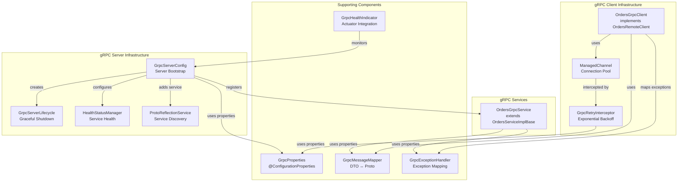

**Sources:**

* [src/main/java/com/sivalabs/bookstore/config/GrpcServerConfig.java L1-L77](https://github.com/philipz/spring-modular-monolith/blob/30c9bf30/src/main/java/com/sivalabs/bookstore/config/GrpcServerConfig.java#L1-L77)
* [src/main/java/com/sivalabs/bookstore/config/GrpcProperties.java L1-L144](https://github.com/philipz/spring-modular-monolith/blob/30c9bf30/src/main/java/com/sivalabs/bookstore/config/GrpcProperties.java#L1-L144)
* [src/main/java/com/sivalabs/bookstore/orders/grpc/OrdersGrpcClient.java L1-L111](https://github.com/philipz/spring-modular-monolith/blob/30c9bf30/src/main/java/com/sivalabs/bookstore/orders/grpc/OrdersGrpcClient.java#L1-L111)
* [src/main/java/com/sivalabs/bookstore/orders/grpc/OrdersGrpcService.java L1-L107](https://github.com/philipz/spring-modular-monolith/blob/30c9bf30/src/main/java/com/sivalabs/bookstore/orders/grpc/OrdersGrpcService.java#L1-L107)

---

## gRPC Server Configuration

The `GrpcServerConfig` class provides the core server infrastructure, bootstrapping a gRPC server on a configurable port with various capabilities enabled.

### Server Bean Creation

The `grpcServer` bean is created in [GrpcServerConfig.java L30-L61](https://github.com/philipz/spring-modular-monolith/blob/30c9bf30/GrpcServerConfig.java#L30-L61)

 and performs the following setup:

| Configuration Aspect | Implementation | Configuration Property |
| --- | --- | --- |
| Port binding | `ServerBuilder.forPort()` | `bookstore.grpc.server.port` (default: 9091) |
| Message size limit | `maxInboundMessageSize()` | `bookstore.grpc.server.max-inbound-message-size` (default: 4MB) |
| Health checks | `HealthStatusManager` | `bookstore.grpc.server.health-check-enabled` (default: true) |
| Service reflection | `ProtoReflectionService` | `bookstore.grpc.server.reflection-enabled` (default: true) |
| Graceful shutdown | `GrpcServerLifecycle` | `bookstore.grpc.server.shutdown-grace-period-seconds` (default: 30) |

The server automatically discovers all Spring beans implementing `BindableService` and registers them:

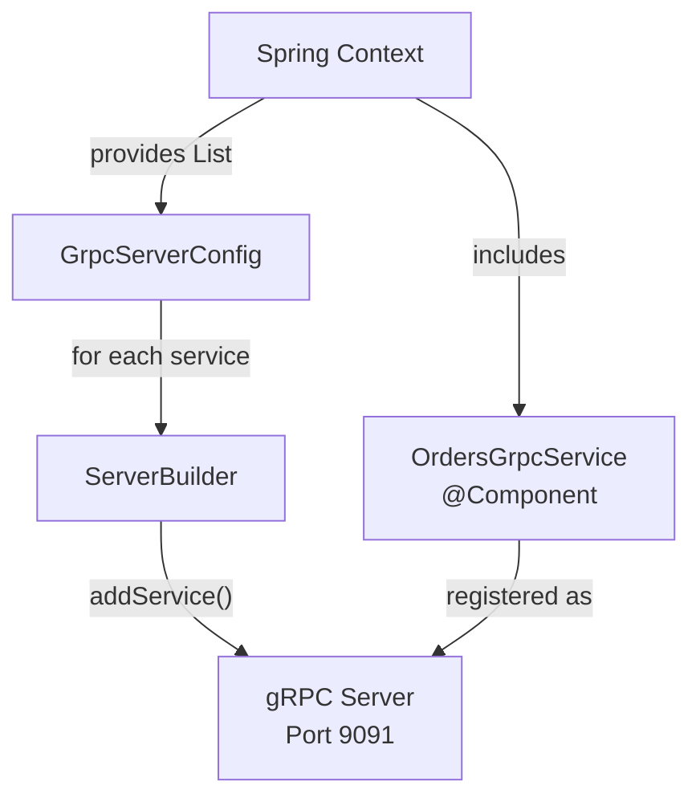

### Health Check Integration

When health checks are enabled, the server registers a `HealthStatusManager` at [GrpcServerConfig.java L40-L45](https://github.com/philipz/spring-modular-monolith/blob/30c9bf30/GrpcServerConfig.java#L40-L45)

 and sets the serving status for each registered service at [GrpcServerConfig.java L50-L53](https://github.com/philipz/spring-modular-monolith/blob/30c9bf30/GrpcServerConfig.java#L50-L53)

:

* Empty service name (`""`) indicates overall server health
* Individual service names reflect per-service health status
* Status values: `SERVING`, `NOT_SERVING`, `UNKNOWN`, `SERVICE_UNKNOWN`

### Service Reflection

Service reflection is enabled by default at [GrpcServerConfig.java L56-L58](https://github.com/philipz/spring-modular-monolith/blob/30c9bf30/GrpcServerConfig.java#L56-L58)

 allowing clients to discover available services and methods at runtime. This is particularly useful for tools like `grpcurl` or gRPC-based UI explorers.

### Lifecycle Management

The `GrpcServerLifecycle` bean created at [GrpcServerConfig.java L72-L76](https://github.com/philipz/spring-modular-monolith/blob/30c9bf30/GrpcServerConfig.java#L72-L76)

 implements `SmartLifecycle` to:

1. Start the gRPC server when Spring context initializes
2. Gracefully shutdown the server on application stop, waiting up to the configured grace period for in-flight RPCs to complete

**Sources:**

* [src/main/java/com/sivalabs/bookstore/config/GrpcServerConfig.java L1-L77](https://github.com/philipz/spring-modular-monolith/blob/30c9bf30/src/main/java/com/sivalabs/bookstore/config/GrpcServerConfig.java#L1-L77)
* [src/main/java/com/sivalabs/bookstore/config/GrpcProperties.java L30-L89](https://github.com/philipz/spring-modular-monolith/blob/30c9bf30/src/main/java/com/sivalabs/bookstore/config/GrpcProperties.java#L30-L89)

---

## gRPC Client and Retry Logic

The gRPC client infrastructure provides a resilient communication layer with automatic retry capabilities for transient failures.

### OrdersGrpcClient Implementation

`OrdersGrpcClient` implements the `OrdersRemoteClient` interface at [OrdersGrpcClient.java L26](https://github.com/philipz/spring-modular-monolith/blob/30c9bf30/OrdersGrpcClient.java#L26-L26)

 providing three primary operations:

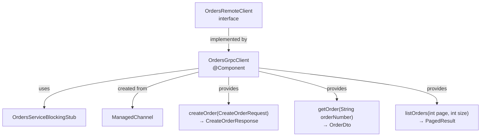

Each method follows a consistent pattern:

1. Convert domain DTO to protobuf message using `GrpcMessageMapper`
2. Apply deadline using `stubWithDeadline()` at [OrdersGrpcClient.java L96-L98](https://github.com/philipz/spring-modular-monolith/blob/30c9bf30/OrdersGrpcClient.java#L96-L98)
3. Execute the gRPC call
4. Convert protobuf response back to domain DTO
5. Map any `StatusRuntimeException` to domain exceptions at [OrdersGrpcClient.java L100-L110](https://github.com/philipz/spring-modular-monolith/blob/30c9bf30/OrdersGrpcClient.java#L100-L110)

### Deadline Management

All client calls use per-call deadlines configured via `bookstore.grpc.client.deadline-ms` (default: 5000ms). The deadline is applied at [OrdersGrpcClient.java L97](https://github.com/philipz/spring-modular-monolith/blob/30c9bf30/OrdersGrpcClient.java#L97-L97)

:

```
blockingStub.withDeadlineAfter(deadlineMs, TimeUnit.MILLISECONDS)
```

This ensures calls fail fast rather than hanging indefinitely.

### Retry Interceptor

`GrpcRetryInterceptor` implements automatic retry with exponential backoff at [GrpcRetryInterceptor.java L23-L189](https://github.com/philipz/spring-modular-monolith/blob/30c9bf30/GrpcRetryInterceptor.java#L23-L189)

 The interceptor only retries unary calls (not streaming RPCs) with retryable status codes.

**Retry Configuration:**

| Property | Default | Description |
| --- | --- | --- |
| `bookstore.grpc.client.retry-enabled` | true | Enable/disable retry logic |
| `bookstore.grpc.client.max-retry-attempts` | 3 | Maximum retry attempts |
| Base delay | 100ms | Initial backoff delay (hardcoded) |
| Backoff multiplier | 2x | Exponential multiplier |

**Retryable Status Codes:**

The interceptor only retries on `UNAVAILABLE` status at [GrpcRetryInterceptor.java L26](https://github.com/philipz/spring-modular-monolith/blob/30c9bf30/GrpcRetryInterceptor.java#L26-L26)

 which indicates transient network issues or temporary service unavailability.

**Exponential Backoff:**

The delay calculation at [GrpcRetryInterceptor.java L179-L181](https://github.com/philipz/spring-modular-monolith/blob/30c9bf30/GrpcRetryInterceptor.java#L179-L181)

 uses the formula:

```
delay = BASE_DELAY_MILLIS * 2^(attempt - 1)
```

For 3 attempts with 100ms base delay:

* Attempt 1: Immediate
* Attempt 2: 100ms delay
* Attempt 3: 200ms delay
* Attempt 4: 400ms delay

### Retry Flow Diagram

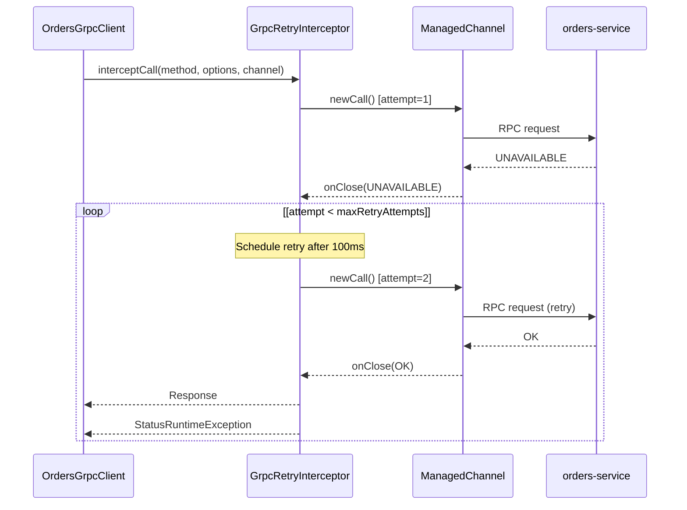

**Sources:**

* [src/main/java/com/sivalabs/bookstore/orders/grpc/OrdersGrpcClient.java L1-L111](https://github.com/philipz/spring-modular-monolith/blob/30c9bf30/src/main/java/com/sivalabs/bookstore/orders/grpc/OrdersGrpcClient.java#L1-L111)
* [src/main/java/com/sivalabs/bookstore/config/GrpcRetryInterceptor.java L1-L189](https://github.com/philipz/spring-modular-monolith/blob/30c9bf30/src/main/java/com/sivalabs/bookstore/config/GrpcRetryInterceptor.java#L1-L189)
* [src/main/java/com/sivalabs/bookstore/orders/api/OrdersRemoteClient.java L1-L15](https://github.com/philipz/spring-modular-monolith/blob/30c9bf30/src/main/java/com/sivalabs/bookstore/orders/api/OrdersRemoteClient.java#L1-L15)
* [src/main/java/com/sivalabs/bookstore/config/GrpcProperties.java L93-L143](https://github.com/philipz/spring-modular-monolith/blob/30c9bf30/src/main/java/com/sivalabs/bookstore/config/GrpcProperties.java#L93-L143)

---

## Protocol Buffer Messages and Mapping

The gRPC infrastructure uses protocol buffer messages defined in `orders.proto` for serialization. The `GrpcMessageMapper` component provides bidirectional conversion between domain DTOs and protobuf messages.

### Message Mapping Responsibilities

`GrpcMessageMapper` handles conversion for:

| Domain Type | Protocol Buffer Type | Mapping Methods |
| --- | --- | --- |
| `CreateOrderRequest` | `com.sivalabs.bookstore.orders.grpc.proto.CreateOrderRequest` | `toCreateOrderRequestProto()`, `toCreateOrderRequest()` |
| `CreateOrderResponse` | `com.sivalabs.bookstore.orders.grpc.proto.CreateOrderResponse` | `toCreateOrderResponse()`, `toCreateOrderResponseDto()` |
| `OrderDto` | `com.sivalabs.bookstore.orders.grpc.proto.Order` | `toOrderDto()`, `toOrderDtoDto()` |
| `OrderView` | `com.sivalabs.bookstore.orders.grpc.proto.OrderView` | `toOrderView()`, `toOrderViewDto()` |
| `OrderStatus` | `com.sivalabs.bookstore.orders.grpc.proto.OrderStatus` | Enum mapping |

### Mapping Flow

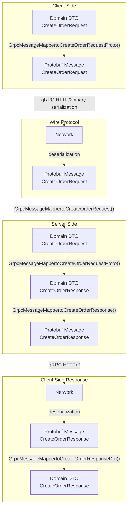

### Server-Side Usage

In `OrdersGrpcService`, the mapper is used at key points:

1. **Request mapping** at [OrdersGrpcService.java L35](https://github.com/philipz/spring-modular-monolith/blob/30c9bf30/OrdersGrpcService.java#L35-L35) : Convert incoming protobuf to domain DTO
2. **Response mapping** at [OrdersGrpcService.java L38](https://github.com/philipz/spring-modular-monolith/blob/30c9bf30/OrdersGrpcService.java#L38-L38) : Convert domain response to protobuf
3. **Entity mapping** at [OrdersGrpcService.java L58](https://github.com/philipz/spring-modular-monolith/blob/30c9bf30/OrdersGrpcService.java#L58-L58)  and [OrdersGrpcService.java L79](https://github.com/philipz/spring-modular-monolith/blob/30c9bf30/OrdersGrpcService.java#L79-L79) : Convert domain entities to protobuf

### Client-Side Usage

In `OrdersGrpcClient`, the mapper is used for:

1. **Request preparation** at [OrdersGrpcClient.java L49](https://github.com/philipz/spring-modular-monolith/blob/30c9bf30/OrdersGrpcClient.java#L49-L49) : Convert domain DTO to protobuf before RPC
2. **Response conversion** at [OrdersGrpcClient.java L52](https://github.com/philipz/spring-modular-monolith/blob/30c9bf30/OrdersGrpcClient.java#L52-L52)  [OrdersGrpcClient.java L65](https://github.com/philipz/spring-modular-monolith/blob/30c9bf30/OrdersGrpcClient.java#L65-L65)  [OrdersGrpcClient.java L80](https://github.com/philipz/spring-modular-monolith/blob/30c9bf30/OrdersGrpcClient.java#L80-L80) : Convert protobuf response back to domain DTO

**Sources:**

* [src/main/java/com/sivalabs/bookstore/orders/grpc/OrdersGrpcService.java L1-L107](https://github.com/philipz/spring-modular-monolith/blob/30c9bf30/src/main/java/com/sivalabs/bookstore/orders/grpc/OrdersGrpcService.java#L1-L107)
* [src/main/java/com/sivalabs/bookstore/orders/grpc/OrdersGrpcClient.java L1-L111](https://github.com/philipz/spring-modular-monolith/blob/30c9bf30/src/main/java/com/sivalabs/bookstore/orders/grpc/OrdersGrpcClient.java#L1-L111)

---

## Exception Handling

The `GrpcExceptionHandler` utility translates domain exceptions into gRPC `StatusRuntimeException` instances with appropriate status codes, ensuring consistent error reporting across the gRPC boundary.

### Exception Mapping Table

| Domain Exception | gRPC Status Code | Description Field | Implementation |
| --- | --- | --- | --- |
| `OrderNotFoundException` | `NOT_FOUND` | Exception message | [GrpcExceptionHandler.java L31-L36](https://github.com/philipz/spring-modular-monolith/blob/30c9bf30/GrpcExceptionHandler.java#L31-L36) |
| `InvalidOrderException` | `INVALID_ARGUMENT` | Exception message | [GrpcExceptionHandler.java L39-L45](https://github.com/philipz/spring-modular-monolith/blob/30c9bf30/GrpcExceptionHandler.java#L39-L45) |
| `ConstraintViolationException` | `INVALID_ARGUMENT` | Formatted violations | [GrpcExceptionHandler.java L47-L65](https://github.com/philipz/spring-modular-monolith/blob/30c9bf30/GrpcExceptionHandler.java#L47-L65) |
| `StatusRuntimeException` | (preserved) | Original status | [GrpcExceptionHandler.java L27-L30](https://github.com/philipz/spring-modular-monolith/blob/30c9bf30/GrpcExceptionHandler.java#L27-L30) |
| All other exceptions | `INTERNAL` | Exception message | [GrpcExceptionHandler.java L67-L72](https://github.com/philipz/spring-modular-monolith/blob/30c9bf30/GrpcExceptionHandler.java#L67-L72) |

### Exception Handling Flow

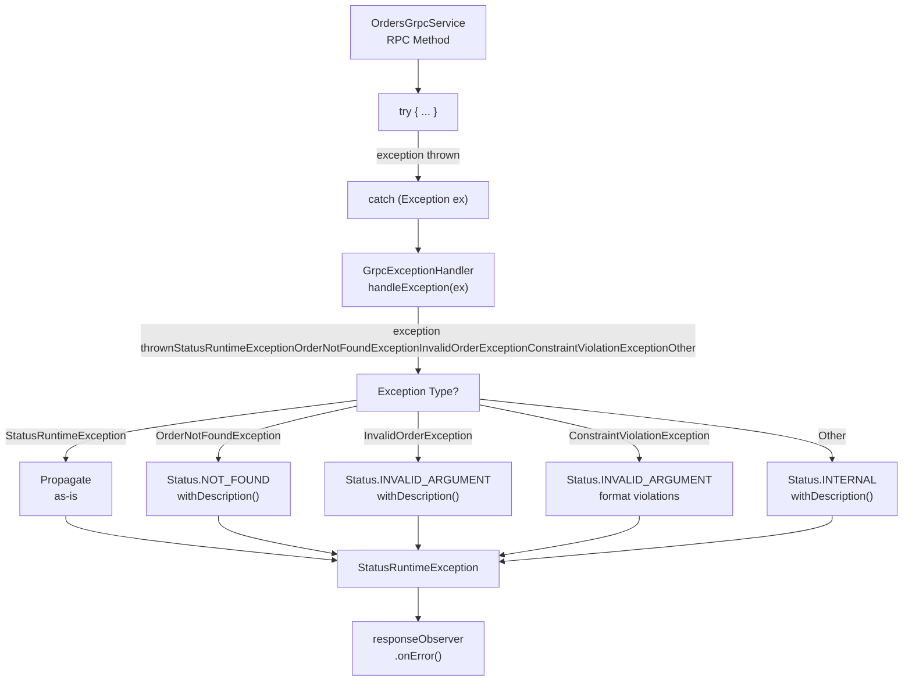

### Constraint Violation Formatting

For `ConstraintViolationException`, the handler formats violations at [GrpcExceptionHandler.java L49-L54](https://github.com/philipz/spring-modular-monolith/blob/30c9bf30/GrpcExceptionHandler.java#L49-L54)

 by:

1. Extracting all `ConstraintViolation` instances
2. Formatting each as `propertyPath: message` using [GrpcExceptionHandler.java L74-L76](https://github.com/philipz/spring-modular-monolith/blob/30c9bf30/GrpcExceptionHandler.java#L74-L76)
3. Joining violations with comma separators
4. Using the formatted string as the gRPC status description

Example output: `customer.name: Customer Name is required, orderItem.quantity: Quantity must be greater than 0`

### Server-Side Usage

Both server and client use the exception handler:

* **Server**: `OrdersGrpcService` calls `GrpcExceptionHandler.handleException()` in catch blocks at [OrdersGrpcService.java L42](https://github.com/philipz/spring-modular-monolith/blob/30c9bf30/OrdersGrpcService.java#L42-L42)  [OrdersGrpcService.java L53](https://github.com/philipz/spring-modular-monolith/blob/30c9bf30/OrdersGrpcService.java#L53-L53)  [OrdersGrpcService.java L65](https://github.com/philipz/spring-modular-monolith/blob/30c9bf30/OrdersGrpcService.java#L65-L65)  [OrdersGrpcService.java L94](https://github.com/philipz/spring-modular-monolith/blob/30c9bf30/OrdersGrpcService.java#L94-L94)
* **Client**: `OrdersGrpcClient` maps `StatusRuntimeException` back to domain exceptions at [OrdersGrpcClient.java L100-L110](https://github.com/philipz/spring-modular-monolith/blob/30c9bf30/OrdersGrpcClient.java#L100-L110)  using reverse mapping: * `NOT_FOUND` → `OrderNotFoundException` * `INVALID_ARGUMENT` → `InvalidOrderException` * Other codes → propagated as-is

**Sources:**

* [src/main/java/com/sivalabs/bookstore/orders/grpc/GrpcExceptionHandler.java L1-L77](https://github.com/philipz/spring-modular-monolith/blob/30c9bf30/src/main/java/com/sivalabs/bookstore/orders/grpc/GrpcExceptionHandler.java#L1-L77)
* [src/main/java/com/sivalabs/bookstore/orders/grpc/OrdersGrpcService.java L41-L43](https://github.com/philipz/spring-modular-monolith/blob/30c9bf30/src/main/java/com/sivalabs/bookstore/orders/grpc/OrdersGrpcService.java#L41-L43)
* [src/main/java/com/sivalabs/bookstore/orders/grpc/OrdersGrpcClient.java L100-L110](https://github.com/philipz/spring-modular-monolith/blob/30c9bf30/src/main/java/com/sivalabs/bookstore/orders/grpc/OrdersGrpcClient.java#L100-L110)

---

## Configuration Properties

All gRPC configuration is externalized through `GrpcProperties` bound to the `bookstore.grpc` prefix at [GrpcProperties.java L14](https://github.com/philipz/spring-modular-monolith/blob/30c9bf30/GrpcProperties.java#L14-L14)

### Server Properties

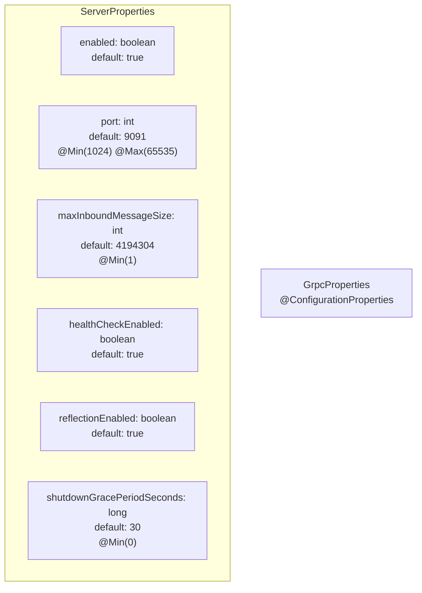

**Server Configuration Properties:**

| Property | Type | Default | Validation | Description |
| --- | --- | --- | --- | --- |
| `bookstore.grpc.server.enabled` | boolean | true | - | Enable/disable gRPC server |
| `bookstore.grpc.server.port` | int | 9091 | 1024-65535 | Server listening port |
| `bookstore.grpc.server.max-inbound-message-size` | int | 4194304 | ≥1 | Maximum message size (4MB default) |
| `bookstore.grpc.server.health-check-enabled` | boolean | true | - | Enable gRPC health service |
| `bookstore.grpc.server.reflection-enabled` | boolean | true | - | Enable service reflection |
| `bookstore.grpc.server.shutdown-grace-period-seconds` | long | 30 | ≥0 | Graceful shutdown timeout |

### Client Properties

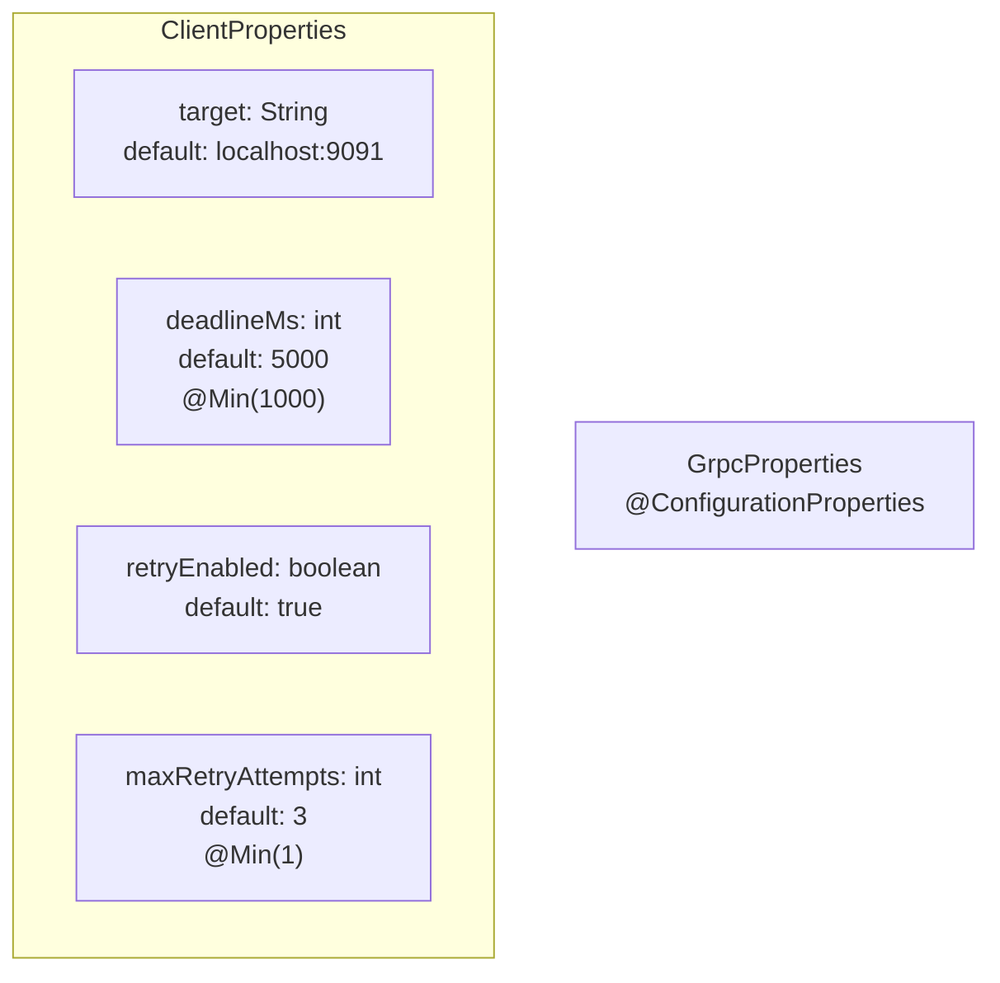

**Client Configuration Properties:**

| Property | Type | Default | Validation | Description |
| --- | --- | --- | --- | --- |
| `bookstore.grpc.client.target` | String | localhost:9091 | - | Target server address |
| `bookstore.grpc.client.deadline-ms` | int | 5000 | ≥1000 | Per-call timeout in milliseconds |
| `bookstore.grpc.client.retry-enabled` | boolean | true | - | Enable automatic retries |
| `bookstore.grpc.client.max-retry-attempts` | int | 3 | ≥1 | Maximum retry attempts |

### Configuration in application.properties

Example configuration from the deployed system:

```
bookstore.grpc.server.enabled=true
bookstore.grpc.server.port=9091
bookstore.grpc.server.max-inbound-message-size=4194304
bookstore.grpc.server.health-check-enabled=true
bookstore.grpc.server.reflection-enabled=true
bookstore.grpc.server.shutdown-grace-period-seconds=30

bookstore.grpc.client.target=localhost:9091
bookstore.grpc.client.deadline-ms=5000
bookstore.grpc.client.retry-enabled=true
bookstore.grpc.client.max-retry-attempts=3
```

**Sources:**

* [src/main/java/com/sivalabs/bookstore/config/GrpcProperties.java L1-L144](https://github.com/philipz/spring-modular-monolith/blob/30c9bf30/src/main/java/com/sivalabs/bookstore/config/GrpcProperties.java#L1-L144)

---

## Health Monitoring

The `GrpcHealthIndicator` integrates gRPC server health with Spring Boot Actuator at [GrpcHealthIndicator.java L1-L39](https://github.com/philipz/spring-modular-monolith/blob/30c9bf30/GrpcHealthIndicator.java#L1-L39)

### Health Check Implementation

The health indicator checks the server state at [GrpcHealthIndicator.java L26-L38](https://github.com/philipz/spring-modular-monolith/blob/30c9bf30/GrpcHealthIndicator.java#L26-L38)

:

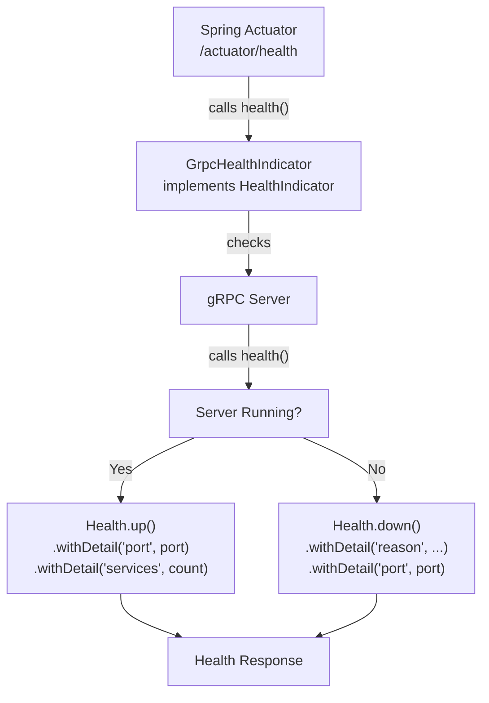

### Health Response Format

**Server Running (UP):**

```json
{
  "status": "UP",
  "details": {
    "port": 9091,
    "services": 1
  }
}
```

**Server Not Running (DOWN):**

```json
{
  "status": "DOWN",
  "details": {
    "reason": "gRPC server not running",
    "port": 9091
  }
}
```

### Conditional Registration

The health indicator is only registered when:

1. `Server.class` is on the classpath (`@ConditionalOnClass`) at [GrpcHealthIndicator.java L15](https://github.com/philipz/spring-modular-monolith/blob/30c9bf30/GrpcHealthIndicator.java#L15-L15)
2. A `Server` bean exists in the context (`@ConditionalOnBean`) at [GrpcHealthIndicator.java L16](https://github.com/philipz/spring-modular-monolith/blob/30c9bf30/GrpcHealthIndicator.java#L16-L16)

This ensures the health check is automatically disabled when the gRPC server is disabled via `bookstore.grpc.server.enabled=false`.

**Sources:**

* [src/main/java/com/sivalabs/bookstore/config/GrpcHealthIndicator.java L1-L39](https://github.com/philipz/spring-modular-monolith/blob/30c9bf30/src/main/java/com/sivalabs/bookstore/config/GrpcHealthIndicator.java#L1-L39)

---

## Testing Infrastructure

The gRPC infrastructure includes comprehensive integration tests using in-process channels for fast, isolated testing.

### Test Setup Pattern

Both `OrdersGrpcServiceIntegrationTest` and `OrdersGrpcClientIntegrationTest` use the in-process channel approach:

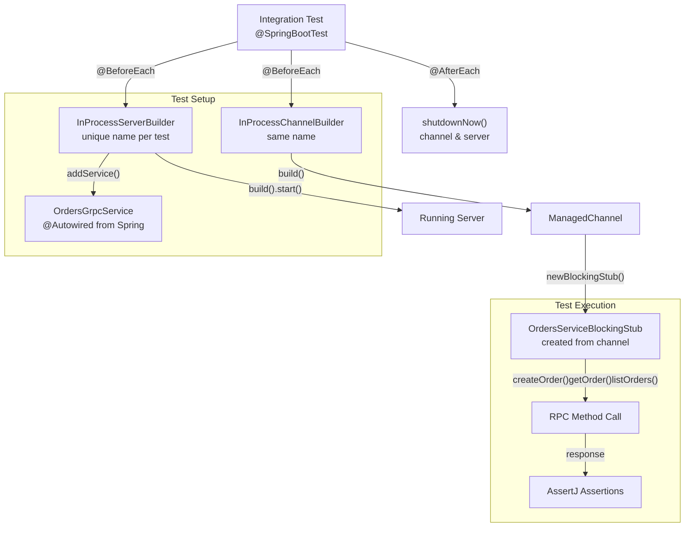

### Test Configuration

Tests disable production infrastructure to isolate gRPC testing:

```markdown
bookstore.cache.enabled=false
bookstore.session.hazelcast.enabled=false
bookstore.grpc.server.enabled=false  # Use in-process server instead
bookstore.grpc.client.retry-enabled=false  # Optional: disable retries for predictable tests
```

### Example Test Cases

From `OrdersGrpcServiceIntegrationTest`:

| Test Case | Scenario | Verification |
| --- | --- | --- |
| `createOrderCreatesPersistentOrderWithGeneratedOrderNumber` | Valid order creation | Order persisted to database with generated number |
| `getOrderReturnsPersistedOrderWhenOrderExists` | Retrieve existing order | Correct order details returned |
| `listOrdersReturnsAllCreatedOrders` | Pagination query | All created orders returned with pagination metadata |
| `createOrderWithEmptyCustomerNameReturnsInvalidArgument` | Validation failure | `INVALID_ARGUMENT` status with validation message |
| `getOrderThrowsNotFoundWhenOrderDoesNotExist` | Missing order | `NOT_FOUND` status with order number in description |

**Sources:**

* [src/test/java/com/sivalabs/bookstore/orders/grpc/OrdersGrpcServiceIntegrationTest.java L1-L394](https://github.com/philipz/spring-modular-monolith/blob/30c9bf30/src/test/java/com/sivalabs/bookstore/orders/grpc/OrdersGrpcServiceIntegrationTest.java#L1-L394)
* [src/test/java/com/sivalabs/bookstore/orders/grpc/OrdersGrpcClientIntegrationTest.java L1-L219](https://github.com/philipz/spring-modular-monolith/blob/30c9bf30/src/test/java/com/sivalabs/bookstore/orders/grpc/OrdersGrpcClientIntegrationTest.java#L1-L219)

---

## Integration with Orders Module

The gRPC infrastructure is tightly integrated with the orders module, providing both server and client implementations.

### Component Interactions

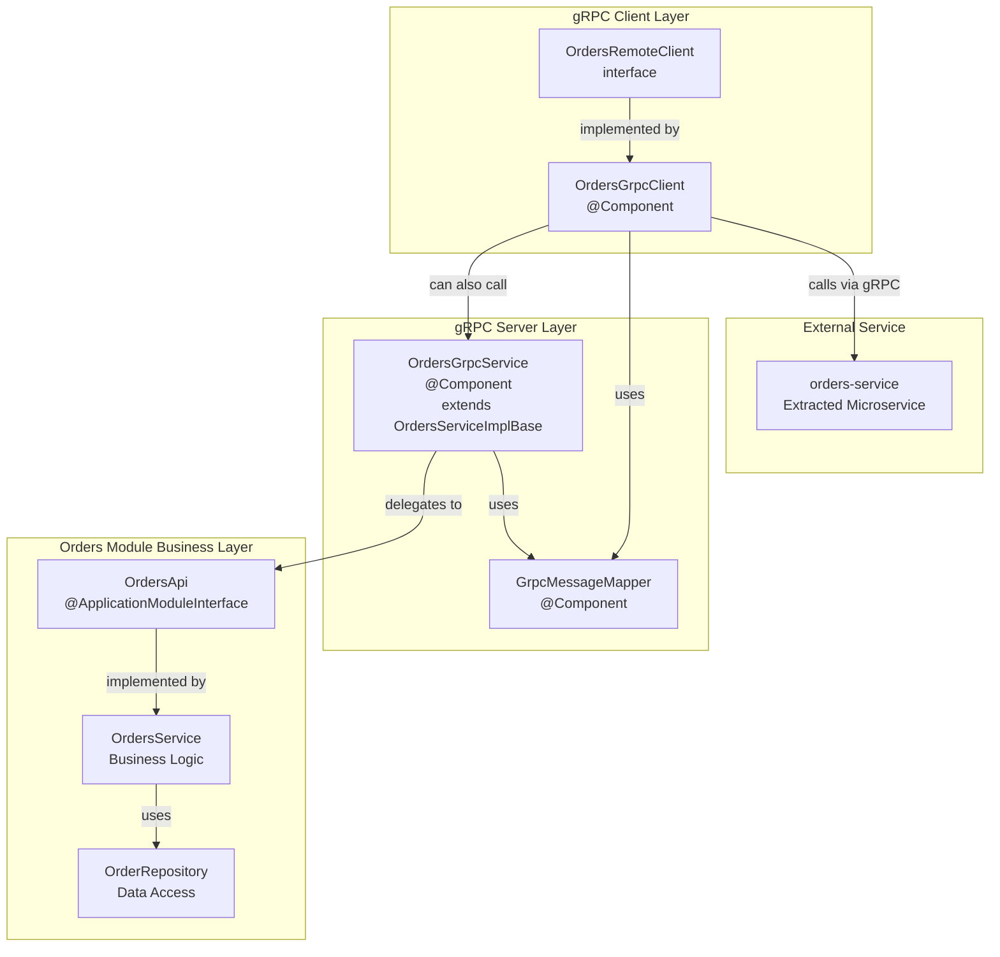

### Dual-Mode Operation

The system supports two operational modes via configuration:

**Monolithic Mode:**

```markdown
# Client targets local gRPC server
bookstore.grpc.client.target=localhost:9091
```

In this mode, `OrdersGrpcClient` calls the in-process `OrdersGrpcService`, essentially making it a local call through the gRPC layer.

**Microservice Mode:**

```markdown
# Client targets external orders-service
bookstore.grpc.client.target=orders-service:9090
```

In this mode, `OrdersGrpcClient` calls the extracted `orders-service`, enabling the strangler pattern for gradual migration. See [Orders Microservice Extraction](/philipz/spring-modular-monolith/13-orders-microservice-extraction) for details.

**Sources:**

* [src/main/java/com/sivalabs/bookstore/orders/grpc/OrdersGrpcService.java L1-L107](https://github.com/philipz/spring-modular-monolith/blob/30c9bf30/src/main/java/com/sivalabs/bookstore/orders/grpc/OrdersGrpcService.java#L1-L107)
* [src/main/java/com/sivalabs/bookstore/orders/grpc/OrdersGrpcClient.java L1-L111](https://github.com/philipz/spring-modular-monolith/blob/30c9bf30/src/main/java/com/sivalabs/bookstore/orders/grpc/OrdersGrpcClient.java#L1-L111)
* [src/main/java/com/sivalabs/bookstore/orders/api/OrdersRemoteClient.java L1-L15](https://github.com/philipz/spring-modular-monolith/blob/30c9bf30/src/main/java/com/sivalabs/bookstore/orders/api/OrdersRemoteClient.java#L1-L15)