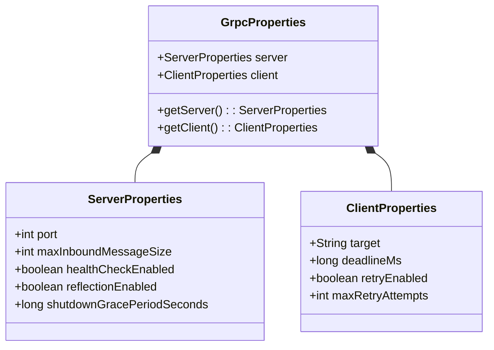
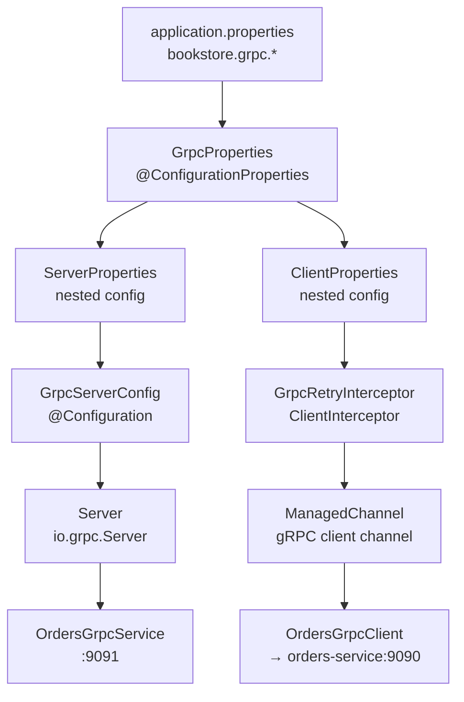
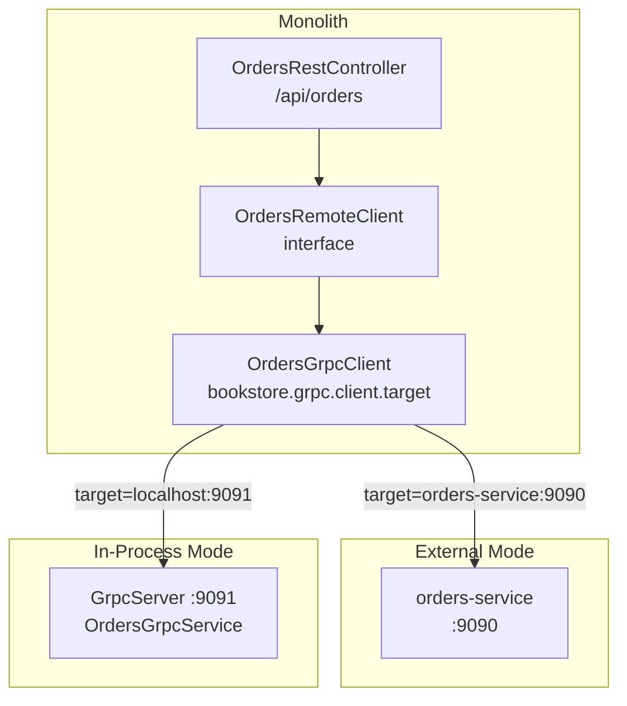

# gRPC Properties

> **Relevant source files**
> * [README-API.md](https://github.com/philipz/spring-modular-monolith/blob/30c9bf30/README-API.md)
> * [README.md](https://github.com/philipz/spring-modular-monolith/blob/30c9bf30/README.md)
> * [docs/API_ANALYSIS_SUMMARY.txt](https://github.com/philipz/spring-modular-monolith/blob/30c9bf30/docs/API_ANALYSIS_SUMMARY.txt)
> * [docs/REST_API_ANALYSIS.md](https://github.com/philipz/spring-modular-monolith/blob/30c9bf30/docs/REST_API_ANALYSIS.md)
> * [docs/bookstore-microservices.png](https://github.com/philipz/spring-modular-monolith/blob/30c9bf30/docs/bookstore-microservices.png)
> * [docs/improvement.md](https://github.com/philipz/spring-modular-monolith/blob/30c9bf30/docs/improvement.md)
> * [docs/orders-data-ownership-analysis.md](https://github.com/philipz/spring-modular-monolith/blob/30c9bf30/docs/orders-data-ownership-analysis.md)
> * [docs/orders-module-boundary-analysis.md](https://github.com/philipz/spring-modular-monolith/blob/30c9bf30/docs/orders-module-boundary-analysis.md)
> * [docs/orders-traffic-migration.md](https://github.com/philipz/spring-modular-monolith/blob/30c9bf30/docs/orders-traffic-migration.md)
> * [k6.js](https://github.com/philipz/spring-modular-monolith/blob/30c9bf30/k6.js)
> * [src/main/java/com/sivalabs/bookstore/config/GrpcRetryInterceptor.java](https://github.com/philipz/spring-modular-monolith/blob/30c9bf30/src/main/java/com/sivalabs/bookstore/config/GrpcRetryInterceptor.java)
> * [src/main/java/com/sivalabs/bookstore/config/GrpcServerConfig.java](https://github.com/philipz/spring-modular-monolith/blob/30c9bf30/src/main/java/com/sivalabs/bookstore/config/GrpcServerConfig.java)
> * [src/main/java/com/sivalabs/bookstore/orders/grpc/GrpcExceptionHandler.java](https://github.com/philipz/spring-modular-monolith/blob/30c9bf30/src/main/java/com/sivalabs/bookstore/orders/grpc/GrpcExceptionHandler.java)

This page documents all configuration properties related to gRPC server and client functionality within the Spring Modulith monolith. These properties control the in-process gRPC server (port 9091), the gRPC client used to communicate with the extracted orders-service, and retry/resilience behavior.

For information about the actual gRPC server setup and lifecycle, see [gRPC Server Configuration](/philipz/spring-modular-monolith/12.1-grpc-server-configuration). For details on the client and retry logic, see [gRPC Client and Retry Logic](/philipz/spring-modular-monolith/12.2-grpc-client-and-retry-logic). For protocol buffer definitions, see [Protocol Buffer Messages and Mapping](/philipz/spring-modular-monolith/12.3-protocol-buffer-messages-and-mapping).

---

## Configuration Class Structure

All gRPC properties are encapsulated in the `GrpcProperties` class, which contains nested configuration groups for server and client concerns.

**Class Hierarchy Diagram**



**Sources:**

* [src/main/java/com/sivalabs/bookstore/config/GrpcServerConfig.java L25](https://github.com/philipz/spring-modular-monolith/blob/30c9bf30/src/main/java/com/sivalabs/bookstore/config/GrpcServerConfig.java#L25-L25)
* [src/main/java/com/sivalabs/bookstore/config/GrpcRetryInterceptor.java L3](https://github.com/philipz/spring-modular-monolith/blob/30c9bf30/src/main/java/com/sivalabs/bookstore/config/GrpcRetryInterceptor.java#L3-L3)

---

## Property Binding Flow

The following diagram shows how properties from `application.properties` are bound into configuration beans and consumed by gRPC infrastructure components.



**Sources:**

* [src/main/java/com/sivalabs/bookstore/config/GrpcServerConfig.java L24-L28](https://github.com/philipz/spring-modular-monolith/blob/30c9bf30/src/main/java/com/sivalabs/bookstore/config/GrpcServerConfig.java#L24-L28)
* [src/main/java/com/sivalabs/bookstore/config/GrpcRetryInterceptor.java L23-L34](https://github.com/philipz/spring-modular-monolith/blob/30c9bf30/src/main/java/com/sivalabs/bookstore/config/GrpcRetryInterceptor.java#L23-L34)
* [README.md L39-L41](https://github.com/philipz/spring-modular-monolith/blob/30c9bf30/README.md#L39-L41)

---

## Server Properties

The server properties control the embedded gRPC server that exposes order operations on port 9091 within the monolith.

### Property Reference

| Property | Type | Default | Description |
| --- | --- | --- | --- |
| `bookstore.grpc.server.enabled` | boolean | `true` | Whether to start the gRPC server. If `false`, the server configuration is skipped entirely. |
| `bookstore.grpc.server.port` | int | `9091` | TCP port for the gRPC server. |
| `bookstore.grpc.server.max-inbound-message-size` | int | System default | Maximum size in bytes for incoming gRPC messages. Prevents resource exhaustion. |
| `bookstore.grpc.server.health-check-enabled` | boolean | `true` | Registers the gRPC Health Checking Protocol service at `grpc.health.v1.Health`. |
| `bookstore.grpc.server.reflection-enabled` | boolean | System default | Registers the gRPC Server Reflection service, enabling tools like `grpcurl` to introspect services. |
| `bookstore.grpc.server.shutdown-grace-period-seconds` | long | System default | Time to wait for in-flight requests to complete during graceful shutdown. |

### Usage in GrpcServerConfig

The `GrpcServerConfig` class consumes these properties to build the `io.grpc.Server` instance:

```
ServerBuilder<?> serverBuilder = ServerBuilder.forPort(serverProperties.getPort())
    .maxInboundMessageSize(serverProperties.getMaxInboundMessageSize());

if (serverProperties.isHealthCheckEnabled()) {
    healthStatusManager = healthStatusManagerProvider.getIfAvailable(HealthStatusManager::new);
    serverBuilder.addService(healthStatusManager.getHealthService());
    // ...
}

if (serverProperties.isReflectionEnabled()) {
    serverBuilder.addService(ProtoReflectionService.newInstance());
}
```

**Sources:**

* [src/main/java/com/sivalabs/bookstore/config/GrpcServerConfig.java L36-L58](https://github.com/philipz/spring-modular-monolith/blob/30c9bf30/src/main/java/com/sivalabs/bookstore/config/GrpcServerConfig.java#L36-L58)
* [src/main/java/com/sivalabs/bookstore/config/GrpcServerConfig.java L63-L70](https://github.com/philipz/spring-modular-monolith/blob/30c9bf30/src/main/java/com/sivalabs/bookstore/config/GrpcServerConfig.java#L63-L70)
* [src/main/java/com/sivalabs/bookstore/config/GrpcServerConfig.java L73-L76](https://github.com/philipz/spring-modular-monolith/blob/30c9bf30/src/main/java/com/sivalabs/bookstore/config/GrpcServerConfig.java#L73-L76)

---

## Client Properties

The client properties configure the `OrdersGrpcClient`, which can target either the in-process server (localhost:9091) or the extracted orders-service (orders-service:9090).

### Property Reference

| Property | Type | Default | Description |
| --- | --- | --- | --- |
| `bookstore.grpc.client.target` | String | `localhost:9091` | gRPC target authority. Use `orders-service:9090` to delegate to the extracted microservice. |
| `bookstore.grpc.client.deadline-ms` | long | `0` (no deadline) | Maximum time in milliseconds to wait for a unary call. If ≤ 0, no deadline is applied. |
| `bookstore.grpc.client.retry-enabled` | boolean | System default | Whether to enable exponential backoff retries for `UNAVAILABLE` status codes. |
| `bookstore.grpc.client.max-retry-attempts` | int | System default | Maximum number of retry attempts for failed unary calls. Must be ≥ 1. |

### Retry Logic in GrpcRetryInterceptor

The `GrpcRetryInterceptor` implements client-side resilience using these properties:

```
if (!clientProperties.isRetryEnabled() || method.getType() != MethodDescriptor.MethodType.UNARY) {
    return next.newCall(method, callOptions);
}

int maxAttempts = Math.max(1, clientProperties.getMaxRetryAttempts());
if (currentAttempt >= maxAttempts) {
    log.warn("gRPC call {} exhausted retries (attempts={})", method.getFullMethodName(), currentAttempt);
    responseListener.onClose(status, trailers);
    return;
}

long delay = computeBackoffDelay(currentAttempt);
// Exponential backoff: BASE_DELAY_MILLIS * 2^(attempt - 1)
```

**Retryable Status Codes:**

* `Status.Code.UNAVAILABLE` – service temporarily unavailable

**Sources:**

* [src/main/java/com/sivalabs/bookstore/config/GrpcRetryInterceptor.java L23-L48](https://github.com/philipz/spring-modular-monolith/blob/30c9bf30/src/main/java/com/sivalabs/bookstore/config/GrpcRetryInterceptor.java#L23-L48)
* [src/main/java/com/sivalabs/bookstore/config/GrpcRetryInterceptor.java L155-L171](https://github.com/philipz/spring-modular-monolith/blob/30c9bf30/src/main/java/com/sivalabs/bookstore/config/GrpcRetryInterceptor.java#L155-L171)
* [src/main/java/com/sivalabs/bookstore/config/GrpcRetryInterceptor.java L175-L181](https://github.com/philipz/spring-modular-monolith/blob/30c9bf30/src/main/java/com/sivalabs/bookstore/config/GrpcRetryInterceptor.java#L175-L181)

---

## Environment-Specific Configuration

### Local Development (In-Process Server)

```markdown
# application.properties (default)
bookstore.grpc.server.enabled=true
bookstore.grpc.server.port=9091
bookstore.grpc.server.health-check-enabled=true
bookstore.grpc.server.reflection-enabled=true

bookstore.grpc.client.target=localhost:9091
bookstore.grpc.client.deadline-ms=5000
bookstore.grpc.client.retry-enabled=true
bookstore.grpc.client.max-retry-attempts=3
```

### Docker Compose (External orders-service)

```yaml
# compose.yml environment variables
services:
  monolith:
    environment:
      BOOKSTORE_GRPC_CLIENT_TARGET: orders-service:9090
      BOOKSTORE_GRPC_CLIENT_DEADLINE_MS: 5000
```

The REST controllers in the monolith delegate to `OrdersGrpcClient`, which transparently targets the external service when configured.

**Sources:**

* [README.md L39-L41](https://github.com/philipz/spring-modular-monolith/blob/30c9bf30/README.md#L39-L41)
* [README.md L147](https://github.com/philipz/spring-modular-monolith/blob/30c9bf30/README.md#L147-L147)
* [docs/orders-traffic-migration.md L64-L65](https://github.com/philipz/spring-modular-monolith/blob/30c9bf30/docs/orders-traffic-migration.md#L64-L65)

---

## Configuration Diagram: Dual-Mode Operation



**Sources:**

* [README.md L39-L41](https://github.com/philipz/spring-modular-monolith/blob/30c9bf30/README.md#L39-L41)
* [README-API.md L157-L159](https://github.com/philipz/spring-modular-monolith/blob/30c9bf30/README-API.md#L157-L159)
* [docs/orders-traffic-migration.md L64-L68](https://github.com/philipz/spring-modular-monolith/blob/30c9bf30/docs/orders-traffic-migration.md#L64-L68)

---

## Complete Property Reference

### Alphabetical Listing

| Property | Type | Section | Notes |
| --- | --- | --- | --- |
| `bookstore.grpc.client.deadline-ms` | long | Client | Request timeout in milliseconds |
| `bookstore.grpc.client.max-retry-attempts` | int | Client | Retry limit (≥ 1) |
| `bookstore.grpc.client.retry-enabled` | boolean | Client | Enable exponential backoff retries |
| `bookstore.grpc.client.target` | String | Client | gRPC channel authority |
| `bookstore.grpc.server.enabled` | boolean | Server | Master switch for gRPC server |
| `bookstore.grpc.server.health-check-enabled` | boolean | Server | Expose health check service |
| `bookstore.grpc.server.max-inbound-message-size` | int | Server | Max message size (bytes) |
| `bookstore.grpc.server.port` | int | Server | Server TCP port |
| `bookstore.grpc.server.reflection-enabled` | boolean | Server | Enable reflection for debugging |
| `bookstore.grpc.server.shutdown-grace-period-seconds` | long | Server | Graceful shutdown timeout |

**Sources:**

* [src/main/java/com/sivalabs/bookstore/config/GrpcServerConfig.java L24-L77](https://github.com/philipz/spring-modular-monolith/blob/30c9bf30/src/main/java/com/sivalabs/bookstore/config/GrpcServerConfig.java#L24-L77)
* [src/main/java/com/sivalabs/bookstore/config/GrpcRetryInterceptor.java L23-L189](https://github.com/philipz/spring-modular-monolith/blob/30c9bf30/src/main/java/com/sivalabs/bookstore/config/GrpcRetryInterceptor.java#L23-L189)

---

## Testing and Validation

### Verifying Server Configuration

Check the actuator endpoint to confirm the gRPC server started:

```markdown
curl http://localhost:8080/actuator/health
# Should include gRPC health component if health-check-enabled=true
```

Use `grpcurl` to introspect available services (requires `reflection-enabled=true`):

```markdown
grpcurl -plaintext localhost:9091 list
# Output: grpc.health.v1.Health, grpc.reflection.v1alpha.ServerReflection, bookstore.v1.OrdersService
```

### Verifying Client Target

Check logs during startup to see which target the client connects to:

```
INFO  OrdersGrpcClient - Initializing gRPC channel to orders-service:9090
```

Or verify by triggering an order creation and inspecting traces in HyperDX (port 8081) to see which backend received the request.

**Sources:**

* [README.md L85-L89](https://github.com/philipz/spring-modular-monolith/blob/30c9bf30/README.md#L85-L89)
* [README.md L143-L147](https://github.com/philipz/spring-modular-monolith/blob/30c9bf30/README.md#L143-L147)

---

## Troubleshooting

| Symptom | Likely Cause | Solution |
| --- | --- | --- |
| `Server started on 9091 but not receiving requests` | Client target misconfigured | Check `bookstore.grpc.client.target` matches the server port |
| `Status.UNAVAILABLE after 3 retries` | Target service down or unreachable | Verify `orders-service` is running; check Docker network |
| `Status.DEADLINE_EXCEEDED` | `deadline-ms` too low | Increase `bookstore.grpc.client.deadline-ms` or investigate slow queries |
| `Reflection not working with grpcurl` | Reflection disabled | Set `bookstore.grpc.server.reflection-enabled=true` |
| `Health check returns DOWN` | Service failed to start or register | Check startup logs; ensure `OrdersGrpcService` bound successfully |

**Sources:**

* [README.md L143-L147](https://github.com/philipz/spring-modular-monolith/blob/30c9bf30/README.md#L143-L147)
* [docs/improvement.md L16](https://github.com/philipz/spring-modular-monolith/blob/30c9bf30/docs/improvement.md#L16-L16)