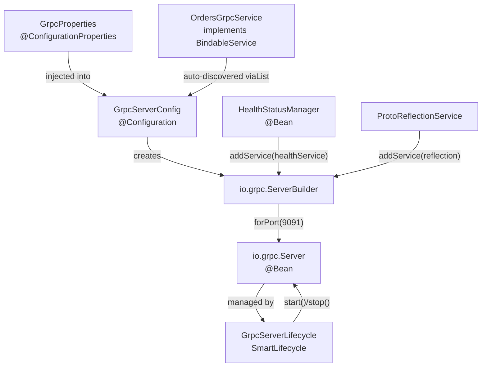
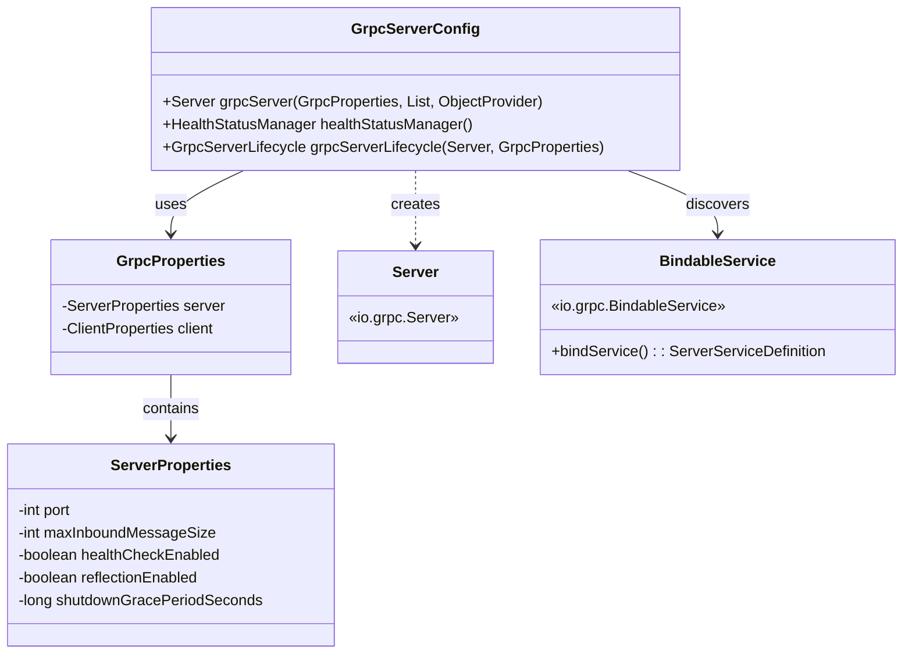
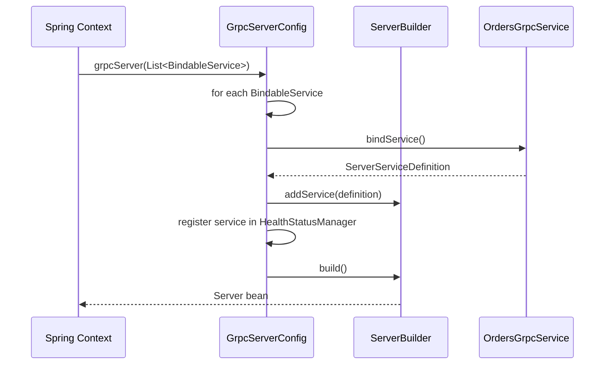
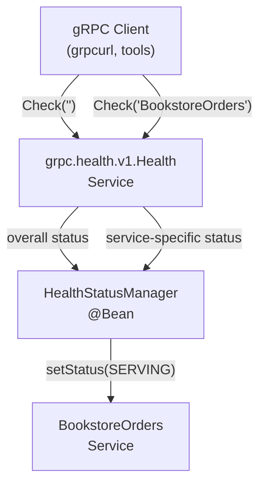
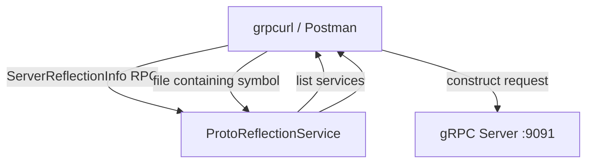
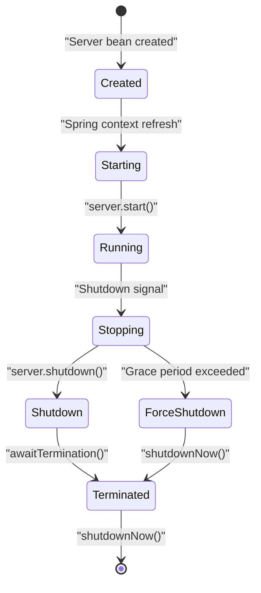
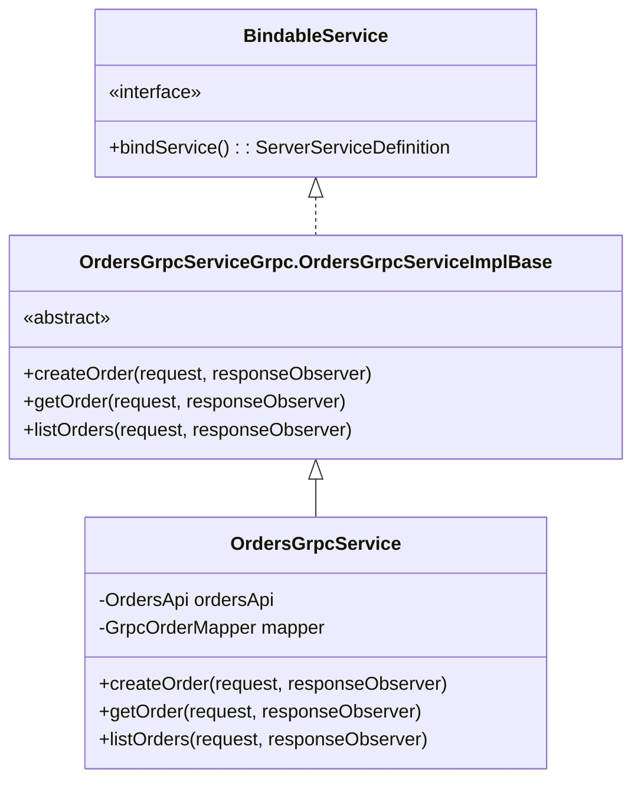
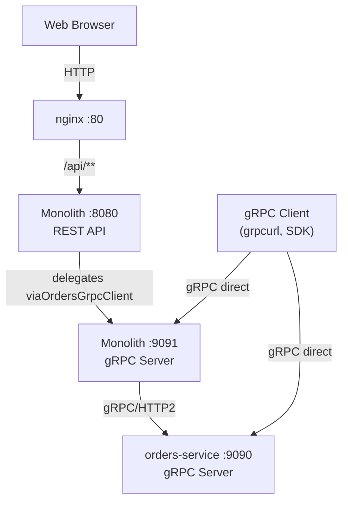

# gRPC Server Configuration

> **Relevant source files**
> * [README-API.md](https://github.com/philipz/spring-modular-monolith/blob/30c9bf30/README-API.md)
> * [README.md](https://github.com/philipz/spring-modular-monolith/blob/30c9bf30/README.md)
> * [docs/API_ANALYSIS_SUMMARY.txt](https://github.com/philipz/spring-modular-monolith/blob/30c9bf30/docs/API_ANALYSIS_SUMMARY.txt)
> * [docs/REST_API_ANALYSIS.md](https://github.com/philipz/spring-modular-monolith/blob/30c9bf30/docs/REST_API_ANALYSIS.md)
> * [docs/bookstore-microservices.png](https://github.com/philipz/spring-modular-monolith/blob/30c9bf30/docs/bookstore-microservices.png)
> * [docs/improvement.md](https://github.com/philipz/spring-modular-monolith/blob/30c9bf30/docs/improvement.md)
> * [docs/orders-data-ownership-analysis.md](https://github.com/philipz/spring-modular-monolith/blob/30c9bf30/docs/orders-data-ownership-analysis.md)
> * [docs/orders-module-boundary-analysis.md](https://github.com/philipz/spring-modular-monolith/blob/30c9bf30/docs/orders-module-boundary-analysis.md)
> * [docs/orders-traffic-migration.md](https://github.com/philipz/spring-modular-monolith/blob/30c9bf30/docs/orders-traffic-migration.md)
> * [k6.js](https://github.com/philipz/spring-modular-monolith/blob/30c9bf30/k6.js)
> * [src/main/java/com/sivalabs/bookstore/config/GrpcRetryInterceptor.java](https://github.com/philipz/spring-modular-monolith/blob/30c9bf30/src/main/java/com/sivalabs/bookstore/config/GrpcRetryInterceptor.java)
> * [src/main/java/com/sivalabs/bookstore/config/GrpcServerConfig.java](https://github.com/philipz/spring-modular-monolith/blob/30c9bf30/src/main/java/com/sivalabs/bookstore/config/GrpcServerConfig.java)
> * [src/main/java/com/sivalabs/bookstore/orders/grpc/GrpcExceptionHandler.java](https://github.com/philipz/spring-modular-monolith/blob/30c9bf30/src/main/java/com/sivalabs/bookstore/orders/grpc/GrpcExceptionHandler.java)

This document describes the gRPC server setup within the Spring Boot monolith, including service registration, health checks, reflection, and lifecycle management. The server exposes Orders operations on port 9091 (configurable) and enables external consumers to interact with the monolith via gRPC.

For client-side configuration and retry logic, see [gRPC Client and Retry Logic](/philipz/spring-modular-monolith/12.2-grpc-client-and-retry-logic). For protocol buffer definitions and message mapping, see [Protocol Buffer Messages and Mapping](/philipz/spring-modular-monolith/12.3-protocol-buffer-messages-and-mapping).

---

## Overview

The gRPC server is configured in the `config` module and automatically discovers all `BindableService` beans at startup. It runs as an embedded in-process server alongside the Spring Boot HTTP server, allowing the monolith to serve both REST and gRPC traffic simultaneously.

**Core Configuration Flow**



**Sources:** [src/main/java/com/sivalabs/bookstore/config/GrpcServerConfig.java L1-L77](https://github.com/philipz/spring-modular-monolith/blob/30c9bf30/src/main/java/com/sivalabs/bookstore/config/GrpcServerConfig.java#L1-L77)

 [README.md L39-L41](https://github.com/philipz/spring-modular-monolith/blob/30c9bf30/README.md#L39-L41)

---

## Server Bean Configuration

The `GrpcServerConfig` class is responsible for constructing the gRPC `Server` bean. It is conditionally enabled based on the presence of gRPC classes and the `bookstore.grpc.server.enabled` property (defaults to `true`).

**Configuration Anatomy**



**Key Configuration Steps:**

| Step | Code Reference | Purpose |
| --- | --- | --- |
| 1. Initialize `ServerBuilder` | [GrpcServerConfig.java L37-L38](https://github.com/philipz/spring-modular-monolith/blob/30c9bf30/GrpcServerConfig.java#L37-L38) | Create builder with configured port and max message size |
| 2. Register health service | [GrpcServerConfig.java L40-L45](https://github.com/philipz/spring-modular-monolith/blob/30c9bf30/GrpcServerConfig.java#L40-L45) | Add gRPC health check protocol support |
| 3. Discover and register services | [GrpcServerConfig.java L47-L54](https://github.com/philipz/spring-modular-monolith/blob/30c9bf30/GrpcServerConfig.java#L47-L54) | Auto-register all `BindableService` beans |
| 4. Enable reflection | [GrpcServerConfig.java L56-L58](https://github.com/philipz/spring-modular-monolith/blob/30c9bf30/GrpcServerConfig.java#L56-L58) | Add `ProtoReflectionService` for tooling support |
| 5. Build server | [GrpcServerConfig.java L60](https://github.com/philipz/spring-modular-monolith/blob/30c9bf30/GrpcServerConfig.java#L60-L60) | Construct final `Server` instance |

**Sources:** [src/main/java/com/sivalabs/bookstore/config/GrpcServerConfig.java L24-L62](https://github.com/philipz/spring-modular-monolith/blob/30c9bf30/src/main/java/com/sivalabs/bookstore/config/GrpcServerConfig.java#L24-L62)

---

## Service Registration

gRPC services are automatically discovered via Spring's dependency injection. Any bean implementing `io.grpc.BindableService` is registered during server creation.

**Service Discovery Process**



**Current Services:**

* **`OrdersGrpcService`** (orders module): Exposes `BookstoreOrders` service with operations like `CreateOrder`, `GetOrder`, `ListOrders`

**Sources:** [src/main/java/com/sivalabs/bookstore/config/GrpcServerConfig.java L47-L54](https://github.com/philipz/spring-modular-monolith/blob/30c9bf30/src/main/java/com/sivalabs/bookstore/config/GrpcServerConfig.java#L47-L54)

---

## Health Checks

The server optionally registers a gRPC health checking service per the [gRPC Health Checking Protocol](https://github.com/philipz/spring-modular-monolith/blob/30c9bf30/gRPC Health Checking Protocol)

 This is enabled by default via `bookstore.grpc.server.health-check-enabled=true`.

**Health Check Architecture**



**Health Status Management:**

| Check Type | Service Name | Status |
| --- | --- | --- |
| Overall server health | `""` (empty string) | `SERVING` |
| Per-service health | Service descriptor name (e.g. `bookstore.BookstoreOrders`) | `SERVING` |

The health status is set to `SERVING` for both the overall server and each registered service during startup:

```
// Overall server health
healthStatusManager.setStatus("", HealthCheckResponse.ServingStatus.SERVING);

// Per-service health
String serviceName = definition.getServiceDescriptor().getName();
healthStatusManager.setStatus(serviceName, HealthCheckResponse.ServingStatus.SERVING);
```

**Sources:** [src/main/java/com/sivalabs/bookstore/config/GrpcServerConfig.java L40-L54](https://github.com/philipz/spring-modular-monolith/blob/30c9bf30/src/main/java/com/sivalabs/bookstore/config/GrpcServerConfig.java#L40-L54)

 [src/main/java/com/sivalabs/bookstore/config/GrpcServerConfig.java L63-L70](https://github.com/philipz/spring-modular-monolith/blob/30c9bf30/src/main/java/com/sivalabs/bookstore/config/GrpcServerConfig.java#L63-L70)

---

## Reflection Support

Server reflection allows gRPC clients and tools (e.g., `grpcurl`, Postman) to discover available services and methods without requiring `.proto` files. This is enabled via `bookstore.grpc.server.reflection-enabled=true` (default).

**Reflection Flow**



**Example Usage:**

```css
# List all services
grpcurl -plaintext localhost:9091 list

# Describe a service
grpcurl -plaintext localhost:9091 describe bookstore.BookstoreOrders

# Make a call
grpcurl -plaintext -d '{"order_number":"ORD-123"}' \
  localhost:9091 bookstore.BookstoreOrders/GetOrder
```

**Sources:** [src/main/java/com/sivalabs/bookstore/config/GrpcServerConfig.java L56-L58](https://github.com/philipz/spring-modular-monolith/blob/30c9bf30/src/main/java/com/sivalabs/bookstore/config/GrpcServerConfig.java#L56-L58)

 [README.md L39-L41](https://github.com/philipz/spring-modular-monolith/blob/30c9bf30/README.md#L39-L41)

---

## Lifecycle Management

The `GrpcServerLifecycle` class implements Spring's `SmartLifecycle` interface to manage the server's start and stop phases. This ensures the gRPC server starts after the Spring context is fully initialized and shuts down gracefully before the context closes.

**Lifecycle Phases**



**Graceful Shutdown Configuration:**

| Property | Default | Description |
| --- | --- | --- |
| `bookstore.grpc.server.shutdown-grace-period-seconds` | 30 | Time allowed for in-flight RPCs to complete before forceful shutdown |

**Lifecycle Implementation:**

* **Phase**: `Ordered.LOWEST_PRECEDENCE - 100` (starts late, stops early)
* **Auto-start**: `true` (starts with Spring context)
* **Shutdown logic**: Attempts graceful shutdown first, falls back to `shutdownNow()` if grace period expires

**Sources:** [src/main/java/com/sivalabs/bookstore/config/GrpcServerConfig.java L72-L76](https://github.com/philipz/spring-modular-monolith/blob/30c9bf30/src/main/java/com/sivalabs/bookstore/config/GrpcServerConfig.java#L72-L76)

---

## Configuration Properties

The gRPC server is configured via `GrpcProperties` which binds to the `bookstore.grpc` namespace in `application.properties`.

**Server Properties Table**

| Property | Type | Default | Description |
| --- | --- | --- | --- |
| `bookstore.grpc.server.enabled` | `boolean` | `true` | Enable/disable gRPC server |
| `bookstore.grpc.server.port` | `int` | `9091` | Port for gRPC server |
| `bookstore.grpc.server.max-inbound-message-size` | `int` | `4MB` (4194304 bytes) | Maximum size for incoming messages |
| `bookstore.grpc.server.health-check-enabled` | `boolean` | `true` | Enable gRPC health checking protocol |
| `bookstore.grpc.server.reflection-enabled` | `boolean` | `true` | Enable server reflection for tooling |
| `bookstore.grpc.server.shutdown-grace-period-seconds` | `long` | `30` | Graceful shutdown timeout |

**Example Configuration:**

```
bookstore.grpc.server.enabled=true
bookstore.grpc.server.port=9091
bookstore.grpc.server.max-inbound-message-size=4194304
bookstore.grpc.server.health-check-enabled=true
bookstore.grpc.server.reflection-enabled=true
bookstore.grpc.server.shutdown-grace-period-seconds=30
```

**Conditional Loading:**

The configuration is only loaded when:

1. `io.grpc.Server` class is on the classpath (`@ConditionalOnClass`)
2. `bookstore.grpc.server.enabled` is `true` or missing (`@ConditionalOnProperty` with `matchIfMissing=true`)

**Sources:** [src/main/java/com/sivalabs/bookstore/config/GrpcServerConfig.java L14-L28](https://github.com/philipz/spring-modular-monolith/blob/30c9bf30/src/main/java/com/sivalabs/bookstore/config/GrpcServerConfig.java#L14-L28)

 [README.md L39-L41](https://github.com/philipz/spring-modular-monolith/blob/30c9bf30/README.md#L39-L41)

---

## Service Implementation Example

Services implementing `BindableService` are automatically discovered and registered. The `OrdersGrpcService` demonstrates the pattern:

**Service Structure**



**Exception Handling:**

All service methods use `GrpcExceptionHandler.handleException()` to translate domain exceptions into appropriate gRPC status codes:

| Domain Exception | gRPC Status | Description |
| --- | --- | --- |
| `OrderNotFoundException` | `NOT_FOUND` | Order number does not exist |
| `InvalidOrderException` | `INVALID_ARGUMENT` | Business validation failure |
| `ConstraintViolationException` | `INVALID_ARGUMENT` | Bean validation failure |
| Other exceptions | `INTERNAL` | Unexpected server error |

**Sources:** [src/main/java/com/sivalabs/bookstore/orders/grpc/GrpcExceptionHandler.java L1-L77](https://github.com/philipz/spring-modular-monolith/blob/30c9bf30/src/main/java/com/sivalabs/bookstore/orders/grpc/GrpcExceptionHandler.java#L1-L77)

---

## Deployment Considerations

**Docker Compose Configuration:**

The gRPC server is exposed via port mapping in `compose.yml`:

```yaml
bookstore:
  ports:
    - "8080:8080"  # HTTP/REST
    - "9091:9091"  # gRPC
```

**Nginx Gateway:**

The nginx webproxy does not proxy gRPC traffic. Clients must connect directly to the gRPC port (9091 for monolith, 9090 for extracted orders-service).

**Traffic Routing:**



**Sources:** [docs/orders-traffic-migration.md L1-L69](https://github.com/philipz/spring-modular-monolith/blob/30c9bf30/docs/orders-traffic-migration.md#L1-L69)

 [README-API.md L157-L159](https://github.com/philipz/spring-modular-monolith/blob/30c9bf30/README-API.md#L157-L159)

---

## Observability

The gRPC server is automatically instrumented by the OpenTelemetry Java agent, capturing traces for all inbound RPCs. Health check calls are also traced but typically excluded from sampling in production.

**Traced Operations:**

* Service method invocations (e.g., `BookstoreOrders/CreateOrder`)
* Request/response metadata
* Exception status codes
* Call duration

**Actuator Integration:**

Spring Actuator exposes gRPC-related metrics when Micrometer is configured:

* `grpc.server.calls.started`
* `grpc.server.calls.completed`
* `grpc.server.message.sent`
* `grpc.server.message.received`

**Sources:** [README.md L24-L28](https://github.com/philipz/spring-modular-monolith/blob/30c9bf30/README.md#L24-L28)

 [docs/REST_API_ANALYSIS.md L77-L81](https://github.com/philipz/spring-modular-monolith/blob/30c9bf30/docs/REST_API_ANALYSIS.md#L77-L81)