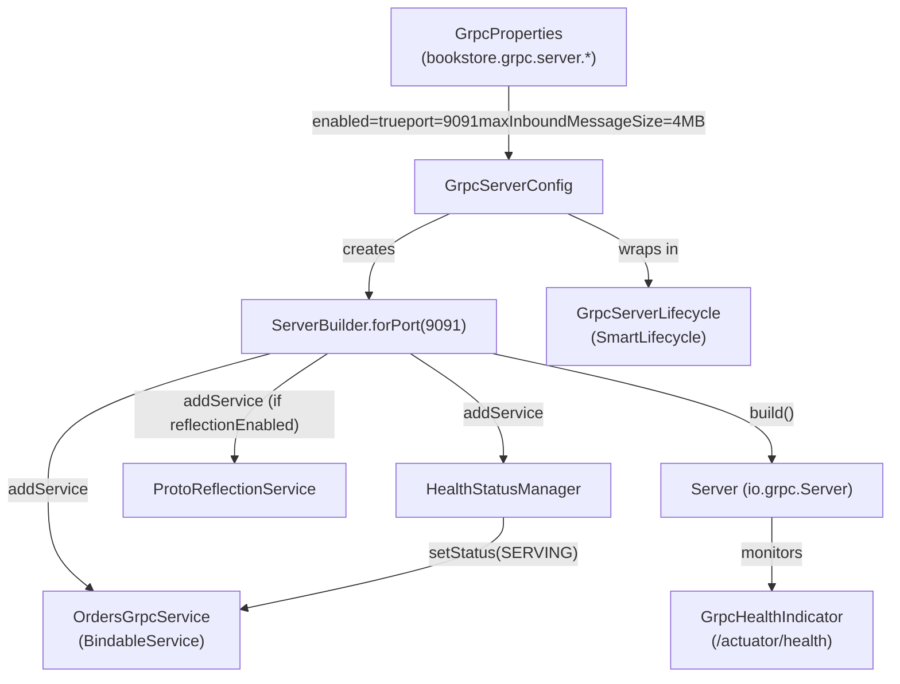
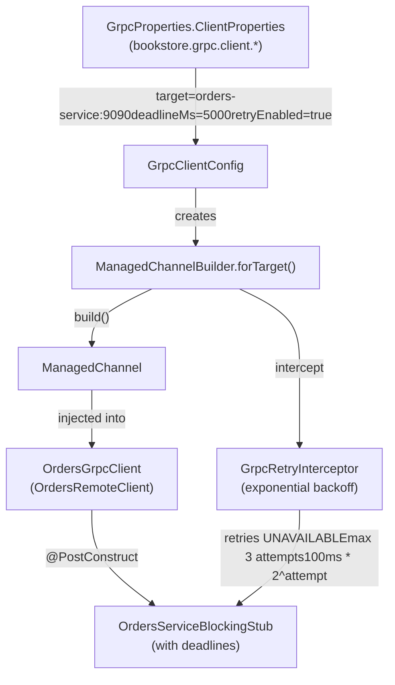
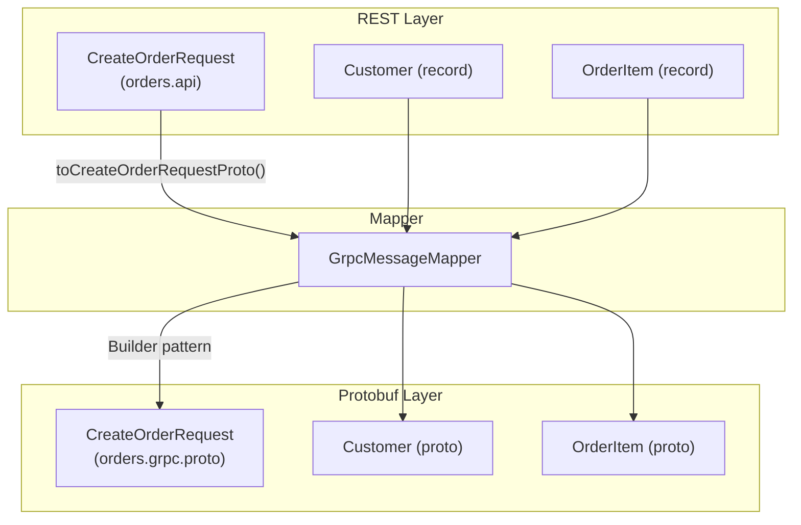
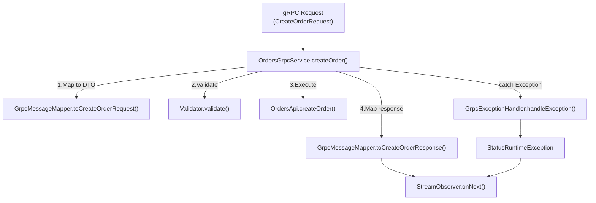
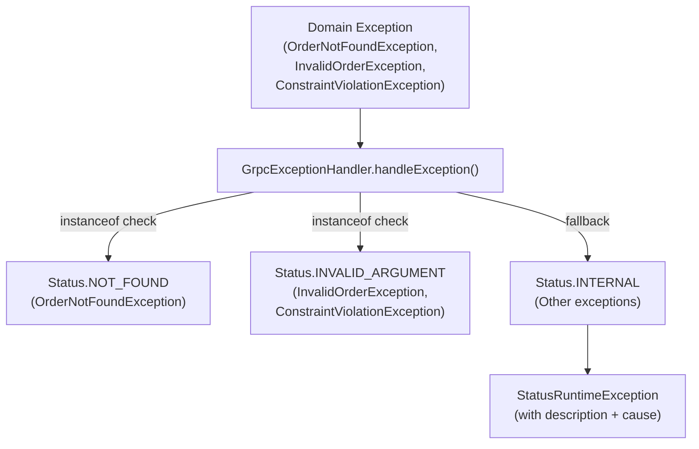
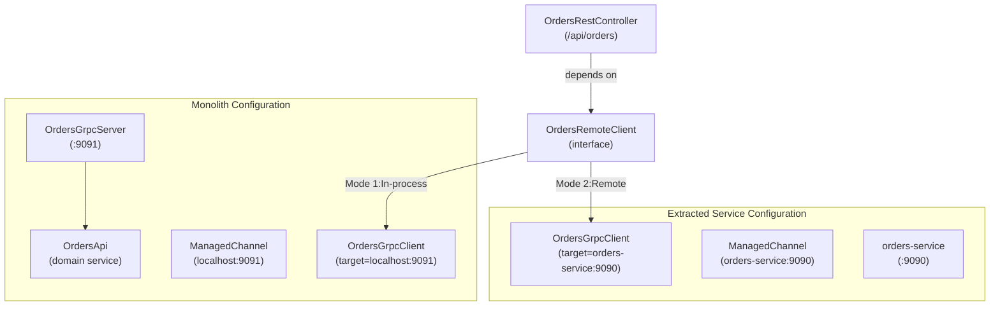

# gRPC Services and Protocol Buffers

> **Relevant source files**
> * [README-API.md](https://github.com/philipz/spring-modular-monolith/blob/30c9bf30/README-API.md)
> * [README.md](https://github.com/philipz/spring-modular-monolith/blob/30c9bf30/README.md)
> * [docs/API_ANALYSIS_SUMMARY.txt](https://github.com/philipz/spring-modular-monolith/blob/30c9bf30/docs/API_ANALYSIS_SUMMARY.txt)
> * [docs/REST_API_ANALYSIS.md](https://github.com/philipz/spring-modular-monolith/blob/30c9bf30/docs/REST_API_ANALYSIS.md)
> * [docs/bookstore-microservices.png](https://github.com/philipz/spring-modular-monolith/blob/30c9bf30/docs/bookstore-microservices.png)
> * [docs/improvement.md](https://github.com/philipz/spring-modular-monolith/blob/30c9bf30/docs/improvement.md)
> * [docs/orders-data-ownership-analysis.md](https://github.com/philipz/spring-modular-monolith/blob/30c9bf30/docs/orders-data-ownership-analysis.md)
> * [docs/orders-module-boundary-analysis.md](https://github.com/philipz/spring-modular-monolith/blob/30c9bf30/docs/orders-module-boundary-analysis.md)
> * [docs/orders-traffic-migration.md](https://github.com/philipz/spring-modular-monolith/blob/30c9bf30/docs/orders-traffic-migration.md)
> * [k6.js](https://github.com/philipz/spring-modular-monolith/blob/30c9bf30/k6.js)
> * [src/main/java/com/sivalabs/bookstore/config/GrpcHealthIndicator.java](https://github.com/philipz/spring-modular-monolith/blob/30c9bf30/src/main/java/com/sivalabs/bookstore/config/GrpcHealthIndicator.java)
> * [src/main/java/com/sivalabs/bookstore/config/GrpcProperties.java](https://github.com/philipz/spring-modular-monolith/blob/30c9bf30/src/main/java/com/sivalabs/bookstore/config/GrpcProperties.java)
> * [src/main/java/com/sivalabs/bookstore/config/GrpcRetryInterceptor.java](https://github.com/philipz/spring-modular-monolith/blob/30c9bf30/src/main/java/com/sivalabs/bookstore/config/GrpcRetryInterceptor.java)
> * [src/main/java/com/sivalabs/bookstore/config/GrpcServerConfig.java](https://github.com/philipz/spring-modular-monolith/blob/30c9bf30/src/main/java/com/sivalabs/bookstore/config/GrpcServerConfig.java)
> * [src/main/java/com/sivalabs/bookstore/orders/api/OrdersRemoteClient.java](https://github.com/philipz/spring-modular-monolith/blob/30c9bf30/src/main/java/com/sivalabs/bookstore/orders/api/OrdersRemoteClient.java)
> * [src/main/java/com/sivalabs/bookstore/orders/grpc/GrpcExceptionHandler.java](https://github.com/philipz/spring-modular-monolith/blob/30c9bf30/src/main/java/com/sivalabs/bookstore/orders/grpc/GrpcExceptionHandler.java)
> * [src/main/java/com/sivalabs/bookstore/orders/grpc/OrdersGrpcClient.java](https://github.com/philipz/spring-modular-monolith/blob/30c9bf30/src/main/java/com/sivalabs/bookstore/orders/grpc/OrdersGrpcClient.java)
> * [src/main/java/com/sivalabs/bookstore/orders/grpc/OrdersGrpcService.java](https://github.com/philipz/spring-modular-monolith/blob/30c9bf30/src/main/java/com/sivalabs/bookstore/orders/grpc/OrdersGrpcService.java)
> * [src/test/java/com/sivalabs/bookstore/orders/grpc/OrdersGrpcClientIntegrationTest.java](https://github.com/philipz/spring-modular-monolith/blob/30c9bf30/src/test/java/com/sivalabs/bookstore/orders/grpc/OrdersGrpcClientIntegrationTest.java)
> * [src/test/java/com/sivalabs/bookstore/orders/grpc/OrdersGrpcServiceIntegrationTest.java](https://github.com/philipz/spring-modular-monolith/blob/30c9bf30/src/test/java/com/sivalabs/bookstore/orders/grpc/OrdersGrpcServiceIntegrationTest.java)

This page documents the gRPC infrastructure used for inter-service communication in the bookstore system, focusing on the Orders service exposed via Protocol Buffers. The gRPC implementation enables both in-process communication (when running as a monolith) and remote communication (when calling the extracted `orders-service`). For REST API endpoints that delegate to these gRPC services, see [REST API Endpoints](/philipz/spring-modular-monolith/7.1-rest-api-endpoints). For exception handling patterns across both protocols, see [Exception Handling and Error Responses](/philipz/spring-modular-monolith/7.3-exception-handling-and-error-responses).

**Sources:** [README.md L37-L41](https://github.com/philipz/spring-modular-monolith/blob/30c9bf30/README.md#L37-L41)

 [docs/orders-traffic-migration.md](https://github.com/philipz/spring-modular-monolith/blob/30c9bf30/docs/orders-traffic-migration.md)

---

## Purpose and Architecture

The system implements gRPC alongside REST to support:

1. **Progressive microservice extraction**: REST controllers delegate to `OrdersGrpcClient`, which can target either an in-process server (`localhost:9091`) or an external `orders-service` (`orders-service:9090`)
2. **High-performance RPC**: Binary protocol with HTTP/2 multiplexing for service-to-service calls
3. **Polyglot compatibility**: Protocol Buffer contracts enable future non-JVM clients

The gRPC stack is optional and controlled by `bookstore.grpc.server.enabled` and `bookstore.grpc.client.target` configuration.

**Sources:** [README.md L37-L41](https://github.com/philipz/spring-modular-monolith/blob/30c9bf30/README.md#L37-L41)

 [README-API.md L157-L159](https://github.com/philipz/spring-modular-monolith/blob/30c9bf30/README-API.md#L157-L159)

---

## Protocol Buffer Service Definition

The Orders service is defined in `orders.proto` (generated Java classes reside in the build output). Key messages and RPCs:

| Message Type | Purpose | Key Fields |
| --- | --- | --- |
| `CreateOrderRequest` | Create a new order | `Customer customer`, `string deliveryAddress`, `OrderItem item` |
| `CreateOrderResponse` | Order creation confirmation | `string orderNumber` |
| `GetOrderRequest` | Retrieve order by number | `string orderNumber` |
| `GetOrderResponse` | Full order details | `OrderDto order` |
| `ListOrdersRequest` | Paginated order list | `int32 page`, `int32 pageSize` |
| `ListOrdersResponse` | Paginated results | `repeated OrderView orders`, pagination metadata |

**Enum:** `OrderStatus` with values `NEW`, `DELIVERED`, `CANCELLED`, `ERROR`.

### Service Definition

```
service OrdersService {
  rpc CreateOrder(CreateOrderRequest) returns (CreateOrderResponse);
  rpc GetOrder(GetOrderRequest) returns (GetOrderResponse);
  rpc ListOrders(ListOrdersRequest) returns (ListOrdersResponse);
}
```

The protobuf-maven-plugin compiles `.proto` files into Java classes under the `com.sivalabs.bookstore.orders.grpc.proto` package.

**Sources:** [src/test/java/com/sivalabs/bookstore/orders/grpc/OrdersGrpcServiceIntegrationTest.java L13-L17](https://github.com/philipz/spring-modular-monolith/blob/30c9bf30/src/test/java/com/sivalabs/bookstore/orders/grpc/OrdersGrpcServiceIntegrationTest.java#L13-L17)

 [src/main/java/com/sivalabs/bookstore/orders/grpc/OrdersGrpcClient.java L11](https://github.com/philipz/spring-modular-monolith/blob/30c9bf30/src/main/java/com/sivalabs/bookstore/orders/grpc/OrdersGrpcClient.java#L11-L11)

---

## gRPC Server Configuration

### Server Lifecycle and Registration



**gRPC Server Configuration Lifecycle**

The `GrpcServerConfig` bootstraps the server using Spring's `@Configuration` pattern:

1. **Server Builder** ([src/main/java/com/sivalabs/bookstore/config/GrpcServerConfig.java L37-L38](https://github.com/philipz/spring-modular-monolith/blob/30c9bf30/src/main/java/com/sivalabs/bookstore/config/GrpcServerConfig.java#L37-L38) ): Initializes on the configured port with max inbound message size
2. **Service Registration** ([src/main/java/com/sivalabs/bookstore/config/GrpcServerConfig.java L47-L54](https://github.com/philipz/spring-modular-monolith/blob/30c9bf30/src/main/java/com/sivalabs/bookstore/config/GrpcServerConfig.java#L47-L54) ): All `BindableService` beans (e.g., `OrdersGrpcService`) are auto-discovered and registered
3. **Health Checks** ([src/main/java/com/sivalabs/bookstore/config/GrpcServerConfig.java L40-L52](https://github.com/philipz/spring-modular-monolith/blob/30c9bf30/src/main/java/com/sivalabs/bookstore/config/GrpcServerConfig.java#L40-L52) ): `HealthStatusManager` tracks per-service health status
4. **Reflection** ([src/main/java/com/sivalabs/bookstore/config/GrpcServerConfig.java L56-L58](https://github.com/philipz/spring-modular-monolith/blob/30c9bf30/src/main/java/com/sivalabs/bookstore/config/GrpcServerConfig.java#L56-L58) ): `ProtoReflectionService` enables tools like `grpcurl` to introspect services
5. **Lifecycle Management** ([src/main/java/com/sivalabs/bookstore/config/GrpcServerConfig.java L73-L76](https://github.com/philipz/spring-modular-monolith/blob/30c9bf30/src/main/java/com/sivalabs/bookstore/config/GrpcServerConfig.java#L73-L76) ): `GrpcServerLifecycle` starts/stops the server with Spring's lifecycle, respecting graceful shutdown periods

### Key Configuration Properties

| Property | Default | Description |
| --- | --- | --- |
| `bookstore.grpc.server.enabled` | `true` | Enable/disable server |
| `bookstore.grpc.server.port` | `9091` | Server listening port |
| `bookstore.grpc.server.max-inbound-message-size` | `4194304` (4MB) | Max message size |
| `bookstore.grpc.server.health-check-enabled` | `true` | Register health service |
| `bookstore.grpc.server.reflection-enabled` | `true` | Enable reflection API |
| `bookstore.grpc.server.shutdown-grace-period-seconds` | `30` | Graceful shutdown timeout |

**Sources:** [src/main/java/com/sivalabs/bookstore/config/GrpcServerConfig.java](https://github.com/philipz/spring-modular-monolith/blob/30c9bf30/src/main/java/com/sivalabs/bookstore/config/GrpcServerConfig.java)

 [src/main/java/com/sivalabs/bookstore/config/GrpcProperties.java L30-L89](https://github.com/philipz/spring-modular-monolith/blob/30c9bf30/src/main/java/com/sivalabs/bookstore/config/GrpcProperties.java#L30-L89)

---

## gRPC Client Configuration

### Client Channel and Interceptor Chain



**gRPC Client Configuration and Retry Logic**

### Retry Strategy

The `GrpcRetryInterceptor` ([src/main/java/com/sivalabs/bookstore/config/GrpcRetryInterceptor.java](https://github.com/philipz/spring-modular-monolith/blob/30c9bf30/src/main/java/com/sivalabs/bookstore/config/GrpcRetryInterceptor.java)

) implements exponential backoff for transient failures:

* **Retryable Codes** ([src/main/java/com/sivalabs/bookstore/config/GrpcRetryInterceptor.java L26](https://github.com/philipz/spring-modular-monolith/blob/30c9bf30/src/main/java/com/sivalabs/bookstore/config/GrpcRetryInterceptor.java#L26-L26) ): Only `UNAVAILABLE` status triggers retry
* **Max Attempts** ([src/main/java/com/sivalabs/bookstore/config/GrpcRetryInterceptor.java L155](https://github.com/philipz/spring-modular-monolith/blob/30c9bf30/src/main/java/com/sivalabs/bookstore/config/GrpcRetryInterceptor.java#L155-L155) ): Configurable via `bookstore.grpc.client.max-retry-attempts` (default 3)
* **Backoff Calculation** ([src/main/java/com/sivalabs/bookstore/config/GrpcRetryInterceptor.java L179-L181](https://github.com/philipz/spring-modular-monolith/blob/30c9bf30/src/main/java/com/sivalabs/bookstore/config/GrpcRetryInterceptor.java#L179-L181) ): `100ms * 2^(attempt-1)` (100ms, 200ms, 400ms...)
* **Deadline Refresh** ([src/main/java/com/sivalabs/bookstore/config/GrpcRetryInterceptor.java L183-L188](https://github.com/philipz/spring-modular-monolith/blob/30c9bf30/src/main/java/com/sivalabs/bookstore/config/GrpcRetryInterceptor.java#L183-L188) ): Each retry gets a fresh deadline to prevent cumulative timeout

### Client Properties

| Property | Default | Description |
| --- | --- | --- |
| `bookstore.grpc.client.target` | `localhost:9091` | Target server (host:port or service name) |
| `bookstore.grpc.client.deadline-ms` | `5000` | Per-call timeout |
| `bookstore.grpc.client.retry-enabled` | `true` | Enable exponential backoff retry |
| `bookstore.grpc.client.max-retry-attempts` | `3` | Max retry count per call |

**Sources:** [src/main/java/com/sivalabs/bookstore/config/GrpcRetryInterceptor.java](https://github.com/philipz/spring-modular-monolith/blob/30c9bf30/src/main/java/com/sivalabs/bookstore/config/GrpcRetryInterceptor.java)

 [src/main/java/com/sivalabs/bookstore/config/GrpcProperties.java L93-L143](https://github.com/philipz/spring-modular-monolith/blob/30c9bf30/src/main/java/com/sivalabs/bookstore/config/GrpcProperties.java#L93-L143)

---

## Message Mapping

### DTO-to-Protobuf Translation



**DTO and Protobuf Message Mapping Flow**

The `GrpcMessageMapper` class (typically in `orders.grpc` package) translates between domain DTOs and Protocol Buffer messages. Key responsibilities:

1. **Request Mapping**: Convert `CreateOrderRequest` (Java record) to protobuf `CreateOrderRequest.Builder`
2. **Response Mapping**: Translate protobuf responses back to domain DTOs (`CreateOrderResponse`, `OrderDto`, `OrderView`)
3. **Type Conversion**: Handle `BigDecimal` ↔ `string` conversions for prices, enum mapping (`OrderStatus`), pagination metadata
4. **Null Safety**: Protobuf doesn't support null; mapper uses empty strings/default values

### Usage in OrdersGrpcClient

```javascript
// Outbound: DTO → Protobuf
var grpcRequest = messageMapper.toCreateOrderRequestProto(request);
var grpcResponse = stubWithDeadline().createOrder(grpcRequest);

// Inbound: Protobuf → DTO
return messageMapper.toCreateOrderResponseDto(grpcResponse);
```

**Sources:** [src/main/java/com/sivalabs/bookstore/orders/grpc/OrdersGrpcClient.java L49-L52](https://github.com/philipz/spring-modular-monolith/blob/30c9bf30/src/main/java/com/sivalabs/bookstore/orders/grpc/OrdersGrpcClient.java#L49-L52)

 [src/main/java/com/sivalabs/bookstore/orders/grpc/OrdersGrpcService.java L35-L38](https://github.com/philipz/spring-modular-monolith/blob/30c9bf30/src/main/java/com/sivalabs/bookstore/orders/grpc/OrdersGrpcService.java#L35-L38)

---

## OrdersGrpcService Implementation

### Service Method Handlers



**OrdersGrpcService Request Processing Flow**

The `OrdersGrpcService` ([src/main/java/com/sivalabs/bookstore/orders/grpc/OrdersGrpcService.java](https://github.com/philipz/spring-modular-monolith/blob/30c9bf30/src/main/java/com/sivalabs/bookstore/orders/grpc/OrdersGrpcService.java)

) extends `OrdersServiceGrpc.OrdersServiceImplBase` and implements three RPCs:

### createOrder Handler

1. **Inbound Mapping** ([src/main/java/com/sivalabs/bookstore/orders/grpc/OrdersGrpcService.java L35](https://github.com/philipz/spring-modular-monolith/blob/30c9bf30/src/main/java/com/sivalabs/bookstore/orders/grpc/OrdersGrpcService.java#L35-L35) ): Convert protobuf to DTO
2. **Validation** ([src/main/java/com/sivalabs/bookstore/orders/grpc/OrdersGrpcService.java L36](https://github.com/philipz/spring-modular-monolith/blob/30c9bf30/src/main/java/com/sivalabs/bookstore/orders/grpc/OrdersGrpcService.java#L36-L36) ): Jakarta Bean Validation on DTO (checks `@NotBlank`, `@Email`, `@Min` constraints)
3. **Delegate to Domain** ([src/main/java/com/sivalabs/bookstore/orders/grpc/OrdersGrpcService.java L37](https://github.com/philipz/spring-modular-monolith/blob/30c9bf30/src/main/java/com/sivalabs/bookstore/orders/grpc/OrdersGrpcService.java#L37-L37) ): Call `OrdersApi.createOrder()`
4. **Outbound Mapping** ([src/main/java/com/sivalabs/bookstore/orders/grpc/OrdersGrpcService.java L38](https://github.com/philipz/spring-modular-monolith/blob/30c9bf30/src/main/java/com/sivalabs/bookstore/orders/grpc/OrdersGrpcService.java#L38-L38) ): Convert DTO response to protobuf
5. **Complete Stream** ([src/main/java/com/sivalabs/bookstore/orders/grpc/OrdersGrpcService.java L39-L40](https://github.com/philipz/spring-modular-monolith/blob/30c9bf30/src/main/java/com/sivalabs/bookstore/orders/grpc/OrdersGrpcService.java#L39-L40) ): Send response via `StreamObserver`

### getOrder Handler

Similar flow but checks for `Optional.isEmpty()` ([src/main/java/com/sivalabs/bookstore/orders/grpc/OrdersGrpcService.java L52-L56](https://github.com/philipz/spring-modular-monolith/blob/30c9bf30/src/main/java/com/sivalabs/bookstore/orders/grpc/OrdersGrpcService.java#L52-L56)

) and throws `OrderNotFoundException` if order not found.

### listOrders Handler

Handles pagination ([src/main/java/com/sivalabs/bookstore/orders/grpc/OrdersGrpcService.java L74-L76](https://github.com/philipz/spring-modular-monolith/blob/30c9bf30/src/main/java/com/sivalabs/bookstore/orders/grpc/OrdersGrpcService.java#L74-L76)

):

* Defaults `page=1`, `pageSize=20` if not specified
* Maps `PagedResult<OrderView>` to protobuf `ListOrdersResponse` with all pagination metadata

**Sources:** [src/main/java/com/sivalabs/bookstore/orders/grpc/OrdersGrpcService.java](https://github.com/philipz/spring-modular-monolith/blob/30c9bf30/src/main/java/com/sivalabs/bookstore/orders/grpc/OrdersGrpcService.java)

---

## Exception Handling and Status Mapping

### Domain Exception to gRPC Status Translation



**Exception to gRPC Status Code Mapping**

The `GrpcExceptionHandler` ([src/main/java/com/sivalabs/bookstore/orders/grpc/GrpcExceptionHandler.java](https://github.com/philipz/spring-modular-monolith/blob/30c9bf30/src/main/java/com/sivalabs/bookstore/orders/grpc/GrpcExceptionHandler.java)

) provides centralized exception translation:

| Domain Exception | gRPC Status | Description Source |
| --- | --- | --- |
| `OrderNotFoundException` | `NOT_FOUND` | Exception message (e.g., "Order ORD-123 not found") |
| `InvalidOrderException` | `INVALID_ARGUMENT` | Exception message |
| `ConstraintViolationException` | `INVALID_ARGUMENT` | Formatted violations: `"customer.name: Customer Name is required"` |
| `StatusRuntimeException` | Propagated as-is | Already gRPC-native |
| Other exceptions | `INTERNAL` | Generic "Internal server error" with cause |

### Validation Error Formatting

For `ConstraintViolationException` ([src/main/java/com/sivalabs/bookstore/orders/grpc/GrpcExceptionHandler.java L47-L64](https://github.com/philipz/spring-modular-monolith/blob/30c9bf30/src/main/java/com/sivalabs/bookstore/orders/grpc/GrpcExceptionHandler.java#L47-L64)

):

* Extracts all `ConstraintViolation` instances
* Formats as `"propertyPath: message"` (e.g., `"customer.email: must be a well-formed email address"`)
* Joins multiple violations with `", "`

### Client-Side Remapping

`OrdersGrpcClient` ([src/main/java/com/sivalabs/bookstore/orders/grpc/OrdersGrpcClient.java L100-L110](https://github.com/philipz/spring-modular-monolith/blob/30c9bf30/src/main/java/com/sivalabs/bookstore/orders/grpc/OrdersGrpcClient.java#L100-L110)

) translates `StatusRuntimeException` back to domain exceptions:

* `NOT_FOUND` → `OrderNotFoundException`
* `INVALID_ARGUMENT` → `InvalidOrderException`
* Others → propagate `StatusRuntimeException`

This allows REST controllers to handle domain exceptions uniformly regardless of whether they're calling local services or remote gRPC.

**Sources:** [src/main/java/com/sivalabs/bookstore/orders/grpc/GrpcExceptionHandler.java](https://github.com/philipz/spring-modular-monolith/blob/30c9bf30/src/main/java/com/sivalabs/bookstore/orders/grpc/GrpcExceptionHandler.java)

 [src/main/java/com/sivalabs/bookstore/orders/grpc/OrdersGrpcClient.java L100-L110](https://github.com/philipz/spring-modular-monolith/blob/30c9bf30/src/main/java/com/sivalabs/bookstore/orders/grpc/OrdersGrpcClient.java#L100-L110)

---

## Integration Patterns

### Dual-Mode Operation: In-Process vs Remote



**Dual-Mode gRPC Client Configuration**

The system supports two deployment modes controlled by `bookstore.grpc.client.target`:

### In-Process Mode (Default)

* **Target**: `localhost:9091`
* **Use Case**: Development, monolithic deployment
* **Behavior**: gRPC client calls the in-process server, which delegates to `OrdersApi` bean
* **Latency**: Sub-millisecond (no network serialization)

### Remote Mode (Microservice Extraction)

* **Target**: `orders-service:9090` (Docker Compose) or external service URL
* **Use Case**: Progressive migration to microservices
* **Behavior**: gRPC client makes network call to external `orders-service`
* **Latency**: Network-bound, but benefits from HTTP/2 multiplexing

### Configuration Example

```markdown
# In-process (monolith)
bookstore.grpc.client.target=localhost:9091

# Remote (extracted service)
bookstore.grpc.client.target=orders-service:9090
```

REST controllers remain unchanged; the `OrdersRemoteClient` abstraction isolates transport concerns.

**Sources:** [README.md L37-L41](https://github.com/philipz/spring-modular-monolith/blob/30c9bf30/README.md#L37-L41)

 [docs/orders-traffic-migration.md L63-L67](https://github.com/philipz/spring-modular-monolith/blob/30c9bf30/docs/orders-traffic-migration.md#L63-L67)

 [src/main/java/com/sivalabs/bookstore/orders/api/OrdersRemoteClient.java](https://github.com/philipz/spring-modular-monolith/blob/30c9bf30/src/main/java/com/sivalabs/bookstore/orders/api/OrdersRemoteClient.java)

---

## Health Checks and Observability

### gRPC Health Indicator

The `GrpcHealthIndicator` ([src/main/java/com/sivalabs/bookstore/config/GrpcHealthIndicator.java](https://github.com/philipz/spring-modular-monolith/blob/30c9bf30/src/main/java/com/sivalabs/bookstore/config/GrpcHealthIndicator.java)

) exposes server status via Spring Boot Actuator:

```
GET /actuator/health

{
  "status": "UP",
  "components": {
    "grpcHealthIndicator": {
      "status": "UP",
      "details": {
        "port": 9091,
        "services": 1
      }
    }
  }
}
```

Health check logic ([src/main/java/com/sivalabs/bookstore/config/GrpcHealthIndicator.java L26-L38](https://github.com/philipz/spring-modular-monolith/blob/30c9bf30/src/main/java/com/sivalabs/bookstore/config/GrpcHealthIndicator.java#L26-L38)

):

* **UP**: Server is not shutdown and not terminated
* **DOWN**: Server is shutdown or terminated, with reason details

### gRPC Health Service Protocol

When `bookstore.grpc.server.health-check-enabled=true`, the server registers the standard gRPC health checking service:

```css
# Query via grpcurl
grpcurl -plaintext localhost:9091 grpc.health.v1.Health/Check

# Response
{
  "status": "SERVING"
}
```

Per-service health status is tracked via `HealthStatusManager` ([src/main/java/com/sivalabs/bookstore/config/GrpcServerConfig.java L44-L52](https://github.com/philipz/spring-modular-monolith/blob/30c9bf30/src/main/java/com/sivalabs/bookstore/config/GrpcServerConfig.java#L44-L52)

):

* Sets `SERVING` status for each registered service
* Supports health probes in Kubernetes (via `exec` probe calling `grpcurl`)

### OpenTelemetry Tracing

gRPC calls are automatically instrumented by the OpenTelemetry Java agent:

* Spans created for each RPC (client and server side)
* Trace context propagated via gRPC metadata headers
* Exported to HyperDX on port 4317 (OTLP gRPC endpoint)

Trace correlation example:

```
POST /api/orders (HTTP span)
  └─ OrdersGrpcClient.createOrder (gRPC client span)
      └─ OrdersGrpcService.createOrder (gRPC server span)
          └─ OrdersApi.createOrder (internal span)
```

**Sources:** [src/main/java/com/sivalabs/bookstore/config/GrpcHealthIndicator.java](https://github.com/philipz/spring-modular-monolith/blob/30c9bf30/src/main/java/com/sivalabs/bookstore/config/GrpcHealthIndicator.java)

 [src/main/java/com/sivalabs/bookstore/config/GrpcServerConfig.java L40-L52](https://github.com/philipz/spring-modular-monolith/blob/30c9bf30/src/main/java/com/sivalabs/bookstore/config/GrpcServerConfig.java#L40-L52)

---

## Testing Strategies

### Integration Testing with In-Process Server

The test suite uses gRPC's in-process transport for fast, isolated testing ([src/test/java/com/sivalabs/bookstore/orders/grpc/OrdersGrpcServiceIntegrationTest.java L83-L94](https://github.com/philipz/spring-modular-monolith/blob/30c9bf30/src/test/java/com/sivalabs/bookstore/orders/grpc/OrdersGrpcServiceIntegrationTest.java#L83-L94)

):

```
@BeforeEach
void setUpServer() throws IOException {
    String serverName = "orders-grpc-test-server-" + UUID.randomUUID();
    grpcServer = InProcessServerBuilder.forName(serverName)
        .directExecutor()
        .addService(ordersGrpcService)
        .build()
        .start();
    channel = InProcessChannelBuilder.forName(serverName)
        .directExecutor()
        .build();
    blockingStub = OrdersServiceGrpc.newBlockingStub(channel);
}
```

**Advantages:**

* No port binding conflicts (uses in-memory channels)
* Deterministic (direct executor, no thread pools)
* Fast test execution
* Real protobuf serialization/deserialization

### Test Coverage

Tests verify:

1. **Happy Path** ([src/test/java/com/sivalabs/bookstore/orders/grpc/OrdersGrpcServiceIntegrationTest.java L111-L156](https://github.com/philipz/spring-modular-monolith/blob/30c9bf30/src/test/java/com/sivalabs/bookstore/orders/grpc/OrdersGrpcServiceIntegrationTest.java#L111-L156) ): Order creation, retrieval, listing
2. **Validation** ([src/test/java/com/sivalabs/bookstore/orders/grpc/OrdersGrpcServiceIntegrationTest.java L268-L304](https://github.com/philipz/spring-modular-monolith/blob/30c9bf30/src/test/java/com/sivalabs/bookstore/orders/grpc/OrdersGrpcServiceIntegrationTest.java#L268-L304) ): Empty customer name, negative quantity
3. **Client Mapping** ([src/test/java/com/sivalabs/bookstore/orders/grpc/OrdersGrpcClientIntegrationTest.java L120-L139](https://github.com/philipz/spring-modular-monolith/blob/30c9bf30/src/test/java/com/sivalabs/bookstore/orders/grpc/OrdersGrpcClientIntegrationTest.java#L120-L139) ): DTO ↔ protobuf translation
4. **Exception Mapping** ([src/test/java/com/sivalabs/bookstore/orders/grpc/OrdersGrpcClientIntegrationTest.java L188-L207](https://github.com/philipz/spring-modular-monolith/blob/30c9bf30/src/test/java/com/sivalabs/bookstore/orders/grpc/OrdersGrpcClientIntegrationTest.java#L188-L207) ): `NOT_FOUND` → `OrderNotFoundException`, `INVALID_ARGUMENT` → `InvalidOrderException`

**Sources:** [src/test/java/com/sivalabs/bookstore/orders/grpc/OrdersGrpcServiceIntegrationTest.java](https://github.com/philipz/spring-modular-monolith/blob/30c9bf30/src/test/java/com/sivalabs/bookstore/orders/grpc/OrdersGrpcServiceIntegrationTest.java)

 [src/test/java/com/sivalabs/bookstore/orders/grpc/OrdersGrpcClientIntegrationTest.java](https://github.com/philipz/spring-modular-monolith/blob/30c9bf30/src/test/java/com/sivalabs/bookstore/orders/grpc/OrdersGrpcClientIntegrationTest.java)

---

## Configuration Reference Summary

| Category | Property | Default | Description |
| --- | --- | --- | --- |
| **Server** | `bookstore.grpc.server.enabled` | `true` | Enable gRPC server |
|  | `bookstore.grpc.server.port` | `9091` | Server port |
|  | `bookstore.grpc.server.max-inbound-message-size` | `4194304` | Max message size (4MB) |
|  | `bookstore.grpc.server.health-check-enabled` | `true` | Register health service |
|  | `bookstore.grpc.server.reflection-enabled` | `true` | Enable reflection API |
|  | `bookstore.grpc.server.shutdown-grace-period-seconds` | `30` | Graceful shutdown timeout |
| **Client** | `bookstore.grpc.client.target` | `localhost:9091` | Target server address |
|  | `bookstore.grpc.client.deadline-ms` | `5000` | Per-call timeout |
|  | `bookstore.grpc.client.retry-enabled` | `true` | Enable exponential backoff |
|  | `bookstore.grpc.client.max-retry-attempts` | `3` | Max retry count |

**Sources:** [src/main/java/com/sivalabs/bookstore/config/GrpcProperties.java](https://github.com/philipz/spring-modular-monolith/blob/30c9bf30/src/main/java/com/sivalabs/bookstore/config/GrpcProperties.java)