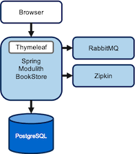
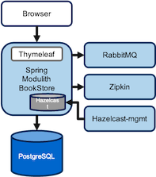

# 重構歷程記錄

本文件紀錄 monolith 專案由傳統 MVC 單體逐步走向前後端分離、模組化與 gRPC 微服務的歷程。每個里程碑都附上主要證據（檔案或 commit），以利追蹤決策背景。

## 里程碑與關鍵證據

- **2024-09～2024-10：單體 MVC + Thymeleaf + Zipkin**
  - UI 使用 Thymeleaf 與靜態資源（`src/main/resources/templates`，可由 `9704b63` 追溯新增）。
  - 追蹤改以 Zipkin（`47ae15a` 更新 `pom.xml`、`compose.yml` 與 `application.properties`）。
  
  

- **2025-09-10 起：Hazelcast 快取整合**
  - `0dda2de` 導入 Hazelcast MapStore、CacheService 與相關設定（`src/main/java/com/sivalabs/bookstore/config/HazelcastConfig.java` 等）。
  - 後續 `9a356fd`、`97aa42f` 等 commit 讓 MapStore 支援延遲讀寫、批次設定。
  
  

- **2025-09 中旬：Orders 模組抽離**
  - `885570f` 建立獨立的 `orders/` 專案（獨立 pom、Liquibase、Docker）。
  - `ba98cf2` 移除 Thymeleaf UI，Orders 模組提供 REST API，`orders/src/main/java/com/sivalabs/bookstore/orders/web/CartRestController.java` 為代表。
  - `78df15d` 更新 reverse proxy 與 domain 結構，`compose.yml` 開始啟動 `orders-service`，並保留 monolith 內 `orders.orders` 表作為回退（`src/main/resources/db/migration/V4__orders_create_orders_table.sql`）。
  
  

- **2025-10-05：REST → gRPC**
  - `a3f6ab8` merge `feature/grpc-migration`：monolith 透過 `OrdersGrpcClient` 存取外部 gRPC 服務；`orders-service` 改暴露 `9090` 埠。
  - 新增 gRPC 組態與消息映射（`src/main/java/com/sivalabs/bookstore/config/GrpcClientConfig.java`、`orders/config/GrpcServerConfiguration.java` 等）。
  
  

- **2025-10-09：Zipkin → OpenTelemetry/HyperDX**
  - `8916875` 導入 OTLP gRPC 設定（`src/main/java/com/sivalabs/bookstore/config/OtlpGrpcTracingConfig.java`）。
  - `de15ce3` 更新 webproxy，讓 Nginx 也可輸出 OTEL 資料。
  - `209a96c`、`9eb607e` 增補環境變數與金鑰管理。
  
  

- **2025-10-20：前後端分離（Next.js）**
  - `1895e873` 移除 monolith 內所有 Thymeleaf 模板，新增 `docs/cors-configuration.md`、`next_in_nginx.md`。
  - `compose.yml` 新增 `frontend-next` 容器與 `/api` 代理設定，同 commit 也加入 `CorsConfig`（`src/main/java/com/sivalabs/bookstore/config/CorsConfig.java`）支援本地開發。
  
  

## 重構路徑圖

## 現況摘要（2025-10 後）

- **服務拓撲**：Nginx 代理 Next.js、monolith API、orders-service gRPC；Hazelcast、Postgres、RabbitMQ 仍由 monolith 管理。
- **Observability**：全面改用 OpenTelemetry → HyperDX（`compose.yml` 的 `hyperdx` service 與 OTLP 環境變數）。
- **Fallback 能力**：monolith 繼續保留 `orders` schema 與 `OrderEntity`，必要時可不依賴外部 orders-service。
- **前端開發體驗**：dev profile 開啟 CORS，Next.js 直接呼叫 `http://localhost:8080/api/**`；部署時由 Nginx 代理確保同源。

此歷程提供日後 refactor 或進一步拆分時的背景脈絡與參考依據。
